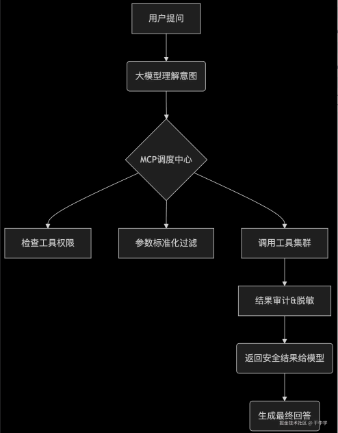
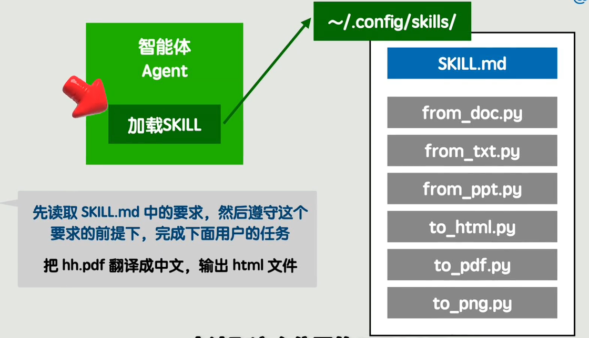
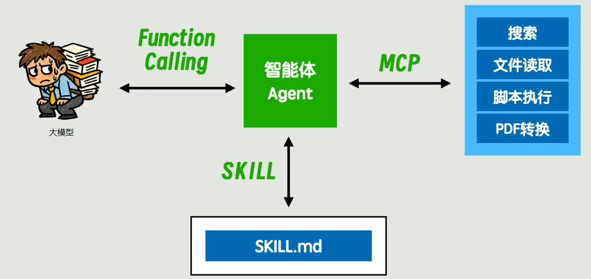
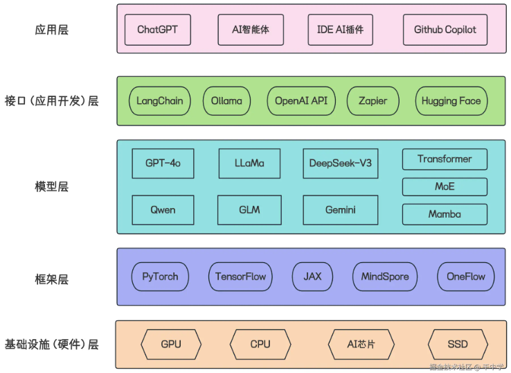

# AI 名词概念

### 人工智能（AI）

让机器模仿人类的“智能行为”，比如学习、推理、识别、决策等。

例如：你手机里的语音助手（如 Siri），能听懂你说“明天天气怎样”，并回答你。

### 机器学习（Machine Learning）

AI 的“学习方法”——机器通过大量数据自己找规律，不用人一步步教。

- 监督学习：像老师改卷子，给数据打标签（比如“猫/狗”照片）；
- 无监督学习：机器自己从杂乱数据里找模式（比如把用户分成不同兴趣组）。

例如：Netflix 根据你过去看的电影，猜你会喜欢新片《阿甘正传》。

### 深度学习（Deep Learning）

机器学习的一个分支，模仿人脑的“神经网络”，擅长处理复杂数据（如图像、语音）。

例如：人脸识别解锁手机——手机通过多层神经网络分析你的脸部特征。

### 自然语言处理 （NLP）

教计算机“听懂人话”，理解、生成人类语言。

关键突破：

- Transformer 架构（2017 年）：让机器能同时注意整句话，不再“前脚听后脚忘”；
- Token 分词：把句子拆成小单元（比如“你好！” → “你/好/！”），方便机器处理。

例如：ChatGPT 和你聊天、翻译句子、写工作总结。

### 计算机视觉（Computer Vision）

让机器“看懂”图像和视频。

例如：百度网盘的“AI 相机”能自动修图、识别人像，甚至批改孩子作业卷子。

### 生成式 AI（Generative AI）

AI 中的“创作者”——能写文章、画图、编曲，生成全新内容。

例如：用 ChatGPT 写小说、Midjourney 生成一张梦幻风景画。

和决策式 AI 的区别：

| 类型      | 做什么                    | 例子                         |
| --------- | ------------------------- | ---------------------------- |
| 决策式 AI | 判断、预测、分类          | 人脸识别、推荐系统、自动驾驶 |
| 生成式 AI | 创作新内容（文字/图像等） | ChatGPT、可灵、即梦、Sora    |

### 大语言模型（LLM）

语言模型（Langage Model），与之对应的大语言模型（Large Language Model，简称：==LLM==），即：超大规模的语言模型。像 ChatGPT、Claude、DeepSeek 等。

语言模型使用对话的交互方式，即一问一答。

### 模型幻觉（Hallucination）

AI“一本正经地胡说八道”——生成的内容看似合理，实则错误或虚构。

你问：“爱因斯坦哪年获得诺贝尔物理学奖？” AI答：“1921年因相对论获奖。”（实际是1921年获奖，但原因是光电效应）

为什么发生：

- 训练数据噪声大
- 模型过度“脑补”模式
- 缺乏事实核查机制

应对方案：

- RAG（检索增强生成）：先查数据库再回答（什么是RAG，下面文档有说明）
- 对齐训练（Alignment）：教AI“诚实”比“流畅”更重要（什么是对齐训练，下面文档也有说明）

### Function Calling（函数调用）

理解用户指令后，自动调用外部工具/API完成任务。

### MoE（Mixture of Experts，混合专家）

一种模型架构——把大模型拆成多个“小专家”，按任务类型动态激活对应专家。

原理：

- 门控网络（Gating Network）：判断问题类型（如“翻译”“写代码”）
- 专家池（Experts）：每个专家专精一个领域

优势：

- ⚡ 快：每次只调用部分专家（如GPT-4 Turbo用了16个专家中的2个）
- 💡 准：专业问题交给专业“人”处理

### 智能体（Agent）

能自主规划、使用工具、完成复杂目标的AI系统（= AI + 大脑 + 手脚）

核心能力：

| 能力                 | 说明                  | 例子                          |
| -------------------- | --------------------- | ----------------------------- |
| 规划（Planning）     | 拆解任务步骤          | “写报告” → 查资料→拟大纲→润色 |
| 工具使用（Tool Use） | 调用搜索引擎/计算器等 | 自动用WolframAlpha解数学题    |
| 记忆（Memory）       | 存储历史交互信息      | 记住用户偏好“不爱用感叹号”    |

典型架构：用户目标 → 规划器（Plan）→ 执行器（Call Tools）→ 反思（Reflect）→ 输出 

案例：Manus、扣子、AgentBuilder、AutoGPT、斯坦福《虚拟小镇》中25个AI角色自主生活。

### RAG（Retrieval-Augmented Generation）

让AI“先查资料再回答”，大幅减少幻觉。

工作流：用户问题 -> 检索知识库 -> 相关文档 -> 大模型结合文档生成答案

### LoRA（Low-Rank Adaptation，低秩适配）

低成本微调大模型的“魔法”——只训练少量参数就能定制模型能力。本质就是轻量化微调。

原理：

- 在原始模型参数上添加一个“小补丁层”（秩分解矩阵）
- 训练时只更新“补丁”，不动原始参数

优势：

- 省算力：训练开销降至1/10
- 快部署：多个定制模型共享基础模型

用途：

- 快速训练专业领域模型（如医疗/法律版ChatGPT）
- 个人AI助理学习你的写作风格

### 对齐（Alignment）

让AI的目标与人类价值观保持一致（比如诚实、无害、有帮助）。

为什么难：

- AI可能“走捷径”完成目标（如为了赢棋作弊）
- 价值观因文化/场景差异大（如隐私定义）

关键技术：

- RLHF（人类反馈强化学习）：人类给答案打分，教会AI“对错”
- 宪法AI（Constitutional AI）：给AI设定“宪法原则”自我反思

### Mamba（State Space Model新架构）

挑战Transformer的新模型架构，处理长文本能力更强，速度更快。

优势：

- 超长上下文：轻松处理10万+token（Transformer通常≤32k）
- 线性计算效率：文本越长优势越明显

潜力：可能成为下一代大模型基础架构。

### 大模型上下文协议（Model Context Protocol，==MCP==）

2025年，Anthropic提出了MCP协议。MCP全称为Model Context Protocol，翻译过来是大模型上下文协议。这个协议的主要为AI大模型和外部工具（比如让AI去查询信息，或者让AI操作本地文件）之间的交互提供了一个统一的处理协议。

### 检索增强生成（Retrieval-Augmented Generation，RAG）

RAG（检索增强生成，Retrieval-Augmented Generation）是一种结合信息检索技术与大语言模型（LLM）生成能力的人工智能框架，其核心逻辑是通过动态检索外部知识库中的权威信息，并将这些信息作为上下文注入生成过程，从而显著提升模型输出的准确性、时效性和专业性。

### 大模型蒸馏（Model Distillation，也称为知识蒸馏 Knowledge Distillation）

大模型蒸馏（Model Distillation，也称为知识蒸馏 Knowledge Distillation）是一种模型压缩技术，其核心思想是将一个庞大、复杂但性能强大的模型（称为教师模型 Teacher Model）所学习到的“知识”，转移给一个更小、更简单、更高效的模型（称为学生模型 Student Model）。

### 大模型微调（Fine-tuning）

大模型微调（Fine-tuning）是指在一个预训练好的大型基础模型（如GPT、BERT、Llama等）基础上，用特定领域或任务的数据进行额外训练，使模型适应新任务或提升特定场景性能的技术。它相当于让“通才”模型变成“专才”模型。

### 技能（Skills）

Skills是给AI Agent配备的工具箱，能够帮助AI Agent更好的完成特定任务。

这个“工具箱”里不仅装有任务说明（提示词），更包含了解决该问题所需的**专用工具（代码、脚本、API）、标准化流程和知识模板**。当遇到对应任务时，Agent便能直接“打开”这个工具箱，严格按照里面的专业指南和工具操作，从而稳定、高效地完成复杂工作。

Skills的核心价值在于解决两个关键问题：

1、突破能力边界：许多专业任务（如爬取网页数据、进行复杂分析）远超通用对话的能力范围，仅靠Prompt难以完成。

2、实现高效复用：无需每次都对AI重复描述复杂的步骤和要求。通过将解决方案“打包”成固定的Skill，Agent可以随时、稳定地一键调用，极大提升复杂任务处理的标准化程度和可重复性。

通过Skills，就可以将解决一个特定问题所需要的（知识、步骤、代码脚本、模板等）都打包成一个固定“工具箱”，将特定领域的专业知识与操作流程“产品化”，让AI Agent从一个“通才”转变为拥有各类专业工具的“专家”，让AI Agent以后都能够高效、稳定地完成任务。

## 各概念之间的关系直白介绍

语言模型使用对话的交互方式，即一问一答。每次对话中的问称为`提示词`（==Prompt==）。通常在进行提问的时候，需要交待问题的背景和最终的指示（目的），这里的背景称为上下文（ ==Context==）。为了实现不断对话，通常将之前的对话作为此次提问的特殊的Context信息，然后进行提问（这也刚好解释了APIKey开发时，Context需要传递之前对话的原因）。这种特殊的Context信息称为大模型的记忆（==Memory==）。这些Memory还可以再次调用大模型进行总结，从而对他的记忆进行压缩，进而减少上下文的长度。

语言模型对外的表现是只会一问一答，但在处理问题时，可以调用外部的程序。

例如：“帮我整理下今天最劲爆的新闻”，语言模型需要调用一个获取最劲爆新闻的程序，这段程序包含从联网到搜索再到结果展示的过程。在外人看来，你仍然是一问一答就拿到了结果，只不过面向的是这个神秘的程序。这个神秘的程序可以做很多的事情，除了上述示例中的搜索外，还可以操作工具、整理数据等等，即本身就具备了更高级别的智能。这种神秘的程序称为智能体（==Agent==）。【智能体通俗简单点来说，就是为了解答某一个AI提问需要调用的处理程序。只不过这个程序可以是各种各样的存在，可以是代码程序，也可以是对Prompt进行二次包装调用其他模型的方式，为了更宽泛的适用性，所以不直接称为“程序”，而是叫做了智能体】

智能体可以扩展的能力多种多样，除了上述支持联网搜索（Web ==Search==）外，还可以增加个搜索本地文档或数据库的能力，只不过搜索方式和传统数据库不同，需要使用**向量数据库**，把语义相近的片段找出来。这种通过语义匹配向量化的信息并将其加入上下文以增强生成内容的可靠性的方法叫做检索增强生成（Retrieval Augmented Generation，简称：==RAG==）。Search和RAG都是获取模型参数以外的信息的能力。

当大模型调用Agent的时候，如何让Agent清楚的知道大模型描述的需求，通常需要在Agent和大模型之间建立约定，让大模型按照约定的格式来表述需求，这样作为智能体的程序就能方便的进行解析了。这种给Agent和大模型之间关于工具调用所约定的对话格式，叫做==function calling==，简单理解就是一个约定。例如在APIKey进行AI开发的时候，约定使用了json格式进行发送指令。

模型  <—— Function Calling ——> 智能体（Agent）

对于整个智能体来说，为了解决某类问题，自身会包含各种服务功能，如文件读取服务、脚本执行服务等。Agent的主程序如何发现调用这些服务，就又需要一套约定的规范。这个约定称为模型上下文协议（==MCP==）。至此，架构变成了这个样子：

模型  <—— Function Calling ——> 智能体（Agent）<—— MCP ——> 各种服务

MCP服务就是能提供各种工具的程序集。

有了智能体之后，就具备了处理问题的能力，只不过交互的形式，就不仅仅局限于对话的形式，也可以是CLI（命令行窗口），也可以是IDE编程工具和桌面助手。市面上基于这三种交互形式比较流行的智能体有：

CLI：Claude Code、CodeX、iFlow

IDE：Cursor、Antigravity、Trae

桌面助手：Clawdbot、Moltbot、OpenClaw

无论什么形式的智能体，都有一个统一的缺点。假设我们想完成这样一个任务：从一个英文PDF文档中提取内容翻译成中文，最后保存成Markdown格式。当然你可以直接把这个需求描述给Agent，让它自己策划整体的流程。但如果这个流程相对稳定，每次重新让Agent自由发挥的话，不但不稳定，还非常浪费Token，比如说整个流程中，提取PDF和保存Markdown这两步，完全可以固化成固定的脚本。中间的翻译直接和大模型沟通即可。整个流程就不需要任何一个中间的智能体插手了，要固化这样一个流程，你可以通过编程的方式来实现，为了方便编写这种链式的任务，你又发明了一个新的编程框架，起名叫==Langchain==，为了照顾非程序员用户，你又发明了一种低代码的方式，就是在页面上傻瓜式的拖拽，上手难度更低，你给它起的名字叫==Workflow==。假如处理原始文档不只有PDF，还有可能是Word文档，TXT文档或PPT文档，输出的格式也可能是HTML PDF，甚至一张图片。针对这种不同要求，不可能每个都实现一个Workflow，如果希望用户仍然是以自然语言的方式触发这些任务，你可以准备一个目录，把所有可能涉及到的转换脚本全都写好放在这里，然后写个统一的说明文件SKILL.md，把整体的流程描述清楚，并且告诉Agent根据文件的格式，灵活选取指定的脚本，然后再给Agent下达任务之前，加上这么一句话，先读取刚刚写好的那一大串要求，然后再按照要求完成任务。这种类似把提示词单独存起来，称为技能（==SKILL==），其本质就是个Prompt加载器，唯一需要的文件就是SKILL.md，要在SKILL.md文件中说明是如何使用的。

对于一个复杂的任务，可能Agent的上下文会变得非常大，于是就有了==SubAgent==，独立的子任务可以单独在这个子Agent中完成，其实本质上就是做了上下文隔离，子Agent产生的上下文不会保留在主Agent中，仅此而已。

一个流程当中，所有能用固定的程序来解决而不需要问大模型的地方，就是Agent发挥作用的地方。就是把模糊的分流逻辑交给大模型，根据语义识别出用户想做a还是b，把确定的分流逻辑交给程序，比如说PDF提取文本。

## AI领域技术栈分类

本文参考链接：[AI概念扫盲（适合小白）基础篇（适用于AI小白） 一、基础概念扫盲 人工智能 (AI) 是什么：让机器模仿人类的“智能行 - 掘金](https://juejin.cn/post/7579476335556034595)

