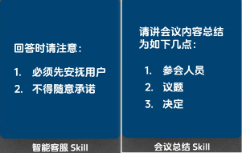
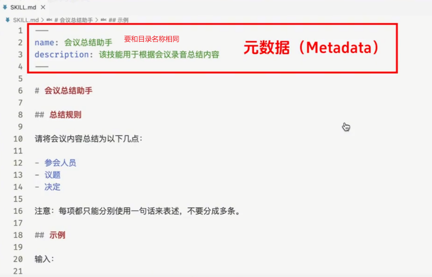
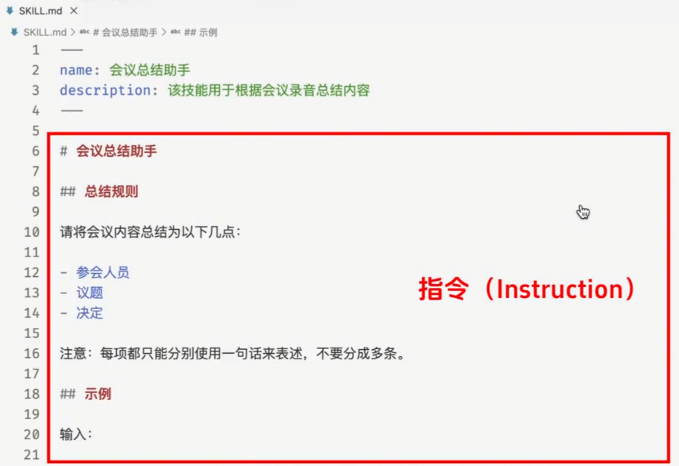
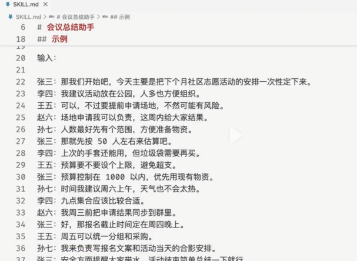
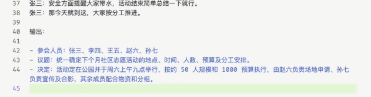
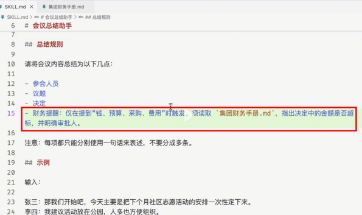
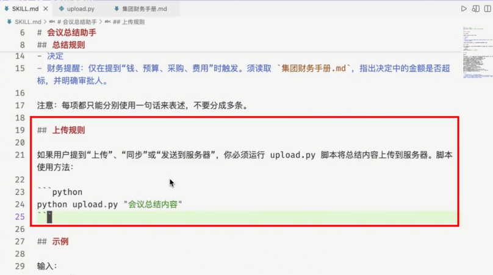
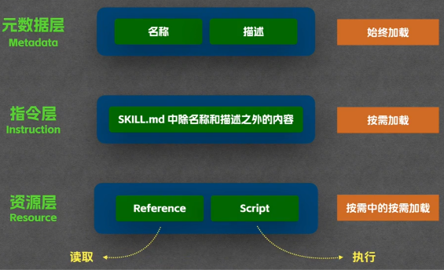
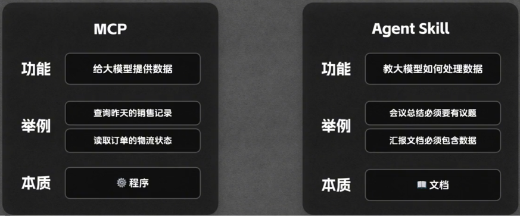

# Agent Skill

## 概念

Agent Skill 是什么？

用最通俗的话来讲，Agent Skill其实就是一个大模型可以随时翻阅的说明文档。比如你想做一个智能客服，可以在Skill里面明确交代“遇到投诉得先安抚用户的情绪，而且不得随意承诺”。再比如你想做会议总结，可以直接在Skill里面规定“必须按照参会人员、议题、决定这个格式来输出总结的内容“。这样一来，就不用每次对话都去重复粘贴那一长串的要求了。大模型自己翻翻这个文档，就知道该怎么干活了。

## 基本用法

在用户目录下的.claude/skill文件夹中创建我们的Skill。

SKILL.md 格式：

- 元数据

  

- 指令

  

  

  

  

## 高级用法

- Reference：在读取说明文件的同时，读取外部引用的说明文件。

  

  

- Script：在读取说明文件的同时，执行文件中要求执行的脚本命令。

  

## 渐进式披露机制

## 与MCP比较

MCP给大模型供给数据，本质是程序；而Skill是教会大模型如何处理这些数据的，本质是文档。

[Agent技能全解析：从入门到原理一次讲透 - 今日头条](https://www.toutiao.com/video/7612414386585584134/?app=news_article_lite&category_new=__all__&module_name=Android_lite_wechat&share_did=MS4wLjACAAAAPrtHAauwMBmlj_BcCO2JSx_aZ48XXKBhx80vc6dusmPZqOBuoPXZnfS4qVS8-fL0&share_token=db09aca6-b9e7-4186-bbc9-4526d1f3107a&share_uid=MS4wLjABAAAARgFIBb7eyeaA7OcHMaSqRQs4Fx_bzxBLNKl4uKhK2Lc&timestamp=1772581921&tt_from=wechat&upstream_biz=Android_lite_wechat&utm_campaign=client_share&utm_medium=toutiao_android&utm_source=wechat&source=m_redirect)

