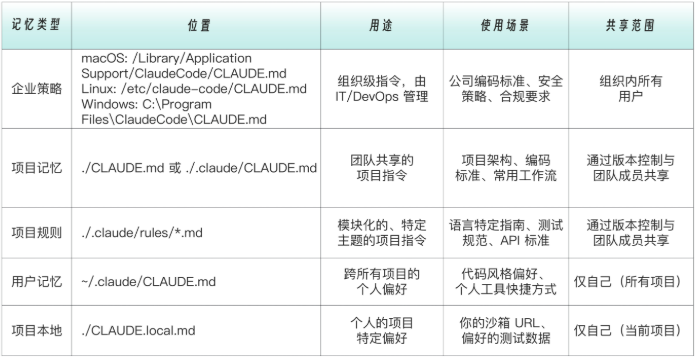
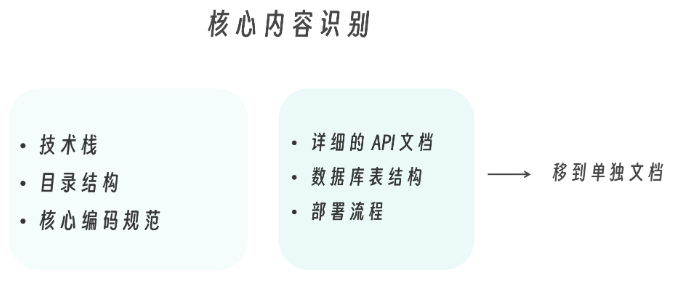

# Claude 记忆系统 —— CLAUDE.md

CLAUDE.md 文件是Claude项目的记忆文件，当在项目目录启动 Claude Code 时，会执行“记忆系统初始化”操作，扫描项目环境中的所有CLAUDE.md 文件，并自动加载读取的内容，将其自动注入到每次会话中。

CLAUDE.md 就像你给新员工一份入职手册，他读完之后就知道公司的规矩。不同的是，Claude 每次对话都会重新“入职”——所以这份手册必须简洁有效。

==CLAUDE.md 的内容会每次对话都加载，所以要精简。把“每次都需要”的内容放这里，把“偶尔需要”的内容放到 Skills 或文档里。==

## Claude Code 的五层记忆架构

Claude Code 支持五个层级的记忆，按照加载的先后顺序分别为：

- 层级0：企业策略（程序安装目录：/etc/claude-code/CLAUDE.md）
- 层级1：用户级（系统用户所在目录：~/.claude/CLAUDE.md）
- 层级2：项目级（项目所在目录：./CLAUDE.md 或 ./.claude/CLAUDE.md）
- 层级3：项目规则级（.claude/rules/*.md）
- 层级4：本地级（./CLAUDE.local.md）




### 企业策略级记忆设定

#### 作用

企业策略级记忆设定的作用是组织范围内的指令，由 IT/DevOps 统一管理和部署组织。适合内容是，公司编码标准、安全策略、合规要求以及禁止使用的库或模式。通过配置管理系统（MDM、Group Policy、Ansible 等）部署，确保在所有开发者机器上一致分发。

#### 位置

在Claude Code 的安装目录中：

- Windows: `C:\Program Files\ClaudeCode\CLAUDE.md`
- macOS: `/Library/Application Support/ClaudeCode/CLAUDE.md`
- Linux: `/etc/claude-code/CLAUDE.md`

如果是个人或小团队，可以直接跳过企业策略级设定这一层。

#### 示例

```markdown
# 公司开发策略

## 安全要求
- 禁止在代码中硬编码任何密钥或敏感信息
- 所有 API 调用必须使用 HTTPS
- 用户输入必须经过验证和清理

## 合规要求
- 所有日志必须排除 PII（个人身份信息）
- 数据库连接必须使用加密传输

## 禁止项
- 禁止使用未经审批的第三方库
- 禁止直接访问生产数据库
```


### 用户级内容设定——跨项目规范

#### 作用

用户级内容设定承载的是你的全局偏好，即==跨所有项目==生效的个人偏好，如个人代码风格，沟通语言设置，通用工作习惯等。

#### 位置

- windows：`C:\Users\Administrator\.claude\CLAUDE.md`
- Linux/macOS：`~/.claude/CLAUDE.md`

#### 示例

```markdown
# 个人偏好

## 沟通方式
- 使用中文回复
- 代码注释使用英文
- 解释简洁直接，不要过多铺垫

## 通用代码风格
- 缩进使用 2 空格
- 优先使用 async/await
- 变量命名使用 camelCase
- 常量命名使用 UPPER_SNAKE_CASE

## 我的常用工具
- 包管理器: uv
- 编辑器: VS Code
- 终端: zsh
```

### 项目级内容设定——团队共享规范

在读取完用户级的内容之后，会再读取项目级内容，因此用户级记忆会被项目级覆盖。例如：用户级描述的是个人喜欢2空格缩进，但项目要求4空格，那么就可以在项目级内容中指定使用4空格。

#### 作用

团队共享规范是团队共享的项目知识，应该提交到 Git。适合存放的内容包括项目架构和技术栈、团队编码规范、重要的设计决策和常用命令。

#### 位置

- 项目根目录的`./CLAUDE.md`，和`.git`目录同级别。

#### 示例

```markdown
# 项目：订单服务 API

## 技术栈
- Node.js 20 + TypeScript
- Fastify（Web 框架）
- Prisma（ORM）
- PostgreSQL + Redis- Zod（数据验证）

## 目录结构
src/
├── routes/ # 路由定义
├── controllers/ # 请求处理
├── services/ # 业务逻辑
├── repositories/ # 数据访问
├── schemas/ # Zod schemas
└── types/ # 类型定义

## API 响应格式
```typescript
interface ApiResponse {
	success: boolean;
	data?: T;
	error?: { code: string; message: string };
}

编码规范
- TypeScript strict 模式
- 禁止使用 any，使用 unknown + 类型守卫
- 所有 API 端点必须有 Zod schema 验证
- 业务错误使用自定义 Error 类

常用命令
- pnpm dev - 启动开发服务器
- pnpm test - 运行测试
- pnpm prisma migrate dev - 运行数据库迁移
```

### 项目规则级内容设定——分类组织

rules 是一个比较高阶的技巧。

#### 作用

Rules 是按主题组织的规则文件，支持条件作用域（也就是视情况来确定是否加载该记忆内容），适合场景包括 CLAUDE.md 变得太长时，不同文件类型需要不同规范时，以及前后端分离的项目。

#### 位置

- 项目所在目录（和.git同级）：`.claude/rules/*.md`

#### 目录结构

```
.claude/
└── rules/
├── typescript.md    # TypeScript 规范 
├── testing.md       # 测试规范 
├── api-design.md    # API 设计规范 
└── security.md      # 安全规范
```

##### 每个条件作用域示例

`.claude/rules/testing.md`：

```markdown
---
paths:
  - "src/**/*.test.ts"
  - "tests/**/*.ts"
---

# 测试规范

## 命名
- 单元测试: `*.test.ts`
- 集成测试: `*.integration.test.ts`

## 结构
使用 Arrange-Act-Assert 模式：

```typescript
describe('OrderService', () => {
  describe('createOrder', () => {
    it('should create order when stock is available', async () => {
      // Arrange
      const mockProduct = createMockProduct({ stock: 10 });

      // Act
      const order = await orderService.createOrder(mockProduct.id, 1);

      // Assert
      expect(order.status).toBe('created');
    });
  });
});

## 覆盖率要求
- 业务逻辑: > 80%
- 工具函数: > 90%
- 路由/控制器: 可以较低
```

此处的关键特性是paths字段让这个规则只在编辑测试文件时生效，不会浪费其他场景的上下文空间。


### 本地级内容设定——个人工作空间

#### 作用

个人工作空间用于记载个人工作笔记，不提交到 Git，适合内容包括本地环境配置、个人调试技巧、当前工作备注，敏感信息（测试账号等）。

>我在和 Claude Code 多轮对话之后，Claude 也会自动压缩对话历史。经过一系列提示词之后，我自己也不知道自己进行到哪一步了，想查一下以前的提示词，或者几天前和 Claude Code 的关键讨论，但是无处寻踪了。而拥有一个记忆空间，定期把关键内容更新就能够解决这个问题（自己更新或者让 Claude 帮忙更新关键点都行）。

#### 位置

- 项目根目录的`./CLAUDE.local.md`

#### 示例

```markdown
# 本地开发笔记

## 我的环境
- 本地 API: http://localhost:3000
- 测试数据库: order_service_dev
- Redis: localhost:6379

## 测试账号
- admin@test.com / test123
- user@test.com / test123

## 当前工作
- 正在重构支付模块
- 参考 PR #234 的讨论
- 周五前完成

## 调试技巧
- 订单状态机日志: LOG_LEVEL=debug pnpm dev
- 查看 Redis 缓存: redis-cli KEYS "order:*"
```

注意：记得把  CLAUDE.local.md 加入  .gitignore！


## 编写高效的 CLAUDE.md

CLAUDE.md 写得好不好，直接决定了 Claude 是靠谱同事，还是每次都要重新培训的实习生。

### CLAUDE.md 编写要遵循的核心原则

#### 核心原则 1：尽可能的简洁

CLAUDE.md 的每一行，都会在每一次对话开始时被自动注入上下文。这意味着一件事：冗余不是无害的，而是持续消耗的。所以保持精简不是建议，而是==必须==。

#### 核心原则 2：具体优于泛泛

不要添加一些对于Claude来说，本来就知道的内容。添加的内容应该是可以改变 Claude 的一些决策的。

例如，无效描述如下：

```markdown
# 项目规范
## 代码质量
请写出高质量的代码。代码应该是可读的。使用有意义的变量名。
保持代码整洁。遵循最佳实践。不要写重复的代码。
```

而真正有价值的 CLAUDE.md，应该是这样：

```markdown
# 项目规范

## TypeScript
- 使用 `interface` 定义对象结构，`type` 用于联合类型
- 禁止 `any`，使用 `unknown` + 类型守卫
- 函数参数 > 3 个时，使用对象参数

## 错误处理
```typescript
// 业务错误
throw new BusinessError('ORDER_NOT_FOUND', '订单不存在');

// 验证错误（Zod 自动抛出）
const data = orderSchema.parse(input);

// controller 中不要 try-catch
// 由全局错误中间件统一处理
```

两者的差异非常明确。后者不是模糊要求“要高质量”，而是给出了如何做才算高质量；不是“注意错误处理”，而是具体的错误模型；不是抽象描述，而是可直接模仿的代码形态。

这里有个简单的判断标准——==如果你不写，Claude 也大概率会做对，那就不要写==。

#### 核心原则 3：关键三问题 Why / What / How

一份真正“能用”的 CLAUDE.md，通常都在回答三个问题。不是一次性回答，而是在关键地方给出明确指引。

##### Why —— 为什么要这样做

这一部分的作用，不是让 Claude “记住一个库”，而是让它理解背后的决策逻辑。当 Claude 明白了为什么，它在面对相似但不完全相同的场景时，才更可能做出一致的判断。

```markdown
## 为什么使用 Zod？
- TypeScript 只有编译时类型检查
- API 输入需要运行时验证
- Zod 可以同时生成 TS 类型和验证逻辑
- 错误信息自动生成，对用户友好
```

##### What —— 具体要做什么，不要做什么

这一部分的重点是边界。什么是允许的，什么是禁止的，决策应该发生在哪一层？对 Claude 来说，这比“最佳实践”四个字重要得多。

```markdown
## 数据库操作规范
- 所有查询通过 Prisma ORM
- 复杂查询封装在 `src/repositories/`
- 禁止在 controller/service 中直接写 SQL
- 事务使用 `prisma.$transaction()`
```

##### How —— 按什么步骤去做

当步骤清晰、路径明确、还有参考文件时，Claude 才会稳定复用同一套工作流，而不是每次自由发挥。

```markdown
## 创建新 API 端点

1. 在 `src/schemas/` 创建请求/响应 Zod schema
2. 在 `src/routes/` 添加路由定义
3. 在 `src/controllers/` 实现请求处理
4. 在 `src/services/` 实现业务逻辑
5. 在 `tests/` 添加测试用例

示例参考: `src/routes/orders.ts`
```

#### 核心原则  4：渐进式披露，不要把一切都塞进 CLAUDE.md

CLAUDE.md 的职责是定义默认决策，而不是承载全部知识。

对于非核心、但可能被用到的内容，正确的做法是引用，而不是复制。

```markdown
# 项目规范

## 核心
[精简的核心规范]

## 详细文档
- 数据库设计: 见 `docs/database.md`
- API 规范: 见 `docs/api-spec.md`
- 部署流程: 见 `docs/deployment.md`
```

这样做有两个好处：

1. CLAUDE.md 保持轻量，启动成本低 。
2. 当 Claude 需要进一步的细节信息时，可以按需读取引用文件。


## 优化已有的 CLAUDE.md

CLAUDE.md 会在每一次对话开始时自动加载。这意味着它并不适合承载所有信息，而只适合存放每次都必须知道的内容。当记忆过多、层级混乱，Claude 的行为反而会变得迟钝甚至不稳定。

CLAUDE.md 中的内容一般不要超过500行。当 Claude 响应明显变慢，经常出现上下文长度警告，而且 Claude“忘记”对话早期的内容时，可以采用 “.md 瘦身三步法”：精简 → 拆分 → 条件规则。

可以按照以下三个步骤进行优化。

### Step 1：精简 —— 识别核心内容

核心内容就是每次对话都需要的内容。通常是项目整体的一个规划：



### Step 2：拆分 —— 非每次必需部分拆分成独立文件

详细的 API 文档、数据库表结构和部署流程虽然重要，但是完全没有必要每次都读入 Claude 内存，可以移动到单独文件，精简原来的 CLAUDE.md 。

```markdown
## 核心规范
[精简内容]

## 详细参考
- API 端点清单: @docs/api.md
- 数据库 Schema: @prisma/schema.prisma
- 部署配置: @docs/deploy.md
```

### Step 3：使用条件规则

可以考虑进一步把测试规范、前端规范、后端规范拆分到  .claude/rules/，并设置  paths条件。


## 记忆管理命令

下述命令都是在 Claude  Code 中输入的命令。

| 命令               | 描述                               | 示例 |
| ------------------ | ---------------------------------- | ---- |
| /memory            | 显示当前加载的所有记忆内容和来源。 |      |
| /memory edit       | 编辑项目级 CLAUDE.md               |      |
| /memory edit user  | 编辑用户级记忆                     |      |
| /memory edit local | 编辑本地级记忆                     |      |


## Auto Memory

Claude Code 本身拥有自动记忆功能，随着项目的演进和对话的深入，会在 ~/.claude/projects//memory/ 目录下自动生成 Auto Memory，用于记录模型在项目中学习到的模式、调试经验与结构认知。

这意味着，Claude Code 的“记忆”并不是单一文件，而是一种多层叠加的上下文注入架构：有些是人为编写的长期规则，有些是组织级强制策略，还有一些是模型自动沉淀的经验笔记。CLAUDE.md 决定“系统被告知什么”，而 Auto Memory 决定“系统在实践中学到了什么”。记忆因此成为一种结构化的工程能力，而不是简单的对话缓存。
