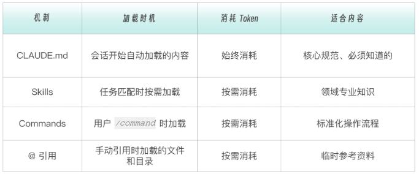

# Claude 常用命令与简介

| 命令              | 说明             |
| ----------------- | ---------------- |
| claude            | 启动交互模式     |
| claude "任务描述" | 执行单次任务     |
| claude -p "问题"  | 快速查询后退出   |
| claude -c         | 继续最近的对话   |
| help              | 帮助             |
| Ctrl + C 或 exit  | 退出             |
| /help             | 查看帮助信息     |
| /model            | 切换模型         |
| /cost             | 查看本次会话费用 |
| /memory           | 编辑记忆文件     |
| /init             | 初始化项目配置   |
| /config           | 修改配置         |
| /mcp              | 管理 MCP 服务器  |

## Claude 简介

Claude Code 获取项目相关知识的几种方式对比：

