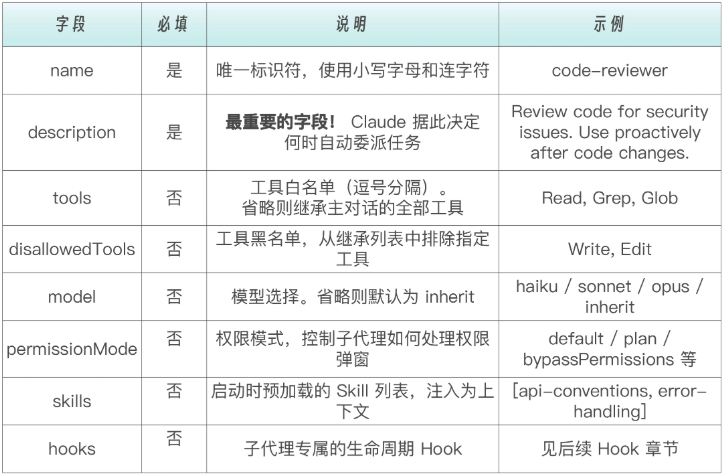
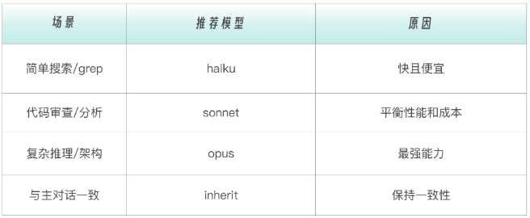
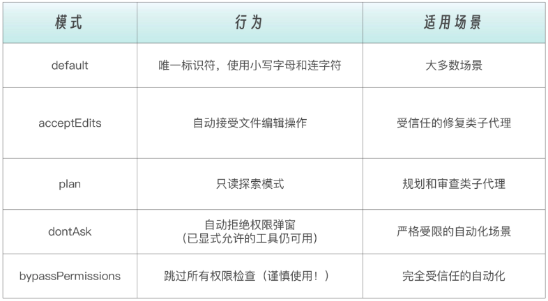
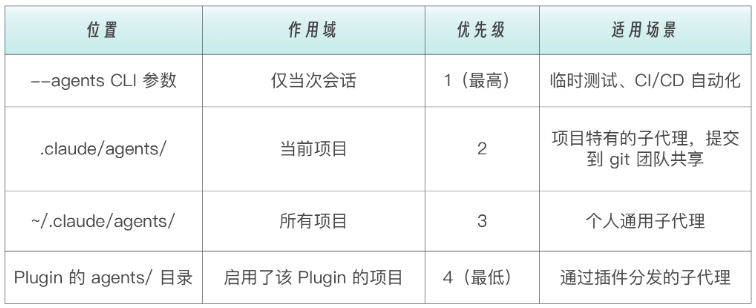
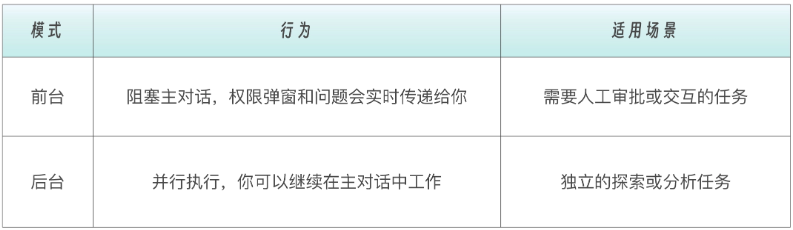

# Sub-Agents

当对Claude Code进行连续对话的时候，Claude Code的主对话上下文是线性追加的，不会自动过期，默认“都当成重要记忆”。

例如：某天，你让 Claude Code 帮你跑一个测试套件，结果输出了 500 行日志；然后你想让它分析一下代码结构，又输出了 200 行；接着你想让它改一个 bug……

这时候，你的对话上下文已经被一次次中间过程污染了，你的每一次对话对“当下执行”是必要的，但对“后续决策”是噪声。Claude 会把这种临时执行数据，当成了长期决策记忆。

这种上下文污染就是Sub Agents要解决的核心问题，即：==如何把“高噪声的执行过程”隔离出去，只让真正有价值的结论，留在主对话中==。因为只有Sub Agent ，才在系统层面天然拥有一个独立的上下文窗口。不是因为它“聪明”，不是因为它“更强”， ==而是因为它是 Claude Code 里唯一一个，结构上允许“执行完即丢弃”的东西==。

那为什么偏偏是Sub Agents能解决这个问题呢？

重点来了 —— 不是 AI Agent 这个概念能解决问题，而是 Sub-Agent 这种“运行模型”在起作用。==Sub-Agent，通过上下文隔离，让专业的 Agent 做专业的事儿，不是为了让 Claude 做得更多， 而是为了让 Claude 记得更少，但记得对==。

## 什么是 Sub Agent

Sub Agent 相当于一个“专职小助手”，带着自己的规则、工具权限、上下文窗口，去完成某一类任务，然后把“结果摘要”带回来。你可以把它理解成：把一个大脑拆成多个岗位角色，每个岗位只做一件事，并且有明确的权限边界。

既然有 Sub-Agent，那肯定要先有主 Agent，Claude Code 的主 Agent 在何处？其实，主 Agent 就是你当前操作的主对话。而主对话 vs Sub Agent，就是老板和员工的关系。Sub  Agent 相当于每个员工带着明确的任务出去，完成后==只把结论带回来==。

## Sub Agent 的核心价值

Sub Agent 的工程价值，核心就是三件事：隔离、约束、复用。

### 隔离

隔离，解决的是上下文污染问题——大量对当前执行有用、但对后续决策毫无价值的日志、搜索结果和中间推理，不应该进入主对话的长期记忆；Sub Agent 天然拥有独立上下文，执行完即丢弃，只把结论带回来，让 Claude 记得更少、但记得对。这是Sub Agent 最重要的价值。

主对话的上下文和 Sub Agent的上下文对比示例：

```
主对话的上下文：
┌────────────────────────────────────────┐
│ 用户：帮我分析一下这个 bug                │
│ Claude：好的，让我看看...                │
│ [Sub Agent 去执行，产生 500 行日志]           │
│ [Sub Agent 返回：发现 3 个相关文件]           │
│ Claude：我发现问题在这三个文件...         │
└────────────────────────────────────────┘
```

```
Sub Agent 的上下文（独立的，执行完就释放）：
┌─────────────────────────────────────────┐
│ 任务：查找 bug 相关文件                   │
│ [搜索输出 500 行日志]                     │
│ [分析过程...]                            │
│ 结论：3 个相关文件                        │
└─────────────────────────────────────────┘
```

主对话只看到Sub Agent 所返回的结论，不需要承载 500 行的搜索过程。这意味着你的对话不会因为一次大搜索就把 token 配额用光，重要的讨论内容不会被中间输出淹没，Claude 在后续对话中能更好地“记住”关键信息。

### 约束

约束，解决的是行为不可控问题——通过工具权限边界，把“我希望你别这么做”变成“你物理上做不到”，让代码审查只能读、修 bug 才能写，角色职责不再依赖提示词自觉。

比如你让 Claude 帮你审查代码，你只希望它看，不希望它动手改。如果没有权限边界，Claude 可能在审查过程中顺手帮你“修”了一些它认为有问题的代码——这不是你想要的行为。有了Sub Agent ，你就可以创建一个  code-reviewer 角色，明确规定它只有  Read, Grep, Glob 权限。这样它再怎么想“插手”，也改不了任何东西。

```markdown
# 只读型Sub Agent（代码审查）
tools: Read, Grep, Glob
# 它只能看，不能改任何东西

# 开发型Sub Agent（bug 修复）
tools: Read, Write, Edit, Bash
# 它可以读写文件和执行命令

# 研究型Sub Agent（技术调研）
tools: Read, WebFetch, WebSearch
# 它可以读本地文件和搜索网络
```

### 复用

复用，解决的是经验无法沉淀的问题——当Sub Agent 被定义成文件、放进版本控制后，好的使用方式就从一次性对话，变成了可共享、可迭代的工程资产。

Sub Agent 的配置保存在文件中，有这样几个好处：

- 版本控制：放进 git，团队共享。
- 跨项目复用：好用的配置可以复制到其他项目。
- 渐进优化：根据实际使用情况不断调整 prompt，持续优化改善。

这三点，分别对应着三个经典的软件工程命题：内存管理、安全边界、组织效率。这三点合在一起，标志着 Claude Code 的使用方式，从“对话技巧”，正式跨入“工程系统”。

```
.claude/agents/
├── test-runner.md      # 测试运行专员
├── code-reviewer.md    # 代码审查专员
├── log-analyzer.md     # 日志分析专员
└── bug-fixer.md        # Bug 修复专员
```

这些配置文件就像公司里的“岗位说明书”，每个岗位职责清晰、权限明确。

## Claude Code 内置的 Sub Agent

Claude Code 内置了一系列子代理，当在进行对话的过程中，在不知不觉间，Claude Code 可能就会自动调用内置子代理。

下面简单介绍其中的三个。

### Explore  子代理

xplore 子代理负责“翻项目、找位置”，专注快速只读搜索，把成百上千行 grep 和分析过程吞进去，只告诉你结论在哪里。

```
┌─────────────────────────────────────────────────────────┐
│  Explore（探索者）                                       │
├─────────────────────────────────────────────────────────┤
│  特点：快速、只读                                         │
│  用途：搜索和分析代码库                                    │
│  模式：quick / medium / very thorough 三档                │
│  工具：Read, Grep, Glob（不能写）                         │
└─────────────────────────────────────────────────────────┘
```

### Plan  子代理

Plan 子代理负责“动手前先想清楚”，在真正修改代码之前，收集上下文、梳理依赖、生成实施路径，避免一上来就盲目修改。

```
┌─────────────────────────────────────────────────────────┐
│  Plan（规划者）                                          │
├─────────────────────────────────────────────────────────┤
│  特点：规划模式专用                                       │
│  用途：在制定实施计划前收集项目上下文                       │
│  限制：子代理不能再生成子代理（防止无限嵌套）                │
└─────────────────────────────────────────────────────────┘
```

当你让 Claude 进入规划模式时，它会用 Plan 子代理来收集信息，设计实施方案。

### General-purpose  子代理

General-purpose 子代理则是“能探索、能修改、能推进”的全能型员工，适合需要多步骤协作的复杂任务。

```
┌─────────────────────────────────────────────────────────┐
│  General-purpose（通用型）                               │
├─────────────────────────────────────────────────────────┤
│  特点：全能型，处理复杂多步骤任务                           │
│  用途：同时需要探索和修改的任务                             │ 
│  工具：完整工具集                                         │
└─────────────────────────────────────────────────────────┘
```

当任务比较复杂，需要多种能力配合时，就可以使用这个通用型子代理。这些子代理的共同点只有一个：把高噪声过程留在子代理里，让主对话只保留决策信息。

## 什么时候该用Sub Agent

一个最直观的判断标准是：主对话到底需不需要承载执行过程本身。

适合使用Sub Agent的主要有以下几类任务。

### 1、高噪声输出的任务

这类任务的共同特点是：执行过程中会产生大量中间信息，但主对话真正关心的，往往只有一个结论。这类任务的执行过程本身就是噪声，子代理要做的就是把大量混乱的信息隔离起来，并进行提纯工作，只把结论带回来。

### 2、角色边界必须非常明确的任务

有些事情，你只希望 Claude “看”，而不希望它“动手”；有些操作，只能在特定目录、特定范围内发生；还有一些敏感操作，本身就需要和其他任务隔离开来。

如果没有子代理，这些约束只能靠提示词和使用者的心理预期维持。而一旦通过子代理定义工具权限，边界就从不稳定的“希望如此”，变成了明确的“系统级约束”。没有写权限，就无法修改文件；没有执行权限，就无法运行命令。正因为边界被落实为能力边界，而不是行为约定，子代理才成为解决安全性和可控性问题的可靠手段。

### 3、可以并行展开的研究型任务

当你需要同时调研认证逻辑、数据库设计和 API 接口，或者对比几种技术方案、从多个视角分析同一个问题时，这些探索之间往往是相互独立的。与其在主对话里来回切换，不如让多个子代理各自去完成自己的探索，再把结果汇总回来。子代理在这里的价值，不只是隔离上下文，更是天然的并行加速器。

### 4、可以拆成清晰阶段的流水线式任务

比如先定位代码位置，再做代码审查，然后进行修改，最后跑测试验证。

```
Explore（找位置）
    ↓
Reviewer（指出问题）
    ↓
Fixer（修复）
    ↓
Test-runner（验证）
```

这类任务的关键在于每一个阶段的目标、权限和输出都是明确的。用子代理把每一段责任固定下来，不但让流程更清晰，也让每一步的上下文更加干净。这不是为了复杂化流程，而是为了避免不同阶段的信息互相污染。

当然，也有一些情况并不适合使用子代理。==如果任务需要频繁来回确认需求、不断调整方向，那子代理这种“派出去干活再回来汇报”的模式反而会拖慢节奏；如果任务的各个阶段高度耦合，每一步都强依赖上一阶段的详细过程，那强行隔离上下文只会增加认知负担；还有非常简单的小任务，启动子代理本身就有开销，直接在主对话中完成，反而更高效==。

## 关键约束：子代理不能再嵌套调用子代理

请注意一条很容易被忽略但影响深远的架构限制——子代理不能再嵌套调用子代理。例如你的 code-reviewer 子代理不能在执行过程中再派出一个 security-scanner 子代理。

这意味着：

1. 所有编排必须由主对话完成：如果你需要“先审查再修复”，必须由主对话依次调用两个子代理，而不是让第一个子代理去调用第二个
2. 流水线的“调度中心”只有一个：就是主对话本身
3. 如果需要在子代理内复用知识：用  skills 字段预加载（而非再嵌套一个子代理）

## Sub Agent 配置文件详解

### 子代理的配置文件格式

子代理使用  Markdown + YAML frontmatter 格式：

```markdown
---
name: code-reviewer
description: Review code for security issues and best practices. Use after code changes.
tools: Read, Grep, Glob
model: sonnet
---

你是一个代码审查专家。

当被调用时：

1. 首先理解代码变更的范围
2. 检查安全问题
3. 检查代码规范
4. 提供改进建议

输出格式：
## 审查结果
- 安全问题：[列表]
- 规范问题：[列表]
- 建议：[列表]
```

frontmatter 部分（--- 之间）定义子代理的元数据和配置。

下方的 Markdown 正文就是子代理的系统提示词（system prompt）。注意：子代理只会收到这段系统提示词和基本环境信息（如工作目录），==不会继承主对话的完整系统提示词==。

### frontmatter 部分中的相关字段详解

frontmatter 部分（--- 之间）定义子代理的元数据和配置，可以使用的字段如下：



其中  name 和  description 是必填字段，其余均为可选。

#### description

description 字段决定了 Claude ==何时自动调用==你的子代理——这是配置中最重要的设计决策。

写的太模糊，Claude 不知道什么时候该用它：

```
description: A code reviewer
```

好的 description：说明做什么 + 什么时候用：

```
description: Review code changes for quality, security vulnerabilities, and best practices. Use proactively after code is modified or when user asks for code review.
```

优点：说明了做什么（审查代码质量、安全、规范）和什么时候用（代码修改后，或用户请求时）。“Proactively” 这个关键词会鼓励 Claude 在合适的时机主动委派任务。

#### tools 和 disallowedTools

- tools：白名单，如果子代理只需要少数几个工具，用白名单更清晰。
- disallowedTools：黑名单，如果子代理需要大部分工具但排除个别，用黑名单更简洁。

注意：==不要同时使用两者==——选一种即可。

```markdown
# 方式一：白名单 (tools) — "只能用这些"
# 适合：需要严格限制的场景（如只读审查）
tools: Read, Grep, Glob

# 方式二：黑名单 (disallowedTools) — “继承所有，但排除这些”
# 适合：需要大部分工具但排除少数危险工具的场景
disallowedTools: Write, Edit
```

工具权限应遵循最小权限原则——只开放必要的工具，能用 Read 完成的任务，就不要给 Edit。以下是根据用途划分的典型工具组合：

```
只读型（审计/检查）         研究型（信息收集）         开发型（读写改）
├── Read                    ├── Read                   ├── Read
├── Grep                    ├── Grep                   ├── Write
└── Glob                    ├── Glob                   ├── Edit
                            ├── WebFetch               ├── Bash
                            └── WebSearch              ├── Glob
                                                       └── Grep
```

#### model

model ：模型选择与默认值



#### permissionMode

permissionMode：权限模式，表示控制子代理在执行过程中遇到需要权限的操作时如何处理。

子代理会继承主对话的权限上下文，但可以通过此字段覆盖行为：



例如，如果你希望子代理能跑  git diff 但绝不能修改文件，可以这样配置：

```markdown
---
name: code-reviewer
tools: Read, Grep, Glob, Bash
permissionMode: plan          # 强制只读模式，即使有 Bash 也无法写入
---
```

这比单纯依赖 prompt 约束更可靠——permissionMode: plan 是==系统级==的只读保障。

#### skills

skills：为子代理预加载知识。

skills  字段允许你在子代理启动时，把指定 Skill 的完整内容注入到子代理的上下文中。这意味着子代理不需要在执行过程中发现和加载 Skill——知识已经在它的脑子里了。

```markdown
---
name: impact-analyzer
description: Analyze impact scope of code changes on the full call chain.
tools: Read, Grep, Glob, Bash
skills:
  - chain-knowledge        # 链路拓扑和 SLA 约束
  - recent-incidents       # 近期事故记录
---
```

==子代理不会自动继承主对话中可用的 Skill==。如果你希望子代理拥有某个 Skill 的知识，必须在这里显式列出。

#### hooks

hooks：子代理专属的生命周期 Hook。

子代理可以在自己的 frontmatter 中定义 Hook——这些 Hook 只在该子代理运行期间生效，子代理结束后自动清理。

```markdown
---
name: db-reader
description: Execute read-only database queries.
tools: Bash
hooks:
  PreToolUse:
    - matcher: "Bash"
      hooks:
        - type: command
          command: "./scripts/validate-readonly-query.sh"
---
```

上面的例子中，db-reader 虽然拥有 Bash 工具，但每次执行 Bash 命令前都会被 Hook 拦截验证——只有 SELECT 查询能通过，INSERT/UPDATE/DELETE 等写操作会被阻止。这比不给 Bash 工具更灵活（允许读操作），又比无约束的 Bash 更安全。

Hook 可以让子代理不仅可以控制有哪些工具，还可以控制工具能做什么操作。

## 子代理的存放位置与优先级

子代理可以被设置为不同的作用域。当多个作用域存在同名子代理时，高优先级的会覆盖低优先级的。



项目级（仅当前项目可用）的子代理存放位置如下所示，适合项目特有的角色，比如针对特定框架的测试运行器：

```
your-project/
└── .claude/
    └── agents/
        ├── test-runner.md
        └── code-reviewer.md
```

用户级（当前系统用户，所有项目可用）的子代理存放位置如下所示，适合通用角色，比如日志分析器、通用代码审查器。

```
~/.claude/
└── agents/
    ├── general-reviewer.md
    └── log-analyzer.md
```

注：`~/.claude/`对应 Windwos系统的用户目录：C:\Users\Administrator\.claude

## 创建子代理的三种方式

### 方式一：交互式创建（推荐新手使用）

在 Claude Code 中输入  /agents，按照向导操作：

```
步骤 1：输入 /agents
步骤 2：选择 "Create new agent"
步骤 3：选择存放位置（User-level 或 Project-level）
步骤 4：选择 "Generate with Claude" 并描述功能
步骤 5：选择需要的工具
步骤 6：选择模型
步骤 7：保存
```

这种方式简单直观，Claude 会帮你生成初始的 prompt。

### 方式二：手写配置文件

直接创建  .claude/agents/your-agent.md 文件。其优势是更精细的控制，方便版本管理，可以从其他项目复制。

### 方式三：CLI 参数临时创建

通过  --agents 参数，可以在启动 Claude Code 时传入 JSON 格式的子代理定义。这种方式创建的子代理仅在当前会话中存在，不会保存到磁盘。这种方式特别适合 CI/CD 自动化时在流水线中临时创建任务专用的子代理。

## 子代理的运行模式

子代理可以在前台或后台运行：



Claude 会根据任务自动选择前台或后台。你也可以手动控制。

将前台子代理切换到后台：

- 对 Claude 说 “run this in the background”
- 正在运行的前台子代理可以按  Ctrl+B 切换到后台

启动前，Claude Code 会预先请求子代理可能需要的所有权限——因为后台运行时无法弹出交互式确认。如果后台子代理因权限不足而失败，你可以恢复它到前台重试。

每个子代理执行完成后，Claude 会自动收到它的  agent ID。如果你需要在之前的子代理基础上继续工作，可以让 Claude 恢复（Resume）它：

```
用 code-reviewer 子代理审查认证模块
[子代理完成]

继续刚才的审查，再看一下授权逻辑
[Claude 恢复之前的子代理，保留完整上下文]
```

恢复的子代理会保留所有之前的对话历史——它从上次停下的地方继续，而不是重新开始。这对于需要多轮迭代的长任务非常有用。
