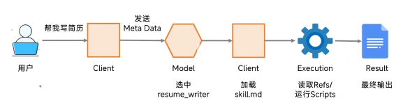

AI学习需要攻克的概念：

- ~~Agent~~

- Skill

- MCP

  

知了Agent：自动剪辑编排视频并发布。自主搜索潜在客户，输入行业关键词，24小时在线找客户；自主帮客户回复咨询；——知了AI员工系统

OpenClaw部署到本地，一般使用Mac mini 当做自己专属的小房间。通过自己的小电脑，对这只小龙虾发号施令。你觉得安全的，愿意给它处理的资料，就放在他那台mac mini上。

mac mini可以自己打开浏览器和操作应用。他模拟的是人的操作不是入侵。

百度APP，一键部署OpenClaw功能，百度APP文心助手，已接入5万个MCP服务（龙虾能用的工具），

龙虾本质是一个AI员工，懂得给龙虾定岗，告诉它要做什么，解决什么事情，需要掌握哪些能力。需要训练龙虾，为了让龙虾更聪明，需要给它配好的模型和算力。还需要好的语料进行调教。

OpenClaw + RPA ：支持在Telegram、飞书等即时通讯工具上面发送指令，让龙虾执行任务。（说明它可以连接这些通讯工具，也就是用户可以不用登录 OpenClaw 的界面，而直接在这些聊天工具里发送消息。）

**通过主流聊天工具当作控制界面来操作 OpenClaw** 的意思。

成熟的RPA工具主要有UiPath、Automation Anywhere、Blue Prism等国际产品，以及金智维、影刀、来也科技等国内方案。它们在跨境电商、金融等领域应用广泛，能有效提升自动化效率，就像视频里OpenClaw与RPA结合那样，让订单处理、库存监控等流程变得更智能高效。

视频展示了OpenClaw与RPA在跨境电商中的实际应用：OpenClaw作为"指令大脑"，支持自然语言交互（无需代码），可通过Telegram/飞书接收指令；RPA作为"执行双手"，能模拟人工操作完成跨系统任务。二者结合可实现：1)订单秒级处理（发货/物流监控）2)客服回复率提升至99% 3)自动优化多平台商品文案 4)每15分钟自动库存巡检并生成采购建议。核心使用路径是：在聊天框输入需求→OpenClaw解析指令→RPA执行操作。当前视频已包含完整演示，如需进一步了解，建议查阅官方文档获取最新实践指南。

OpenClaw擅长执行任务，并不擅长挖掘整理信息。Revor AI挖掘用户。

给龙虾安装各种Skills，赋予技能。如：marketingskills（GitHub）、resend-skills（GitHub），接管邮箱，自动发送。

MiniMax、月暗、智谱；

ChatGPT、Claude

用户界面录入需求 => AI处理 => 结果呈现。

skills：awesome-claude-skills（GitHub）

skills的使用示例：[建议收藏！全网最细的Skills实操，小白也能轻松学会！ - 今日头条](https://www.toutiao.com/video/7595480898611462656/?app=news_article_lite&category_new=__all__&module_name=Android_lite_wechat&share_did=MS4wLjACAAAAPrtHAauwMBmlj_BcCO2JSx_aZ48XXKBhx80vc6dusmPZqOBuoPXZnfS4qVS8-fL0&share_token=d8ed77ff-fc3d-45d0-a362-306649f94775&share_uid=MS4wLjABAAAARgFIBb7eyeaA7OcHMaSqRQs4Fx_bzxBLNKl4uKhK2Lc&timestamp=1772497884&tt_from=wechat&upstream_biz=Android_lite_wechat&utm_campaign=client_share&utm_medium=toutiao_android&utm_source=wechat&source=m_redirect)

skills 优势：可以放在项目级别或者放在Claude级别全局进行通用的。它是升级版的提示词，除了有提示词之外，还做了token优化，以及附件功能（可以扩展执行更多的复杂的任务）。

一键安装OpenClaw：[超简单！5分钟带你安装OpenClaw中文版！小白轻松上手！ - 今日头条](https://www.toutiao.com/video/7604714767949890075/?from_scene=all&log_from=1d597dfdc5b68_1772694825122) - OpenClaw-cn

将常用好用的提示词固定化为文件。

[10分钟彻底讲透Agent Skills！ - 今日头条](https://www.toutiao.com/video/7612662345742942770/?app=news_article_lite&category_new=__all__&module_name=Android_lite_wechat&share_did=MS4wLjACAAAAPrtHAauwMBmlj_BcCO2JSx_aZ48XXKBhx80vc6dusmPZqOBuoPXZnfS4qVS8-fL0&share_token=37812bfa-cb50-4822-b951-8f3073824a0f&share_uid=MS4wLjABAAAARgFIBb7eyeaA7OcHMaSqRQs4Fx_bzxBLNKl4uKhK2Lc&timestamp=1772497928&tt_from=wechat&upstream_biz=Android_lite_wechat&utm_campaign=client_share&utm_medium=toutiao_android&utm_source=wechat&source=m_redirect)

Agent Skills 代表了人机交互的质变。不再仅仅是向AI发送文字，而是在配置AI的专业能力。通过将提示词、数据、工具封装为SKill，我们将AI从通用的“聊天伴侣”变成了具备特定领域经验的“专家代理“。

Skill = skill.md + Meta Data + References + Scripts

Skill的完整工作流程：

Skills结构目录

Gemini3 、GPT5.2 做Code review

opencode的github插件: oh-my-opencode

OpenClaw：

- exec：权限很高，可以直接执行各种各样的终端命令
- read：读取各种各样的文件
- process：获取任务进度
- sessions_history：可以调取会话历史
- 

skills：说白了就是一份份提前写好的提示词，类似说明书。==awesome openclaw skills（GitHub）==

专门分享skills的平台：ClawHub

[一个视频搞懂OpenClaw！ - 今日头条](https://www.toutiao.com/video/7612480808959394358/?app=news_article_lite&category_new=__all__&module_name=Android_lite_wechat&share_did=MS4wLjACAAAAPrtHAauwMBmlj_BcCO2JSx_aZ48XXKBhx80vc6dusmPZqOBuoPXZnfS4qVS8-fL0&share_token=755364a3-1f41-4c1f-8bb0-a078025053da&share_uid=MS4wLjABAAAARgFIBb7eyeaA7OcHMaSqRQs4Fx_bzxBLNKl4uKhK2Lc&timestamp=1772498052&tt_from=wechat&upstream_biz=Android_lite_wechat&utm_campaign=client_share&utm_medium=toutiao_android&utm_source=wechat&source=m_redirect)

主流集成AI的编程工具：VS Code 、Cursor、Codex

[Agent技能全解析：从入门到原理一次讲透 - 今日头条](https://www.toutiao.com/video/7612414386585584134/?app=news_article_lite&category_new=__all__&module_name=Android_lite_wechat&share_did=MS4wLjACAAAAPrtHAauwMBmlj_BcCO2JSx_aZ48XXKBhx80vc6dusmPZqOBuoPXZnfS4qVS8-fL0&share_token=db09aca6-b9e7-4186-bbc9-4526d1f3107a&share_uid=MS4wLjABAAAARgFIBb7eyeaA7OcHMaSqRQs4Fx_bzxBLNKl4uKhK2Lc&timestamp=1772581921&tt_from=wechat&upstream_biz=Android_lite_wechat&utm_campaign=client_share&utm_medium=toutiao_android&utm_source=wechat&source=m_redirect)

混合检索、记忆刷写、OpenClaw Gateway、多智能体路由：[挑战17分钟，搞懂OpenClaw与Skills差异在哪 - 今日头条](https://www.toutiao.com/video/7612826914939601434/?app=news_article_lite&category_new=__all__&module_name=Android_lite_wechat&share_did=MS4wLjACAAAAPrtHAauwMBmlj_BcCO2JSx_aZ48XXKBhx80vc6dusmPZqOBuoPXZnfS4qVS8-fL0&share_token=325ab455-05fd-41ab-adf4-e1fe3bc65a04&share_uid=MS4wLjABAAAARgFIBb7eyeaA7OcHMaSqRQs4Fx_bzxBLNKl4uKhK2Lc&timestamp=1772600373&tt_from=wechat&upstream_biz=Android_lite_wechat&utm_campaign=client_share&utm_medium=toutiao_android&utm_source=wechat&source=m_redirect)

Github ：ClawRouter ：ClawRouter 的核心逻辑，是通过 15 个维度的逻辑分析，智能判断用户需求的复杂度，再自动在 40 多家海内外大模型中做智能路由选择。简单的天气查询、信息检索，直接调用免费 / 超低价模型；代码开发、复杂逻辑推理等高阶任务，再调用贵价的大模型。普通用户日常使用，能省下 50%-70% 的 Token 成本，极致情况下，成本能降低 90% 以上。

底层有阶跃星辰、月之暗面、Mini Max、火山引擎等大模型厂商，纷纷深度适配 OpenClaw，给开发者提供更低成本、更强能力的模型支持；基础设施层，有智能模型路由、跨 Agent 通讯协议、云部署、端侧硬件等项目，解决 Agent 的成本、通讯、部署核心难题；应用层，无数垂直场景的创新正在涌现，办公、占卜、运维、内容、生活服务、出海、投资，几乎覆盖了所有领域。

作者回复:  群里经常有同学问Codex，我三个一起说。 Codex是高质量写代码、Review代码神器，Cursor 是AI-IDE，Claude Code 是AI-工程系统 Codex提升编码能力 Cursor 提升个人编码和做项目的效率 CC 解决团队级、工程级、风险级问题 以前我一边用Cursor，一边用CC。现在我CC用熟了，Cursor鸡肋，弃了。 群里的小伙伴有的用CC做项目，然后用Codex Review。我觉得挺好。

如何安装，并持久化服务：[Windows本地轻松部署OpenClaw大龙虾教学，无需科学上网和WSL - 今日头条](https://www.toutiao.com/video/7612738135390323263/?app=news_article_lite&category_new=__all__&module_name=Android_lite_wechat&share_did=MS4wLjACAAAAPrtHAauwMBmlj_BcCO2JSx_aZ48XXKBhx80vc6dusmPZqOBuoPXZnfS4qVS8-fL0&share_token=c7d4bb65-0c5b-415f-9df5-b8b18cda6477&share_uid=MS4wLjABAAAARgFIBb7eyeaA7OcHMaSqRQs4Fx_bzxBLNKl4uKhK2Lc&timestamp=1772669838&tt_from=wechat&upstream_biz=Android_lite_wechat&utm_campaign=client_share&utm_medium=toutiao_android&utm_source=wechat&source=m_redirect)

[让 AI 住进飞书：OpenClaw 接入飞书机器人的完整实践 - it排球君 - 博客园](https://www.cnblogs.com/MrVolleyball/p/19676465)

[新手保姆级教程：OpenClaw 自动化操作浏览器！ - 狂师 - 博客园](https://www.cnblogs.com/jinjiangongzuoshi/p/19673570)

[OpenClaw 保姆级教程：你要知道的都在这里了！ - 贾克斯的平行世界 - 博客园](https://www.cnblogs.com/zh94/p/19670571)

[.NET+AI | MEAI | .NET 平台的 AI 底座 （1） - 「圣杰」 - 博客园](https://www.cnblogs.com/sheng-jie/p/19219744#top)

https://mp.weixin.qq.com/s/-H5o23ELvzp96ZMyq81cyA

[‍⁠‍‍⁠‌‍‌⁠‬⁠⁠‌‌‬‬‬‬‍‍手把手教你白嫖腾讯云服务器并安装OpenClaw和接入飞书机器人 - 飞书云文档](https://my.feishu.cn/wiki/TaF7whlWbiuHFTkS9KIcsb3PnHc)

SDD：规范驱动开发

【从 LLM 到 Agent Skill，一期视频带你打通底层逻辑！】 https://www.bilibili.com/video/BV1E7wtzaEdq/?share_source=copy_web&vd_source=0c3508996343cffb03a456391ba5edd0
