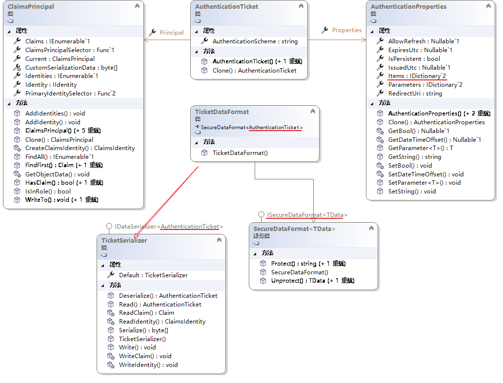
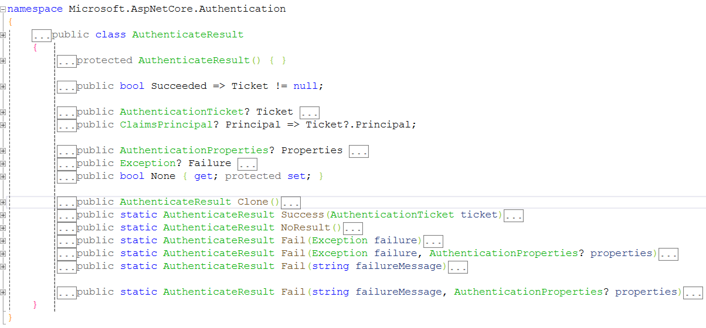
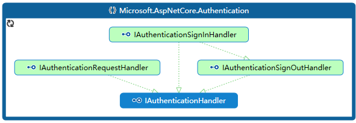
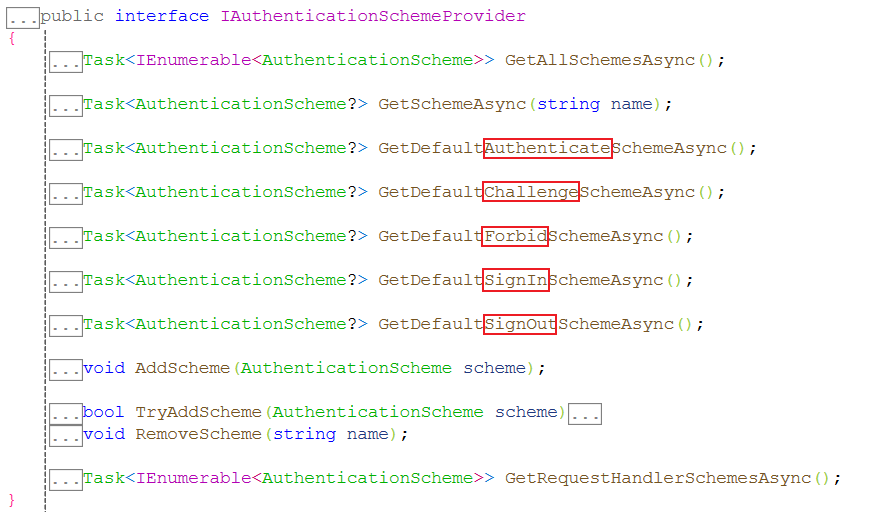

# ASP.NET Core 认证

认证是一个确定请求访问者真实身份的过程。认证的目的在于确定请求者是否与其声称的这个身份相符。


## 认证相关的核心对象

- Claim：描述用户身份的声明
- IIdentity：用户的身份
- IPrincipal：接受认证的对象，可能对应一个用户，也可能对应一个应用、进程或服务，不管这个对象是哪种类型，都用IPrincipal接口表示。

用户通过`IPrincipal`对象表示，而用户采用的身份通过`IIdentity`接口表示。通过`IPrincipal`对象表示的用户可以拥有一个或者多个通过`IIdentity`对象表示的身份。


### Claim

Claim可以用来描述用户的信息（如地址、电话号码），也可以描述用户的权限（如拥有的角色或所在用户组）。

Claim只能通过构造函数创建，Claim的所有成员属性的值只能获取不能修改。

其中Type属性可以通过静态类型`ClaimTypes`中的常量形式获取；ValueType属性可以通过静态类型`ClaimValueTypes`中的常量形式获取。

### `IIdentity`的衍生类：`ClaimsIdentity`和`GenericIdentity`

` IIdentity`表示用户的身份，`ClaimsIdentity`实现了`IIdentity`接口，而`GenericIdentity`又继承自`ClaimsIdentity`。

三者定义如下：

```c#
public interface IIdentity
{
    //认证类型
    string? AuthenticationType { get; }
    //身份是否经过认证
    bool IsAuthenticated { get; }
    //用户名
    string? Name { get; }
}
public class ClaimsIdentity : IIdentity{...}
public class GenericIdentity : ClaimsIdentity{...}
```

#### ClaimsIdentity

ClaimsIdentity 表示采用声明来描述的身份。它是对一组Claim对象的封装，对外提供了操作这组Claim对象集合的一些方法。

ClaimsIdentity中表示身份是否经过认证的IsAuthenticated属性取决于ClaimsIdentity对象是否设置了认证类型。

ClaimsIdentity中的相关源码如下：

```c#
public virtual bool IsAuthenticated
{
    get { return !string.IsNullOrEmpty(_authenticationType); }
}
public virtual string? AuthenticationType
{
    get { return _authenticationType; }
}
```

换句话说，如果AuthenticationType属性不是Null或者空字符串，IsAuthenticated就返回true。

#### GenericIdentity

GenericIdentity是ClaimsIdentity的子类，表示一个“泛化”的身份。

注意：**GenericIdentity重写了IsAuthenticated属性**，源码如下：

```c#
public override string Name
{
    get
    {
        return m_name;
    }
}
public override bool IsAuthenticated
{
    get
    {
        return !m_name.Equals("");
    }
}
```

此时，IsAuthenticated属性的值取决于表示用户名的Name属性是否是一个空字符串，如果有一个具体的用户名，就返回True。

### IPrincipal的衍生类：ClaimsPrincipal和GenericPrincipal

IPrincipal表示接受认证的对象，通常指用户。

ClaimsPrincipal实现了IPrincipal接口，而GenericPrincipal类又继承自ClaimsPrincipal。

三者定义如下：

```c#
public interface IPrincipal
{
    //认证用户的身份
    IIdentity? Identity { get; }

    //用户是否被添加到指定的角色中
    bool IsInRole(string role);
}
public class ClaimsPrincipal : IPrincipal{...}
public class GenericPrincipal : ClaimsPrincipal{...}
```

#### ClaimsPrincipal

ClaimsPrincipal是对多个ClaimsIdentity对象的封装，因此一个用户可以有多个身份。对外提供了操作ClaimsIdentity集合的方法。

其他属性参见源码。

#### GenericPrincipal

GenericPrincipal是ClaimsPrincipal的子类，当创建一个GenericPrincipal对象时，可以直接指定作为身份的IIdentity对象和角色列表。

由于GenericPrincipal的构造函数的参数类型是IIdentity接口，因此创建GenericPrincipal对象时，可以指定一个任意类型的IIdentity对象。


## 认证模型



### 认证票据：AuthenticationTicket

AuthenticationTicket对象实际上是对一个ClaimsPrincipal对象的封装。

AuthenticationTicket的属性描述如下：

| 属性                                                         | 描述                                                |
| ------------------------------------------------------------ | --------------------------------------------------- |
| [AuthenticationScheme](https://learn.microsoft.com/zh-cn/dotnet/api/microsoft.aspnetcore.authentication.authenticationticket.authenticationscheme?view=aspnetcore-8.0#microsoft-aspnetcore-authentication-authenticationticket-authenticationscheme) | 获取负责此票证的身份验证方案。                      |
| [Principal](https://learn.microsoft.com/zh-cn/dotnet/api/microsoft.aspnetcore.authentication.authenticationticket.principal?view=aspnetcore-8.0#microsoft-aspnetcore-authentication-authenticationticket-principal) | 获取具有经过身份验证的用户标识的 claims-principal。 |
| [Properties](https://learn.microsoft.com/zh-cn/dotnet/api/microsoft.aspnetcore.authentication.authenticationticket.properties?view=aspnetcore-8.0#microsoft-aspnetcore-authentication-authenticationticket-properties) | 身份验证会话的附加状态值。                          |

AuthenticationTicket的只读属性Principal返回一个ClaimsPrincipal对象。

AuthenticationTicket的只读属性Properties返回一个AuthenticationProperties对象。


#### 认证票据的描述信息：AuthenticationProperties 

AuthenticationProperties包含很多与当前上下文（Authentication Context）或者认证会话（Authentication Session）相关的信息，其中大部分是对认证票据的描述。其数据都保存在Items属性表示的数据字典中，如果需要为认证票据添加其他的描述信息，则可以直接将它们添加到这个字典中。

相关属性描述如下：

| 属性                                                         | 描述                                                         |
| ------------------------------------------------------------ | ------------------------------------------------------------ |
| [AllowRefresh](https://learn.microsoft.com/zh-cn/dotnet/api/microsoft.aspnetcore.authentication.authenticationproperties.allowrefresh?view=aspnetcore-8.0#microsoft-aspnetcore-authentication-authenticationproperties-allowrefresh) | 获取或设置是否应允许刷新身份验证会话。                       |
| [ExpiresUtc](https://learn.microsoft.com/zh-cn/dotnet/api/microsoft.aspnetcore.authentication.authenticationproperties.expiresutc?view=aspnetcore-8.0#microsoft-aspnetcore-authentication-authenticationproperties-expiresutc) | 获取或设置身份验证票证的过期时间。                           |
| [IsPersistent](https://learn.microsoft.com/zh-cn/dotnet/api/microsoft.aspnetcore.authentication.authenticationproperties.ispersistent?view=aspnetcore-8.0#microsoft-aspnetcore-authentication-authenticationproperties-ispersistent) | 获取或设置是否在多次请求后保留身份验证会话。                 |
| [IssuedUtc](https://learn.microsoft.com/zh-cn/dotnet/api/microsoft.aspnetcore.authentication.authenticationproperties.issuedutc?view=aspnetcore-8.0#microsoft-aspnetcore-authentication-authenticationproperties-issuedutc) | 获取或设置身份验证票证的颁发时间。                           |
| [Items](https://learn.microsoft.com/zh-cn/dotnet/api/microsoft.aspnetcore.authentication.authenticationproperties.items?view=aspnetcore-8.0#microsoft-aspnetcore-authentication-authenticationproperties-items) | 有关身份验证会话的状态值。                                   |
| [Parameters](https://learn.microsoft.com/zh-cn/dotnet/api/microsoft.aspnetcore.authentication.authenticationproperties.parameters?view=aspnetcore-8.0#microsoft-aspnetcore-authentication-authenticationproperties-parameters) | 传递给身份验证处理程序的参数集合。 它们不用于序列化或持久性，仅用于在调用站点之间流动数据。 |
| [RedirectUri](https://learn.microsoft.com/zh-cn/dotnet/api/microsoft.aspnetcore.authentication.authenticationproperties.redirecturi?view=aspnetcore-8.0#microsoft-aspnetcore-authentication-authenticationproperties-redirecturi) | 获取或设置要用作 http 重定向响应值的完整路径或绝对 URI。     |


#### 认证票据的格式化：TicketDataFormat

认证票据是一种私密性数据，请求携带的认证票据需要进行序列化和数据加密操作。这个过程称为“对认证票据的格式化”，主要通过TicketDataFormat对象来完成。

`TicketDataFormat` 派生自 `SecureDataFormat<AuthenticationTicket>`：

```c#
public class TicketDataFormat : SecureDataFormat<AuthenticationTicket>
{
    public TicketDataFormat(IDataProtector protector)
        : base(TicketSerializer.Default, protector)
    {
    }
}
```

`TicketDataFormat` 对象默认使用的序列化器来源于TicketSerializer.Default返回的TicketSerializer对象。

```c#
public class TicketSerializer : IDataSerializer<AuthenticationTicket>
{
    ...
    public static TicketSerializer Default { get; } = new TicketSerializer();
    ...
}
```

##### `SecureDataFormat<TData> `类型

`SecureDataFormat<TData> `能够将数据的序列化/反序列化和加密/解密分开来实现，并将序列化/反序列化交给一个由`IDataSerializer<TData>`对象表示的序列化器来完成，而加密/解密工作则由一个IDataProtector对象来负责。可以根据需要自定义相应的IDataProtector实现类型并采用相应的算法来对认证票据实施加密。

`SecureDataFormat<TData> `实现了接口 `ISecureDataFormat<TData>`：

```c#
public class SecureDataFormat<TData> : ISecureDataFormat<TData>
{
    private readonly IDataSerializer<TData> _serializer;
    private readonly IDataProtector _protector;
    public SecureDataFormat(IDataSerializer<TData> serializer, IDataProtector protector)
    {
        _serializer = serializer;
        _protector = protector;
    }
    ...
}
```

`ISecureDataFormat<TData>`接口定义如下：

```c#
public interface ISecureDataFormat<TData>
{
    string Protect(TData data, string? purpose); 
    TData? Unprotect(string? protectedText);
    TData? Unprotect(string? protectedText, string? purpose);
}
```


### 认证处理器：IAuthenticationHandler

认证处理器在认证模型中通过IAuthenticationHandler接口表示，每种认证方案都对应该接口的某个实现类型。

IAuthenticationHandler的定义如下：

```csharp
public interface IAuthenticationHandler
{
   //初始化身份验证处理程序
   Task InitializeAsync(AuthenticationScheme scheme, HttpContext context);
   //对当前请求进行身份验证
   Task<AuthenticateResult> AuthenticateAsync();
   //质询当前请求
   Task ChallengeAsync(AuthenticationProperties? properties);
   //禁止当前请求
   Task ForbidAsync(AuthenticationProperties? properties);
}
```

认证中间件最终调用AuthenticateAsync方法对每个请求实施认证。在实施认证之前，还会调用InitializeAsync方法来完成一些初始化工作，方法的第一个参数AuthenticationScheme表示当前的认证方案。

AuthenticateAsync方法在完成认证后会将认证结果封装到AuthenticateResult对象。

#### 认证结果：AuthenticateResult

AuthenticateResult定义如下：



认证结果具有成功、失败和None这三种状态，每种状态都有对应的属性和静态方法。

AuthenticateAsync方法用来认证请求，ChallengeAsync方法和ForbidAsync方法分别在匿名请求和权限不足情况下发送质询。

而登录和注销操作定义在IAuthenticationHandler的派生接口中。

#### IAuthenticationHandler的派生接口

实现了IAuthenticationHandler接口的子接口如下图所示：



##### IAuthenticationSignOutHandler 和 IAuthenticationSignInHandler 

IAuthenticationSignOutHandler 实现了 IAuthenticationHandler：

```c#
public interface IAuthenticationSignOutHandler : IAuthenticationHandler
{
   Task SignOutAsync(AuthenticationProperties? properties);
}
```

而IAuthenticationSignInHandler 又实现了 IAuthenticationSignOutHandler：

```c#
 public interface IAuthenticationSignInHandler : IAuthenticationSignOutHandler
 {
     Task SignInAsync(ClaimsPrincipal user, AuthenticationProperties? properties);
 }
```

因此，认证处理器类型只需要实现IAuthenticationSignInHandler接口，就可以实现一个完整的认证方案需要实现的请求认证、登录和注销3个核心操作。例如针对Cookie认证方案的CookieAuthenticationHandler类型就实现了IAuthenticationSignInHandler接口。

##### IAuthenticationRequestHandler

对于一个普通的 IAuthenticationHandler对象来说，认证中间件利用它来对当前请求实施认证之后总是将请求分发给后续管道，而IAuthenticationRequestHandler对象则对请求处理具有更大的控制权，因为它可以决定是否还有必要对当前请求进行后续处理。

IAuthenticationRequestHandler也实现了IAuthenticationHandler：

```c#
public interface IAuthenticationRequestHandler : IAuthenticationHandler
{
    Task<bool> HandleRequestAsync();
}
```

HandleRequestAsync方法如果返回true，则整个请求处理流程将到此为止。

#### 获取认证处理器对象：IAuthenticationHandlerProvider

IAuthenticationHandlerProvider的GetHandlerAsync方法会根据当前HttpContext上下文对象和认证方案名称来提供对应的IAuthenticationHandler对象。

```c#
public interface IAuthenticationHandlerProvider
{
    Task<IAuthenticationHandler?> GetHandlerAsync(HttpContext context, string authenticationScheme);
}
```

##### IAuthenticationHandlerProvider的实现类：AuthenticationHandlerProvider

```c#
public class AuthenticationHandlerProvider : IAuthenticationHandlerProvider
{
    public AuthenticationHandlerProvider(IAuthenticationSchemeProvider schemes);

    public IAuthenticationSchemeProvider Schemes { get; }

    public Task<IAuthenticationHandler?> GetHandlerAsync(HttpContext context, string authenticationScheme);
}
```

#### 认证方案：AuthenticationScheme

```c#
public class AuthenticationScheme
{
    public AuthenticationScheme(string name, string? displayName, Type handlerType){...}
	//认证方案名称
    public string Name { get; }
	//认证方案显示名称
    public string? DisplayName { get; }
	//认证处理器的类型
    public Type HandlerType { get; }
}
```


#### 注册和获取认证方案：IAuthenticationSchemeProvider

IAuthenticationSchemeProvider可以根据认证方案名称得到对应的AuthenticationScheme对象，同时也通过其进行认证方案的注册。

IAuthenticationSchemeProvider的定义如下：



认证方案通过AddScheme方法进行注册，注册的认证方案通过RemoveScheme方法删除。

GetSchemeAsync方法根据指定的认证方案名称获取对应的AuthenticationScheme对象。上述红框表示为5种类型的操作（请求认证、登录、注销和两种质询）提供默认的认证方案。

GetRequestHandlerSchemesAsync方法返回的认证方案是供 IAuthenticationRequestHandler对象使用的。

##### IAuthenticationSchemeProvider的实现类：AuthenticationSchemeProvider


### 认证服务：IAuthenticationService

在实际应用中，并不会直接调用作为认证处理器的IAuthenticationHandler对象的AuthenticateAsync方法、SignInAsync方法和SignOutAsync方法来进行认证、登录和注销操作，而是调用HttpContext上下文对象的同名方法。认证方案的5个核心操作（认证、登录、注销、2个质询）都可以调用HttpContext上下文对象对应的方法来完成。

下述是SignInAsync方法的实现方式：

```c#
public static Task SignInAsync(this HttpContext context, string? scheme, ClaimsPrincipal principal, AuthenticationProperties? properties) =>
    context.RequestServices.GetRequiredService<IAuthenticationService>().SignInAsync(context, scheme, principal, properties);

```

可以看到，这些方法与IAuthenticationHandler对象之间的适配是通过IAuthenticationService服务来实现的。

```c#
public interface IAuthenticationService
{
    Task<AuthenticateResult> AuthenticateAsync(HttpContext context, string? scheme);
	
    Task ChallengeAsync(HttpContext context, string? scheme, AuthenticationProperties? properties);

    Task ForbidAsync(HttpContext context, string? scheme, AuthenticationProperties? properties);

    Task SignInAsync(HttpContext context, string? scheme, ClaimsPrincipal principal, AuthenticationProperties? properties);

    Task SignOutAsync(HttpContext context, string? scheme, AuthenticationProperties? properties);
}
```

#### IAuthenticationService接口的默认实现类：AuthenticationService

```c#
public class AuthenticationService : IAuthenticationService
{
    private HashSet<ClaimsPrincipal>? _transformCache;

    public AuthenticationService(IAuthenticationSchemeProvider schemes, IAuthenticationHandlerProvider handlers, IClaimsTransformation transform, IOptions<AuthenticationOptions> options)
    {
        Schemes = schemes;
        Handlers = handlers;
        Transform = transform;
        Options = options.Value;
    }
    
	public IAuthenticationSchemeProvider Schemes { get; }
	public IAuthenticationHandlerProvider Handlers { get; }
	public IClaimsTransformation Transform { get; }
    public AuthenticationOptions Options { get; }
    public virtual async Task ChallengeAsync(HttpContext context, string? scheme, AuthenticationProperties? properties) { .... }
    
  	public virtual async Task ForbidAsync(HttpContext context, string? scheme, AuthenticationProperties? properties) { ... }
    
    public virtual async Task SignInAsync(HttpContext context, string? scheme, ClaimsPrincipal principal, AuthenticationProperties? properties)    {  ... }
    
    public virtual async Task SignOutAsync(HttpContext context, string? scheme, AuthenticationProperties? properties){ ... }

	//AuthenticateAsync的实现方式
    public virtual async Task<AuthenticateResult> AuthenticateAsync(HttpContext context, string? scheme)
    {
        if (scheme == null)
        {
            //WY:此处获取AuthenticationScheme对象
            var defaultScheme = await Schemes.GetDefaultAuthenticateSchemeAsync();
            scheme = defaultScheme?.Name;
            if (scheme == null)
            {
                throw new InvalidOperationException($"No authenticationScheme was specified, and there was no DefaultAuthenticateScheme found. The default schemes can be set using either AddAuthentication(string defaultScheme) or AddAuthentication(Action<AuthenticationOptions> configureOptions).");
            }
        }
        //WY:此处用于获取IAuthenticationHandler对象
        var handler = await Handlers.GetHandlerAsync(context, scheme);
        if (handler == null)
        {
            throw await CreateMissingHandlerException(scheme);
        }

        // Handlers should not return null, but we'll be tolerant of null values for legacy reasons.
        var result = (await handler.AuthenticateAsync()) ?? AuthenticateResult.NoResult();

        if (result.Succeeded)
        {
            var principal = result.Principal!;
            var doTransform = true;
            _transformCache ??= new HashSet<ClaimsPrincipal>();
            if (_transformCache.Contains(principal))
            {
                doTransform = false;
            }

            if (doTransform)
            {
                //WY:实现ClaimsPrincipal对象的转换或者加跟
                principal = await Transform.TransformAsync(principal);
                _transformCache.Add(principal);
            }
            return AuthenticateResult.Success(new AuthenticationTicket(principal, result.Properties, result.Ticket!.AuthenticationScheme));
        }
        return result;
    }
    
    .....
}      
```

由于构造函数中注入了IAuthenticationHandlerProvider对象，所以能够利用它得到对应的IAuthenticationHandler对象并实现5个方法。并且构造函数还注入了IAuthenticationSchemeProvider对象，可以通过它提供默认的认证方案。

见上述AuthenticateAsync方法的实现代码的注释说明。


## 服务注册

- AddAuthentication
- AuthenticationBuilder
- AuthenticationSchemeOptions
- AuthenticationMiddleware


参考资源：《ASP.NET Core 6 框架揭秘》

更新时间：2024-02-17
