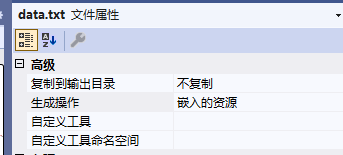

# ASP.NET Core 文件系统

ASP.NET Core 中的文件系统的核心对象是 IFileProvider 对象，当需要读取配置文件、静态Web资源文件（如CSS、JS和图片文件等）、MVC应用的视图文件，以及直接编译到程序集中的内嵌资源文件，只要是和目录或文件相关的读取，都需要使用到 IFileProvider对象。

IFileProvider接口的定义源码如下：

```c#
public interface IFileProvider
{
    //获取文件信息
    IFileInfo GetFileInfo(string subpath);
	//获取目录内容
    IDirectoryContents GetDirectoryContents(string subpath);
	//监听文件，参数支持通配符
    IChangeToken Watch(string filter);
}
```


## 获取目录树形结构

通过调用IFileProvider对象的GetDirectoryContents()方法获取指定目录下的目录和文件信息。

```c#
public class FileSystem : IFileSystem
{
    ...
    public void ShowStructure(Action<int, string> print)
    {
        int indent = -1;
        Print("");

        void Print(string subPath)
        {
            indent++;
            foreach (var fileInfo in _fileProvider.GetDirectoryContents(subPath))
            {
                print(indent, fileInfo.Name);
                if (fileInfo.IsDirectory)
                {
                    Print($@"{subPath}\{fileInfo.Name}".TrimStart('\\'));
                }
            }
            indent--;
        }
    }
}
```

注册IFileProvider服务的代码：

```c#
static void Print(int layer, string name) => Console.WriteLine($"{new string(' ', layer * 4)}{name}");
new ServiceCollection()
    .AddSingleton<IFileProvider>(new PhysicalFileProvider(@"c:\test"))
    .AddSingleton<IFileSystem, FileSystem>()
    .BuildServiceProvider()
    .GetRequiredService<IFileSystem>()
    .ShowStructure(Print);
```

当需要根据指定的目录构建IFileProvider对象时，需要使用PhysicalFileProvider类，该类实现了IFileProvider接口。


## 读取文件内容

### 读取物理文件

通过调用IFileProvider对象的GetFileInfo()方法获取一个描述目标文件的IFileInfo对象，然后通过该对象相关的方法进行文件的读取操作。

```c#
public class FileSystem : IFileSystem
{
    ...
    public async Task<string> ReadAllTextAsync(string path)
    {
        byte[] buffer;
        using (var stream = _fileProvider.GetFileInfo(path).CreateReadStream())
        {
            buffer = new byte[stream.Length];
            await stream.ReadAsync(buffer);
        }
        return Encoding.Default.GetString(buffer);
    }
}
```

注册IFileProvider服务的代码：

```c#
var content = await new ServiceCollection()
    .AddSingleton<IFileProvider>(new PhysicalFileProvider(@"c:\test"))
    .AddSingleton<IFileSystem, FileSystem>()
    .BuildServiceProvider()
    .GetRequiredService<IFileSystem>()
    .ReadAllTextAsync("data.txt");
```


### 读取程序集中的内嵌的资源文件

将项目下的文件内嵌到编译生成的程序集中：



上述设置会改变.csproj文件中的内容：

```c#
  <ItemGroup>
    <EmbeddedResource Include="data.txt" />
  </ItemGroup>
```

读取内嵌文件的内容：

```c#
//获取默认应用程序域中的进程可执行文件
var assembly = Assembly.GetEntryAssembly()!;
var content = await new ServiceCollection()
    .AddSingleton<IFileProvider>(new EmbeddedFileProvider(assembly))
    .AddSingleton<IFileSystem, FileSystem>()
    .BuildServiceProvider()
    .GetRequiredService<IFileSystem>()
    .ReadAllTextAsync("data.txt");

var stream = assembly.GetManifestResourceStream($"{assembly.GetName().Name}.data.txt");
var buffer = new byte[stream!.Length];
stream.Read(buffer, 0, buffer.Length);

Debug.Assert(content == Encoding.Default.GetString(buffer));
```


## 监控文件的变化

通过调用IFileProvider对象的Watch()方法来实施文件的监控。该方法返回IChangeToken对象。注意：ChangeToken静态类并不是IChangeToken接口的实现类，ChangeToken类的OnChange()静态方法接收一个返回类型是IChangeToken的回调函数作为参数。

```c#
using var fileProvider = new PhysicalFileProvider(@"c:\test");
string? original = null;
//监听文件一旦发生变化就调用Callback方法
ChangeToken.OnChange(() => fileProvider.Watch("data.txt"), Callback);
//每隔5秒就写入当前时间
while (true)
{
    File.WriteAllText(@"c:\test\data.txt", DateTime.Now.ToString());
    await Task.Delay(5000);
}

async void Callback()
{
    var stream = fileProvider.GetFileInfo("data.txt").CreateReadStream();
    {
        var buffer = new byte[stream.Length];
        await stream.ReadAsync(buffer);
        var current = Encoding.Default.GetString(buffer);
        if (current != original)
        {
            //输出内容
            Console.WriteLine(original = current);
        }
    }
}
```


## 文件系统的几个核心对象

### IFileProvider

IFileProvider接口的定义源码如下：

```c#
public interface IFileProvider
{
    //获取文件信息
    IFileInfo GetFileInfo(string subpath);
	//获取目录内容
    IDirectoryContents GetDirectoryContents(string subpath);
	//监听文件，参数支持通配符
    IChangeToken Watch(string filter);
}
```

实现了`IFileProvider`接口的常用类型有：

- PhysicalFileProvider：用于物理文件操作。
- EmbeddedFileProvider：用于程序集内嵌文件操作。
- NullFileProvider：表示一个不包含任何目录和文件的空文件系统。
- CompositeFileProvider：表示一个由多个 IFileProvider 构建的复合式的文件系统。


### IChangeToken

IChangeToken接口的定义源码如下：

```c#
public interface IChangeToken
{
    //如果关联的数据发生改变，HasChanged属性将变成true
    bool HasChanged { get; }

    //当数据发生变化时是否需要主动执行注册的回调操作
    bool ActiveChangeCallbacks { get; }

    //注册一个在数据发生改变时可以自动执行的回调
    IDisposable RegisterChangeCallback(Action<object> callback, object state);
}
```

注意：静态类ChangeToken不是IChangeToken接口的实现类。

实现了IChangeToken接口的常用类型有：

- CancellationChangeToken，该类型是对一个CancellationToken对象的封装。
- CompositeChangeToken，表示由多个IChangeToken组合而成的复合型IChangeToken对象。对于一个CompositeChangeToken对象来说，只要组成它的任何一个IChangeToken发生改变，其HasChanged属性就变成True，注册的回调随之被执行。只要任何一个IChangeToken的同名属性返回true，ActiveChangeCallbacks属性就会返回true。

#### ChangeToken

注意：静态类ChangeToken不是IChangeToken接口的实现类，而是对`IChangeToken`的简化操作。虽然可以直接调用`IChangeToken`提供的`RegisterChangeCallback`方法注册在接收到数据变化通知后的回调操作，但更常用的是调用`ChangeToken`类型提供的两个`OnChange`静态方法。该方法的第一个参数需要被指定为一个用来提供`IChangeToken`对象的`Func<IChangeToken>`委托对象。

```c#
ChangeToken.OnChange(() => fileProvider.Watch("data.txt"), Callback);
```


### 物理文件系统的几个核心对象

物理文件系统的核心对象都是通过PhysicalProvider对象的相关调用产生的。

#### `IFileInfo`

通过调用`IFileProvider`的`GetFileInfo()`方法可以得到`IFileInfo`对象，该对象有以下几种类型。

实现了`IFileInfo`接口的类型有：

- PhysicalFileInfo：是对System.IO.FileInfo的封装，其所有属性都来源于封装的FileInfo对象。
- NotFoundFileInfo：当目标文件不存在时，返回该对象。
- PhysicalDirectoryInfo：是对System.IO.DiredcotryInfo对象的封装，其所有属性都来源于封装的DirectoryInfo对象。

#### PhysicalFilesWatcher

PhysicalFileProvider针对物理文件的变化监控是通过PhysicalFilesWatcher对象实现的。其Watch方法的内部会直接调用PhysicalFileProvider的CrateFileChangeToken方法，并返回IChangeToken对象。这是一个公共类型，如果有监控物理文件系统变化的需求，都可以直接使用它。

 当PhysicalFilesWatcher 的 Watch方法被调用时，PhysicalFileProvider会通过解析目录通配符表达式来确定监控的文件或目录，并最终利用 FileSystemWatcher 对象对这些文件实施监控。监控文件或者目录的变化（创建、修改、重命名和删除等）都会实时的反映到Watch方法返回的IChangeToken对象上。


### 内嵌程序集中的资源文件相关的几个核心对象

- Assembly：该对象提供了用于提取内嵌资源文件的内容和元素信息的方法。
- EmbeddedFileProvider
- EmbeddedResourceFileInfo


---


笔记来源：《ASP.NET Core 6 框架揭秘》