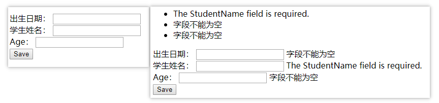
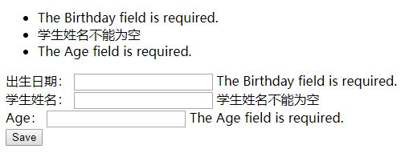
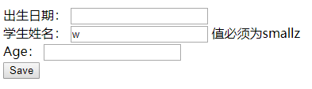
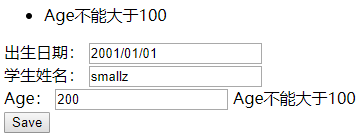

# ASP.NET Core 模型验证

模型（Model）是一个经常被提到的词汇，无论是Entity Framework中的模型，还是ASP.NET Core中的模型，它的实质都是一个C#实体类。在Entity Framework中，模型实体类是用于映射数据库表结构的自定义类，实现数据的存储和处理。在ASP.NET Core中，模型实体类是一个自定义的ViewModel类，用于视图的数据绑定和呈现，这个自定义的ViewModel类也可以直接使用数据库操作（例如Entity Framework）的实体类（通常不建议这么做，而是自定义一个ViewModel类，用于模型绑定）。

模型验证指的是为了防止错误的或存在安全威胁的数据被处理，而在模型进行绑定时所做的验证。


## 模型状态

模型状态指的是模型在绑定和验证时发生的错误情况。

模型会先绑定再验证，一般来说， 模型绑定的错误通常是数据转换错误（例如，在要求为数字的字段输入了字符串）；而模型验证的错误通常是数据在不符合业务规则时报告的错误（例如，在字段要求只能输入1-5之间的数字中输入了0）。

需要注意的是：模型绑定和模型验证都是在执行控制器操作（或Razor Pages处理程序方法）之前进行。

可以在控制器操作方法（或Razor Pages处理程序方法）中，使用ModelState属性及其成员获取模型验证的状态。

```c#
public IActionResult Save(StudentViewModel student)
{
    if (!ModelState.IsValid)
    {
        return View("Index", student);
    }    
    return RedirectToAction(actionName: nameof(Index));
}
```

注意：如果 Web API 控制器具有 `[ApiController]` 特性，则它们不必检查 `ModelState.IsValid`。 在此情况下，如果模型状态无效，将返回包含问题详细信息的自动 HTTP 400 响应。

### 重新运行验证

可以调用TryValidateModel()方法对模型进行重新验证，一般不常用，但是对于模型中的属性重新赋值或修复验证不通过的模型时，会很有用。

```c#
public IActionResult Save(StudentViewModel student)
{
    if (!ModelState.IsValid)
    {
        student.Age = 23;
        //清空之前的验证状态，不调用该方法，IsValid会始终为false
        ModelState.Clear();
        TryValidateModel(student);
    }
    if (!ModelState.IsValid)
    {
        return View("Index", student);
    }
    //return View("Index", student);
    return RedirectToAction(actionName: nameof(Index));
}
```

上述代码需要特别注意的是，如果在ModelState.IsValid为false的情况下，调用TryValidateModel()方法时，一定要先调用ModelState.Clear()方法清空之前的验证状态，否则ModelState.IsValid将一直为false。


## 验证相关的内置特性

内置的一些特性可以为模型属性的验证指定验证规则。这些内置的特性都在[System.ComponentModel.DataAnnotations](https://docs.microsoft.com/dotnet/api/system.componentmodel.dataannotations) 命名空间中，可在该命名空间下找到验证特性的完整列表。

一些常用的内置验证特性如下：

- [Required]：验证字段是否非NULL。
- [StringLength]：验证字符串属性值是否未超过指定长度限制。
- [RegularExpression]：验证属性值是否与指定的正则表达式匹配。
- [EmailAddress]：验证属性是否有电子邮件格式。
- [Phone]：验证属性是否有电话号码格式。
- [Range]：验证属性值是否在指定范围内。
- [CreditCard]：验证属性是否有信用卡格式。
- [Compare]：验证模型中的两个属性是否匹配。
- [Url]：验证属性是否有 URL 格式。
- [Remote]：通过调用服务器上的操作方法，验证客户端上的输入。

示例：

```c#
[Required]
[StringLength(maximumLength:10,ErrorMessage ="{0}的长度必须在{2}-{1}之间",MinimumLength =2)]
public string StudentName { get; set; }

[DataType(DataType.Date)]
public DateTime Birthday { get; set; }

[Range(18,36)]
public int Age { get; set; }
```


### ErrorMessage

在应用某些验证特性时（例如StringLengthAttribute特性），特性中包含了ErrorMessage属性，该属性用于获取或设置一条在验证失败的情况下与验证控件关联的错误消息。

ErrorMessage属性的值是一个支持使用[复合格式设置（String.Format）](https://docs.microsoft.com/zh-cn/dotnet/standard/base-types/composite-formatting?view=netframework-4.7.2)的错误消息字符串。针对不同特性的ErrorMessage属性值，可以指定的占位符数量和代表的含义各不相同。

例如，StringLength特性，可以指定3个占位符：

```c#
[StringLength(maximumLength:8,ErrorMessage ="{0}的长度必须在{2}-{1}之间",MinimumLength =6)]
public string StudentName{ get; set; }
```

ErrorMessage属性值中占位符：{0}表示属性名称，这里值为StudentName，{1}为maximumLength参数的值，{2}为MinimumLength属性的值。因此上述的最终错误消息为：“StudentName的长度必须在6-8之间”。

备注：关于各个特性中的ErrorMessage属性说明，可以查阅该特性相关的官方帮助文档说明。

### [Required]特性

默认情况下，验证系统将不可为null的类型（如int、decimal、DateTime等）的参数或属性视为具有[Required]特性。

#### 自定义默认错误消息

如果特性不使用ErrorMessage属性指定错误消息，在验证不通过时，将会显示默认的错误消息，可以在Startup.ConfigureServices()方法中，通过配置选项来设置默认的错误消息。

```c#
public void ConfigureServices(IServiceCollection services)
{
    services.AddMvc(options =>
    {
        options.ModelBindingMessageProvider.SetValueMustNotBeNullAccessor(
        (_s) => "字段不能为空");
    })
    .SetCompatibilityVersion(Microsoft.AspNetCore.Mvc.CompatibilityVersion.Version_2_2);
}
```

上述代码只是设置了必填项为空时的默认错误消息。options.ModelBindingMessageProvider可以获取Microsoft.AspNetCore.Mvc.ModelBinding.Metadata.DefaultModelBindingMessageProvider类型的对象，该类还包含许多设置其他场景的模型绑定错误的默认消息的方法。

备注：实际使用中，通过这种方式单独设置每种场景的默认错误消息并不常用，而是使用特性中的ErrorMessage属性，它提供了更大的灵活性。通过同时设置了默认错误消息和ErrorMessage属性，那么最终将使用ErrorMessage属性设置的错误消息。

### 示例

接下来的所有代码都是基于该示例进行的扩展。

首先定义一个模型，StudentViewModel.cs：

```c#
namespace My.ModelValidation.Study.ViewModels
{
    public class StudentViewModel
    {
        public int StudentId { get; set; }

        [Required]
        public string StudentName { get; set; }

        [DataType(DataType.Date)]
        public DateTime Birthday { get; set; }

        public int Age { get; set; }
    }
}
```

StudentViewModel模型中只有StudentName属性为string类型，其他的都为非null值类型，如前所述，验证系统将不可为 null 类型视为具有 `[Required]` 特性。 这意味着即使不应用 `[Required]` 特性，也可进行客户端验证。 但如果不使用Required特性，将将收到默认错误消息。 若要指定自定义错误消息，就需要使用Required特性，并指定ErrorMessage值。

接着在HomeController中，定义如下操作方法：

```c#
public IActionResult Index()
{
    return View();
}
public IActionResult Save(StudentViewModel student)
{
    if (!ModelState.IsValid)
    {
        return View("Index", student);
    }
    //这里为了看到最终呈现的验证效果，都返回Index视图
    return View("Index", student);
    //return RedirectToAction(actionName: nameof(Index));
}
```

对应的Home/Index.cshtml：

```html
@{
    Layout = null;
}
@addTagHelper *, Microsoft.AspNetCore.Mvc.TagHelpers

@namespace My.ModelValidation.Study
@using ViewModels

@model StudentViewModel
<!DOCTYPE html>

<html>
<head>
    <meta name="viewport" content="width=device-width" />
    <title>ASP.NET Core 模型验证</title>
</head>
<body>
    <form asp-action="Save" method="post">

        <div asp-validation-summary="All" class="text-danger"></div>

        <div>
            <label asp-for="Birthday ">出生日期：</label>
            <input type="text" asp-for="Birthday " />
            <span asp-validation-for="Birthday" class="text-danger"></span>
        </div>
        <div>
            <label asp-for="StudentName">学生姓名：</label>
            <input asp-for="StudentName" />
            <span asp-validation-for="StudentName" class="text-danger"></span>
        </div>
        <div>
            <label asp-for="Age"></label>：
            <input asp-for="Age" />
            <span asp-validation-for="Age" class="text-danger"></span>
        </div>

        <input type="submit" value="Save" />
    </form>
</body>
</html>
```

在Razor视图页面中，没有任何的js代码，直接运行程序，在不输入任务数据的情况下点击Save，呈现的效果如下：

当点击Save按钮时，将会调用控制器操作方法Save()，该方法中，ModelState.IsValid为false，验证不通过，将直接向客户端响应Index视图，随后看到响应的错误消息。其中非null类型的属性（例如Age），自动被应用[Required]特性。

另外通过Index.cshtml页面内容可以看到，即使不使用任何的js脚本，仍然可以进行模型验证，只不过是服务器端的模型验证，如果想要在客户端就支持验证，避免到服务器的不必要往返，就需要借助js/JQuery验证插件：

```html
<script src="https://cdnjs.cloudflare.com/ajax/libs/jquery/3.3.1/jquery.min.js"></script>
<!--添加的下述链接之后，对于必填项的内容，如果没有填写，将会阻止提交-->
<script src="https://cdnjs.cloudflare.com/ajax/libs/jquery-validate/1.17.0/jquery.validate.min.js"></script>
<script src="https://cdnjs.cloudflare.com/ajax/libs/jquery-validation-unobtrusive/3.2.11/jquery.validate.unobtrusive.min.js"></script>
```

注意：一旦添加了上述的Javascript脚本引用，当点击Save按钮时，将不会直接调用Home/Save，而是先进行客户端的验证，对于必填字段的默认错误消息，将不会被提示，而是显示ErrorMessage属性的默认消息内容。

例如，将StudentName属性添加Required特性，并指定ErrorMessage的值：

```c#
[Required(ErrorMessage ="学生姓名不能为空")]
public string StudentName { get; set; }
//Age不添加任何特性
public int Age { get; set; }
```

当引用了上述中的JS文件之后，不填写任何内容，直接点击Save按钮，将不会触发控制器操作方法的调用，而是只触发客户端的验证，并且显示的消息全部来自于ErrorMessage属性（包括int类型的Age属性，默认使用Required特性）指定的值。

显示效果如下：



备注：此处更能说明前文中的配置默认的错误消息内容并没有多大意义，因为ErrorMessage属性值往往具有更高的应用性。

### [Remote]特性

[Remote] 特性用于客户端验证，该验证需要在服务器上调用方法，以确定字段输入是否有效，效果有点类似于Ajax调用。使用该特性时，必须引入上文中的3个Javascript脚本文件。

要实现远程验证，需要在服务器端定义可供JavaScript调用的操作方法，该操作方法要求返回JSON响应。只有在值为true的情况下，才表示输入有效。任何其他字符串都表示输入无效，并且会将字符串作为自定义的错误消息进行显示。

HomeController中存在下述操作方法用于远程验证：

```c#
[AcceptVerbs("Get", "Post")]
public IActionResult VerifyData(string StudentName,int Age,DateTime Birthday)
{
    if (!StudentName.Equals("smallz"))
    {
        return Json("值必须为smallz");
    }
    return Json(true);
}
```

定义好操作方法后，还需要在模型的属性上使用[Remote]特性进行注解：

```c#
[Remote(action: "VerifyData", controller: "Home", AdditionalFields = nameof(Age) + "," + nameof(Birthday))] //该特性必须借助前端js才能实现
public string StudentName { get; set; }
```

Remote特性的controller参数用来指定要处理的控制器名称，action参数用来指定对应的操作方法名称。如果操作方法的参数名称和要使用Remote特性的属性名称相同（例如上述中的StudentName参数），将自动将属性对应的实际值传入到操作方法对应的参数上。

因此，当操作方法VerifyData(string StudentName)只有一个参数时，可以直接使用如下特性形式：

```c#
[Remote(action: "VerifyData", controller: "Home")]
public string StudentName { get; set; }
```

如果有除属性之外的其他参数，需要结合Remote特性的AdditionalFields属性使用，例如，操作方法名为VerifyData(string StudentName,int Age)，可以使用如下形式：

```c#
[Remote(action: "VerifyData", controller: "Home", AdditionalFields = nameof(Age))]
public string StudentName { get; set; }
```

如果有除属性之外的2个以上的其他参数，可以使用逗号分隔的形式提供：

```c#
[Remote(action: "VerifyData", controller: "Home", AdditionalFields = nameof(Age) + "," + nameof(Birthday))] //该特性必须借助前端js才能实现
public string StudentName { get; set; }
```

注意：AdditionalFields（与所有属性参数一样）必须是常量表达式。

运行代码， 当在文本框中输入任何字符时，都将触发服务器端的操作方法验证，并显示错误消息：

注意：Remote特性必须结合JavaScript文件才能使用。


## 自定义验证特性

对于内置验证特性无法处理的情况，可以创建自定义验证特性。主要有两种方式：

- 派生自ValidationAttribute类
- 实现IValidatableObject接口

### 方式一：继承自ValidationAttribute类

可以创建一个继承自ValidationAttribute类的自定义特性，并重写IsValid方法。

IsValid 方法接受名为 value 的对象，该对象是要进行验证的输入。 重载版本还接受 ValidationContext 对象，该对象提供其他信息，例如模型绑定创建的模型实例。

下述代码创建一个派生自ValidationAttribute类的特性CusStudentAttribute：

```c#
public class CusStudentAttribute: ValidationAttribute
{
    private int _year;
    public CusStudentAttribute(int year){
        _year = year;
    }
    public int XdYear => _year;
    protected override ValidationResult IsValid(object value, ValidationContext validationContext)
    {
        //validationContext.ObjectInstance表示要验证的对象
        var student = validationContext.ObjectInstance as StudentViewModel;
        var repleaseYear=( (DateTime)value).Year;

        if(repleaseYear<_year)
        {
            return new ValidationResult(GetErrorMessage());
        }
        return ValidationResult.Success;
    }
    internal string GetErrorMessage()
    {
        return "出生年份必须大于" + _year;
    }
}
```

创建好验证特性之后，需要将其应用到模型的属性上：

```c#
[DataType(DataType.Date)]
[CusStudent(year:2000)]
public DateTime Birthday { get; set; }
```

运行程序，当向Birthday输入小于2000的年份，点击Save时，将会触服务器端的验证，会提示错误消息，效果如下：

### 方式二：实现IValidatableObject接口

方式一中创建的自定义验证特性，往往只适用于单一的模型，可以在要验证的模型中直接实现IValidatableObject接口，并实现其Validate()方法，代码如下：

```c#
public class StudentViewModel : IValidatableObject
{
    public int StudentId { get; set; }

    [Required(ErrorMessage = "学生姓名不能为空")]
    [Remote(action: "VerifyData", controller: "Home", AdditionalFields = nameof(Age) + "," + nameof(Birthday))] //该特性必须借助前端js才能实现
    public string StudentName { get; set; }

    [DataType(DataType.Date)]
    [CusStudent(year: 2000)]
    public DateTime Birthday { get; set; }

    //[Required]
    //[Range(18,36)]
    public int Age { get; set; }

    public IEnumerable<ValidationResult> Validate(ValidationContext validationContext)
    {
        if (Age > 100)
        {
            yield return new ValidationResult("Age不能大于100", new[] { nameof(Age) });
        }
    }
}
```

运行代码，当在Age中输入了大于100的数字，单击Save时，会触发后端验证，将显示错误信息，运行效果如下：


## 顶级节点验证

前文中的验证都是基于模型的属性使用的验证特性，除了模型的属性之外，可以将验证特性直接作用在顶级节点上，顶级节点包括：

- MVC操作方法的参数（或Razor Pages中的处理程序方法参数）
- MVC控制器的属性（或Razor Pages中的PageModel属性）

常用的可以直接作用在顶级节点的验证特性有以下几种。

### [RegularExpression]特性

[RegularExpression]特性可以直接验证方法的参数：

```c#
[AcceptVerbs("Get", "Post")]
public IActionResult VerifyPhone(
    [RegularExpression(@"^\d{3}-\d{3}-\d{4}$")] string phone)
{
    if (!ModelState.IsValid)
    {
        return Json($"Phone {phone} has an invalid format. Format: ###-###-####");
    }

    return Json(true);
}
```

### [BindRequired, FromQuery]特性

BindRequired和FromQuery特性并不属于验证特性，而是用于模型绑定的限定，可以与验证特性一起使用。

```c#
[HttpPost]
public IActionResult CheckAge([BindRequired, FromQuery] int age)
{...}
```

上述代码，用于指定CheckAge 方法在提交表单时必须从查询字符串绑定 age 参数。

```
https://localhost:5001/Users/CheckAge?Age=99
```

当提交查询字符串中格式设置正确的 age 参数时，表单将进行验证。

在 CompatibilityVersion.Version_2_1 或更高版本上运行时，默认启用了顶级节点验证。 也就是说，即使CheckAge()操作方法不显示的使用[BindRequired, FromQuery]特性，只要使用查询字符串的形式为age传参，都可以获取到值。

当然，也可以手动禁用顶级节点验证，可以通过在 (Startup.ConfigureServices) 中设置 AllowValidatingTopLevelNodes 属性，来替代默认选项：

```c#
services.AddMvc(options => 
    {
        options.AllowValidatingTopLevelNodes = false;
    })
    .SetCompatibilityVersion(CompatibilityVersion.Version_2_2);
```

注意：非常不建议禁用顶级节点验证，一旦禁用，就意味着查询字符串形式的取值，都得使用[BindRequired, FromQuery]特性标注操作方法的参数。


## 最大错误数

达到最大错误数（默认为 200）时，验证停止。 可以使用 Startup.ConfigureServices 中的以下代码配置该数字：

```c#
services.AddMvc(options => 
    {
        options.MaxModelValidationErrors = 50;
        options.ModelBindingMessageProvider.SetValueMustNotBeNullAccessor(
            (_) => "The field is required.");
    })
    .SetCompatibilityVersion(CompatibilityVersion.Version_2_2);
```


## 最大递归次数

> [ValidationVisitor](https://docs.microsoft.com/dotnet/api/microsoft.aspnetcore.mvc.modelbinding.validation.validationvisitor) 遍历所验证模型的对象图。 如果模型非常深或无限递归，验证可能导致堆栈溢出。 [MvcOptions.MaxValidationDepth](https://docs.microsoft.com/dotnet/api/microsoft.aspnetcore.mvc.mvcoptions.maxvalidationdepth#Microsoft_AspNetCore_Mvc_MvcOptions_MaxValidationDepth)提供了在访问者递归超过配置深度时提前停止验证的方法。 在 `CompatibilityVersion.Version_2_2` 或更高版本上运行时，`MvcOptions.MaxValidationDepth` 的默认值为 200。 对于更低版本，该值为 null，这表示没有深度约束。


## 自动短路

> 如果模型图不需要验证，验证将自动短路（跳过）。 运行时为其跳过验证的对象包括基元集合（如 `byte[]`、`string[]`、`Dictionary<string, string>`）和不具有任何验证器的复杂对象图。


## 禁用验证（不常用）

创建一个实现了IObjectModelValidator接口的类，实现的方法中不做任何处理，表示不会将任何字段标记为无效。

```c#
public class NullObjectModelValidator : IObjectModelValidator
{
    public void Validate(
        ActionContext actionContext,
        ValidationStateDictionary validationState,
        string prefix,
        object model)
    {
    }
}
```

然后将该类注入到容器中的`IObjectModelValidator` 实现：

```c#
services.AddSingleton<IObjectModelValidator>(new NullObjectModelValidator());
```

注意：可能仍然会看到模型绑定的模型状态错误。


## 验证特性与客户端的关联

如果只使用服务器端验证，会增加不必要的往返。可以使用客户端验证，阻止无效的表单的提交。客户端验证需要引入以下JavaScript文件：

```html
<script src="https://cdnjs.cloudflare.com/ajax/libs/jquery/3.3.1/jquery.min.js"></script>
<script src="https://cdnjs.cloudflare.com/ajax/libs/jquery-validate/1.17.0/jquery.validate.min.js"></script>
<script src="https://cdnjs.cloudflare.com/ajax/libs/jquery-validation-unobtrusive/3.2.11/jquery.validate.unobtrusive.min.js"></script>
```

在不引入上述js文件的情况下，如果不输入任何内容，直接点击Save将会触发服务器验证，响应的HTML内容如下：

```html
<form method="post" action="/Home/Save">

        <div class="text-danger validation-summary-errors" data-valmsg-summary="true"><ul><li>学生姓名不能为空</li>
<li>字段不能为空</li>
<li>字段不能为空</li>
</ul></div>

        <div>
            <label for="Birthday">出生日期：</label>
            <input type="text" class="input-validation-error" data-val="true" data-val-required="The Birthday field is required." id="Birthday" name="Birthday" value="">
            <span class="text-danger field-validation-error" data-valmsg-for="Birthday" data-valmsg-replace="true">字段不能为空</span>
        </div>
        <div>
            <label for="StudentName">学生姓名：</label>
            <input type="text" class="input-validation-error" data-val="true" data-val-remote="'StudentName' is invalid." data-val-remote-additionalfields="*.StudentName,*.Age,*.Birthday" data-val-remote-url="/Home/VerifyData" data-val-required="学生姓名不能为空" id="StudentName" name="StudentName" value="">
            <span class="text-danger field-validation-error" data-valmsg-for="StudentName" data-valmsg-replace="true">学生姓名不能为空</span>
        </div>
        <div>
            <label for="Age">Age</label>：
            <input type="number" class="input-validation-error" data-val="true" data-val-required="The Age field is required." id="Age" name="Age" value="">
            <span class="text-danger field-validation-error" data-valmsg-for="Age" data-valmsg-replace="true">字段不能为空</span>
        </div>

        <input type="submit" value="Save">
    <input name="__RequestVerificationToken" type="hidden" value="CfDJ8Obm5Kf2GbNHqG2AFpMzfTfwRmO8aiAejPuaGC3GbYEGmsS8AoA3Jkxi1nid25w_1ANUHCqT-2y83BryPiFeYfcuvdfEfN1oLLUv21gw8N4-jm8WfcfVRhI8uG4WWUV6Neyobm8Kit7AHWFJTbF8cmo"></form>
```

上述生成的HTML内容中，data-val-{Var}属性（例如data-val-required）中的{Var}的值来自于应用在属性上的相关特性（此处是[Required]特性），所以生成的是data-val-required。

当引用上述中的js文件时，会生成不一样的结果：

```html
<div>
            <label for="Birthday">出生日期：</label>
            <input type="text" data-val="true" data-val-required="The Birthday field is required." id="Birthday" name="Birthday" value="" class="input-validation-error" aria-describedby="Birthday-error" aria-invalid="true">
            <span class="text-danger field-validation-error" data-valmsg-for="Birthday" data-valmsg-replace="true"><span id="Birthday-error" class="">The Birthday field is required.</span></span>
        </div>
```

### 向动态创建的整个Form表单添加验证

jQuery 非介入式验证会在第一次加载页面时将验证逻辑和参数传递到 jQuery Validate。 因此，不会对动态生成的表单自动执行验证，动态创建的表单要想支持验证，需要调用相关的js方法。

例如，下述示例演示如何通过Ajax动态的添加表单，并为表单设置客户端验证：

```javascript
$.get({
    url: "https://url/that/returns/a/form",
    dataType: "html",
    error: function(jqXHR, textStatus, errorThrown) {
        alert(textStatus + ": 表单创建失败 " + errorThrown);
    },
    success: function(newFormHTML) {
        var container = document.getElementById("form-container");
        //向现有元素添加表单
        container.insertAdjacentHTML("beforeend", newFormHTML);
        //获取所有表单元素
        var forms = container.getElementsByTagName("form");
        //获取刚添加的表单元素
        var newForm = forms[forms.length - 1];
        //为添加的表单设置客户端验证
        $.validator.unobtrusive.parse(newForm);
    }
})
```

> `$.validator.unobtrusive.parse()` 方法采用 jQuery 选择器作为它的一个参数。 此方法指示 jQuery 非介入式验证分析该选择器内表单的 `data-` 属性。 然后将这些特性的值传递给 jQuery Validate 插件。

### 向动态创建的单个元素添加验证

和创建整个Form表单相比，在现有的表单中动态创建单个元素的场景更常见。添加验证时，依然调用的是$.validator.unobtrusive.parse() 方法，但是该方法只适用于整个表单，而不是单个元素。若要为单个元素添加验证，可以先清除之前分析表单时添加的验证数据，然后再重新分析表单，间接的实现单个元素的验证添加。

```javascript
$.get({
    url: "https://url/that/returns/a/control",
    dataType: "html",
    error: function(jqXHR, textStatus, errorThrown) {
        alert(textStatus + ": Couldn't add control. " + errorThrown);
    },
    success: function(newInputHTML) {
        var form = document.getElementById("my-form");
        //向现有表单添加单个HTML元素
        form.insertAdjacentHTML("beforeend", newInputHTML);
        //先删除之前分析表单时添加的验证数据
        $(form).removeData("validator")
               .removeData("unobtrusiveValidation");  
        //重新分析表单
        $.validator.unobtrusive.parse(form);
    }
})
```

### 自定义客户端验证

这里不对JQuery Validate adapter做过多的介绍，关于如何编写相关的js方法和具体使用请参阅：

<https://docs.microsoft.com/zh-cn/aspnet/core/mvc/models/validation?view=aspnetcore-2.2#custom-client-side-validation>

这里主要讲解如何在服务器端自定义客户端生成的HTML元素的验证属性。

#### 方式一：使自定义验证特性实现IClientModelValidator接口

对上文中的CusStudentAttribute类进行扩展，使其实现IClientModelValidator接口，并实现其AddValidation()方法，完整的代码如下：

```c#
public class CusStudentAttribute: ValidationAttribute,IClientModelValidator
{
    private int _year;
    public CusStudentAttribute(int year){
        _year = year;
    }

    public int XdYear => _year;

    public void AddValidation(ClientModelValidationContext context)
    {
        if (context == null)
        {
            throw new ArgumentNullException(nameof(context));
        }

        MergeAttribute(context.Attributes, "data-smallz", "true");
        MergeAttribute(context.Attributes, "data-smallz-student", GetErrorMessage());

        var year = _year.ToString(CultureInfo.InvariantCulture);
        MergeAttribute(context.Attributes, "data-smallz-student-year", year);
    }


    private bool MergeAttribute(IDictionary<string, string> attributes, string key, string value)
    {
        if (attributes.ContainsKey(key))
        {
            return false;
        }

        attributes.Add(key, value);
        return true;
    }


    protected override ValidationResult IsValid(object value, ValidationContext validationContext)
    {
        //validationContext.ObjectInstance表示要验证的对象
        var student = validationContext.ObjectInstance as StudentViewModel;

        var repleaseYear=( (DateTime)value).Year;

        if(repleaseYear<_year)
        {
            return new ValidationResult(GetErrorMessage());
        }

        return ValidationResult.Success;
    }

    internal string GetErrorMessage()
    {
        return "出生年份必须大于" + _year;
    }
}
```

在模型属性中应用该特性：

```c#
[DataType(DataType.Date)]
[CusStudent(year: 2000)]
public DateTime Birthday { get; set; }
```

运行程序，在不输入任何内容的情况下，点击Save，将会触发验证，响应的HTML内容如下：

```html
<div>
            <label for="Birthday">出生日期：</label>
            <input type="text" class="input-validation-error" data-smallz="true" data-smallz-student="出生年份必须大于2000" data-smallz-student-year="2000" data-val="true" data-val-required="The Birthday field is required." id="Birthday" name="Birthday" value="1991/01/01">
            <span class="text-danger field-validation-error" data-valmsg-for="Birthday" data-valmsg-replace="true">出生年份必须大于2000</span>
        </div>
```

可以看到，HTML元素中已经包含了自定义的验证属性data-smallz-student、data-smallz-student-year。

#### 方式二：在DI中注册IValidationAttributeAdapterProvider提供程序

首先定义一个派生自AttributeAdapterBase<TAttribute> 类的子类：

```c#
public class StudentAttributeAdapter : AttributeAdapterBase<CusStudentAttribute>
{

    private int _year;

    public StudentAttributeAdapter(CusStudentAttribute attribute, IStringLocalizer stringLocalizer)
    : base(attribute, stringLocalizer)
    {
        _year = attribute.XdYear;
    }

    public override void AddValidation(ClientModelValidationContext context)
    {
        if (context == null)
            throw new NotImplementedException();
        MergeAttribute(context.Attributes, "data-wy", "true");
        MergeAttribute(context.Attributes, "data-wy-student", GetErrorMessage(context));

        var year=Attribute.XdYear.ToString(CultureInfo.InvariantCulture);
        MergeAttribute(context.Attributes, "data-wy-student-year", year);


    }

    public override string GetErrorMessage(ModelValidationContextBase validationContext)
    {
        return Attribute.GetErrorMessage();
    }
}
```

上述代码中AttributeAdapterBase<TAttribute>对应的泛型类型CusStudentAttribute，是一个没有实现IClientModelValidator接口的自定义特性（非方式一中的实现了IClientModelValidator接口的CusStudentAttribute，而是最上面的第一次出现的CusStudentAttribute）。

接着定义一个实现了IValidationAttributeAdapterProvider接口的提供程序：

```c#
public class CustomValidationAttributeAdapterProvider : IValidationAttributeAdapterProvider
{
    IValidationAttributeAdapterProvider baseProvider =
       new ValidationAttributeAdapterProvider();

    public IAttributeAdapter GetAttributeAdapter(ValidationAttribute attribute, IStringLocalizer stringLocalizer)
    {
        if (attribute is CusStudentAttribute)
        {
            return new StudentAttributeAdapter(
                attribute as CusStudentAttribute, stringLocalizer);
        }
        else
        {
            return baseProvider.GetAttributeAdapter(attribute, stringLocalizer);
        }
    }
}
```

在该提供程序中，有对StudentAttributeAdapter的使用。

最后，在DI中注入：

```c#
//如果在定义中间件的同时使用了实现接口的形式去扩展验证，最终以接口形式为主
        services.AddSingleton
<IValidationAttributeAdapterProvider,
CustomValidationAttributeAdapterProvider > ();
```

运行程序，触发验证，显示的HTML内容如下：

```html
<div>
            <label for="Birthday">出生日期：</label>
            <input type="text" data-val="true" data-val-required="The Birthday field is required." data-wy="true" data-wy-student="出生年份必须大于2000" data-wy-student-year="2000" id="Birthday" name="Birthday" value="" class="input-validation-error" aria-describedby="Birthday-error" aria-invalid="true">
            <span class="text-danger field-validation-error" data-valmsg-for="Birthday" data-valmsg-replace="true"><span id="Birthday-error" class="">The Birthday field is required.</span></span>
        </div>
```

可以看到HTML元素生成了data-wy-student、data-wy-student-year等验证属性。

如果同时使用了方式一和方式二，最终将以方式一的结果展示。

 

## 禁用客户端验证（不常用）

以下代码禁用 MVC 视图中的客户端验证：

```c#
services.AddMvc().AddViewOptions(options =>
{
    if (_env.IsDevelopment())
    {
        options.HtmlHelperOptions.ClientValidationEnabled = false;
    }
});
```

这仅适用于 MVC 视图，不适用于 Razor Pages。 禁用客户端验证的另一方式是在页面中不添加上述js文件的引用。