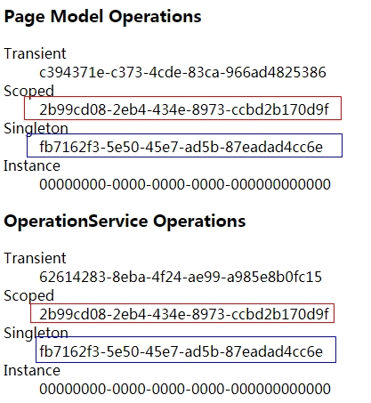
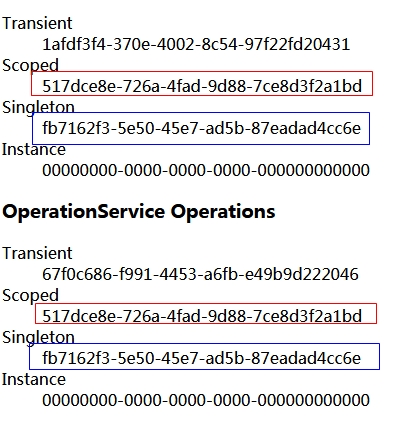

# ASP.NET Core 依赖注入

ASP.NET Core中，依赖注入的常见编码规则：

- 推荐以构造函数形式请求注入的服务
- 


## 正确的应用依赖注入的示例

### 第一步：创建为应用提供服务的接口，并实现该接口

使用接口的形式定义为应用提供服务的方法：

```c#
interface IMyDependency
{
    Task WriteMessage(string message);
}
```

接着实现该接口：

```c#
public class MyDependency : IMyDependency
{
    private readonly ILogger<MyDependency> _logger;

    public MyDependency(ILogger<MyDependency> logger)
    {
        _logger = logger;
    }

    public Task WriteMessage(string message)
    {
        _logger.LogInformation($"MyDependency类中的WriteMessage方法被调用。 Message：{message}");
        return Task.FromResult(10);
    }
}
```

MyDependency在其构造函数中请求一个ILogger< TCategoryName >实例。

### 第二步：注册服务

在Startup.cs的ConfigureServices方法中，注册服务：

```c#
public void ConfigureServices(IServiceCollection services)
{
    services.AddMvc().SetCompatibilityVersion(CompatibilityVersion.Version_2_1);
	//注册服务，将服务生存期的范围限定为单个请求的生存期。
    services.AddScoped<IMyDependency, MyDependency>();    
}
```

如果服务的构造函数需要基元（原始类型数据，如 string），则可以使用IConfiguration 或 IOptions 注入基元：

```c#
public class MyDependency : IMyDependency
{
    public MyDependency(IConfiguration config)
    {
        var myStringValue = config["MyStringKey"];
    }
    ...
}
```

### 第三步：访问服务

```c#
public class IndexModel : PageModel
{
    private readonly IMyDependency _myDependency;
    public IndexModel(IMyDependency myDependency)
    {
        _myDependency = myDependency;
    }
    public async Task OnGetAsync()
    {
        await _myDependency.WriteMessage("test");
    }
}
```

### 注册服务的方式

#### 可以使用的方式

```c#
public void ConfigureServices(IServiceCollection services)
{
	//方式一：直接添加用户类型（注意，不是实例对象）
	services.AddScoped<MyClass>(); //MyClass是一个普通类
    services.AddSingleton<MyClass>();
    
    //方式二：使用接口，和用户类型
    services.AddTransient<IOperationTransient, Operation>();
	services.AddScoped<IOperationScoped, Operation>();
	services.AddSingleton<IOperationSingleton, Operation>();
    
    //方式三：使用接口和实例，单个服务的工厂方法
	services.AddSingleton<ISomeService>(sp => new SomeServiceImplementation());
    services.AddSingleton<IOperationSingletonInstance>(new Operation(Guid.Empty));

}
```

#### 不要使用的方式

[不要通过用户代码将实例添加到容器中](https://docs.microsoft.com/zh-cn/aspnet/core/fundamentals/dependency-injection?view=aspnetcore-2.2#disposal-of-services)，因为不会自动调用Dispose()方法，服务关闭时不会释放，会带来性能影响。错误示例如下：

```c#
services.AddSingleton<Service3>(new Service3());
services.AddSingleton(new Service3());
```

也就是说，尽量通过接口的形式注入服务，即在<T>中，为T指定接口类型，如果没有接口，T可以指定为具体类，但是不要为其再提供实例对象。


## 服务的生存期

在ASP.NET Core中，每一个注册的服务都有生存期，可以配置的生存期类型有：

- Transient（暂时）：该类型的生存期的服务，每次从服务容器中进行请求时都会创建。这种生存期适合轻量级、 无状态的服务。

- Scoped（作用域）：生存期是作用域的服务，以每个客户端请求（连接）一次的方式创建。

- Singleton（单例）：生存期是单例（单一实例）的服务，是在第一次请求时（或者在运行 ConfigureServices 并且使用服务注册指定实例时）创建的，每个后续请求都使用相同的实例。如果应用需要单一实例行为，建议通过该方式进行注册，而不是通过实现单一实例设计模式并提供用户代码来管理对象在类中的生存期。

  注意：尽量不要从单一实例中解析有其他作用域的服务，当处理后续请求时，它可能会导致服务处于不正确的状态。

### 官方示例解读

为了说明注册服务的不同生存期之间的差异，这里以官方文档的示例进行补充说明。

官方文档的示例中提供了如下几个接口和类：

```c#
public interface IOperation
{
    Guid OperationId { get; }
}

public interface IOperationTransient : IOperation
{
}

public interface IOperationScoped : IOperation
{
}

public interface IOperationSingleton : IOperation
{
}

public interface IOperationSingletonInstance : IOperation
{
}
```

Operation.cs：

```c#
public class Operation : IOperationTransient, 
    IOperationScoped, 
    IOperationSingleton, 
    IOperationSingletonInstance
{
    public Operation() : this(Guid.NewGuid())
    {
    }

    public Operation(Guid id)
    {
        OperationId = id;
    }

    public Guid OperationId { get; private set; }
}
```

还有一个非常重要的OperationService.cs：

```c#
public class OperationService
{
    public OperationService(
        IOperationTransient transientOperation,
        IOperationScoped scopedOperation,
        IOperationSingleton singletonOperation,
        IOperationSingletonInstance instanceOperation)
    {
        TransientOperation = transientOperation;
        ScopedOperation = scopedOperation;
        SingletonOperation = singletonOperation;
        SingletonInstanceOperation = instanceOperation;
    }

    public IOperationTransient TransientOperation { get; }
    public IOperationScoped ScopedOperation { get; }
    public IOperationSingleton SingletonOperation { get; }
    public IOperationSingletonInstance SingletonInstanceOperation { get; }
}
```

OperationService需要注意的地方有：

- 该类的内部没有为接口成员实例化过任何接口对象，也就是说，当通过依赖关系注入请求OperationService时，它的每个接口实例都来自于其他注册的服务，这些实例根据生存期的不同，可能是新实例，也可能是基于该服务的生存期的现有实例。
- 该类的构造函数需要请求其他接口，这是典型的以链式方式使用依赖关系注入。因此为了能够正确的使用依赖关系注入并解析，必须在该服务注册之前，注册每个接口对应的服务。见下述代码。

```c#
public void ConfigureServices(IServiceCollection services)
{
    services.AddMvc().SetCompatibilityVersion(CompatibilityVersion.Version_2_2);

    services.AddTransient<IOperationTransient, Operation>();
    services.AddScoped<IOperationScoped, Operation>();
    services.AddSingleton<IOperationSingleton, Operation>();
    services.AddSingleton<IOperationSingletonInstance>(new Operation(Guid.Empty));
	//必须注册了其他接口服务后，才能注册OperationService
    services.AddTransient<OperationService, OperationService>();
}
```

IndexModel.cshtml.cs：

```c#
public class IndexModel : PageModel
{
	public OperationService OperationService { get; }
    public IOperationTransient TransientOperation { get; }
    public IOperationScoped ScopedOperation { get; }
    public IOperationSingleton SingletonOperation { get; }
    public IOperationSingletonInstance SingletonInstanceOperation { get; }
    
    public IndexModel(
        OperationService operationService,
        IOperationTransient transientOperation,
        IOperationScoped scopedOperation,
        IOperationSingleton singletonOperation,
        IOperationSingletonInstance singletonInstanceOperation)
    {
        OperationService = operationService;
        TransientOperation = transientOperation;
        ScopedOperation = scopedOperation;
        SingletonOperation = singletonOperation;
        SingletonInstanceOperation = singletonInstanceOperation;
    }
}
```

Index.cshtml：

```php+HTML
<h3>Page Model Operations</h3>
<dl>
    <dt>Transient</dt>
    <dd>@Model.TransientOperation.OperationId</dd>
    <dt>Scoped</dt>
    <dd>@Model.ScopedOperation.OperationId</dd>
    <dt>Singleton</dt>
    <dd>@Model.SingletonOperation.OperationId</dd>
    <dt>Instance</dt>
    <dd>@Model.SingletonInstanceOperation.OperationId</dd>
</dl>
<h3>OperationService Operations</h3>
<dl>
    <dt>Transient</dt>
    <dd>@Model.OperationService.TransientOperation.OperationId</dd>
    <dt>Scoped</dt>
    <dd>@Model.OperationService.ScopedOperation.OperationId</dd>
    <dt>Singleton</dt>
    <dd>@Model.OperationService.SingletonOperation.OperationId</dd>
    <dt>Instance</dt>
    <dd>@Model.OperationService.SingletonInstanceOperation.OperationId</dd>
</dl>
```

执行后，第一次请求的结果如下：



注意同颜色的框OperationId的值一样，再次刷新页面，或者重新打开链接，甚至使用不同浏览器请求页面，第二次得到的结果如下：



### 生存期总结

通过上述结果可以得到如下结论：

- Transient：只要从服务容器中获取，就会重新创建。相当于属性的get选择器中，每次都创建一个实例对象。
- Scoped：在同一个请求中，获取的实例对象是相同的，而不同请求之间获取的对象不同。 这里的请求可以理解为客户端对服务器的一次请求，无论是页面刷新还是按钮点击。示例中的代码`services.AddTransient<OperationService, OperationService>();`进行了链式注入，由于生存期是Scoped，因此同一次的请求时，获取的对象都相同。
- 单一实例对象对每个对象和每个请求都是相同的（不管 ConfigureServices 中是否提供 Operation 实例）。

实际使用中，最常用的是将注册的服务的生存期指定为Scoped，即通过Scoped注册服务。


## 在Program.Main()方法中使用服务

主要用于在启动时访问有作用域的服务以便运行初始化任务。

```c#
public static void Main(string[] args)
{
    var host = CreateWebHostBuilder(args).Build();
    using (var serviceScope = host.Services.CreateScope())
    {
        var services = serviceScope.ServiceProvider;
        try
        {
            var services = serviceScope.ServiceProvider;
            
            var oscoped = services.GetRequiredService<IOperationScoped>();
            //此处和页面显示的OperationId的值并不一致
            Console.WriteLine("ScopedScopedScoped:" + oscoped.OperationId);
            
            var osingleton = services.GetRequiredService<IOperationSingleton>();
            //此处和页面显示的OperationId的值相同
            Console.WriteLine("SingletonSingleton:" + osingleton.OperationId);
        }
        catch (Exception ex)
        {
            var logger = services.GetRequiredService<ILogger<Program>>();
            logger.LogError(ex, "An error occurred.");
        }
    }
    host.Run();
}
```

注意：通过该示例可以看到，虽然是获取的已注册的服务，但是生存期是Scoped的服务，最终得到的对象的OperationId和页面显示的OperationId的值并不一样。

与访问 `RequestServices` 集合相比，以构造函数参数的形式请求依赖项是更优先的选择。


