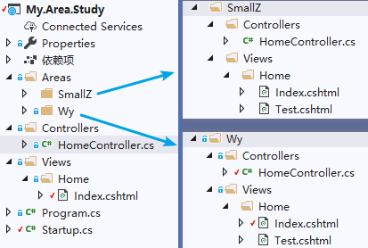

# ASP.NET Core中的区域

在ASP.NET Core中，无论是MVC应用还是Razor Pages应用，都可以使用Area（区域），通过Area可以将一个大的ASP.NET Core Web应用划分为多个更小的功能组，每个功能组中，都以单独的命名空间（用于路由）和文件夹结构（用于视图）的形式组织在一起，并且每个功能组都有自己的一组Razor Pages、控制器、视图和模型。


## MVC应用中的区域

常见的区域文件夹结构如下：



注：上图只是为了说明区域文件夹的结构，对于每个区域内的控制器名称和操作方法，没有特殊限定。

带有区域的ASP.NET Core MVC应用，需要包含以下内容：

- 区域文件夹结构（必须定义Areas文件夹和相关的区域名称，例如上述中的SmallZ和Wy，以及Views文件夹）
- 将区域中的控制器使用[Area]特性进行关联
- 在Startup中添加区域路由

以上内容是区域能够正常使用的关键，由于各个区域之间可能存在控制器和操作方法相同的情况，因此为了能够正确的解析，建议严格按照上述内容进行实现。

### 区域文件夹结构

虽然上图中的文件夹结构是常见的区域布局，例如每个区域中都包含了Controllers文件夹和Views文件夹，除此之外还可能包含Models文件夹或Data等其他文件夹，但是最关键的还是Views文件夹，因为控制器和模型等内容最终编译成.dll文件，而在对视图发出请求之前，并不会编译视图的内容，也就是说，除了Views文件夹，区域中的其他文件夹的位置都无关紧要，并且不是必需的。

视图发现按以下顺序搜索匹配的区域视图文件：

```
/Areas/<Area-Name>/Views/<Controller-Name>/<Action-Name>.cshtml
/Areas/<Area-Name>/Views/Shared/<Action-Name>.cshtml
/Views/Shared/<Action-Name>.cshtml
/Pages/Shared/<Action-Name>.cshtml
```

影响区域检索的，只与Views文件夹结构有关。

### 将控制器与区域关联

使用[Area]特性指定控制器的区域：

```c#
namespace My.Area.Study.Areas.SmallZ.Controllers
{
    [Area("SmallZ")]
    public class HomeController : Controller
    {
        public IActionResult Index()
        {
            return View();
        }

        public IActionResult Test()
        {
            return View();
        }
    }
}
```

注意：[Area]特性必不可少，AreaAttribute 用于将控制器表示为某个区域的一部分，比方说，此控制器位于 Wy区域中。 没有 [Area] 属性的控制器不是任何区域的成员，在路由提供 area 路由值时不匹配。

### 在Startup中添加区域路由

若要正确使用区域，还需要在Startup.Configure()方法中，添加区域路由。默认的路由设置如下：

```c#
app.UseMvc(routes =>
{
    routes.MapRoute(
        name: "default",
        template: "{controller=Home}/{action=Index}/{id?}");
});
```

区域路由通常以传统路由方式设置，而不是属性路由。

传统路由依赖定义的顺序，一般情况下，具有区域的路由应位于路由表中考前的位置，因为它们比没有区域的路由更特定。 

添加支持区域的路由：

```c#
app.UseMvc(routes =>
{
    routes.MapRoute(
        name: "WyAreas",
        template: "{area:exists}/{controller=Home}/{action=Index}/{id?}"
    );

    routes.MapRoute(
        name: "default",
        template: "{controller=Home}/{action=Index}/{id?}");
});
```

上述代码中，{area:exists}应用了路由必须与区域匹配的约束（exists），一般情况下，建议使用该约束。

使用了上述路由配置之后，以下url都可以正常访问：

```
http://localhost:33966/
http://localhost:33966/smallz
http://localhost:33966/wy
http://localhost:33966/smallz/home/test
http://localhost:33966/wy/home/test
```

#### 使用MapAreaRoute方法创建命名区域路由

为了避免匹配冲突，先将上述的路由配置注释掉。这里使用MapAreaRoute方法创建命名区域路由：

```c#
app.UseMvc(routes =>
{
    routes.MapAreaRoute(
        name: "WyAreaRoute",
        areaName: "Wy", //必须是真实存在的Area名称
        template: "MyWy/{controller=Home}/{action=Index}/{id?}"
    );
	//暂时注释掉，以传统路由方式访问的区域都将失效
    //routes.MapRoute(
    //    name: "WyAreas",
    //    template: "{area:exists}/{controller=Home}/{action=Index}/{id?}"
    //);

    routes.MapRoute(
        name: "default",
        template: "{controller=Home}/{action=Index}/{id?}");
    
});
```

定义好上述命名区域路由之后，能够正常访问的Url如下：

```
http://localhost:33966/  
http://localhost:33966/mywy/home/test
```

不能访问的url有：

```
http://localhost:33966/smallz
http://localhost:33966/wy
http://localhost:33966/smallz/home/test
http://localhost:33966/wy/home/test
http://localhost:33966/mywy（抛出异常：匹配到多个端点）
```

由于示例的区域文件结构中，包含了多个Home控制器和Index操作方法，因此在未显式指定唯一匹配的操作方法时，会出现异常。

一般情况下，优先使用传统路由方式定义区域路由。

关于区域路由的更多描述，见下文中的“区域路由”。

### MVC区域的链接生成

主要有以下几种方式，用来生成区域相关的超链接：

```html
@addTagHelper *, Microsoft.AspNetCore.Mvc.TagHelpers
@{
    Layout = null;
}

<!DOCTYPE html>

<html>
<head>
    <meta name="viewport" content="width=device-width" />
    <title>Index</title>
</head>
<body>
    <div>
        <a asp-area="" asp-controller="Home" asp-action="Index">
            /Home/Index
        </a>
    </div>

    <div>
        方式一：
        <a asp-area="Wy" asp-controller="Home" asp-action="Test">Wy/Home/Test</a>
    </div>

    <div>
        方式二：
        @Html.ActionLink("SmallZ/Home/Test", "Test", "Home", new { area = "Wy" })
    </div>

    <div>
        方式三：
        <a href='@Url.Action("Test", "Home", new { area = "Wy" })'>
            SmallZ/Home/Test
        </a>
    </div>
</body>
</html>
```

注意：区域名称能不能使用，取决于Starup中的路由配置，由于上述中的路由配置注释掉了传统路由的方式，仅保留了Wy的命名区域路由，因此区域名称只能使用Wy。

### 更改默认的区域文件夹名称（不常用）

下面的代码用于将默认的区域文件夹名称由"Areas"改为"MyArea"：

```c#
public void ConfigureServices(IServiceCollection services)
{
    services.Configure<RazorViewEngineOptions>(options =>
    {
        options.AreaViewLocationFormats.Clear();
        options.AreaViewLocationFormats.Add("/MyAreas/{2}/Views/{1}/{0}.cshtml");
        options.AreaViewLocationFormats.Add("/MyAreas/{2}/Views/Shared/{0}.cshtml");
        options.AreaViewLocationFormats.Add("/Views/Shared/{0}.cshtml");
    });

    services.AddMvc();
}
```


## Razor Pages应用中的区域

在Razor Pages应用中使用区域，请参考链接：https://docs.microsoft.com/zh-cn/aspnet/core/mvc/controllers/areas?view=aspnetcore-2.2#areas-with-razor-pages


## 区域路由

上文已经对区域路由的应用进行了演示，路由配置如下：

```c#
app.UseMvc(routes =>
{
    routes.MapAreaRoute(
        name: "WyAreaRoute",
        areaName: "Wy", //必须是真实存在的Area名称
        template: "MyWy/{controller=Home}/{action=Index}/{id?}"
    );
    
	//暂时注释掉，以传统路由方式访问的区域都将失效
    //routes.MapRoute(
    //    name: "WyAreas",
    //    template: "{area:exists}/{controller=Home}/{action=Index}/{id?}"
    //);
    
	//默认传统路由
    routes.MapRoute(
        name: "default",
        template: "{controller=Home}/{action=Index}/{id?}");    
});
```

在上述路由中，当使用Url访问时（例如：/mywy/home/test），第一个路由将生成路由值{ area = Wy, controller = Home, action = Test }。

通过MapAreaRoute()方法创建的路由等效于以下路由：

```c#
app.UseMvc(routes =>
{
    routes.MapRoute("WyAreaRoute", "MyWy/{controller}/{action}/{id?}",
        defaults: new { area = "Wy" }, constraints: new { area = "Wy" });
});
```

上述代码中的default参数用来设置默认值，constraints参数提供相关的约束，这里限制使用“Wy"作为区域名称。

对应匹配的控制器操作方法如下：

```c#
namespace My.Area.Study.Areas.SmallZ.Controllers
{
    [Area("SmallZ")]
    public class HomeController : Controller
    {
        public IActionResult Test()
        {
            return View();
        }
    }
}
```

注意：[Area]特性必不可少，AreaAttribute 用于将控制器表示为某个区域的一部分，比方说，此控制器位于 Wy区域中。 没有 [Area] 属性的控制器不是任何区域的成员，在路由提供 area 路由值时不匹配。

备注：就不匹配任何值而言，缺少 area 值相当于 area 的值为 NULL 或空字符串。


#### 区域路由中的粘性（补充）

在某个区域内执行某项操作时，area 的路由值将以环境值的形式提供，以便路由用于生成 URL。 这意味着默认情况下，区域在 URL 生成中具有粘性，如以下示例所示。

```c#
app.UseMvc(routes =>
{
    routes.MapAreaRoute("duck_route", "Duck",
        "Manage/{controller}/{action}/{id?}");
    routes.MapRoute("default", "Manage/{controller=Home}/{action=Index}/{id?}");
});
```

控制器操作方法：

```c#
using Microsoft.AspNetCore.Mvc;

namespace MyApp.Namespace4
{
    [Area("Duck")]
    public class UsersController : Controller
    {
        public IActionResult GenerateURLInArea()
        {
            // 未显式指定area
            var url = Url.Action("Index", "Home"); 
            // 此处返回： /Manage
            return Content(url);
        }

        public IActionResult GenerateURLOutsideOfArea()
        {
            // 即使将area设置空字符串，因为粘性，仍然可以生成url
            var url = Url.Action("Index", "Home", new { area = "" }); 
            // 注意此处返回： /Manage/Home/Index
            return Content(url);
        }
    }
}
```

