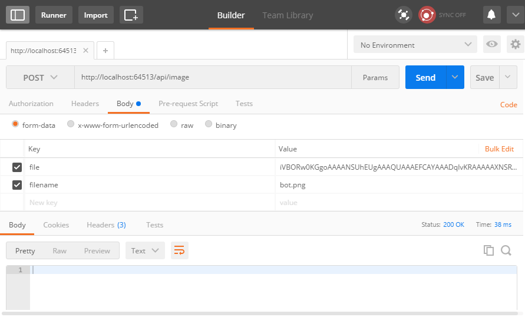

# ASP.NET Core中的模型绑定

ASP.NET Core MVC 中的模型绑定指的是将 HTTP 请求中的数据映射到操作方法参数。 

当 MVC 收到 HTTP 请求时，它会将此请求路由到控制器的特定操作方法。然后将 HTTP 请求中的值绑定到该操作方法的参数。至于要运行哪个操作方法，取决于路由数据中的内容。

模型绑定的先后顺序如下：

1. Form Value：使用Post方式提交的值，包括JQuery Post请求。
2. Route Values：基于路由的路由值。
3. Query String：URL查询字符串部分。

> 如果操作方法的参数是一个属性为简单类型和复杂类型的类，如 Movie 类型，则 MVC 的模型绑定仍可对其进行妥善处理。 它使用反射和递归来遍历查找匹配项的复杂类型的属性。 模型绑定查找模式 parameter_name.property_name 以将值绑定到属性 。 如果未找到此窗体的匹配值，它将尝试仅使用属性名称进行绑定。
>
> 对于诸如 Collection 类型的类型，模型绑定将查找 parameter_name[index] 或仅 [index] 的匹配项。 
>
> 对于 Dictionary 类型，模型绑定的处理方法与之类似，即请求 parameter_name[key] 或仅 [key]（只要键是简单类型）。

若要实现模型绑定，该类必须具有要绑定的公共默认构造函数和公共可写属性。 发生模型绑定时，在使用公共默认构造函数对类进行实例化后才可设置属性。

如果绑定失败，MVC 不会引发错误。 接受用户输入的每个操作均应检查 ModelState.IsValid 属性。

注意：控制器的 `ModelState` 属性中的每个输入均为包含 `Errors` 属性的 `ModelStateEntry`。 很少需要自行查询此集合。 请改用 `ModelState.IsValid`。


## 通过特性自定义模型绑定行为

MVC 包含多种特性，可用于将其默认模型绑定行为定向到不同的源。 

- `[BindRequired]`：指定需要绑定的参数，如果无法发生绑定，此特性将添加模型状态错误。
- `[BindNever]`：指示模型绑定器从不绑定到此参数。
- `[FromHeader]`、`[FromQuery]`、`[FromRoute]`、`[FromForm]`：使用这些特性指定要应用的确切绑定源。
- `[FromServices]`：此特性使用依赖关系注入绑定服务中的参数。
- `[FromBody]`：使用配置的格式化程序绑定请求正文中的数据。 基于请求的内容类型，选择格式化程序。
- `[ModelBinder]`：用于替代默认模型绑定器、绑定源和名称。


## 全局配置模型绑定行为(不常用)

通过向 MvcOptions.ModelMetadataDetailsProviders 添加详细信息提供程序，可以全局配置系统行为的各个方面。 MVC 有一些内置的详细信息提供程序，可通过它们配置禁用模型绑定或验证某些类型等行为。

### 禁用对特定类型的所有模型的模型绑定

例如禁用对System.Version类型的所有模型的模型绑定，需要在Startup.ConfigureServices 中添加 ExcludeBindingMetadataProvider()方法的调用：

```c#
services.AddMvc().AddMvcOptions(options =>
    options.ModelMetadataDetailsProviders.Add(
        new ExcludeBindingMetadataProvider(typeof(System.Version))));
```

### 禁用对特定类型的属性的验证

例如，禁用对System.Guid类型的属性的验证，可以在Startup.ConfigureServices 中添加 SuppressChildValidationMetadataProvider()方法的调用：

```c#
services.AddMvc().AddMvcOptions(options =>
    options.ModelMetadataDetailsProviders.Add(
        new SuppressChildValidationMetadataProvider(typeof(System.Guid))));
```


## 绑定请求正文（FromBody）中的带格式数据

这里的“带格式数据”通常指的是JSON、XML 和许多其他格式的请求数据。

 使用 [FromBody] 特性绑定参数和请求数据时，MVC 会使用一组已配置的格式化程序，基于请求数据的内容类型对请求数据进行处理。 默认情况下，MVC 已经包括了用于处理 JSON 数据的 JsonInputFormatter 类（JsonInputFormatter 为默认格式化程序且基于 Json.NET）。

对于其他格式的数据，可以添加其他格式化程序。

除非有特性应用于 ASP.NET Core，否则它将基于 Content-Type 标头和参数类型来选择输入格式化程序。 

例如，如果想要使用 XML 或其他格式，则必须在 Startup.cs 文件中配置该格式：

```c#
public void ConfigureServices(IServiceCollection services)
{
    services.AddMvc()
        .AddXmlSerializerFormatters();
   }
```

 注：上述代码可能需要先使用 NuGet 获取对 Microsoft.AspNetCore.Mvc.Formatters.Xml 的引用，然后，将 Consumes 特性应用于控制器类或操作方法，以使用所需格式。


## 自定义模型绑定

**说明：**通过实现自定义模型绑定器可以扩展内置的模型绑定功能，但是，自定义模型绑定通常很少用到。

### 现有模型绑定器的实现方式

这里以内置的ByteArrayModelBinder类为例， 实现 IModelBinderProvider 的 ByteArrayModelBinderProvider 将 byte[] 参数映射到 ByteArrayModelBinder，因此ByteArrayModelBinder可以将base64编码的字符串转换为字节数组（字节数组通常可以存储为文件或数据库 BLOB 字段）。也就是说，如果一个控制器操作方法的参数是字节数组，那么可以直接为该参数传入base64编码的字符串，内置的ByteArrayModelBinder可以完成这两种类型的转换。

#### 使用ByteArrayModelBinder和ByteArrayModelBinderProvider 

任何文件（图片、视频等）都可以转化成二进制数据（字节数组），而二进制数据可以使用Base64编码的字符串来表示（通过字节数组转换为Base64编码的字符串），例如，[这里是一段Base64编码的字符串，它实际是由一张图片转换过来的](https://github.com/aspnet/AspNetCore.Docs/blob/master/aspnetcore/mvc/advanced/custom-model-binding/sample/CustomModelBindingSample/Base64String.txt)，下面的代码演示了如何将这段Base64编码的字符串，最终还原为图片：

```c#
[HttpPost]
public void PostFile(byte[] file,string filename){
    string filePath = Path.Combine(_env.ContentRootPath, "wwwroot/images/upload", filename);
    if (System.IO.File.Exists(filePath)) return;
    System.IO.File.WriteAllBytes(filePath, file);
}
```

可以使用Postman工具将Base64编码的字符串发送到该操作方法：



发送的Base64编码的字符串会自动绑定到操作方法的直接数组中，然后将字节数组写入到目标文件。

#### `IModelBinderProvider`和`IModelBinder`

IModelBinderProvider接口用于创建IModelBinder接口的实例（实现了IModelBinder接口的类的实例），并在MvcOptions中进行注册。IModelBinder接口用来定义模型绑定器。

IModelBinder接口的定义如下：

```c#
public interface IModelBinder
{
	Task BindModelAsync(ModelBindingContext bindingContext);
}
```

IModelBinderProvider接口的定义如下：

```c#
public interface IModelBinderProvider
{
	IModelBinder GetBinder(ModelBinderProviderContext context);
}
```

需要注意的是GetBinder()方法返回的正是IModelBinder接口类型。

以上文中提到的ByteArrayModelBinder和ByteArrayModelBinderProvider为例：ByteArrayModelBinder派生自IModelBinder接口，而ByteArrayModelBinderProvider派生自IModelBinderProvider接口。

ByteArrayModelBinderProvider的内部实现如下：

```c#
public IModelBinder GetBinder(ModelBinderProviderContext context);
{
	if (context == null)
    {
        throw new ArgumentNullException(nameof(context));
    }

    if (context.Metadata.ModelType == typeof(byte[]))
    {
        return new ByteArrayModelBinder();
    }

    return null;
}
```

### 自定义模型绑定器的实现方式

创建自定义模型绑定器时，主要有以下两种方式：

- 方式一：实现IModelBinderProvider接口和IModelBinder接口，并在Startup中使用MvcOptions进行配置。
- 方式二：实现IModelBinder接口，并使用ModelBinderAttribute特性。

无论使用哪种方式，都需要先定义实现IModelBinder接口的模型绑定器：

```c#
public class StudentEntityBinder : IModelBinder
{
    private readonly AppDbContext _db;

    public StudentEntityBinder(AppDbContext db)
    {
        _db = db;
    }

    public Task BindModelAsync(ModelBindingContext bindingContext)
    {
        if (bindingContext == null)
        {
            throw new ArgumentNullException(nameof(bindingContext));
        }
        //获取模型名称
        var modelName = bindingContext.ModelName;
        //按照模型名称获取参数的值
        var valueProviderResult = bindingContext.ValueProvider.GetValue(modelName);

        if (valueProviderResult == ValueProviderResult.None)
        {
            return Task.CompletedTask;
        }

        bindingContext.ModelState.SetModelValue(modelName, valueProviderResult);
        var value = valueProviderResult.FirstValue;

        if (string.IsNullOrEmpty(value))
        {
            return Task.CompletedTask;
        }

        if (!int.TryParse(value, out int id))
        {
            bindingContext.ModelState.TryAddModelError(modelName, "Id必须是int类型");
            return Task.CompletedTask;
        }

        var model = _db.Students.Find(id);

        //设置最终模型绑定的结果
        bindingContext.Result = ModelBindingResult.Success(model);
        return Task.CompletedTask;
    }
}
```

AppDbContext.cs：

```c#
public class AppDbContext : DbContext
{
    public AppDbContext(DbContextOptions options) : base(options)
    {
    }

    public DbSet<Student> Students { get; set; }
}
```

Student.cs：

```c#
public class Student
{
    public int Id { get; set; }
    public string Name { get; set; }
    public string StuCode { get; set; }
}
```

#### 方式一：实现IModelBinderProvider接口

这种方式是推荐的方式，也是内置框架绑定器的实现方式。

指定绑定器所操作的类型时，指定它生成的参数的类型，而不是绑定器接受的输入。

定义实现了IModelBinderProvider接口的模型绑定器提供程序：

```c#
public class StudentEntityBinderProvider : IModelBinderProvider
{
    public IModelBinder GetBinder(ModelBinderProviderContext context)
    {
        if (context == null)
        {
            throw new ArgumentNullException(nameof(context));
        }
        //判断当前实例表示的模型类型是否为Student
        if (context.Metadata.ModelType == typeof(Student))
        {
            return new BinderTypeModelBinder(typeof(StudentEntityBinder));
        }

        return null;
    }
}
```

上述绑定器提供程序适用于StudentEntityBinder，将其添加到 MVC 提供程序的集合中时，无需在 Author 或 Author 类型参数上使用 ModelBinder 属性。上述代码返回 BinderTypeModelBinder，BinderTypeModelBinder 充当模型绑定器中心，并提供依赖关系注入 (DI)。 AuthorEntityBinder 需要 DI 来访问 EF Core。 如果模型绑定器需要 DI 中的服务，请使用 BinderTypeModelBinder。

将自定义模型绑定器提供程序添加到ConfigureServices中：

```c#
public void ConfigureServices(IServiceCollection services)
{
    services.AddDbContext<AppDbContext>(options => options.UseInMemoryDatabase());
    services.AddMvc(options =>
    {
        // add custom binder to beginning of collection
        options.ModelBinderProviders.Insert(0, new StudentEntityBinderProvider());
    });
}
```

评估模型绑定器时，按顺序检查提供程序的集合。 使用返回绑定器的第一个提供程序。

注意：向集合的末尾添加提供程序，可能会导致在调用自定义绑定器之前调用内置模型绑定器。 因此在此示例中，向集合的开头添加自定义提供程序，确保它用于 Author 操作参数。

#### 方式二：使用ModelBinderAttribute特性

为Student添加ModelBinder特性：

```c#
[ModelBinder(BinderType = typeof(StudentEntityBinder))]
public class Student
{
	...
}
```

上述代码中的ModelBinder特性，用于指定绑定到Student操作参数的IModelBinder 的类型，这里是StudentEntityBinder类型。

然后就可以在操方法中，直接使用StudentEntityBinder：

```c#
[HttpGet("get/{studentId}")]
public IActionResult Get(Student author)
{
    return Ok(author);
}
```

还可以使用ModelBinder特性将AuthorEntityBinder应用于覆盖默认约定的参数（不使用默认约定的参数）：

```c#
[HttpGet("{id}")]
public IActionResult GetById([ModelBinder(Name = "id")]Author author)
{
    if (author == null)
    {
        return NotFound();
    }
    if (!ModelState.IsValid)
    {
        return BadRequest(ModelState);
    }
    return Ok(author);
}
```

上述代码直接在模型绑定中，通过EF查找实体，比起在操作方法中查找实体，代码更加简化。但这种做法，实际中并不建议采用，这里只是为了说明模型绑定的用法才使用的。

