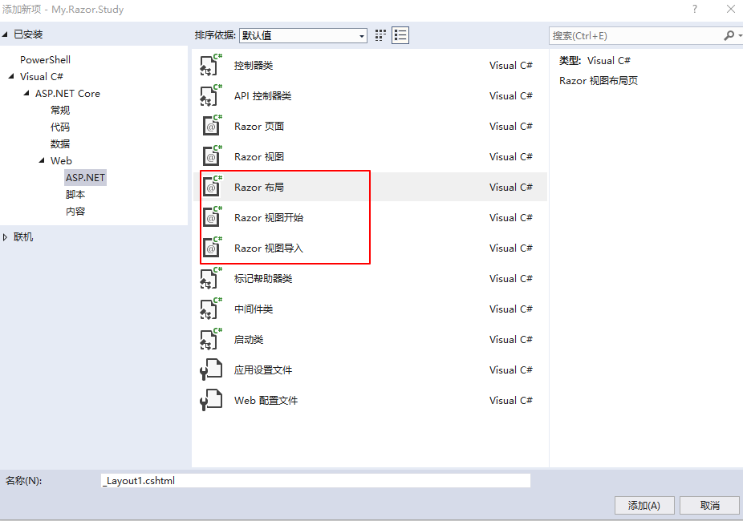

# ASP.NET Core Razor Pages

Razor Pages实际上包含两部分：

- 会生成PageModel类的Razor页面
- 不会生成PageModel类的Razor视图（多用于MVC）

关于Razor页面和Razor视图之间的区别和联系，请参阅本文中的“Razor页面和Razor视图”部分。

本文侧重于Razor页面的讲解，除了PageModel相关的之外，Razor视图的使用基本和Razor页面相同。


## 创建Razor Web应用

大多数文档中都采用“Web应用程序”项目模板来创建Razor应用，本文为了更好的说明Razor使用的过程，采用“空”项目模板进行创建，创建完成之后，手动的添加wwwroot和Pages文件夹，项目结构如下图所示：


要想让创建的应用输出Razor页面，需要在Startup.cs中添加MVC组件，代码如下：

```c#
public void ConfigureServices(IServiceCollection services)
{
    services.AddMvc().SetCompatibilityVersion(
        Microsoft.AspNetCore.Mvc.CompatibilityVersion.Version_2_2);
}
public void Configure(IApplicationBuilder app, IHostingEnvironment env)
{
    if (env.IsDevelopment())
    {
        app.UseDeveloperExceptionPage();
    }    
    app.UseMvc();
}
```

接着在Pages文件夹中，手动的添加Razor页面Index，Index.cshtml文件的代码如下：

```html
@page
@model My.Razor.Study.Pages.IndexModel
@{
    Layout = null;
}

<!DOCTYPE html>

<html>
<head>
    <meta name="viewport" content="width=device-width" />
    <title>Index</title>
</head>
<body>
    <h1>Hello ,Razor!</h1>
    <h2>@DateTime.Now</h2>
</body>
</html>
```

以上就是运行一个Razor应用所需要的最少资源，运行项目将会看到如下结果：


## Pages 文件夹

接下来对Pages文件夹进行扩展，右击“Pages”文件夹，选择“添加新项”，依次添加“Razor布局”、“Razor视图开始”、“Razor视图导入”三个文件，名称使用默认名称即可，如下图所示：


添加完成之后，在Pages文件夹下，存在以下文件：


_Layout.cshtml：该文件用于设置应用程序的布局。

```html
<!DOCTYPE html>
@{
    Console.WriteLine("_Layout.cshtml");
}
<html>
<head>
    <meta name="viewport" content="width=device-width" />
    <title>@ViewBag.Title</title>
</head>
<body>
    <h1>Hello Layout Razor!</h1>
    <div>
        @RenderBody()
    </div>

    @RenderSection("Scripts", required: false)
</body>
</html>
```

_ViewImports.cshtml： 该文件包含要导入每个 Razor 页面的 Razor 指令。

```c#
@{
    Console.WriteLine("_ViewImports.cshtml");
}
@using My.Razor.Study
@namespace My.Razor.Study.Pages
@addTagHelper *, Microsoft.AspNetCore.Mvc.TagHelpers
```

_ViewStart.cshtml：在运行Pages下的所有Razor页面之前，都会先执行该文件，用于指定布局页。

```c#
@{
    Layout = "_Layout";
    Console.WriteLine("_ViewStart.cshtml");
}
```


## Razor页面和Razor视图

在添加新项时，可以选择“Razor页面”和“Razor视图”，对于MVC应用，大多数情况下选择的都是“Razor视图”，“Razor页面”更多的是用在非MVC应用中。但是这并不是绝对的，因为Razor页面和Razor视图可以混合使用。唯一不同的是，当创建Razor页面时，默认会生成一个PageModel类，用于在Razor页面中指定@model，并且Razor页面必须包含@page指令，@page指令将Razor页面转换为一个可以直接处理请求的操作，而无需通过控制器处理。 

注意：@page 必须是Razor页面上的第一个 Razor 指令。

右击Pages文件夹选择”添加“=> ”Razor页面“，将会看到下图所示对话框：


默认情况下，“生成PageModel类”选项是勾选的，如果不勾选，将会生成Razor视图，与直接添加“Razor视图”的效果完全一样。

当创建好一个Razor页面时，默认会生成一个与.cshtml文件名称保持一致的.cshtml.cs文件。虽然在解决方案视图中，查看这两个文件时，默认以折叠的方式显式，但实际上是完全独立的两个文件，可以将.cshtml.cs文件中的类看成是一个独立的实体，它的作用就是用来在.cshtml文件中指明@model，这一点和MVC中的ViewModel非常类似。

对于一个ASP.NET Core Web应用，无论创建时选择的模板是“Web应用程序”还是“基于MVC”，都可以在应用中混合使用Razor页面和Razor视图，不过通常不建议这么做，因为这样会增加路由匹配的复杂性。尤其是页面较多的Web应用，推荐使用基于MVC的模板进行创建，对应的应该使用Razor视图进行页面的展示。对于页面较少功能单一的Web应用，可以基于“Web应用程序”的模板进行创建，使用该模板创建的项目，默认使用Razor页面进行展示，当然如前面所述，创建的时候，可以选择不生成PageModel类，这样跟Razor视图就没有什么区别了。

注意：本文所述的Razor Pages都是基于生成PageModel类的Razor页面进行介绍的，如果是MVC中的Razor，统一称之为Razor视图。


## 添加实体数据模型和对应的Razor页面

#### 添加实体数据模型

右击该项目，添加“新建文件夹”，命名为“Models”，在Models中添加一个实体类StudentModel：

```c#
namespace My.Razor.Study.Models
{
    public class StudentModel
    {
        public int Id { get; set; }
        public string Name { get; set; }
        public string StuNumber { get; set; }

        [DataType(DataType.Date)]
        public DateTime BirthDate { get; set; }
    }
}
```

上述代码中使用了[DataType(DataType.Date)]特性，用来指定BirthDate的数据类型为Date，使用该特性后，用户在日期字段中无需输入时间信息，并且该字段仅显示日期（而不显示时间信息）。

添加完实体数据模型后，接着来创建Student操作的相关Razor页面，这些页面包含基本的增删改查操作，为了便于后期数据的存储，此处使用Entity Framework Core基于内存数据库进行数据的读写。

#### 添加DbContext

右击该项目，添加“Data”文件夹，在该文件夹中添加一个DbContext，用于EF Core数据操作：

```c#
public class MyRazorContext : DbContext
{
    public MyRazorContext(DbContextOptions<MyRazorContext> options):base(options)
    {

    }
    public DbSet<StudentModel> Students { get; set; }
}
```

接着在Startup的ConfigureServices方法中添加该服务：

```c#
public void ConfigureServices(IServiceCollection services)
{
    services.AddDbContext<MyRazorContext>(options =>
            options.UseInMemoryDatabase("myAppDB")
    )
    .AddMvc()
        .SetCompatibilityVersion(
        Microsoft.AspNetCore.Mvc.CompatibilityVersion.Version_2_2);
}
```

上述中代码不会创建真正的数据库实体，而是基于内存进行数据处理。

#### 添加Razor页面

在Pages文件夹下创建Students文件夹，右击“Students”文件夹，添加“Razor页面”，在弹出的“添加基架”对话框中，可以选择Razor页面一个一个的添加，这里为了简单，直接选择“使用实体框架生成Razor页面（CRUD）“，如图所示：


在弹出的窗口中，选择模型类和刚才创建的数据上下文：


点击“添加”，将会在“Students”文件夹下添加相关的Razor页面，由于勾选了“引用脚本库”选项，因此还会在Pages文件夹下添加_ValidationScriptsPartial.cshtml文件，如下图所示：


运行该项目，使用https://localhost:5001/Students进行访问，各个页面呈现如下：


由于是基于内存数据库进行数据存储，因此每次运行该项目时，上一次输入的内容都会丢失。

注意：

默认情况下，运行时在“Pages”文件夹中查找Razor页面文件；如果URL未指定具体的页面，默认查找当前URL目录下的Index页面。


## Razor页面内容介绍

大多数Web应用的功能无非就是增删改查，在Students文件夹下面存在以下文件：

- Create.cshtml
- Delete.cshtml
- Edit.cshtml
- Index.cshtml
- Details.cshtml

这里也基于这些基本功能对Razor的使用进行逐步讲解。

### Index.cshtml

Index.cshtml一般作为查询页面进行展示，该页面显示的是所有Student的列表。

##### Pages/Students/Index.cshtml.cs：

```c#
namespace My.Razor.Study.Pages.Students
{
    public class IndexModel : PageModel
    {
        private readonly My.Razor.Study.Data.MyRazorContext _context;
		//使用依赖关系注入将 MyRazorContext 添加到页
        public IndexModel(My.Razor.Study.Data.MyRazorContext context)
        {
            _context = context;
        }

        public IList<StudentModel> StudentModel { get; set; }

        public async Task OnGetAsync()
        {
            StudentModel = await _context.Students.ToListAsync();
        }
    }
}
```

Razor页面派生自PageModel， 按照约定，PageModel 派生的类称为 <PageName>Model。 

当使用https://localhost:5001/Students进行访问时，默认会访问Pages下的/Students/Index.cshtml文件，将会触发上述代码中的OnGetAsync()方法，该方法中对StudentModel进行赋值，方法执行完成之后，就会呈现页面。OnGetAsync 或 OnGet 通常用于初始化页面状态，类似于WebForm中的Page_Load方法。当初始化页面状态之后，就会呈现页面。

##### Pages/Students/Index.cshtml：

```html
@page
@model My.Razor.Study.Pages.Students.IndexModel

@{
    ViewData["Title"] = "Index";
}

<h1>Index</h1>

<p>
    <a asp-page="Create">Create New</a>
</p>
<table class="table">
    <thead>
        <tr>
            <th>
                @Html.DisplayNameFor(model => model.StudentModel[0].Name)
            </th>
            <th>
                @Html.DisplayNameFor(model => model.StudentModel[0].StuNumber)
            </th>
            <th>
                @Html.DisplayNameFor(model => model.StudentModel[0].BirthDate)
            </th>
            <th></th>
        </tr>
    </thead>
    <tbody>
@foreach (var item in Model.StudentModel) {
        <tr>
            <td>
                @Html.DisplayFor(modelItem => item.Name)
            </td>
            <td>
                @Html.DisplayFor(modelItem => item.StuNumber)
            </td>
            <td>
                @Html.DisplayFor(modelItem => item.BirthDate)
            </td>
            <td>
                <a asp-page="./Edit" asp-route-id="@item.Id">Edit</a> |
                <a asp-page="./Details" asp-route-id="@item.Id">Details</a> |
                <a asp-page="./Delete" asp-route-id="@item.Id">Delete</a>
            </td>
        </tr>
}
    </tbody>
</table>
```

###### @page指令

@page**必须是**页面上的第一个Razor指令，它使文件具备可以处理请求的能力。

###### @model指令

@model 指令用于指定传递给 Razor 页面的模型类型，它可以使派生自PageModel的类用于Razor页面。

###### @{}

当 `@` 符号后跟 [Razor 保留关键字](https://docs.microsoft.com/zh-cn/aspnet/core/mvc/views/razor?view=aspnetcore-2.2#razor-reserved-keywords)时，它会转换为 Razor 特定标记，否则会转换为 C#代码，对于多个代码行组成的片段，可以使用大括号包裹起来。

###### ViewData

PageModel 基类具有 ViewData 字典属性，可用于添加要传递到某个视图的数据。 可以使用键/值模式将对象添加到 ViewData 字典。

###### @Html.DisplayNameFor(model => model.StudentModel[0].Name)

该方法使用HTML帮助程序检查 Lambda 表达式中引用的 Title 属性来确定显示名称。检查 Lambda 表达式（而非求值），这意味着当 model、model.StudentModel 或 model.StudentModel[0] 为 null 或为空时，不会存在任何访问冲突。 对 Lambda 表达式求值时（例如，使用 @Html.DisplayFor(modelItem => item.Title)），将求得该模型的属性值。

###### `<a asp-page="./Edit" asp-route-id="@item.Id">Edit</a>`

asp-page和asp-route-id是一个[标记辅助程序](https://docs.microsoft.com/zh-cn/aspnet/core/mvc/views/tag-helpers/intro)的常规用法，上述代码会生成如下形式的链接：

`https://localhost:5001/Students/Edit?id=1`

### Create.cshtml

Create.cshtml用于创建单个Student信息。

##### Pages/Students/Create.cshtml.cs：

```c#
namespace My.Razor.Study.Pages.Students
{
    public class CreateModel : PageModel
    {
        private readonly My.Razor.Study.Data.MyRazorContext _context;

        public CreateModel(My.Razor.Study.Data.MyRazorContext context)
        {
            _context = context;
        }

        public IActionResult OnGet()
        {
            return Page();
        }

        [BindProperty]
        public StudentModel StudentModel { get; set; }

        public async Task<IActionResult> OnPostAsync()
        {
            if (!ModelState.IsValid)
            {
            	//如果模型验证不通过，直接显示Create页面
                return Page();
            }

            _context.Students.Add(StudentModel);
            await _context.SaveChangesAsync();
            
            return RedirectToPage("./Index");
        }
    }
}
```

OnGet方法用于初始化页面所需的任何状态，由于Create页面没有任何要初始化的状态，因此返回Page()，对应的方法返回的参数类型为IActionResult，Page()方法创建用于呈现 Create.cshtml 页的PageResult 对象。

由于OnGet()方法中不存在任何初始化操作，因此也可以直接使用无返回参数的OnGet()方法，在方法体的内部，什么都不写也是可以的。

```c#
public void OnGet()
{
    //return Page();
}
```

###### BindProperty

StudentModel属性使用了[BindProperty] 特性来选择加入模型绑定。当Create页面中的表单提交值时，ASP.NET Core运行时将提交的值绑定到CreateModel中的StudentModel模型。

###### OnPostAsync()

当页面提交表单数据时，运行OnPostAsync()方法，如果不存在模型错误，将保存数据，并且重定向到Index页面。

##### Pages/Students/Create.cshtml：

```html
@page
@model My.Razor.Study.Pages.Students.CreateModel

@{
    ViewData["Title"] = "Create";
}

<h1>Create</h1>

<h4>StudentModel</h4>
<hr />
<div class="row">
    <div class="col-md-4">
        <form method="post">
            <div asp-validation-summary="ModelOnly" class="text-danger"></div>
            <div class="form-group">
                <label asp-for="StudentModel.Name" class="control-label"></label>
                <input asp-for="StudentModel.Name" class="form-control" />
                <span asp-validation-for="StudentModel.Name" class="text-danger"></span>
            </div>
            <div class="form-group">
                <label asp-for="StudentModel.StuNumber" class="control-label"></label>
                <input asp-for="StudentModel.StuNumber" class="form-control" />
                <span asp-validation-for="StudentModel.StuNumber" class="text-danger"></span>
            </div>
            <div class="form-group">
                <label asp-for="StudentModel.BirthDate" class="control-label"></label>
                <input asp-for="StudentModel.BirthDate" class="form-control" />
                <span asp-validation-for="StudentModel.BirthDate" class="text-danger"></span>
            </div>
            <div class="form-group">
                <input type="submit" value="Create" class="btn btn-primary" />
            </div>
        </form>
    </div>
</div>

<div>
    <a asp-page="Index">Back to List</a>
</div>

@section Scripts {
    @{await Html.RenderPartialAsync("_ValidationScriptsPartial");}
}
```

###### 表单标记帮助程序

在ASP.NET Core中，`<form method="post">`表单是一个内置的表单标记帮助程序，虽然和常规的html元素<form>使用方式一样，但是它会自动生成一个防伪令牌。

```c#
<input name="__RequestVerificationToken" type="hidden" value="CfDJ8KdYDenjI8RIrWVk4TMozQW-u7y-ZI0FQ6CHloaspgtlCURSCWck6LK9OSOL-9Xyb-bqALqtIEpnXpPOu5Qw-yE5YdMetdgGHatTyvOyPggcAD8hevu9BG0pS_G7nA9aqFEpsKh4tNN_OLY_gGWNln4">
```

###### 验证标记帮助程序

`<div asp-validation-summary` 和 `<span asp-validation-for`显示验证的错误信息。

###### 标签标记帮助程序

`<label asp-for="Movie.Title" class="control-label"></label>`用于生成标签描述和Title属性和for特性。

###### 输入标记帮助程序

`<input asp-for="Movie.Title" class="form-control" />` 生成 jQuery 验证所需的 HTML 属性。

### Edit.cshtml

##### Pages/Students/Edit.cshtml：

```html
@page "{id:int}"
@model My.Razor.Study.Pages.Students.EditModel

@{
    ViewData["Title"] = "Edit";
}

<h1>Edit</h1>

<h4>StudentModel</h4>
<hr />
<div class="row">
    <div class="col-md-4">
        <form method="post">
            <div asp-validation-summary="ModelOnly" class="text-danger"></div>
            <input type="hidden" asp-for="StudentModel.Id" />
            <div class="form-group">
                <label asp-for="StudentModel.Name" class="control-label"></label>
                <input asp-for="StudentModel.Name" class="form-control" />
                <span asp-validation-for="StudentModel.Name" class="text-danger"></span>
            </div>
            <div class="form-group">
                <label asp-for="StudentModel.StuNumber" class="control-label"></label>
                <input asp-for="StudentModel.StuNumber" class="form-control" />
                <span asp-validation-for="StudentModel.StuNumber" class="text-danger"></span>
            </div>
            <div class="form-group">
                <label asp-for="StudentModel.BirthDate" class="control-label"></label>
                <input asp-for="StudentModel.BirthDate" class="form-control" />
                <span asp-validation-for="StudentModel.BirthDate" class="text-danger"></span>
            </div>
            <div class="form-group">
                <input type="submit" value="Save" class="btn btn-primary" />
            </div>
        </form>
    </div>
</div>

<div>
    <a asp-page="./Index">Back to List</a>
</div>

@section Scripts {
    @{await Html.RenderPartialAsync("_ValidationScriptsPartial");}
}
```

在Index.cshtml中，将会生成如下形式的url链接：

```html
<td>
    <a href="/Students/Edit?id=1">Edit</a> |
    <a href="/Students/Details?id=1">Details</a> |
    <a href="/Students/Delete?id=1">Delete</a>
</td>
```

它将以查询字符串的形式传递id参数，如果不想使用这种形式，而是将id作为URL路径的一部分进行生成，可以在对应的页面使用路由模板，例如上述中的Edit.cshtml代码在@page指令的后面指定了路由模板：

```c#
@page "{id:int}"
```

此时将会生成如下形式的URL：

```html
<td>
    <a href="/Students/Edit/1">Edit</a> |
    <a href="/Students/Details?id=1">Details</a> |
    <a href="/Students/Delete?id=1">Delete</a>
</td>
```

使用`@page "{id:int}"`可以限定请求的URL必须包含整数，如果没有传入id值或者值不是int类型的整数，都将无法触发后台的`OnGetAsync(int? id)`方法的执行，将返回404错误。如果id可选，可以使用`?`追加到路由约束：

```c#
@page "{id:int?}"
```

当使用了参数可选的路由模板时，如果请求的URL没有包含id值，或者包含了int类型的整数，都将触发后台`OnGetAsync(int? id)`方法的执行；如果请求的URL包含了不是int类型的值，将不会触发后台OnGet方法的执行。

##### Pages/Students/Edit.cshtml.cs：

```c#
public class EditModel : PageModel
{
    private readonly My.Razor.Study.Data.MyRazorContext _context;

    public EditModel(My.Razor.Study.Data.MyRazorContext context)
    {
        _context = context;
    }

    [BindProperty]
    public StudentModel StudentModel { get; set; }

    public async Task<IActionResult> OnGetAsync(int? id)
    {
        if (id == null)
        {
        	//如果URL没有传id值，返回404
            return NotFound();
        }

        StudentModel = await _context.Students.FirstOrDefaultAsync(m => m.Id == id);

        if (StudentModel == null)
        {
            return NotFound();
        }
        return Page();
    }

    public async Task<IActionResult> OnPostAsync()
    {
        if (!ModelState.IsValid)
        {
            return Page();
        }

        _context.Attach(StudentModel).State = EntityState.Modified;

        try
        {
            await _context.SaveChangesAsync();
        }
        catch (DbUpdateConcurrencyException)
        {
            if (!StudentModelExists(StudentModel.Id))
            {
                return NotFound();
            }
            else
            {
                throw;
            }
        }

        return RedirectToPage("./Index");
    }

    private bool StudentModelExists(int id)
    {
        return _context.Students.Any(e => e.Id == id);
    }
}
```

当对Students/Edit页面进行HTTP GET请求时，例如：`https://localhost:5001/Students/Edit/1`，OnGetAsync方法会为StudentModel赋值，并返回Page()方法，Page()方法呈现Edit.cshtml对应的Razor页面。

当对Edit页面进行Post提交时，Edit页面上的表单会绑定到StudentModel属性，因为该属性的[BindProperty]特性会启用模型绑定，在OnPostAsync方法中，首先验证模型绑定的状态是否存在错误，如果模型状态存在错误（例如BirthDate无法被转换为日期），则会将已提交的值再次发送给表单进行呈现，如果没有错误则执行保存操作。

另外还有一点需要注意，在上述代码中：

```c#
 _context.Attach(StudentModel).State = EntityState.Modified;
 try
 {
     await _context.SaveChangesAsync();
 }
 catch (DbUpdateConcurrencyException)
 {
     if (!StudentModelExists(StudentModel.Id))
     {
         return NotFound();
     }
     else
     {
         throw;
     }
 }
```

这段代码可以处理并发情况，即将要修改的数据如果被其他人进行了删除，那么在执行SaveChangesAsync时，会发生异常。


## Razor页面其他标签的模型绑定

使用[BindProperty]特性实现表单元素（Post提交）或查询字符串（Get请求）与PageModel的属性之间的模型绑定，前提是表单元素的name或查询字符串中的键名要和PageModel的属性名称相同。

默认情况下，Razor页面只绑定带有**非**GET谓词的属性。

#### 文本框模型绑定

C#代码：

```c#
[BindProperty]
public string Address { get; set; }
```

HTML代码：

```html
<div>
    <p>文本框模型绑定</p>
    <input type="text" asp-for="Address" />
</div>
```

生成之后的HTML代码：

```html
<input type="text" id="Address" name="Address" value="">
```

#### 下拉框模型绑定

绑定下拉框元素时，需要定义两个属性，一个用于绑定下拉框的数据源，类型为SelectList，另一个用于绑定下拉框选择的值，类型常见为String，如下所示：

C#代码：

```c#
//用于绑定下拉框，不需要使用BindProperty特性修饰
public SelectList GroupNames { get; set; }

[BindProperty]
public string GroupNameValue { get; set; } //下拉框提交的值

public async Task OnGetAsync()
{
    //在Get方法中为下拉框属性复制，通常绑定为一个List集合或数组
    string [] gs = { "G1", "G2", "G3" };
    GroupNames = new SelectList(gs);
}
```

HTML代码：

```html
<div>
    <p>下拉框模型绑定</p>
    <div>
        <select asp-for="GroupNameValue" asp-items="Model.GroupNames">
            <option value="">All</option>
        </select>
    </div>
</div>
```

注意上述代码中的asp-items用于绑定下拉框数据源对应的属性，类型为SelectList，而asp-for用于绑定选择的值。

生成后的HTML代码如下：

```html
<select id="GroupNameValue" name="GroupNameValue">
    <option value="">All</option>
    <option>G1</option>
    <option>G2</option>
    <option>G3</option>
</select>
```

#### 查询字符串形式的模型绑定

C#代码：

```c#
[BindProperty(SupportsGet = true)]
public string QueryValue { get; set; }
```

如果Get请求的URL中包含“?queryvalue=”部分，就会将值自动绑定到对应的QueryValue属性上。

```
https://localhost:5001/students?queryvalue=abc
```

注意： [BindProperty] 特性的 SupportsGet 属性设置为 true，如上述中的[BindProperty(SupportsGet = true)]，会强制要求只在GET请求上将属性进行模型绑定。

说明：如果不想使用查询字符串的形式进行模型绑定，可以使用前文介绍的路由模板约束：

```
@page "{QueryValue?}"
```


## Razor页面多个Post处理程序

大多数情况下，一个表单中包含一个提交按钮，默认会执行OnPostAsync()方法，如果一个表单中有多个提交按钮，或者一个页面中有多个表单，当执行提交操作时，为了正确的选择对应Post处理方法，需要借助asp-page-handler属性进行实现。

```html
<div>
    <input type="submit" value="删除" asp-route-wy="01" asp-page-handler="Delete" />
    <input type="submit" value="创建" asp-page-handler="Create" />
</div>
```

上述代码中存在两个Post提交，不同的是指定的asp-page-handler属性值不同，按照惯例，根据方案 OnPost[handler]Async 基于 handler 参数的值来选择处理程序方法的名称，即上述中的“删除”按钮提交时，默认会调用OnPostDeleteAsync()方法，而“创建”按钮提交时，将会调用OnPostCreateAsync()方法。

```c#
public async Task<IActionResult> OnPostDeleteAsync(string wy)
{
    return Page();
}
public async Task<IActionResult> OnPostCreateAsync()
{
    return Page();
}
```

Razor页面生成后的HTML代码如下：

```html
<div>
	<input type="submit" value="删除" formaction="/Students?wy=01&amp;handler=Delete">
    <input type="submit" value="创建" formaction="/Students?handler=Create">
</div>
```


