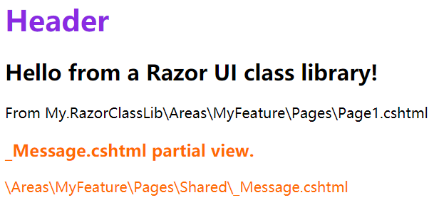

# ASP.NET Core Razor类库项目

**本文中的术语说明**

RCL：全称是Razor Class Library，即Razor类库。


## Razor类库

Razor类库简称为RCL，即Razor Class Library，它可以将Razor视图、Razor页面、控制器、页面模型、视图组件和数据模型等构建在一起，生成的一个可重用的类库，即为Razor类库。

RCL可以打包并重复使用，应用程序可以包含若干个RCL，并可以重写其中包含的视图和页面。如果在Web应用和RCL中都能找到视图（或部分视图、Razor页面），则优先使用Web应用中的Razor标记（`.cshtml`文件）。


## 创建Razor类库项目

打开Visual Studio 2017，选择 `“新建“ => ”项目” => “ASP.NET Core Web应用程序”`，在模板中选择”Razor类库“，注意，为了避免与已生成的视图库发生文件名冲突，建议库名称不要以`.Views`结尾。


创建完成之后，打开项目对应的`.csproj`文件，内容如下：

```xml
<Project Sdk="Microsoft.NET.Sdk.Razor">

  <PropertyGroup>
    <TargetFramework>netstandard2.0</TargetFramework>
  </PropertyGroup>

  <ItemGroup>
    <PackageReference Include="Microsoft.AspNetCore.Mvc" Version="2.2.0" />
  </ItemGroup>
</Project>
```

在解决方案资源管理器中，为创建的项目添加下述文件。

`Areas/MyFeature/Pages/Shared/_Message.cshtml`：

```html
<div style="color:#ff6a00;">
    <h3>_Message.cshtml partial view.</h3>
    <p>\Areas\MyFeature\Pages\Shared\_Message.cshtml</p>
</div>
```

`Areas/MyFeature/Pages/Shared/_Header.cshtml`：

```html
<h1 style="color:blueviolet;">Header</h1>
```

`Areas/MyFeature/Pages/Shared/_Footer.cshtml`：

```html
<h1 style="color:coral;">Footer</h1>
```

`Areas\MyFeature\Pages\_Layout.cshtml`：

```html
@addTagHelper *, Microsoft.AspNetCore.Mvc.TagHelpers
<!DOCTYPE html>

<html>
<head>
    <meta name="viewport" content="width=device-width" />
    <title>@ViewBag.Title</title>
</head>
<body>
    <div>
        <partial name="_Header" />
        @RenderBody()
    </div>
</body>
</html>
```

`Areas\MyFeature\Pages\Page1.cshtml.cs`：

```html
@page
@addTagHelper *, Microsoft.AspNetCore.Mvc.TagHelpers
@{ 
    Layout = "_Layout";
}

<h2>Hello from a Razor UI class library!</h2>
<p> From  My.RazorClassLib\Areas\MyFeature\Pages\Page1.cshtml</p>

<partial name="_Message" />
```

上述创建的文件彼此关系说明如下：

- `Page1.cshtml`页面使用了布局页`_Layout.cshtml`和分部视图`_Message.cshtml`
- `_Layout.cshtml`布局页使用了分部视图`_Header.cshtml`


## 添加Razor类库项目的引用

- 当创建好一个Razor类库时，并不能够直接使用，需要在其他Web项目中添加该类库项目的引用：
- 创建一个新的ASP.NET Web应用程序，模板选择“Web应用程序”，并设为启动项。
- 右击该项目，选择“生成依赖项” > "项目依赖项"，勾选上文创建的Razor类库项目。
- 右击该项目，选择“添加” > "引用"，在“引用管理器”对话框中勾选上文创建的Razor类库项目，点击“确定”。

运行该Web应用程序，在浏览器中输入以下url进行访问：

```
http://localhost:5147/myfeature/page1
```

页面显示效果如下图所示：




## 应用Razor类库的注意事项

- 如果在 Web 应用和 Razor 类库中都能找到视图、分部视图或 Razor 页面，则 Web 应用中的 Razor 标记（`.cshtml `文件）优先。
- 尽量不要在新的Web应用中，尝试使用Razor类库中的布局，换句话说，在创建Razor类库中的布局页时，尽量保持独立性，避免被外部的应用所干扰。
- 如果一定要使用Razor类库中的布局，那么在创建Razor类库中的布局文件时，布局文件所处的目录结构要尽可能的简单，例如上文中将布局文件放在了目录`MyApp\Areas\MyFeature\Pages\_Layout.cshtml`中，这种过于复杂，不便于向外部应用公开内容，最好的是直接放在`MyApp\Pages\_Layout.cshtml`。


