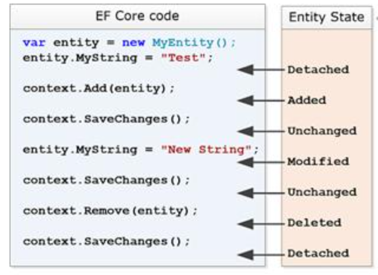

# EF Core 相关笔记

[TOC]

## Code-First 模式开发

### 需要安装的工具和Nuget包

```
Pomelo.EntityFrameworkCore.MySql
Microsoft.EntityFrameworkCore.Design
```

### 安装 dotnet tool ef 工具

进入到解决方案目录，安装dotnet tool ef工具

```
dotnet tool install --global dotnet-ef
```

### 添加迁移文件

进入到具体的项目目录，添加迁移文件，“Init”是迁移脚本的名字：

```
dotnet ef migrations add Init
```

如果后期对数据库进行了更改，可以继续使用该命令添加新的迁移文件，例如：

```
dotnet ef migrations add ProjectIdAutoGenerate
```

如果要删除上一次迁移 (回滚对迁移) 所做的代码更改，可以执行下述命令：

```
dotnet ef migrations remove
```

上述命令只能移除最新的迁移文件。

### 列出所有迁移版本

```
dotnet ef migrations list
```

### 更新数据库

然后执行更新数据库：

```
dotnet ef database update
```

### EF Core 生成SQL脚本

以下命令可以指定输出到文件中，如果不指定，默认输出到控制台中。

从空白开始生成sql脚本（从初始化到最新的生成脚本）：

```
dotnet ef migrations script
```

生成指定版本到最新版本的sql：

```
dotnet ef migrations script 版本名
```

从A-B版本生成迁移SQL脚本：

```
dotnet ef migrations script 版本A 版本B
```

### 对比更新数据库

```
dotnet ef database update
```

### 强制更新某个版本到数据库 

```
dotnet ef database update AddNe
```


## EF Core Database-First

EF 提供了一种根据数据库连接字符串来生成实体的命令工具，如下：

```
dotnet ef dbcontext scaffold "server=192.168.0.2;port=7306;user=root;password=root123456@;database=lighter" Pomelo.EntityFrameworkCore.MySql -o Models
```

虽然可以生成实体，但是实体类需要进行修改才可以使用，因此不太建议使用Database-First模式。


## EF Core 编程建议

### CancellationToken 

建议在 Controller 中，每个异步方法都采用带有 CancellationToken 参数的方法，这样在前台中断请求时，后端可以接收到前台中断的消息，从而取消后端的程序执行，以此来提高性能。

### 单独设置 EF Core 的日志级别

单独设置 EF Core 的日志级别：

"Microsoft.EntityFrameworkCore.Database.Command":"Debug"，一旦设置之后，可以在控制台中查看EF Core 执行的生成脚本。

### AddDbContext 和 AddDbContextPool

AddDbContext 和 AddDbContextPool：

参考EF Core官方文档说明，https://docs.microsoft.com/zh-cn/ef/core/miscellaneous/context-pooling#limitations。并不是AddDbContextPool一定会起到很明显的优化作用。


## EF Core 中的关系

### 一对一

### 一对多

一是主体实体（主表），多是依赖实体（从表）。

### 多对多

A表和B表时多对多的关系，在此基础上，存在中间表C表，将A表和B表进行串联，C表中含有两个外键，分别指向A表和B表。同时包含两个引用属性，指向A实体和B实体。


## EF Core 查询建议

foreach时，要先将要遍历的结果集提前执行ToList()，使其马上加载，然后再进行遍历。否则，它将在foreach内循环执行多次的数据库取值。

错误的写法：

```
foreach(var p in wy.source){}
```

正确的写法：

```
var list=wy.source.ToList();
foreach(var p in list){}
```


## EF Core 实体状态

Entity State：

- Added 添加
- Unchanged 没有变化 
- Modified 已修改
- Deleted 已删除 
- Detached 未跟踪 




## EF Core 并发处理

- 乐观处理：系统认为数据的更新在大多数情况下是不会产生冲突的，只在数据库更新操作提交的时候才对数据作冲突检测。
- 悲观处理：根据命名即对数据进行操作更新时，对操作持悲观保守的态度，认为产生数据冲突的可能性很大，需要先对请求的数据加锁再进行相关的操作。


## 重点

如果要在DbContext中获取HttpContext中的数据，必须要在DbContext的构造函数中获取，而不是在其他方法中获取。
例如代码中的tenantId，如果在其他方法中获取，会因为缓存策略，而无法命中，导致获取不到新的值。


HttpPut：一般用于整个对象的更新。

HttpPatch：一般用于对象的某个属性的更新。


