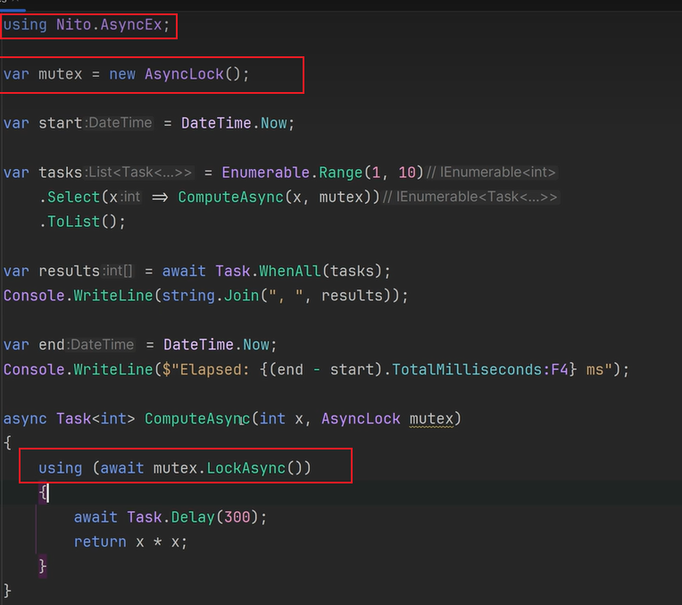
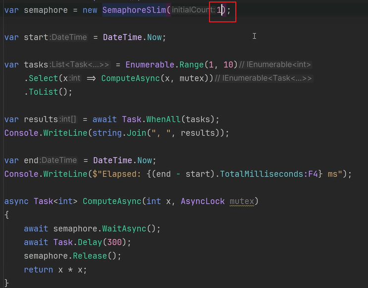

# C# 并发编程

[TOC]

## 并发编程的形式

常见的并发编程的形式有：

- 多线程（Thread、ThreadPool）
- 异步编程（Task，异步编程默认使用线程池）
- 并行处理（并行处理是一种多线程形式，而多线程是一种并发形式，在 .NET 中，有 TPL（任务并行库）、Parallel、PLinq 库提供并行编程）
- 响应式编程


## 异步编程概述

关于异步的概述，这里引用MSDN的一段文字：

> 异步编程是一项关键技术，使得能够简单处理多个核心上的阻塞 I/O 和并发操作。  如果需要 I/O 绑定（例如从网络请求数据或访问数据库），则需要利用异步编程。 还可以使用 CPU 绑定代码（例如执行成本高昂的计算），对编写异步代码而言，这是一个不错的方案。 
>
> 异步代码具有以下特点：
>
> - 等待 I/O 请求返回的同时，可通过生成处理更多请求的线程，处理更多的服务器请求。
> - 等待 I/O 请求的同时生成 UI 交互线程，并通过将长时间运行的工作转换到其他 CPU 核心，让 UI 的响应速度更快。
> - 许多较新的 .NET APIs 都是异步的。

使用异步编程，方法的调用是后台运行，并且不会阻塞调用线程。

.NET 中，有三种异步编程模式：

- **基于任务的异步模式 (TAP)** ：.NET 推荐使用的异步编程方法，该模式使用单一方法表示异步操作的开始和完成。包括我们常用的 async 、await 关键字，属于该模式的支持。
  - Task
  - 并行处理

- 基于事件的异步模式 (EAP) ：是提供异步行为的基于事件的旧模型。==.NET Core 已经不支持==。
- 异步编程模型 (APM) 模式：也称为 [IAsyncResult](https://docs.microsoft.com/zh-cn/dotnet/api/system.iasyncresult) 模式，这是使用 IAsyncResult 接口提供异步行为的旧模型。==.NET Core 也不支持==。

补充：多线程中的传统对象如Monitor（lock）、Mutex、Semaphore、EventWaitHandle这些同步机制，都不适用于异步编程。

唯一可以进行异步编程的对象是SemaphoreSlim。


### 已被 .NET Core 淘汰的异步编程模型

#### ~~异步编程模型（APM）【==已被.NET Core淘汰==】~~

之前的实现方式：

```
BeginXXX
EndXXX
```

使用Task替代实现：

1. Task.Factory.FromAsync
2. TaskCompletionSource

例如，获取文件的大小，原始实现方式：

```csharp
// 原生获取文件大小
private static void Sample1() {
    FileStream fileStream = new FileStream(Environment.CurrentDirectory + "//1.txt", FileMode.Open);
    byte[] bytes = new byte[fileStream.Length];
    fileStream.BeginRead(bytes, 0, bytes.Length, (IAsyncResult ir) => {
        var length = (ir.AsyncState as FileStream).EndRead(ir);
        Console.WriteLine($"当前的Length={length}");
    }, fileStream);

    Console.Read();
}
```

使用Task.Factory.FromAsync实现相同功能：

```csharp
private static void Sample2() {
    FileStream fileStream = new FileStream(Environment.CurrentDirectory + "//1.txt", FileMode.Open);

    byte[] bytes = new byte[fileStream.Length];

    var task = Task.Factory.FromAsync(fileStream.BeginRead, fileStream.EndRead, bytes, 0, bytes.Length, fileStream);
    Console.WriteLine($"当前的Length={task.Result}"); //阻塞直到获取了结果

    Console.Read();
}
```

使用TaskCompletionSource实现相同功能：

```csharp
private static Task<int> GetFileLengthAsync() {
    TaskCompletionSource<int> source = new TaskCompletionSource<int>();
    FileStream fileStream = new FileStream(Environment.CurrentDirectory + "//1.txt", FileMode.Open);

    byte[] bytes = new byte[fileStream.Length];

    fileStream.BeginRead(bytes, 0, bytes.Length, (IAsyncResult ir) => {
        var length = (ir.AsyncState as FileStream).EndRead(ir);
        // 将结果写入到source中
        source.SetResult(length);
    }, fileStream);
    // return返回的时候，上述方法还没有被执行，因此方法名标记为了异步
    return source.Task;
}
```

大多数的XXXAsync方法的内部实现，使用的都是TaskCompletionSource。


#### ~~基于事件的编程模型（EAP）【==已被.NET Core淘汰==】~~

也可以将事件进行包装，使用Task实现。

例如，使用WebClient获取一个HTML页面的大小，基于事件编程模型的原始实现如下：

```csharp
static void Sample3() {
    WebClient client = new WebClient();
    client.DownloadStringCompleted += (sender, e) => {
        var length = e.Result.Length;
        Console.WriteLine("当前的Length=" + length);
    };

    client.DownloadStringAsync(new Uri("http://cnblogs.com"));
    Console.Read();
}
```

使用TaskCompletionSource实现相同的功能：

```csharp
static Task<int> Sample4() {
    TaskCompletionSource<int> source = new TaskCompletionSource<int>();
    WebClient client = new WebClient();
    client.DownloadStringCompleted += (sender, e) => {
        if (e.Error != null) {
            source.SetException(e.Error);
        }
        else{
            var length = e.Result.Length;
            source.SetResult(length);
        }
    };

    client.DownloadStringAsync(new Uri("http://cnblogs.com"));
    return source.Task;
}

  private static void Main(string[] args) {
           var length= Sample4().Result;
            Console.WriteLine($"当前的Length={length}");  
        }
```

目前.NET中基于事件，已经提供了基于Task的异步方法。


## 并发与并行

并发与并行的区别与联系：

- 并行是真正多核同时运行，多个事件在==同一时刻==发生；

- 而并发是多个事件在==同一个时间间隔内==发生。
- 并行处理是并发的一种形式。


## 多线程与异步编程实战技术选型

多线程与异步编程相关的派生关系：

- `System.Threading.Thread`
- `System.Threading.ReaderWriterLockSlim`
- `System.Threading.SemaphoreSlim`
- `System.Threading.CountdownEvent`
- `System.Threading.CancellationTokenSource`
- `System.Threading.CancellationToken`（结构）
- `System.Threading.Barrier` 
- `System.Threading.WaitHandle`
  - `System.Threading.Semaphore`
  - `System.Threading.Mutex`
  - `System.Threading.EventWaitHandle`
    - `System.Threading.ManualResetEvent`
    - `System.Threading.AutoResetEvent`


无论是多线程还是任务，牵扯到理论部分时，心里一定要有一个抽象的用来理解的概念叫“信号”，这个信号不是指的编程里面的信号量，而是一个抽象的用来理解 System.Threading 命令空间下的各个成员之间相关作用的这么一个介质。例如在线程同步中，A任务调用的某个成员的方法影响了B任务的状态或行为，这种本质是一系列复杂的机制，而便于理解，就可以简单想成是A在调用完方法后，会产生一个信号，从而影响到了B任务。


多个线程访问同一个资源（多个线程都需要执行同一个代码块）造成数据不一致的情况，需要实现同步时（同一时刻只能有一个线程执行该代码块）的常见使用场景：

- 声明简单类型字段的时候，使用volatile关键字；对于简单值类型的原子操作，优先使用 Interlocked，其次使用 lock(obj) 语句或 Monitor 类型。
- Mutex 只用于实现进程间的同步，它会耗费比较多的资源，进程内请考虑 Monitor/lock。
- SemaphoreSlim 可以用来限制同时访问资源的线程个数，当指定为只能允许一个线程访问资源时，也可以实现同步。（注意：与 lock 不同的时，SemaphoreSlim本身允许多个线程同时执行相同的区域代码，因此称为非排他锁。）


多个线程需要协调管理（控制线程的数量、什么时候执行）时的常见使用场景：

- SemaphoreSlim 也可以用来限制对可同时访问资源或资源池的线程数。
- 从一个线程发送通知到另一个线程，在一个线程中控制其他线程什么时候等待、什么时候执行的场景，可以使用 AutoResetEvent 或 ManualResetEvent。==注意：实现线程的暂停、继续功能，最好是通过ManualResetEvent来实现，而不是直接操作线程本身的方法==。
- TaskCompletionSource 用于从一个线程写入结果，在另一个线程中接收结果。需要注意的是TaskCompletionSource 只能设置一次结果。

上述的这些场景下，一般都有对应的内置的对象可供直接使用：

- 常见的非异步编程组合（不能使用Async只能使用Thread的情况下）：Thread+ManualResetEvent/AutoResetEvent + BlockingCollection

- 支持Async异步编程的组合：Task + SemaphoreSlim + Channel


牵扯到集合相关的多个线程访问时的常见使用场景：

- 非异步的生产、消费的集合队列实现，可以使用 BlockingCollection。
- 用于异步编程的集合队列实现，可以使用Channel，类似于BlockingCollection。


==注意：Monitor（lock）、Mutex、Semaphore、EventWaitHandle这些不能用于异步，即线程执行的代码块中不能包含await语句。==如果想要使用异步，可以使用SemaphoreSlim。

如果想在lock语句中使用await，可以使用Nito.AsyncEx包中的AsyncLock对象。

、

对应的使用SemaphoreSlim实现上述功能：




- 


## 其他未归纳的技术点

其他与并发编程相关的其他内容：

- AsyncLazy：用于单例
- JoinableTaskFactory
- IAsyncEnumerable：可用于数据流
- IAsyncDisposable
- AsyncRelayCommand：WPF，CommunityToolkit
- TaskNotifier：WPF，CommunityToolkit
- ==Nito.Async==Ex包中提供的：
  - AsyncLock
  - AsyncAutoResetEvent
  - AsyncBarrier
- CliWrap：提供对Process的封装


## 扩展阅读

- [多线程模型](https://threads.whuanle.cn/1.thread_basic/2.thread_model.html)
- [概述 .NET 6 ThreadPool 实现 - 黑洞视界 - 博客园 (cnblogs.com)](https://www.cnblogs.com/eventhorizon/p/15316955.html)
- [Erika Parsons 和 Eric Eilebrecht - CLR 4 - 线程池内部 - 通道 9](https://channel9.msdn.com/Shows/Going+Deep/Erika-Parsons-and-Eric-Eilebrecht--CLR-4-Inside-the-new-Threadpool)
- [新的和改进的 CLR 4 线程池引擎](http://www.danielmoth.com/Blog/New-And-Improved-CLR-4-Thread-Pool-Engine.aspx)（工作窃取和本地队列）
- [.NET CLR 线程池内部结构](http://aviadezra.blogspot.co.uk/2009/06/net-clr-thread-pool-work.html)（将新的爬山算法与旧版线程池中使用的先前算法进行比较）
- [CLR 线程池注入，卡顿问题](http://joeduffyblog.com/2006/07/08/clr-thread-pool-injection-stuttering-problems/)
- [为什么 CLR 2.0 SP1 的线程池默认最大线程数增加到 250/CPU](http://joeduffyblog.com/2007/03/04/why-the-clr-20-sp1s-threadpool-default-max-thread-count-was-increased-to-250cpu/)
- [使用更可靠的线程池线程注入策略](https://github.com/dotnet/coreclr/issues/1754)（CoreCLR GitHub 问题）
- [使用更可靠的线程池线程注入策略](https://github.com/dotnet/corefx/issues/2329)（CoreFX GitHub 问题）
- [线程池增长：一些重要细节](https://gist.github.com/JonCole/e65411214030f0d823cb)
- [.NET 的 ThreadPool 类 - 幕后](https://www.codeproject.com/articles/3813/net-s-threadpool-class-behind-the-scenes)（基于 SSCLI 源，而不是 CoreCLR）
- [CLR 执行上下文](http://chabster.blogspot.co.uk/2013/04/clr-execution-context.html)（俄语，但谷歌翻译做得很合理）
- [线程池 + 任务测试（作者 Ben Adams）](https://github.com/benaadams/ThreadPoolTaskTesting)
- [异步编程模式 - .NET | Microsoft Learn](https://learn.microsoft.com/zh-cn/dotnet/standard/asynchronous-programming-patterns/)
- [.NET 中的并行编程：文档指南 - .NET | Microsoft Learn](https://learn.microsoft.com/zh-cn/dotnet/standard/parallel-programming/)
- [托管线程处理基本知识 - .NET | Microsoft Learn](https://learn.microsoft.com/zh-cn/dotnet/standard/threading/managed-threading-basics)
- [高级 .NET 编程文档 | Microsoft Learn](https://learn.microsoft.com/zh-cn/dotnet/navigate/advanced-programming/)