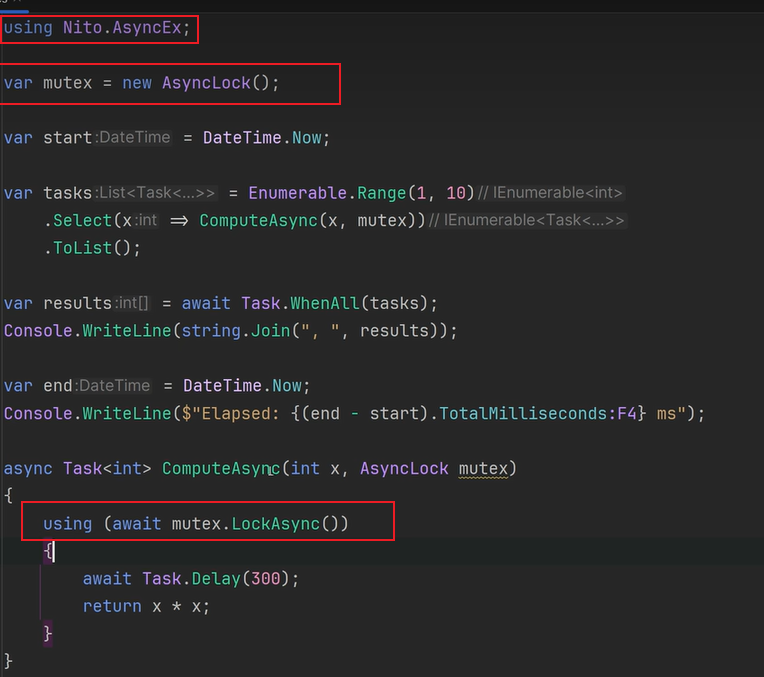

# C# 并发编程

常见的并发编程的形式有：

- 多线程（Thread、ThreadPool）
- 异步编程（Task，异步编程默认使用线程池）
- 并行处理（并行处理是一种多线程形式，而多线程是一种并发形式，在 .NET 中，有 TPL（任务并行库）、Parallel、PLinq 库提供并行编程）
- 响应式编程

并发与并行的区别与联系：

- 并行是真正多核同时运行，多个事件在==同一时刻==发生；

- 而并发是多个事件在==同一个时间间隔内==发生。
- 并行处理是并发的一种形式。

多个线程访问同一个资源（多个线程都需要执行同一个代码块）造成数据不一致的情况，需要实现同步时（同一时刻只能有一个线程执行该代码块）的常见使用场景：

- 声明简单类型字段的时候，使用volatile关键字；对于简单值类型的原子操作，优先使用 Interlocked，其次使用 lock(obj) 语句或 Monitor 类型。
- Mutex 只用于实现进程间的同步，它会耗费比较多的资源，进程内请考虑 Monitor/lock。
- SemaphoreSlim 可以用来限制同时访问资源的线程个数，当指定为只能允许一个线程访问资源时，也可以实现同步。（注意：与 lock 不同的时，SemaphoreSlim本身允许多个线程同时执行相同的区域代码，因此称为非排他锁。）

多个线程需要协调管理（控制线程的数量、什么时候执行）时的常见使用场景：

- SemaphoreSlim 也可以用来限制对可同时访问资源或资源池的线程数。
- 从一个线程发送通知到另一个线程，在一个线程中控制其他线程什么时候等待、什么时候执行的场景，可以使用 AutoResetEvent 或 ManualResetEvent。
- TaskCompletionSource 用于从一个线程写入结果，在另一个线程中接收结果。需要注意的是TaskCompletionSource 只能设置一次结果。

上述的这些场景下，一般都有对应的内置的对象可供直接使用：

- 常见的非异步编程组合（不能使用Async只能使用Thread的情况下）：Thread+ManualResetEvent/AutoResetEvent + BlockingCollection

- 支持Async异步编程的组合：Task + SemaphoreSlim + Channel

牵扯到集合相关的多个线程访问时的常见使用场景：

- 非异步的生产、消费的集合队列实现，可以使用 BlockingCollection。
- 用于异步编程的集合队列实现，可以使用Channel，类似于BlockingCollection。

==注意：Monitor（lock）、Mutex、Semaphore、EventWaitHandle这些不能用于异步，即线程执行的代码块中不能包含await语句。==如果想要使用异步，可以使用SemaphoreSlim。

如果想在lock语句中使用await，可以使用Nito.AsyncEx包中的AsyncLock对象。

、

对应的使用SemaphoreSlim实现上述功能：

其他与并发编程相关的其他内容：

- AsyncLazy：用于单例
- JoinableTaskFactory
- IAsyncEnumerable：可用于数据流
- IAsyncDisposable
- AsyncRelayCommand：WPF，CommunityToolkit
- TaskNotifier：WPF，CommunityToolkit
- ==Nito.Async==Ex包中提供的：
  - AsyncLock
  - AsyncAutoResetEvent
  - AsyncBarrier
- CliWrap：提供对Process的封装

扩展阅读：

- [多线程模型](https://threads.whuanle.cn/1.thread_basic/2.thread_model.html)
- [概述 .NET 6 ThreadPool 实现 - 黑洞视界 - 博客园 (cnblogs.com)](https://www.cnblogs.com/eventhorizon/p/15316955.html)
- [Erika Parsons 和 Eric Eilebrecht - CLR 4 - 线程池内部 - 通道 9](https://channel9.msdn.com/Shows/Going+Deep/Erika-Parsons-and-Eric-Eilebrecht--CLR-4-Inside-the-new-Threadpool)
- [新的和改进的 CLR 4 线程池引擎](http://www.danielmoth.com/Blog/New-And-Improved-CLR-4-Thread-Pool-Engine.aspx)（工作窃取和本地队列）
- [.NET CLR 线程池内部结构](http://aviadezra.blogspot.co.uk/2009/06/net-clr-thread-pool-work.html)（将新的爬山算法与旧版线程池中使用的先前算法进行比较）
- [CLR 线程池注入，卡顿问题](http://joeduffyblog.com/2006/07/08/clr-thread-pool-injection-stuttering-problems/)
- [为什么 CLR 2.0 SP1 的线程池默认最大线程数增加到 250/CPU](http://joeduffyblog.com/2007/03/04/why-the-clr-20-sp1s-threadpool-default-max-thread-count-was-increased-to-250cpu/)
- [使用更可靠的线程池线程注入策略](https://github.com/dotnet/coreclr/issues/1754)（CoreCLR GitHub 问题）
- [使用更可靠的线程池线程注入策略](https://github.com/dotnet/corefx/issues/2329)（CoreFX GitHub 问题）
- [线程池增长：一些重要细节](https://gist.github.com/JonCole/e65411214030f0d823cb)
- [.NET 的 ThreadPool 类 - 幕后](https://www.codeproject.com/articles/3813/net-s-threadpool-class-behind-the-scenes)（基于 SSCLI 源，而不是 CoreCLR）
- [CLR 执行上下文](http://chabster.blogspot.co.uk/2013/04/clr-execution-context.html)（俄语，但谷歌翻译做得很合理）
- [线程池 + 任务测试（作者 Ben Adams）](https://github.com/benaadams/ThreadPoolTaskTesting)
- [异步编程模式 - .NET | Microsoft Learn](https://learn.microsoft.com/zh-cn/dotnet/standard/asynchronous-programming-patterns/)
- [.NET 中的并行编程：文档指南 - .NET | Microsoft Learn](https://learn.microsoft.com/zh-cn/dotnet/standard/parallel-programming/)
- [托管线程处理基本知识 - .NET | Microsoft Learn](https://learn.microsoft.com/zh-cn/dotnet/standard/threading/managed-threading-basics)
- [高级 .NET 编程文档 | Microsoft Learn](https://learn.microsoft.com/zh-cn/dotnet/navigate/advanced-programming/)