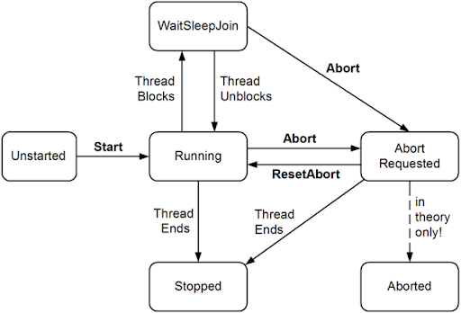
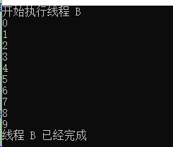
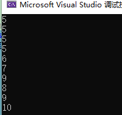
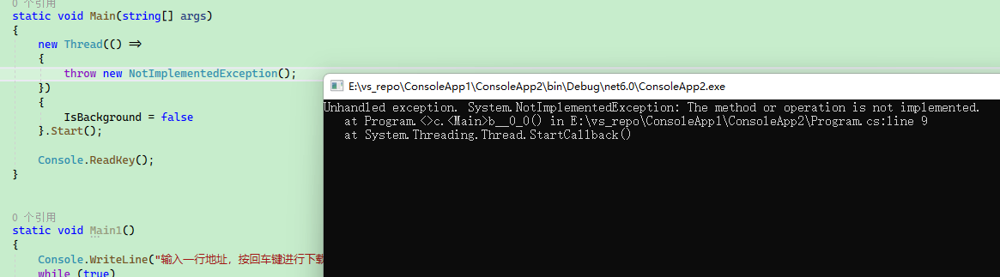

# C# 多线程

当程序启动时，进程需要启动第一个线程，以便执行代码，第一个启动的线程，一般称为**主线程**。

与 C 语言等语言相比，C 语言程序启动时，是由操作系统注入线程的，而 C# 则是由 CLR 注入第一个线程，进程中的主线程只有一个。在 .NET 程序中，主线程会执行 `Main()` 中的代码，一旦 `Main()` 完成，程序便会结束，即主线程的结束，进程便会结束，因此**主线程的生命周期即进程的生命周期**。


使用Thread.CurrentThread 获取当前正在执行的线程对象。

```c#
static void Main()
{
    Console.WriteLine($"当前的线程：{Environment.CurrentManagedThreadId}");
    var currentThread = Thread.CurrentThread;
    Console.WriteLine("线程标识：" + currentThread.Name);
    Console.WriteLine("当前地域：" + currentThread.CurrentCulture.Name);
    Console.WriteLine("线程执行状态：" + currentThread.IsAlive);
    Console.WriteLine("是否为后台线程：" + currentThread.IsBackground);
    Console.WriteLine("是否为线程池线程" + currentThread.IsThreadPoolThread);
}
```

输出结果：

```
线程标识：
当前地域：zh-CN
线程执行状态：True
是否为后台线程：False
是否为线程池线程False
```


## 创建线程

在 C# 中，使用 Thread 类来创建以及管理线程的，通过这种方式创建的线程称为**托管线程**。

Thread 是 .NET CLR 中的线程管理对象，因为它归 CLR 管理，自动由GC 分配和回收内存空间，因此程序员不需要关注线程的栈内存分配、如何创建以及回收内存。

### Thread 构造函数

Thread 类有以下构造函数：

```csharp
public Thread(ParameterizedThreadStart start);
public Thread(ThreadStart start);
public Thread(ParameterizedThreadStart start, int maxStackSize);
public Thread(ThreadStart start, int maxStackSize);
```

#### ParameterizedThreadStart

ParameterizedThreadStart 是一个委托，其参数是一个 object 类型，当进行参数传递时，需要进行类型转换甚至装箱拆箱操作。

```c#
public delegate void ParameterizedThreadStart(object? obj);
```

示例：

```csharp
static void Main(string[] args)
{
    string myParam = "abcdef";
    ParameterizedThreadStart parameterized = new ParameterizedThreadStart(OneTest);
    Thread thread = new Thread(parameterized);
    thread.Start(myParam);
    Console.ReadKey();
}

public static void OneTest(object obj)
{
    string str = obj as string;
    if (string.IsNullOrEmpty(str))
        return;

    Console.WriteLine("新的线程已经启动");
    Console.WriteLine(str);
}
```

通过这种方式创建的线程，有且只能有一个 object 参数，不灵活。

#### ThreadStart 

ThreadStart 是一个无参数委托，使用 `ThreadStart` 时，不需要作为参数传递，可以通过使用静态变量或类成员变量共享信息。

优点是不需要装箱拆箱，多线程可以共享空间；缺点是变量是大家都可以访问，此种方式在多线程竞价时，可能会导致多种问题(可以加锁解决)。

```csharp
public delegate void ThreadStart();
```

示例：

```csharp
class Program
{
    private static string A = "成员变量";        // 通过静态字段传递信息
    static void Main(string[] args)
    {
        Thread thread1 = new Thread(OneTest1);
        thread1.Name = "Test1";
        thread1.Start();

        Console.ReadKey();
    }

    public static void OneTest1()
    {
        Console.WriteLine("新的线程已经启动");
        Console.WriteLine(A);       // 本身对象的其它成员
    }
}
```

### 使用委托与 Lambda 创建 Thread

由于 ParameterizedThreadStart 和 ThreadStart 都是委托，因此上述的两种形式可以直接通过委托的方式简化操作。

```csharp
static void Main()
{
    Thread thread1 = new Thread(() =>
    {
        // 要执行的代码
    });
    thread1.Start();

    var url = "https://baidu.com";
    var method = "GET";
    Thread thread2 = new Thread(() =>
    {
        Download(url, method);
    });
    thread2.Start();
}

public static void Download(string url, string method)
{
    if (method == "GET")
    {
        new HttpClient().GetAsync(url);
    }
    else if (method == "POST")
    {
        new HttpClient().PostAsync(url, null);
    }
}
```

### CLR 的线程是如何创建的

在 C# 中创建一个线程很简单：

```csharp
        Thread thread = new Thread(() => { });
```

在 C# 中创建 Thread 对象是一种轻量级操作，当 `new Thread` 时，只是创建了一个 Thread，此时并不会实际创建一个操作系统线程。**只有使用 `thread.Start();` 时，才会创建一个真正的操作系统线程**。

在 `new Thread` 时，CLR 会调用一个 `Initialize` 方法初始化一个 C++ Thread 对象。

从 C# 代码到 CLR 的 C++ 代码中，需要调用多个函数才能完成创建流程。

具体的创建流程如下所示：


通过这些步骤，你应该意识到 C# 中的线程与操作系统线程是一对一的关系。同时你也了解到，==创建一个 Thread，需要这么多步骤，而且消耗类系统资源，因此在 .NET 并发编程中，我们要避免直接创建线程，而应该多使用线程池线程或 Task，避免创建和回收线程的开销==。

参考资源：[CLR 的线程是如何创建的](https://threads.whuanle.cn/1.thread_basic/2.thread_model.html#clr-%E7%9A%84%E7%BA%BF%E7%A8%8B%E6%98%AF%E5%A6%82%E4%BD%95%E5%88%9B%E5%BB%BA%E7%9A%84)


## 线程状态

使用Thread.ThreadState获取当前线程的状态。注意：获取的状态并不能表明线程的实时状态。

因为线程执行时，可能会被 CPU 夺取时间片，这个时间是极短的，可能就几个指令时间，因此当你大代码完成判断时，线程已经被挂起。

```csharp
if ((currentThread.ThreadState | ThreadState.Running) == currentThread.ThreadState)
{
    //...
}
```

ThreadState 的枚举定义如下：

| 枚举             | 值   | 说明                                                         |
| ---------------- | ---- | ------------------------------------------------------------ |
| Aborted          | 256  | 该线程现在已死，但其状态尚未更改为 Stopped                   |
| AbortRequested   | 128  | 已对线程调用了 Abort(Object) 方法，但线程尚未收到试图终止它的挂起的 ThreadAbortException |
| Background       | 4    | 线程正作为后台线程执行                                       |
| Running          | 0    | 线程已启动且尚未停止                                         |
| Stopped          | 16   | 线程已停止                                                   |
| StopRequested    | 1    | 正在请求线程停止                                             |
| Suspended        | 64   | 线程已挂起                                                   |
| SuspendRequested | 2    | 正在请求线程挂起                                             |
| Unstarted        | 8    | 尚未对线程调用 Start() 方法                                  |
| WaitSleepJoin    | 32   | 线程阻塞中                                                   |

演示代码：

```csharp
static void Main()
{
    var currentThread = Thread.CurrentThread;
    Console.WriteLine(currentThread.ThreadState);
}
```

注意，上面这么多枚举中，并不都是线程的运行状态，例如 `Background` 只是表明此线程属于后台线程，不能表示此线程是正在运行还是已经停止。我们要区分线程生命周期和信息两部分，像 `Running`、`Stopped` 等，属于线程**生命周期**状态的枚举，而 `Background` 属于**标记**信息。

.NET Thread 的 `Thread.ThreadState` 表示的线程生命周期变更关系如下：




在 .NET 中，描述线程的状态有两个枚举：

```
System.Diagnostics.ThreadState
System.Threading.ThreadState
```

`System.Diagnostics.ThreadState` 表示**==操作系统==中线程**的状态，主要目的用于调试，请参考：https://docs.microsoft.com/zh-cn/dotnet/api/system.diagnostics.threadstate?view=net-6.0

`System.Threading.ThreadState` 里面有很多枚举类型是没有用处的，我们可以使用一个这样的方法来获取更加有用的信息：

```csharp
public static ThreadState GetThreadState(ThreadState ts)
{
    return ts & (ThreadState.Unstarted |
        ThreadState.WaitSleepJoin |
        ThreadState.Stopped);
}
```


## UnsafeStart

使用 `UnsafeStart()` 启动的线程不捕获执行上下文。

在一些场景下我们需要在默认执行上下文中延迟创建**线程池线程和计时器线程**，因为使用 `Start()` 启动的线程需要在初始化一些工作，这会在线程上创建一个额外的堆栈帧，并可能导致 AsyncLocal 值更改通知被不必要地发送（请参考https://github.com/dotnet/runtime/pull/46181），UnsafeStart 避免捕获当前执行上下文并在线程运行时恢复它。关于上下文这些东西，后面会说到，这里不必关注。

两者的在调用时，差异在 `captureContext` 参数：

```csharp
    [UnsupportedOSPlatform("browser")]
    public void Start()
    {
        Start(captureContext: true);
    }

    [UnsupportedOSPlatform("browser")]
    public void UnsafeStart()
    {
        Start(captureContext: false);
    }
```

> 从 CLR 源码中获得。

目前有以下地方使用到 `UnsafeStart`：

- `FileSystemWatcher`
- `SocketAsyncEngine`
- `CounterGroup`
- `ThreadPoolTaskScheduler`


## 休眠与阻塞

阻塞的定义：当线程由于特定原因暂停执行，那么它就是阻塞的。如果线程处于阻塞状态，线程就会交出他的 CPU 时间片，并且不会消耗 CPU 时间，直至阻塞结束，即线程会阻塞，但是 CPU 会继续找到其他未阻塞的线程继续执行指令，避免 CPU 空闲。阻塞会发生 CPU 从一个线程换到另一个线程执行，即上下文切换。

`Thread.Sleep()` 、`Thread.Yield()` 方法可以将当前线程挂起一段时间。

`Thread.Sleep();` 会阻塞线程，使得线程交出时间片，然后处于休眠状态，直至被重新唤醒；适合用于长时间的等待；

`Thread.Join()` 方法可以阻塞**当前线程一直等待另一个线程运行至结束**，需要两个线程配合。

在等待线程 `Sleep()` 或 `Join()` 的过程中，线程是阻塞的(Blocket)。

`Thread.Sleep()` 使用方式如下：

```csharp
    static void Main()
    {
        for (int i = 0; i < 100; i++)
        {
            Console.WriteLine(i);
            Thread.Sleep(1000);
        }
    }
```

> 通过 `Thread.Sleep()` 控制每秒只打印一次信息。

==`Thread.Sleep()` 将会导致线程立即放弃自己的时间片，将 CPU 交于其他的线程，而 `Thread.Yield()` 虽然交出时间片，但是**它只会将资源交给同一个处理器上运行的线程**。==

```csharp
public static void Sleep(int millisecondsTimeout)
public static bool Yield()        // 如果操作系统转而执行另一个线程，则为 true；否则为 false。
```

==另一方面，及时没有其它线程要运行了，`Thread.Sleep(xxx)` 也会保证当前的线程继续休眠一段时间，而 `Thread.Yield()` 则会让不出来（没有其它线程可以要用 CPU），而且 `Thread.Yield()` 只是把 CPU 让一下，很快又会被分配时间片的。当然，如果是使用 `Thread.Sleep(0)` ，也会达到相同效果。==

`Thread.Sleep(0)` 或 `Thread.Yield` 在高级性能调优方面非常有用，同时它还是一种很好的诊断工具，可用于帮助开发者发现与线程安全相关的问题。

`Thread.Join()` ：当一个主线程启动了一个新的子线程时，默认情况下，主线程执行完，会自动终止子线程的执行，此时可以通过子线程调用Join()方法，来阻止主线程的执行，直到子线程执行完毕或终止，才会继续执行主线程。

示例一：

```csharp
    static void Main()
    {
        var thread = new Thread(Print);
        Console.WriteLine("开始执行线程 B");

        thread.Start();

        // 开始等待线程B完成
        thread.Join();
        Console.WriteLine("线程 B 已经完成");
    }

    public static void Print()
    {
        for (int i = 0; i < 10; i++)
        {
            Console.WriteLine(i);
            Thread.Sleep(1000);
        }
    }
```



示例二：

```csharp
// 带参数的Thread
var pth = new Thread(obj=> {
    Thread.Sleep(1000 * 5);
    Console.WriteLine($"当前的线程：{Environment.CurrentManagedThreadId}");
    Console.WriteLine($"接收到的参数值：{obj}");
});

// 传入参数到线程内
pth.Start("wy");

// Join的使用
// 多个线程支持存在交互和等待

//实现先输出其他线程再输出主线程
// 阻止调用线程（这里是主线程），直到子线程终止。
pth.Join(1000*3); // 等待3秒，过后依旧执行主线程

Console.WriteLine($"主线程：{Environment.CurrentManagedThreadId}");
Console.ReadLine();
```


## 自旋与阻塞

线程等待有内核模式(Kernel Mode)和用户模式(User Model)。

因为只有操作系统才能控制线程的生命周期，因此使用 `Thread.Sleep()` 等方式阻塞线程，发生上下文切换，此种等待称为内核模式。

用户模式使线程等待，并不需要线程切换上下文，而是让线程通过执行一些无意义的运算，实现等待，也称为自旋。

我们来对比一下 `Thread.Sleep(1)` 和 `Thread.SpinWait(1)` 占用的时间。

```csharp
    static void Main(string[] args)
    {
        Stopwatch stopwatch = new Stopwatch();
        stopwatch.Start();
        Thread.Sleep(1);
        Console.WriteLine(stopwatch.Elapsed.ToString());
        Console.ReadKey();
    }
    static void Main(string[] args)
    {
        Stopwatch stopwatch = new Stopwatch();
        stopwatch.Start();
        Thread.SpinWait(1);
        Console.WriteLine(stopwatch.Elapsed.ToString());
        Console.ReadKey();
    }
```

输出结果：

```
00:00:00.0014747
00:00:00.0000214
```

可以看到，自旋一次消耗的时间远远低于 `1ms`，并且 `Thread.Sleep` 会出现上下文切换，而 `Thread.SpinWait` 不会。`Thread.SpinWait` 适合等待短暂的任务，实现线程同步。

自旋的详细介绍见《线程同步》。


## 终止

`.Abort()` 方法不能在 .NET Core 上使用，不然会出现 `System.PlatformNotSupportedException:“Thread abort is not supported on this platform.”` 。

`.Abort()` 的 API：

| 方法          | 说明                                                         |
| ------------- | ------------------------------------------------------------ |
| Abort()       | 在调用此方法的线程上引发 ThreadAbortException，以开始终止此线程的过程。 调用此方法通常会终止线程。 |
| Abort(Object) | 引发在其上调用的线程中的 ThreadAbortException以开始处理终止线程，同时提供有关线程终止的异常信息。 调用此方法通常会终止线程。 |

`Abort()` 方法给线程注入 `ThreadAbortException` 异常，导致线程被终止。

==虽然 `.Abort()` 不能用，但是还有 `Thread.Interrupt()` 可以用，**它可以中断处于 `WaitSleepJoin` 线程状态的线程**。==

示例代码如下，在 Print 函数结束前，按下回车键，都会导致函数中止。

```csharp
static void Main()
{
    var thread = new Thread(Print);
    Console.WriteLine("开始执行线程 B");

    thread.Start();
	//读取用户的录入
    _ = Console.ReadLine();
	//当按下回车键之后，触发此处代码，此时中断由Thread.Sleep(1000)阻塞的线程，导致函数终止
    thread.Interrupt();

    Console.ReadKey();
}

public static void Print()
{
    for (int i = 0; i < 10; i++)
    {
        Console.WriteLine(i);
        Thread.Sleep(1000);
    }
}
```


可见，当对另一个线程调用 `Interrupt` 时，会弹出 `System.Threading.ThreadInterruptedException` 异常，导致线程中止。在调试环境下，可能会导致 Vistual Studio 弹出异常，==直接启动编译后的程序，则不会弹出异常==。

==注意，如果线程不会处于 `WaitSleepJoin` 状态，而是一直运行，则 `Interrupt()` 函数对线程无效。==

代码示例如下：

```csharp
static void Main()
{
    var thread = new Thread(Print);
    Console.WriteLine("开始执行线程 B");

    thread.Start();

    _ = Console.ReadLine();

    thread.Interrupt();
    Console.WriteLine("你按下了回车键");

    for (int i = 0; i < 100; i++)
    {
        Console.WriteLine(Value);
        Thread.Sleep(1000);
    }
    Console.ReadKey();
}

private static long Value = 0;

public static void Print()
{
    //无阻塞的循环操作
    for (long i = 0; i < 1000000000000000000; i++)
    {
        Value++;
    }
}
```

你会发现，`Print()` 会一直挂在后台执行， Value 值不断变大。

如果你细心留意，会发现第二个 `Print()` 例子中的 `Thread.Sleep()` 和 `Console.WriteLine();` 都被去掉了，因为除了 `Thread,Sleep()` 会导致 `WaitSleepJoin`，`Console.WriteLine();` ==**与控制台进行 IO 传输时，也会发生中断**。**当进程/线程需要执行 IO 操作时，都会发生中断**==，进程/线程被暂停，等待 IO 结果，期间 CPU 会执行其他线程，中断与软硬件有关，读者可以参考计算机组成原理或操作系统方面的书籍，这里就不在细谈。

==如果代码中加上 `Console.WriteLine(Value);` ，你会发现，`thread.Interrupt();` 又起效了。==

```csharp
    public static void Print()
    {
        for (long i = 0; i < 1000000000000000000; i++)
        {
            Value++;
            Console.WriteLine(Value);
        }
    }
```

>  总结
>
> 通过 `.Interrupt()` 函数，可以让处于 `WaitSleepJoin` 状态的线程抛出异常而停止。可以使用 `Sleep()`、`Join()` 方式使得线程休眠，也可以让线程执行 IO 操作如读写文件、读取或输出控制台终端等发生中断导致线程挂起。


## 线程的不确定性

线程的不确定性是指几个并发运行的线程，不确定下一次 CPU 时间片会分配给谁(当然，分配有优先级)。

多线程是并发运行的，但一般 CPU 没有那么多核，不可能在同一时刻执行所有的线程。CPU 会决定某个时刻将时间片分配给多个线程中的一个线程，这就出现了 CPU 的时间片分配调度。

执行下面的代码示例，你可以看到，两个线程打印的顺序是不确定的，而且每次运行结果都不同。

CPU 有一套公式确定下一次时间片分配给谁，但是比较复杂，需要学习计算机组成原理和操作系统。

```csharp
static void Main(string[] args)
{
    Thread thread1 = new Thread(Test1);
    Thread thread2 = new Thread(Test2);

    thread1.Start();
    thread2.Start();

    Console.ReadKey();
}

public static void Test1()
{
    for (int i = 0; i < 10; i++)
    {
        Console.WriteLine("Test1:" + i);
    }
}
public static void Test2()
{
    for (int i = 0; i < 10; i++)
    {
        Console.WriteLine("Test2:" + i);
    }
}
```

>  提示
>
> 上面代码每次执行输出的结果都不一样。


## 数据不要直接跨线程使用

如果线程中需要使用外部的变量，最好的做法是使用参数的形式传给线程，而不是直接引用该变量来使用。

有以下代码，错误写法一：

```csharp
    static void Main(string[] args)
    {
        for (int i = 0; i < 10; i++)
        {
            new Thread(() =>
            {
                Console.WriteLine(i);
            }).Start();
        }
    }
```

代码很简单，启动 10 个线程，分别输出 i 的值。按照设想，虽然线程并发运行时具有不确定性，那么最终会输出 `0-9`，但是会乱序。可是，程序启动后，输出结果是这样的：



==这是因为线程在不同的 CPU 核心上运行，而 CPU 与内存之间具有 `寄存器、L1 Cache、L2 Cache、L3 Cache、内存` 多级结构，如果不对内存进行锁定，那么在一个 CPU 核心修改了变量的值但是还没有写回到内存中，而另一个 CPU 读取了旧的值时，便会出现脏读。==

==错误写法二==，常错形式：

```csharp
static void Main(string[] args)
{
    for (int i = 0; i < 10; i++)
    {
        new Thread(() =>
        {
            var value = i;
            Console.WriteLine(value);
        }).Start();
    }
}
```

正确写法一：

```c#
for (int i = 0; i <10; i++)
{
      int tmp = i;
      new Thread(() =>
      {
          Console.WriteLine($"i = {tmp}");
      }).Start();
}
```

正确写法二，最好的写法，推荐写法：

```csharp
static void Main(string[] args)
{
    for (int i = 0; i < 100; i++)
    {
        new Thread((a) =>
        {
            Console.WriteLine(a + "进入到了资源池");
        }).Start(i);
    }
}
```


## 线程优先级、前台线程和后台线程

`Thread.Priority` 属性用于设置线程的优先级，`Priority` 是一个 ThreadPriority 类型枚举，其枚举类型如下

| 枚举        | 值   | 说明                                                         |
| ----------- | ---- | ------------------------------------------------------------ |
| AboveNormal | 3    | 可以将 安排在具有 `Highest` 优先级的线程之后，在具有 `Normal` 优先级的线程之前。 |
| BelowNormal | 1    | 可以将 Thread 安排在具有 `Normal` 优先级的线程之后，在具有 `Lowest` 优先级的线程之前。 |
| Highest     | 4    | 可以将 Thread 安排在具有任何其他优先级的线程之前。           |
| Lowest      | 0    | 可以将 Thread 安排在具有任何其他优先级的线程之后。           |
| Normal      | 2    | 可以将 Thread 安排在具有 `AboveNormal` 优先级的线程之后，在具有 `BelowNormal` 优先级的线程之前。 默认情况下，线程具有 `Normal` 优先级。 |

优先级排序：`Highest` > `AboveNormal` > `Normal` > `BelowNormal` > `Lowest`。

`Thread.IsBackgroundThread` 可以设置线程是否为后台线程。

==前台线程的优先级大于后台线程，并且程序需要等待所有前台线程执行完毕后才能关闭；而当程序关闭时，无论后台线程是否在执行，都会强制退出。对于前台线程，如果前台线程抛出异常，则会导致程序异常终止。==

==如果线程优先级设置过大，则可能会干涉到系统运行，如 磁盘写入、鼠标点击等都是高速运转的，如果程序中有太多高优先级的线程，那么系统需要分配大量 CPU 时间运行这些线程的代码，可能会导致系统无响应或响应缓慢。当然，如果你的程序要执行大量 IO 操作或者需要实时交互需要低延迟，则可以设置为高优先级。如果线程优先级过低，则可能导致线程饥饿，迟迟得不到 CPU 时间片，导致如窗口界面无响应。==

IsBackground为true时，表示后台线程，当主线程退出时，该线程也会被终止。
IsBackground为false时，表示前台线程，此时如果该前台线程不退出，主线程也无法退出。只有所有的前台线程结束后，主线程才能退出。


## 异常处理

.NET 中的线程有前台线程和后台线程之分，前台线程的线程内部发生错误时，会影响整个进程，导致进程异常并退出。

```csharp
static void Main(string[] args)
{
    new Thread(() =>
    {
        throw new NotImplementedException();
    })
    {
        IsBackground = false
    }.Start();

    Console.ReadKey();
}
```



==而线程的中的异常，只能由线程内部自行捕获，外部无法处理。==

下面代码示例中，是一种错误做法：

```csharp
try
{
    new Thread(() =>
    {
        throw new NotImplementedException();
    }).Start();
}
catch (Exception ex) { }
```

正确做法是：

```csharp
new Thread(() =>
{
    try
    {
        throw new NotImplementedException();
    }
    catch (Exception ex) { }
}).Start();
```
