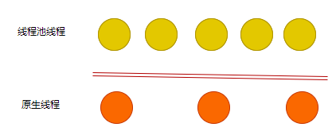
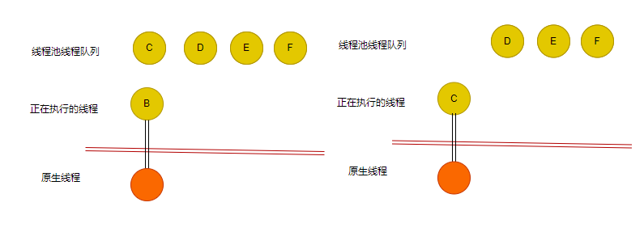
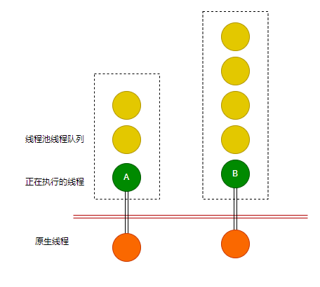
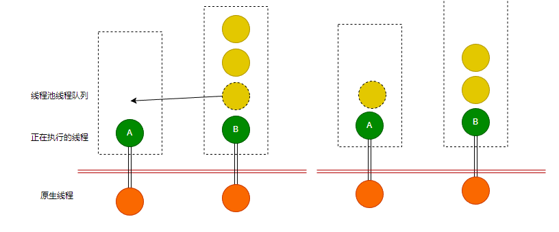

# C# 线程池

线程池全称为托管线程池，线程池受 .NET 通用语言运行时(CLR)管理，线程的生命周期由 CLR 处理，因此我们可以专注于实现任务，而不需要理会线程管理。

线程池的应用场景：任务并行库 (TPL)操作、异步 I/O 完成、计时器回调、注册的等待操作、使用委托的异步方法调用和套接字连接。

> Task、Task<TResult> 原理也是基于线程池。

为什么需要使用线程池？

因为创建原生线程（系统线程）的代价比较昂贵，而在 .NET 中，CLR 线程跟原生线程是 1:1 的关系，因此使用 CLR 创建新的线程时，会付出较大的代价。因此需要使用线程池，复用线程，减少创建和消耗线程的操作。

因为系统线程切换时，线程上下文切换需要一定的代价，因此对系统线程做线程池，可以减少创建、销毁过程的性能消耗，但是不能减少切换上下文的性能消耗。==而使用 CLR 线程池时，CLR 还可以自行管理线程的上下文切换以及 CPU 缓存，其原理在于 CLR 线程池跟 系统线程是 M:N 的关系。==



举个不太严谨的例子，一个原生线程 A 跟一个线程池线程 B 绑定，然后线程池 B 完成了任务，但是此时不会释放 A ，而是从队列中把线程池线程 C 绑定到 A 执行任务。

这样，原生线程 A 一直在运行，执行了 B 代码接着执行 C 代码，在这个过程中不需要切换原生线程，只切换了 CLR 中的线程。



这种队列有两种，分别是全局队列、本地队列，上面所说的即本地队列。

正常情况下，线程池会有多个任务队列，每个队列的任务数量有所差异。



从上图来看，假设 A 执行完成剩下的两个任务，那么 A 的队列就变空了，为了不让这个原生线程闲着，A 会从 B 的任务队列中，偷点任务出来。



关于线程池的调度原理，参考资料：https://www.cnblogs.com/eventhorizon/p/15316955.html


## ThreadPool

ThreadPool 是开发者使用线程池的 API 手段。通过 `System.Threading.ThreadPool` 类，我们可以使用线程池。

ThreadPool 类是静态类，它提供一个线程池，该线程池可用于执行任务、发送工作项、处理异步 I/O、代表其他线程等待以及处理计时器。

### ThreadPool 常用属性和方法

属性：

| 属性                   | 说明                               |
| ---------------------- | ---------------------------------- |
| CompletedWorkItemCount | 获取迄今为止已处理的工作项数。     |
| PendingWorkItemCount   | 获取当前已加入处理队列的工作项数。 |
| ThreadCount            | 获取当前存在的线程池线程数。       |

方法：

| 方法                                                         | 说明                                                         |
| ------------------------------------------------------------ | ------------------------------------------------------------ |
| BindHandle(IntPtr)                                           | 将操作系统句柄绑定到 ThreadPool。                            |
| BindHandle(SafeHandle)                                       | 将操作系统句柄绑定到 ThreadPool。                            |
| GetAvailableThreads(Int32, Int32)                            | 检索由 GetMaxThreads(Int32, Int32) 方法返回的最大线程池线程数和当前活动线程数之间的差值。 |
| GetMaxThreads(Int32, Int32)                                  | 检索可以同时处于活动状态的线程池请求的数目。 所有大于此数目的请求将保持排队状态，直到线程池线程变为可用。 |
| GetMinThreads(Int32, Int32)                                  | 发出新的请求时，在切换到管理线程创建和销毁的算法之前检索线程池按需创建的线程的最小数量。 |
| QueueUserWorkItem(WaitCallback)                              | 将方法排入队列以便执行。 此方法在有线程池线程变得可用时执行。 |
| QueueUserWorkItem(WaitCallback, Object)                      | 将方法排入队列以便执行，并指定包含该方法所用数据的对象。 此方法在有线程池线程变得可用时执行。 |
| QueueUserWorkItem(Action, TState, Boolean)                   | 将 Action 委托指定的方法排入队列以便执行，并提供该方法使用的数据。 此方法在有线程池线程变得可用时执行。 |
| RegisterWaitForSingleObject(WaitHandle, WaitOrTimerCallback, Object, Int32, Boolean) | 注册一个等待 WaitHandle 的委托，并指定一个 32 位有符号整数来表示超时值（以毫秒为单位）。 |
| SetMaxThreads(Int32, Int32)                                  | 设置可以同时处于活动状态的线程池的请求数目。 所有大于此数目的请求将保持排队状态，直到线程池线程变为可用。 |
| SetMinThreads(Int32, Int32)                                  | 发出新的请求时，在切换到管理线程创建和销毁的算法之前设置线程池按需创建的线程的最小数量。 |
| UnsafeQueueNativeOverlapped(NativeOverlapped)                | 将重叠的 I/O 操作排队以便执行。                              |
| UnsafeQueueUserWorkItem(IThreadPoolWorkItem, Boolean)        | 将指定的工作项对象排队到线程池。                             |
| UnsafeQueueUserWorkItem(WaitCallback, Object)                | 将指定的委托排队到线程池，但不会将调用堆栈传播到辅助线程。   |
| UnsafeRegisterWaitForSingleObject(WaitHandle, WaitOrTimerCallback, Object, Int32, Boolean) | 注册一个等待 WaitHandle 的委托，并使用一个 32 位带符号整数来表示超时时间（以毫秒为单位）。 此方法不将调用堆栈传播到辅助线程。 |

### QueueUserWorkItem()

ThreadPool 有一个 `QueueUserWorkItem()` 方法，该方法接受一个代表用户异步操作的委托(名为 WaitCallback )，调用此方法传入委托后，就会进入线程池内部队列中。

**WaitCallback** 委托的定义如下：

```csharp
public delegate void WaitCallback(object state);
```

现在我们来写一个简单的线程池示例：

```csharp
static void Main(string[] args)
{
    // 不传递参数
    ThreadPool.QueueUserWorkItem(_=> {
        Console.WriteLine($"当前线程：{Environment.CurrentManagedThreadId}");
    });
    
    //传递参数
    ThreadPool.QueueUserWorkItem(obj => {
        Console.WriteLine($"当前线程：{Environment.CurrentManagedThreadId}，值为：{obj}");
    },"张三");
    
    //泛型参数
    ThreadPool.QueueUserWorkItem<Student>(stu => {
    Console.WriteLine($"当前线程：{Environment.CurrentManagedThreadId}，值为：{stu.Name}");
    }, new Student { Name = "张三" }, true);

    Console.WriteLine($"主线程：{Environment.CurrentManagedThreadId}");
    Console.WriteLine("当前线程数量："+ ThreadPool.ThreadCount);
    Console.ReadLine();
    
    ThreadPool.QueueUserWorkItem(MyAction);

    // Lambda
    ThreadPool.QueueUserWorkItem(state =>
    {
        Console.WriteLine("任务已被执行2");
    });

    ThreadPool.QueueUserWorkItem(_ =>
    {
        Console.WriteLine("任务已被执行1");
    });
    Console.ReadKey();
}
// state 表示要传递的参数信息，这里为 null
private static void MyAction(Object state)
{
    Console.WriteLine("任务已被执行1");
}
class Student{
    public string Name{ get; set; }
}
```

这里有几个要点：

- ==不要将长时间运行的操作放进线程池中；==
- ==不应该阻塞线程池中的线程；==
- ==线程池中的线程都是后台线程(又称工作者线程)；==


### 线程池线程数

线程池中的线程类型有：

- WorkThread，CPU密集型
- IOThread，IO密集型

线程池中的 `SetMinThreads()`和 `SetMaxThreads()` 可以设置线程池工作的最小和最大线程数。其定义分别如下：

```csharp
// 设置线程池最小工作线程数线程
public static bool SetMinThreads (int workerThreads, int completionPortThreads);
// 获取
public static void GetMinThreads (out int workerThreads, out int completionPortThreads);
```

workerThreads：要由线程池根据需要创建的新的最小工作程序线程数。

completionPortThreads：要由线程池根据需要创建的新的最小空闲异步 I/O 线程数。

`SetMinThreads()` 的返回值代表是否设置成功。

```csharp
// 设置线程池最大工作线程数
public static bool SetMaxThreads (int workerThreads, int completionPortThreads);
// 获取
public static void GetMaxThreads (out int workerThreads, out int completionPortThreads);
```

workerThreads：线程池中辅助线程的最大数目。

completionPortThreads：线程池中异步 I/O 线程的最大数目。

`SetMaxThreads()` 的返回值代表是否设置成功。

线程池的线程数示例：

```csharp
class Program
{
    static void Main(string[] args)
    {
        // 不断加入任务
        for (int i = 0; i < 8; i++)
            ThreadPool.QueueUserWorkItem(state =>
            {
                Thread.Sleep(100);
                Console.WriteLine("");
            });
        for (int i = 0; i < 8; i++)
            ThreadPool.QueueUserWorkItem(state =>
            {
                Thread.Sleep(TimeSpan.FromSeconds(1));
                Console.WriteLine("");
            });

        Console.WriteLine("     此计算机处理器数量：" + Environment.ProcessorCount);

        // 工作项、任务代表同一个意思
        Console.WriteLine("     当前线程池存在线程数：" + ThreadPool.ThreadCount);
        Console.WriteLine("     当前已处理的工作项数：" + ThreadPool.CompletedWorkItemCount);
        Console.WriteLine("     当前已加入处理队列的工作项数：" + ThreadPool.PendingWorkItemCount);
        int count;
        int ioCount;
        ThreadPool.GetMinThreads(out count, out ioCount);
        Console.WriteLine($"     默认最小辅助线程数：{count}，默认最小异步IO线程数：{ioCount}");

        ThreadPool.GetMaxThreads(out count, out ioCount);
        Console.WriteLine($"     默认最大辅助线程数：{count}，默认最大异步IO线程数：{ioCount}");
        Console.ReadKey();
    }
}
```

运行后，输出结果（不同计算机输出结果不同）：

```csharp
此计算机处理器数量：12
当前线程池存在线程数：14
当前已处理的工作项数：9
当前已加入处理队列的工作项数：5
默认最小辅助线程数：12，默认最小异步IO线程数：12
默认最大辅助线程数：32767，默认最大异步IO线程数：1000
```

重要知识点：

- ==线程池最小线程数，默认是当前计算机处理器数量。==
- 线程池创建后，无论有没有任务，都至少有最小线程数个线程存活。
- 如果将线程池最小数设置得过大(`SetMinThreads()`)，会导致任务切换开销变大，消耗更多得性能资源。
- ==如果设置得最小值小于处理器数量，则也可能会影响性能。==、
- ==Environment.ProcessorCount 可以确定当前计算机上有多少个处理器数量(例如CPU是四核八线程，结果就是八)。==
- `SetMaxThreads()` 设置的最大工作线程数或 I/O 线程数，不能小于 `SetMinThreads()` 设置的最小工作线程数或 I/O 线程数。
- 设置线程数过大，会导致任务切换开销变大，消耗更多得性能资源。
- 如果加入的任务大于设置的最大线程数，那么将会进入等待队列。
- ==不能将工作线程或 I/O 完成线程的最大数目设置为小于计算机上的处理器数。==
- 如果线程数设置过小，那么任务很多时，队列会有大量任务需要等待，这样可能会导致我们要执行的任务不能马上完成，很多要执行的函数阻塞等待。

### 爬山算法

线程池中的线程会带有一个队列，当往线程池添加的任务太多时，这些任务会发到队列中，等待线程的执行。

每个任务要执行的函数因为代码的不同，会有快有慢，有可能一个队列已经处理完毕，其它队列还有一堆任务在等待处理；又或者程序在晚上的时候很少人使用，不需要这么多线程处理任务；那么这时候线程池可能就会处于 ”不平衡的状态“。

确定在任何时间点应该有多少线程在运行，是一个难事情，需要程序根据不同的状态，动态设置线程数量才行。

而爬山算法可以解决这些问题，如果增加新的线程有助于提高吞吐量，那么线程池会增加更多线程；否则，它会减少线程的数量。

###  不支持的线程池异步委托

我们从设置线程数中，发现有个 I/O 异步线程数，这个线程数限制的是执行异步委托的线程数量，这正是本节要介绍的。

这里的异步委托，指的是BeginInvoke这种模式，而非APM（异步编程模型(Asynchronous Programming Model，简称 APM)，在日常撸码中，我们可以使用 `async`、`await` 和`Task` 一把梭了事）。

.NET Core 是不支持异步委托的，具体可以看 https://github.com/dotnet/runtime/issues/16312

==.NET Core 不再使用 `BeginInvoke` 这种模式==，一旦使用该种模式，一定踩坑。

==错误的==示例代码：

```csharp
class Program
{
    private delegate string MyAsyncDelete(out int thisThreadId);
    static void Main(string[] args)
    {
        int threadId;
        // 不是异步调用
        MyMethodAsync(out threadId);

        // 创建自定义的委托
        MyAsyncDelete myAsync = MyMethodAsync;

        // 初始化异步的委托
        IAsyncResult result = myAsync.BeginInvoke(out threadId, null, null);

        // 当前线程等待异步完成任务，也可以去掉
        result.AsyncWaitHandle.WaitOne();
        Console.WriteLine("异步执行");

        // 检索异步执行结果
        string returnValue = myAsync.EndInvoke(out threadId, result);

        // 关闭
        result.AsyncWaitHandle.Close();

        Console.WriteLine("异步处理结果：" + returnValue);
    }
    private static string MyMethodAsync(out int threadId)
    {
        // 获取当前线程在托管线程池的唯一标识
        threadId = Thread.CurrentThread.ManagedThreadId;
        // 模拟工作请求
        Thread.Sleep(TimeSpan.FromSeconds(new Random().Next(1, 5)));
        // 返回工作完成结果
        return "喜欢我的读者可以关注笔者的博客欧~";
    }
}
```

上述这种形式的示例代码，只能在 .NET Fx 使用，在 .NET Core 中是用不了的。

目前百度到的很多文章也是 .NET FX 时代的代码了，要注意 C# /.NET 在版本迭代中，对异步这些 API ，做了很多修改，注意看别人的文章时候留意时间，别学完后才发现不能在 .NET Core 中使用。

### 任务取消功能

**这个取消跟线程池无关。**

CancellationToken：传播有关应取消操作的通知。

CancellationTokenSource：向应该被取消的 CancellationToken 发送信号。

两者关系如下：

```csharp
CancellationTokenSource cts = new CancellationTokenSource();
CancellationToken token = cts.Token;
```

CancellationTokenSource 实例化一个取消标记，然后传递 CancellationToken 进去；

这个取消，在于信号的发生和信号的捕获，**任务的取消不是实时的**。

示例代码如下：

被启动的线程，每个阶段都判断 `.IsCancellationRequested`，然后确定是否停止运行。这取决于线程的自觉性。

```csharp
class Program
{
    static void Main()
    {
        CancellationTokenSource cts = new CancellationTokenSource();

        Console.WriteLine("按下回车键，将取消任务");

        new Thread(() => { CanceTask(cts.Token); }).Start();
        new Thread(() => { CanceTask(cts.Token); }).Start();

        Console.ReadKey();

        // 取消执行
        cts.Cancel();
        Console.WriteLine("完成");
        Console.ReadKey();
    }

    private static void CanceTask(CancellationToken token)
    {
        Console.WriteLine("第一阶段");
        Thread.Sleep(TimeSpan.FromSeconds(1));
        if (token.IsCancellationRequested)
            return;

        Console.WriteLine("第二阶段");
        Thread.Sleep(TimeSpan.FromSeconds(1));
        if (token.IsCancellationRequested)
            return;

        Console.WriteLine("第三阶段");
        Thread.Sleep(TimeSpan.FromSeconds(1));
        if (token.IsCancellationRequested)
            return;

        Console.WriteLine("第四阶段");
        Thread.Sleep(TimeSpan.FromSeconds(1));
        if (token.IsCancellationRequested)
            return;

        Console.WriteLine("第五阶段");
        Thread.Sleep(TimeSpan.FromSeconds(1));
        if (token.IsCancellationRequested)
            return;
    }
}
```

CancellationTokenSource 没有特效，不能让线程直接终止，而是让开发者自行编写代码判断。

CancellationTokenSource 的任务取消，主要是用于 线程同步。后面的章节中会说到这些问题，这里先跳过。


### 计时器

常用的定时器有两种，分别是：System.Timers.Timer 和 System.Thread.Timer。

`System.Threading.Timer`是一个普通的计时器，它是线程池中的线程中。

`System.Timers.Timer` **封装了** `System.Threading.Timer`，并提供了一些用于在特定线程上分派的其他功能。

两者主要使用区别：

- [System.Timers.Timer](https://docs.microsoft.com/en-us/dotnet/api/system.timers.timer?view=netframework-4.7.2)，它会定期触发一个事件并在一个或多个事件接收器中执行代码。
- [System.Threading.Timer](https://docs.microsoft.com/en-us/dotnet/api/system.threading.timer?view=netframework-4.7.2)，它定期在线程池线程上执行一个回调方法。

==大多数情况下使用 System.Threading.Timer==，因为它比较“轻”，另外就是 .NET Core 1.0 时，`System.Timers.Timer` 被取消了，NET Core 2.0 时又回来了。主要是为了 .NET FX 和 .NET Core 迁移方便，才加上去的。

System.Threading.Timer 其中一个构造函数定义如下：

```csharp
public Timer (System.Threading.TimerCallback callback, object state, uint dueTime, uint period);
```

callback：要定时执行的方法；

state：要传递给线程的信息(参数)；

dueTime：延迟时间，避免一创建计时器，马上开始执行方法；

period：设置定时执行方法的时间间隔；

计时器示例：

```csharp
    class Program
    {
        static void Main()
        {
            Timer timer = new Timer(TimeTask,null,100,1000);

            Console.ReadKey();
        }

        // public delegate void TimerCallback(object? state);
        private static void TimeTask(object state)
        {
            Console.WriteLine("www.whuanle.cn");
        }
    }
```

Timer 有不少方法，但不常用，可以查看官方文档。[https://docs.microsoft.com/zh-cn/dotnet/api/system.threading.timer](https://docs.microsoft.com/zh-cn/dotnet/api/system.threading.timer)


参考资源：

- [线程池](https://threads.whuanle.cn/1.thread_basic/3.pool.html)

- [概述 .NET 6 ThreadPool 实现 - 黑洞视界 - 博客园 (cnblogs.com)](https://www.cnblogs.com/eventhorizon/p/15316955.html)

- [Erika Parsons 和 Eric Eilebrecht - CLR 4 - 线程池内部 - 通道 9](https://channel9.msdn.com/Shows/Going+Deep/Erika-Parsons-and-Eric-Eilebrecht--CLR-4-Inside-the-new-Threadpool)

- [新的和改进的 CLR 4 线程池引擎](http://www.danielmoth.com/Blog/New-And-Improved-CLR-4-Thread-Pool-Engine.aspx)（工作窃取和本地队列）

- [.NET CLR 线程池内部结构](http://aviadezra.blogspot.co.uk/2009/06/net-clr-thread-pool-work.html)（将新的爬山算法与旧版线程池中使用的先前算法进行比较）

- [CLR 线程池注入，卡顿问题](http://joeduffyblog.com/2006/07/08/clr-thread-pool-injection-stuttering-problems/)

- [为什么 CLR 2.0 SP1 的线程池默认最大线程数增加到 250/CPU](http://joeduffyblog.com/2007/03/04/why-the-clr-20-sp1s-threadpool-default-max-thread-count-was-increased-to-250cpu/)

- [使用更可靠的线程池线程注入策略](https://github.com/dotnet/coreclr/issues/1754)（CoreCLR GitHub 问题）

- [使用更可靠的线程池线程注入策略](https://github.com/dotnet/corefx/issues/2329)（CoreFX GitHub 问题）

- [线程池增长：一些重要细节](https://gist.github.com/JonCole/e65411214030f0d823cb)

- [.NET 的 ThreadPool 类 - 幕后](https://www.codeproject.com/articles/3813/net-s-threadpool-class-behind-the-scenes)（基于 SSCLI 源，而不是 CoreCLR）

- [CLR 执行上下文](http://chabster.blogspot.co.uk/2013/04/clr-execution-context.html)（俄语，但谷歌翻译做得很合理）

- [线程池 + 任务测试（作者 Ben Adams）](https://github.com/benaadams/ThreadPoolTaskTesting)

  
