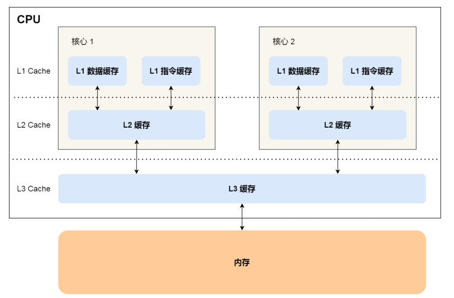
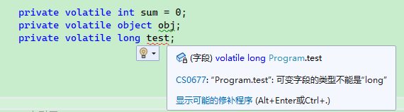

# C# 线程同步

同步（synchronization）是指==协调并发操作，得到可以预测的结果的行为==，主要用于多个线程访问同一个数据时的操作。

==如果有 N 个线程都会执行某个操作，当一个线程正在执行这个操作时，其它线程都必须依次等待，这就是线程同步。==

最简单的也是最实用的同步做法是使用任务延续（continuation）和任务组合器。延续和任务组合器将并发程序构造为异步操作，减少了对锁和信号发送的依赖。具体参考任务章节。

本文是对底层的同步结构的进行介绍。

同步结构可以分为三类：

- 排他锁：排他锁每一次只允许一个线程执行特定的活动或一段代码。它的主要目的是令线程访问共享的写状态而不互相影响。排他锁包括lock、Mutex和SpinLock。
- 非排他锁：非排他锁实现了有限的并发性。非排他锁包括Semaphore（Slim）和 ReaderWriterLock（Slim）。
- 信号发送结构：这种结构允许线程在接到一个或者多个其他线程的通知之前保持阻塞状态。信号发送结构包括ManualResetEvent（Slim）、AutoResetEvent、CountdownEvent和Barrier。前三者就是所谓的事件等待句柄（event waithandle）。

除此之外，一些结构在不使用锁的前提下也可以巧妙地处理特定的共享状态的同步操作，称为非阻塞同步结构（nonblocking synchronization construct）。它们包括Thread.MemoryBarrier、Thread.VolatileRead、Thread.VolatileWrite、volatile关键字和Interlocked类。


## 多线程竞争下的原子操作

### 竞争条件

当两个或两个以上的线程访问共享数据，并且尝试同时改变它时，就会发生争用的情况。它们所依赖的那部分共享数据，叫做竞争条件。

数据争用是竞争条件中的一种，出现竞争条件可能会导致内存(数据)损坏或者出现不确定性的行为。

### 线程同步

如果有 N 个线程都会执行某个操作，当一个线程正在执行这个操作时，其它线程都必须依次等待，这就是线程同步。

多线程环境下出现竞争条件，通常是没有执行正确的同步而导致的。

### CPU时间片和上下文切换

**时间片（timeslice）**是操作系统分配给每个正在运行的进程微观上的一段 CPU 时间。

> 首先，内核会给每个进程分配相等的初始时间片，然后每个进程轮番地执行相应的时间，当所有进程都处于时间 片耗尽的状态时，内核会重新为每个进程计算并分配时间片，如此往复。

**上下文切换（Context Switch）**，也称做进程切换或任务切换，是指 CPU 从一个进程或线程切换到另一个进程或线程。

> 在接受到中断（Interrupt）的时候，CPU 必须要进行上下文交换。进行上下文切换时，会带来性能损失。

### 阻塞

阻塞状态指==线程处于等待状态==。当线程处于阻塞状态时，会尽可能少占用 CPU 时间。

当线程从运行状态(Runing)变为阻塞状态时(WaitSleepJoin)，操作系统就会将此线程占用的 CPU 时间片分配给别的线程。当线程恢复运行状态时(Runing)，操作系统会重新分配 CPU 时间片。

分配 CPU 时间片时，会出现上下文切换。

### 内核模式和用户模式

只有操作系统才能切换线程、挂起线程，因此阻塞线程是由操作系统处理的，这种方式被称为内核模式(kernel-mode)。

`Sleep()`、`Join()` 等，都是使用内核模式来阻塞线程，实现线程同步(等待)。

==内核模式实现线程等待时，出现上下文切换。这适合等待时间比较长的操作，这样会减少大量的 CPU 时间损耗。==

如果线程只需要等待非常微小的时间，阻塞线程带来的上下文切换代价会比较大，这时我们可以使用**自旋**，来实现线程同步，这一方法称为用户模式(user-mode)。

### Interlocked 类

Interlocked 为多个线程共享的变量（简单值类型）提供原子操作。

使用 Interlocked 类 避免竞争条件，可以在不阻塞线程(lock、Monitor)的情况下，对目标对象做修改。

Interlocked 类是静态类，让我们先来看看 Interlocked 的常用方法：

| 方法              | 作用                                                         |
| ----------------- | ------------------------------------------------------------ |
| CompareExchange() | 比较两个数是否相等，如果相等，则替换第一个值。               |
| Decrement()       | 以原子操作的形式递减指定变量的值并存储结果。                 |
| Exchange()        | 以原子操作的形式，设置为指定的值并返回原始值。               |
| Increment()       | 以原子操作的形式递增指定变量的值并存储结果。                 |
| Add()             | 对两个数进行求和并用和替换第一个整数，上述操作作为一个原子操作完成。 |
| Read()            | 返回一个以原子操作形式加载的值。                             |

C# 中赋值和一些简单的数学运算不是原子操作，受多线程环境影响，可能会出现问题。

错误示例：

```csharp
static void Main(string[] args)
{
    for (int i = 0; i < 5; i++)
    {
        Thread thread = new Thread(AddOne);
        thread.Start();
    }

    Thread.Sleep(TimeSpan.FromSeconds(2));
    Console.WriteLine("sum = " + sum);
}
```

运行上述代码，每次运行的结果都不一样。这是因为多个线程使用同一个变量进行操作时，并不知道此变量已经在其它线程中发生改变，导致执行完毕后结果不符合期望。

操作值类型时，其内存位置的值会被复制到 CPU 缓存中，例如 CPU1 将 sum 值复制到 L2 中，CPU1 还没有将计算后的结果放到 L3， CPU2 读取了一个旧值，即 CPU2 发生脏读，此时 CPU1、CPU2 操作的 `int sum` 导致数据混乱。



因此，这里就需要原子操作，==在某个时刻，必须只有一个线程能够进行某个操作==。而上面的操作，指的是读取、计算、写入这一过程。

当然，我们==可以使用 lock 或者 Monitor 来解决，但是这样会带来比较大的性能损失==。这时 Interlocked 就起作用了，对于一些简单的操作运算， Interlocked 可以实现原子性的操作。

#### Interlocked.Increment()、Interlocked.Decrement()

`Interlocked.Increment()` 是递增，而 `Interlocked.Decrement()` 是递减。

```csharp
public static void AddOne()
{
    for (int i = 0; i < 100_0000; i++)
    {
        Interlocked.Increment(ref sum);
    }
}
```

#### Interlocked.Exchange()

`Interlocked.Exchange()` 实现赋值运算。这个方法有多个重载，我们找其中一个来看看：

```csharp
public static int Exchange(ref int location1, int value);
```

意思是将 value 赋给 location1 ，然后返回 location1 改变之前的值。

```csharp
static void Main(string[] args)
{
    int a = 1;
    int b = 5;

    // a 改变前为1
    int result1 = Interlocked.Exchange(ref a, 2);

    Console.WriteLine($"a新的值 a = {a}   |  a改变前的值 result1 = {result1}");

    Console.WriteLine();

    // a 改变前为 2，b 为 5
    int result2 = Interlocked.Exchange(ref a, b);

    Console.WriteLine($"a新的值 a = {a}   | b不会变化的  b = {b}   |   a 之前的值  result2 = {result2}");
}
```

#### Interlocked.CompareExchange()

其中一个重载：

```csharp
public static int CompareExchange (ref int location1, int value, int comparand)
```

比较两个 32 位有符号整数是否相等，如果相等，则替换第一个值。

如果 `comparand` 和 `location1` 中的值相等，则将 `value` 存储在 `location1`中。 否则，不会执行任何操作。

==看准了，是 `location1` 和 `comparand` 比较！==

```csharp
 static void Main(string[] args)
{
    int location1 = 1;
    int value = 2;
    int comparand = 3;

    Console.WriteLine("运行前：");
    Console.WriteLine($" location1 = {location1}    |   value = {value} |   comparand = {comparand}");

    Console.WriteLine("当 location1 != comparand 时");
    int result = Interlocked.CompareExchange(ref location1, value, comparand);
    Console.WriteLine($" location1 = {location1} | value = {value} |  comparand = {comparand} |  location1 改变前的值  {result}");

    Console.WriteLine("当 location1 == comparand 时");
    comparand = 1;
    result = Interlocked.CompareExchange(ref location1, value, comparand);
    Console.WriteLine($" location1 = {location1} | value = {value} |  comparand = {comparand} |  location1 改变前的值  {result}");
}
```

#### Interlocked.Add()

对两个 32 位整数进行求和并用和替换第一个整数，上述操作作为一个原子操作完成。

```csharp
public static int Add (ref int location1, int value);
```

只能对 int 或 long 有效。

回到第一小节的多线程求和问题，使用 `Interlocked.Add()` 来替换`Interlocked.Increment()`。

```csharp
static void Main(string[] args)
{
    for (int i = 0; i < 5; i++)
    {
        Thread thread = new Thread(AddOne);
        thread.Start();
    }

    Thread.Sleep(TimeSpan.FromSeconds(10));
    Console.WriteLine("sum = " + sum);
}
private static int sum = 0;
public static void AddOne()
{
    for (int i = 0; i < 100_0000; i++)
    {
        Interlocked.Add(ref sum,1);
    }
}
```

#### Interlocked.Read()

返回一个以原子操作形式加载的 64 位值。

64位系统上不需要 Read 方法，因为64位读取操作已是原子操作。 在32位系统上，64位读取操作不是原子操作，除非使用 Read 执行。

```csharp
public static long Read (ref long location);
```

就是说 32 位系统上才用得上。具体场景我没有找到。


### volatile 关键字

这里直接引用官方文档的解释：

`volatile` 关键字指示一个字段可以由多个同时执行的线程修改。 出于性能原因，编译器，运行时系统甚至硬件都可能重新排列对存储器位置的读取和写入。

据官方文档，`volatile` 关键字可应用于以下类型的字段：

- 引用类型。
- 指针类型（在不安全的上下文中）。 请注意，虽然指针本身可以是可变的，但是它指向的对象不能是可变的。 换句话说，不能声明“指向可变对象的指针”。
- 简单类型，如 `sbyte`、`byte`、`short`、`ushort`、`int`、`uint`、`char`、`float` 和 `bool`。
- 具有以下基本类型之一的 `enum` 类型：`byte`、`sbyte`、`short`、`ushort`、`int` 或 `uint`。
- 已知为引用类型的泛型类型参数。
- IntPtr 和 UIntPtr。

注意，volatile 只能用于引用类型或等于小于 32 位的值类型。



.NET 设计上是支持 32 位系统和 64 位系统的，而 long 类型固定是 64 位，在 32 位的系统下，CPU 寄存器执行指令时，寄存器一次只能处理 4 字节，要处理 long 类型，取内存就需要两次指令，高 4 字节和 低 4 字节是分开计算的，因此无法保证 long 的原子性。另外，在 32 位系统下，需要额外使用其它指令配合计算 long ，因此也会消耗一部分性能。

最简单的例子就是学 C 语言时，都会学到的结构体对齐。

奇怪，既然 long 、double 不行，为啥引用类型可以？

因为 `private volatile object obj;` 保存的是对象的引用地址，其地址长度跟 CPU 有关，取地址值时，只需要一次取数据指令即可。

关于 volatile 的使用方法有几个误区，第一个误区是，==volatile 不能保证数据隔离==。

踩坑代码：

```c#
private static volatile int sum = 0;
////单独执行一次，sum值为1000000
static void AddOne()
{
    for (int i = 0; i < 100_0000; i++)
    {
        sum += 1;
    }
}
static void Main(string[] args)
{
    for (int i = 0; i < 5; i++)
    {
        new Thread(AddOne).Start();
    }
    Thread.Sleep(TimeSpan.FromSeconds(10));
    Console.WriteLine("sum = " + sum);
    Console.ReadKey();
}
```

上述代码中，每调用一次AddOne()方法，sum的值都加1000000，因此启动了5个线程，期望的结果应该是5000000才对，而代码实际运行结果为，并且每次执行的结果都不一样：

```
sum = 1398807
```

原因在于：volatile 可以保证同一个字段被多个线程修改时，修改后的最新值能够被线程看到，避免发生脏读，**它无法解决多个线程同时写的问题**。==因此，千万不要简单的以为使用了volatile，就可以代替锁操作。==volatile的主要作用是：**解决多线程情况下，==一==写多读得情况。**


## Locker 和 Monitor 锁（排它锁）

### lock

lock 是 Monitor 实现的语法糖。生成的代码对比：

```c#
lock (x)
{
    // Your code...
}
```

```c#
object __lockObj = x;
bool __lockWasTaken = false;
try
{
    System.Threading.Monitor.Enter(__lockObj, ref __lockWasTaken);
    // Your code...
}
finally
{
    if (__lockWasTaken) System.Threading.Monitor.Exit(__lockObj);
}
```

lock 用于读一个引用类型进行加锁，同一时刻内只有一个线程能够访问此对象。

Lock 锁定的对象，建议使用静态的引用类型（字符串除外）。当然也可以通过类实例的成员变量，作为锁对象。

lock 示例代码：

```csharp
class Program
{
    private static object obj = new object();
    private static int sum = 0;
    static void Main(string[] args)
    {
        Thread thread1 = new Thread(Sum1);
        thread1.Start();
        Thread thread2 = new Thread(Sum2);
        thread2.Start();
        while (true)
        {
            Console.WriteLine($"{DateTime.Now.ToString()}:" + sum);
            Thread.Sleep(TimeSpan.FromSeconds(1));
        }
    }

    public static void Sum1()
    {
        sum = 0;
        lock (obj)
        {
            for (int i = 0; i < 10; i++)
            {
                sum += i;
                Console.WriteLine("Sum1");
                Thread.Sleep(TimeSpan.FromSeconds(2));
            }
        }
    }

    public static void Sum2()
    {
        sum = 0;
        lock (obj)
        {
            for (int i = 0; i < 10; i++)
            {
                sum += 1;
                Console.WriteLine("Sum2");
                Thread.Sleep(TimeSpan.FromSeconds(2));
            }
        }
    }
}
```

也可以将类自己设置为锁， 这可以防止恶意代码对公共对象采用做锁。

例如：

```csharp
  public void Access()
    {
        lock(this) {}
     }
```

注意：

- 锁可以阻止其它线程执行锁块(lock(o){})中的代码，当锁定时，其它线程必须等待锁中的线程执行完成并释放锁。但是这可能会给程序带来性能影响。
- 锁不太适合I/O场景，例如文件I/O，繁杂的计算或者操作比较持久的过程，会给程序带来很大的性能损失。

### Monitor

| 操作             | 说明                                                         |
| :--------------- | :----------------------------------------------------------- |
| Enter， TryEnter | 获取对象的锁。 此操作还标记关键节的开头。 其他任何线程都不能输入临界区，除非它使用不同的锁定对象执行临界区中的说明。 |
| Wait             | 释放对象的锁，以允许其他线程锁定并访问对象。 调用线程会等待另一个线程访问对象。 使用脉冲信号通知等待线程关于对象状态的更改。 |
| Pulse 、PulseAll | 将信号发送到一个或多个等待线程。 信号通知等待线程：锁定对象的状态已更改，锁的所有者已准备好释放该锁。 正在等待的线程置于对象的就绪队列中，因此它可能最终接收对象的锁。 线程锁定后，它可以检查对象的新状态，以查看是否已达到所需的状态。 |
| Exit             | 释放对象的锁。 此操作还标记受锁定对象保护的临界区的结尾。    |

示例一：

```csharp
private static object obj = new object();
private static bool acquiredLock = false;

public static void Test()
{
    try
    {
        Monitor.Enter(obj, ref acquiredLock);
    }
    catch { }
    finally
    {
        if (acquiredLock)
            Monitor.Exit(obj);
    }
}
```

`Monitor.Enter` 锁定 obj 这个对象，并且设置 acquiredLock 为 true，告诉别人 obj 已经被锁定。最后结束时，判断 acquiredLock ，释放锁，并设置 acquiredLock 为 false。

临界区：指被某些符号包围的范围。例如 `{}` 内。

Monitor 对象的 Enter 和 Exit 方法来标记临界区的开头和结尾。

`Enter()` 方法获取锁后，能够保证只有单个线程能够使用临界区中的代码。使用 Monitor 类，最好搭配 `try{...}catch{...}finally{...}` 来使用，因为如果获取到锁但是没有释放锁的话，会导致其它线程无限阻塞，即发生死锁。

一般来说，lock 关键字够用了。

下面示范了多个线程如何使用 Monitor 来实现锁：

```csharp
private static object obj = new object();
private static bool acquiredLock = false;
static void Main(string[] args)
{
    new Thread(Test1).Start();
    Thread.Sleep(1000);
    new Thread(Test2).Start();
}

public static void Test1()
{
    try
    {
        Monitor.Enter(obj, ref acquiredLock);
        for (int i = 0; i < 10; i++)
        {
            Console.WriteLine("Test1正在锁定资源");
            Thread.Sleep(1000);
        }
    }
    catch { }
    finally
    {
        if (acquiredLock)
            Monitor.Exit(obj);
        Console.WriteLine("Test1已经释放资源");
    }
}
public static void Test2()
{
    bool isGetLock = false;
    isGetLock = Monitor.TryEnter(obj, 500);
    if (isGetLock == false)
    {
        Console.WriteLine("锁还没有释放，我不干活了");
        return;
    }
    try
    {
        Monitor.Enter(obj, ref acquiredLock);
        for (int i = 0; i < 10; i++)
        {
            Console.WriteLine("Test2正在锁定资源");
            Thread.Sleep(1000);
        }
    }
    catch { }
    finally
    {
        if (acquiredLock)
            Monitor.Exit(obj);
        Console.WriteLine("Test2已经释放资源");
    }
}
```

如果对象已经被锁定，另一个线程使用 `Monitor.Enter` 对象，就会一直等待另一个线程解除锁定。可以通过 `Monitor.TryEnter()` 来设置等待时间，超过一段时间后，如果锁还没有释放，就会返回 false。


## 方法锁

`[MethodImpl(MethodImplOptions.Synchronized)]` 特性标记，可以让该方法只允许同时一个线程运行。

```csharp
[MethodImpl(MethodImplOptions.Synchronized)]
public void Test()
{

}
```


## 进程互斥锁：Mutex 锁（排它锁）

Mutex 中文为互斥，Mutex 类叫做互斥锁。Mutex 跟 lock 相似，但是 Mutex 支持多个进程，Mutex 大约比 lock 慢 20 倍。

互斥锁(Mutex)，用于多线程中防止两条线程同时对一个公共资源进行读写的机制，Mutex 只能在获得锁的线程中释放锁。

Mutex 只用于实现进程间的同步，它会耗费比较多的资源，进程内请考虑 Monitor/lock。

Mutex 的工作原理：

当两个或两个以上的线程同时访问共享资源时，操作系统需要一个同步机制来确保每次只有一个线程使用资源。

> Mutex 是一种同步基元，Mutex 仅向一个线程授予独占访问共享资源的权限。这个权限依据就是 互斥体，当一个线程获取到互斥体后，其它线程也在试图获取互斥体时，就会被挂起(阻塞)，直到第一个线程释放互斥体。

Windows 操作系统中，Mutex 同步对象有两个状态：

- signaled：未被任何对象拥有；
- nonsignaled：被一个线程拥有；

### Mutex类

Mutex 类其构造函数如下：

| 构造函数                        | 说明                                                         |
| ------------------------------- | ------------------------------------------------------------ |
| Mutex()                         | 使用默认属性初始化 Mutex类的新实例。                         |
| Mutex(Boolean)                  | 使用 Boolean 值（指示调用线程是否应具有互斥体的初始所有权）初始化 Mutex 类的新实例。 |
| Mutex(Boolean, String)          | 使用 Boolean 值（指示调用线程是否应具有互斥体的初始所有权以及字符串是否为互斥体的名称）初始化 Mutex 类的新实例。 |
| Mutex(Boolean, String, Boolean) | 使用可指示调用线程是否应具有互斥体的初始所有权以及字符串是否为互斥体的名称的 Boolean 值和当线程返回时可指示调用线程是否已赋予互斥体的初始所有权的 Boolean 值初始化 Mutex 类的新实例。 |

Mutex 构造函数中的 String类型参数 叫做互斥量，而互斥量是全局的操作系统对象。

构造函数中，如果为 `name` 指定 `null` 或空字符串，则将创建一个本地 Mutex 对象，只会在进程内有效。

以下述构造函数为例：

```
public Mutex (bool initiallyOwned, string name, out bool createdNew);
```

通过 new 来实例化 Mutex 类，会检查系统中此互斥量 name 是否已经被使用，如果没有被使用，则会创建 name 互斥量并且此线程拥有此互斥量的使用权；此时 `createdNew == true`。

那么 initiallyOwned ，它的作用是是否允许线程是否能够获取到此互斥量的初始化所有权。因为我们希望只有一个程序能够在后台运行，因此我们要设置为 false。

==Mutex 的 参数中，name 是非常有讲究的==。

在运行终端服务的服务器上，命名系统 mutex 可以有两个级别的可见性。

- 如果其名称以前缀 "Global\" 开头，则 mutex 在所有终端服务器会话中可见。
- 如果其名称以前缀 "Local\" 开头，则 mutex 仅在创建它的终端服务器会话中可见。 在这种情况下，可以在服务器上的其他每个终端服务器会话中存在具有相同名称的单独 mutex。

如果在创建已命名的 mutex 时未指定前缀，则采用前缀 "Local\"。 在终端服务器会话中，两个互斥体的名称只是它们的前缀不同，它们都是对终端服务器会话中的所有进程都可见。

也就是说，前缀名称 "Global\" 和 "Local\" 描述互斥体名称相对于终端服务器会话的作用域，而不是相对于进程。

请参考：

https://docs.microsoft.com/zh-cn/dotnet/api/system.threading.mutex?view=netcore-3.1#methods

https://www.cnblogs.com/suntp/p/8258488.html

Mutex 的常用方法如下：

| 方法                           | 说明                                                         |
| ------------------------------ | ------------------------------------------------------------ |
| Close()                        | 释放由当前 WaitHandle 占用的所有资源。                       |
| Dispose()                      | 释放由 WaitHandle 类的当前实例占用的所有资源。               |
| OpenExisting(String)           | 打开指定的已命名的互斥体（如果已经存在）。                   |
| ReleaseMutex()                 | 释放 Mutex一次。                                             |
| TryOpenExisting(String, Mutex) | 打开指定的已命名的互斥体（如果已经存在），并返回指示操作是否成功的值。 |
| WaitOne()                      | 阻止当前线程，直到当前 WaitHandle 收到信号。                 |
| WaitOne(Int32)                 | 阻止当前线程，直到当前 WaitHandle 收到信号，同时使用 32 位带符号整数指定时间间隔（以毫秒为单位）。 |
| WaitOne(Int32, Boolean)        | 阻止当前线程，直到当前的 WaitHandle 收到信号为止，同时使用 32 位带符号整数指定时间间隔，并指定是否在等待之前退出同步域。 |
| WaitOne(TimeSpan)              | 阻止当前线程，直到当前实例收到信号，同时使用 TimeSpan 指定时间间隔。 |
| WaitOne(TimeSpan, Boolean)     | 阻止当前线程，直到当前实例收到信号为止，同时使用 TimeSpan 指定时间间隔，并指定是否在等待之前退出同步域。 |

### Mutex 使用示例

#### 系统只能运行一个程序的实例

示例一，用于控制系统只能运行一个此程序的实例，不允许同时启动多次。

```csharp
class Program
{
    // 第一个程序
    const string name = "www.whuanle.cn";
    private static Mutex m;
    static void Main(string[] args)
    {
        // 本程序是否是 Mutex 的拥有者
        bool firstInstance;
        m = new Mutex(false,name,out firstInstance);
        if (!firstInstance)
        {
            Console.WriteLine("程序已在运行！按下回车键退出！");
            Console.ReadKey();
            return;
        }
        Console.WriteLine("程序已经启动");
        Console.WriteLine("按下回车键退出运行");
        Console.ReadKey();
        m.ReleaseMutex();
        m.Close();
        return;
    }
}
```

运行结果：


#### 接替运行

示例二，当同时点击一个程序时，只能有一个实例A可以运行，其它实例进入等待队列，等待A运行完毕后，然后继续运行队列中的下一个实例。

我们将每个程序比作一个人，模拟一个厕所坑位，每次只能有一个人上厕所，其他人需要排队等候。

使用 `WaitOne()` 方法来等待别的进程释放互斥量，即模拟排队；`ReleaseMutex()` 方法解除对坑位的占用。

```csharp
class Program
{
    // 第一个程序
    const string name = "www.whuanle.cn";
    private static Mutex m;
    static void Main(string[] args)
    {
        // wc 还有没有位置
        bool firstInstance;
        m = new Mutex(true,name,out firstInstance);

        // 已经有人在上wc
        if (!firstInstance)
        {
            // 等待运行的实例退出，此进程才能运行。
            Console.WriteLine("排队等待");
            m.WaitOne();
            GoWC();
            return;
        }
        GoWC();

        return;
    }

    private static void GoWC()
    {
        Console.WriteLine(" 开始上wc");
        Thread.Sleep(1000);
        Console.WriteLine(" 开门");
        Thread.Sleep(1000);
        Console.WriteLine(" 关门");
        Thread.Sleep(1000);
        Console.WriteLine(" xxx");
        Thread.Sleep(1000);
        Console.WriteLine(" 开门");
        Thread.Sleep(1000);
        Console.WriteLine(" 离开wc");
        m.ReleaseMutex();
        Thread.Sleep(1000);
        Console.WriteLine(" 洗手");
    }
}
```

运行效果：


上述示例中的下述代码：

```
m = new Mutex(true,name,out firstInstance);
```

一个程序结束后，要允许其它线程能够创建 Mutex 对象获取互斥量，需要将构造函数的第一个参数设置为 true。

你也可以改成 false，看看会报什么异常。

你可以使用 `WaitOne(Int32)` 来设置等待时间，单位是毫秒，超过这个时间就不排队了，去别的地方上厕所。

为了避免出现问题，请考虑在 finally 块中执行 `m.ReleaseMutex()`。

#### 进程同步示例

示例三，父进程 Parent 启动子进程 Children ，等待子进程 Children 执行完毕，子进程退出，父进程退出。

新建一个 .NET Core 控制台项目，名称为 Children，其 Progarm 中的代码如下：

```csharp
using System;
using System.Threading;

namespace Children
{
    class Program
    {
        const string name = "进程同步示例";
        private static Mutex m;
        static void Main(string[] args)
        {
            Console.WriteLine("子进程被启动...");
            bool firstInstance;

            // 子进程创建互斥体
            m = new Mutex(true, name, out firstInstance);

            // 按照我们设计的程序，创建一定是成功的
            if (firstInstance)
            {
                Console.WriteLine("子线程执行任务");
                DoWork();
                Console.WriteLine("子线程任务完成");

                // 释放互斥体
                m.ReleaseMutex();
                // 结束程序
                return;
            }
            else
            {
                Console.WriteLine("莫名其妙的异常，直接退出");
            }
        }
        private static void DoWork()
        {
            for (int i = 0; i < 5; i++)
            {
                Console.WriteLine("子线程工作中");
                Thread.Sleep(TimeSpan.FromSeconds(1));
            }
        }
    }
}
```

然后发布或生成项目，打开程序文件位置，复制线程文件路径。 创建一个新项目，名为 Parent 的 .NET Core 控制台，其 Program 中的代码如下：

```csharp
using System;
using System.Diagnostics;
using System.Threading;

namespace Parent
{
    class Program
    {
        const string name = "进程同步示例";
        private static Mutex m;
        static void Main(string[] args)
        {
            // 晚一些再执行，我录屏要对正窗口位置
            Thread.Sleep(TimeSpan.FromSeconds(3));
            Console.WriteLine("父进程启动！");

            new Thread(() =>
            {
                // 启动子进程
                Process process = new Process();
                process.StartInfo.UseShellExecute = true;
                process.StartInfo.CreateNoWindow = false;
                process.StartInfo.WorkingDirectory = @"../../../ConsoleApp9\Children\bin\Debug\netcoreapp3.1";
                process.StartInfo.FileName = @"../../../ConsoleApp9\Children\bin\Debug\netcoreapp3.1\Children.exe";
                process.Start();
                process.WaitForExit();
            }).Start();


            // 子进程启动需要一点时间
            Thread.Sleep(TimeSpan.FromSeconds(1));

            // 获取互斥体
            bool firstInstance;
            m = new Mutex(true, name, out firstInstance);

            // 说明子进程还在运行
            if (!firstInstance)
            {
                // 等待子进程运行结束
                Console.WriteLine("等待子进程运行结束");
                m.WaitOne();
                Console.WriteLine("子进程运行结束，程序将在3秒后自动退出");
                m.ReleaseMutex();
                Thread.Sleep(TimeSpan.FromSeconds(3));
                return;
            }
        }
    }
}
```

请将 Children 项目的程序文件路径，替换到 Parent 项目启动子进程的那部分字符串中。

然后启动 Parent.exe，可以观察到如下图的运行过程：


## 自旋（SpinWait）与自旋锁（SpinLock，排它锁）

线程阻塞是会耗费上下文切换的，对于过短的线程等待，这种切换的代价会比较昂贵的。在我们前面的示例中，大量使用了 `Thread.Sleep()` 和各种类型的等待方法，这其实是不合理的。

SpinWait 则提供了更好的选择。

自旋和阻塞的区别自旋与阻塞有一些细微的差别。首先，非常短暂的自旋在条件可以很快得到满足的场景（例如几微秒）下是非常高效的，因为它避免了上下文切换带来的延迟和开销。

三种常用的线程等待：

- `Thread.Sleep();` 会阻塞线程，使得线程交出时间片，然后处于休眠状态，直至被重新唤醒；适合用于长时间的等待；
- `Thread.SpinWait();` 使用了自旋等待，等待过程中会进行一些的运算，线程不会休眠，用于微小的时间等待；长时间等待会影响性能；
- `Task.Delay();` 用于异步中的等待，异步的文章后面才写，这里先不理会；

线程等待有内核模式(Kernel Mode)和用户模式(User Model)。

因为只有操作系统才能控制线程的生命周期，因此使用 `Thread.Sleep()` 等方式阻塞线程，发生上下文切换，此种等待称为内核模式。

用户模式使线程等待，并不需要线程切换上下文，而是**让线程通过执行一些无意义的运算，实现等待，也称为自旋**。自旋的意思是，没事找事做。

自旋一次消耗的时间极低，并且 `Thread.Sleep` 会出现上下文切换，而 `Thread.SpinWait` 不会。`Thread.SpinWait` 适合等待短暂的任务，实现线程同步。

`Thread.SpinWait()` 在极少数情况下，避免线程使用上下文切换很有用。

### SpinWait 

SpinWait 是结构体；Thread.SpinWait() 的原理就是 SpinWait 。

属性：

| 属性              | 说明                                                         |
| ----------------- | ------------------------------------------------------------ |
| Count             | 获取已对此实例调用 SpinOnce() 的次数。                       |
| NextSpinWillYield | 获取对 SpinOnce() 的下一次调用是否将产生处理器，同时触发强制上下文切换。 |

方法：

| 方法                      | 说明                                                     |
| ------------------------- | -------------------------------------------------------- |
| Reset()                   | 重置自旋计数器。                                         |
| SpinOnce()                | 执行单一自旋。                                           |
| SpinOnce(Int32)           | 执行单一自旋，并在达到最小旋转计数后调用 Sleep(Int32) 。 |
| SpinUntil(Func)           | 在指定条件得到满足之前自旋。                             |
| SpinUntil(Func, Int32)    | 在指定条件得到满足或指定超时过期之前自旋。               |
| SpinUntil(Func, TimeSpan) | 在指定条件得到满足或指定超时过期之前自旋。               |

`Thread.Sleep()` 会发生上下文切换，出现比较大的性能损失，如果需要等待的时间很短，那就最好使用 `Thread.SpinWait`，让线程继续占用短时间的 CPU 什么也不做，避免出现线程上下文切换。

SpinWait 实质上是（处理器）使用了非常紧密的循环，并使用 `iterations` 参数指定的循环计数。 SpinWait 等待时间取决于处理器的速度。

SpinWait 无法使你准确控制等待时间，主要是使用一些锁时用到，例如 Monitor.Enter。

### SpinLock

微软文档：提供一个相互排斥锁基元，在该基元中，尝试获取锁的线程将在重复检查的循环中等待，直至该锁变为可用为止。

SpinLock 称为自旋锁，适合用在频繁争用而且等待时间较短的场景。主要特征是避免了阻塞，不出现昂贵的上下文切换。

读写锁 ReaderWriterLock 和 ReaderWriterLockSlim ，而 ReaderWriterLockSlim 内部依赖于 SpinLock，并且比 ReaderWriterLock 快了三倍。

SpinLock 的模板如下：

```csharp
private static void DoWork()
{
    SpinLock spinLock = new SpinLock();
    bool isGetLock = false;     // 是否已获得了锁
    try
    {
        spinLock.Enter(ref isGetLock);
        // 运算
    }
    finally
    {
        if (isGetLock)
            spinLock.Exit();
    }
}
```

需要注意的是， SpinLock 实例不能共享，也不能重复使用。

### 自旋与休眠

当线程处于进入休眠状态或解除休眠状态时，会发生上下文切换，这就带来了昂贵的消耗。

而线程不断运行，就会消耗 CPU 时间，占用 CPU 资源。

对于过短的等待，应该使用自旋(spin)方法，避免发生上下文切换；过长的等待应该使线程休眠，避免占用大量 CPU 时间。

我们可以使用最为熟知的 `Sleep()` 方法休眠线程。有很多同步线程的类型，也使用了休眠手段等待线程（已经写好草稿啦）。

自旋的意思是，没事找事做。


## 信号量（Semaphore，非排它锁）

信号量有两个功能相似的实现：Semaphore 和 SemaphoreSlim。两者都可以限制同时访问某一资源或资源池的线程数，实现并发时限制具体数量的线程进行并发操作。

SemaphoreSlim 表示对可同时访问资源或资源池的线程数加以限制的 Semaphore 的轻量替代。SemaphoreSlim是在 .NET Fx4.0 引入的，它进行了一些优化以适应并行编程对低延迟的需求。

SemaphoreSlim的限制：SemaphoreSlim 不使用信号量，不支持进程间同步，只能在进程内使用。SemaphoreSlim不能用于进程间通信。

与 lock 不同的时，Semaphore 运行多个线程同时执行相同的区域代码，因此称为非排他锁。

### 信号量

信号量分为两种类型：本地信号量和命名系统信号量。

- 命名系统信号量在整个操作系统中均可见，可用于同步进程的活动。
- 局部信号量仅存在于进程内。

当 name 为 null 或者为空时，Mutex 的信号量时局部信号量，否则 Mutex 的信号量是命名系统信号量。Semaphore 的话，也是两种方式都有。

如果使用接受名称的构造函数创建 Semaphor 对象，则该对象将与该名称的操作系统信号量关联。

两个构造函数：

```csharp
Semaphore(Int32, Int32, String)
Semaphore(Int32, Int32, String, Boolean)
```

上面的构造函数可以创建多个表示同一命名系统信号量的 Semaphore 对象，并可以使用 OpenExisting 方法打开现有的已命名系统信号量。

我们上面使用的示例就是局部信号量，进程中引用本地 Semaphore 对象的所有线程都可以使用。 每个 Semaphore 对象都是单独的本地信号量。

可以利用 Semaphore 限制一个程序最多能够同时运行多少个。

### Semaphore 类

Semaphore的构造函数如下：

| 构造函数                                 | 说明                                                         |
| ---------------------------------------- | ------------------------------------------------------------ |
| Semaphore(Int32, Int32)                  | 初始化 Semaphore 类的新实例，并指定初始入口数和最大并发入口数。 |
| Semaphore(Int32, Int32, String)          | 初始化 Semaphore 类的新实例，并指定初始入口数和最大并发入口数，根据需要指定系统信号灯对象的名称。 |
| Semaphore(Int32, Int32, String, Boolean) | 初始化 Semaphore 类的新实例，并指定初始入口数和最大并发入口数，还可以选择指定系统信号量对象的名称，以及指定一个变量来接收指示是否创建了新系统信号量的值。 |

Semaphore 使用纯粹的内核时间(kernel-time)方式(等待时间很短)，并且支持在不同的进程间同步线程(像Mutex)。

以下述构造函数为例：

```
public Semaphore(int initialCount, int maximumCount);
```

- initialCount 表示一开始允许几个进程进入资源池，如果设置为0，所有线程都不能进入，要一直等资源池放通。

- maximumCount 表示最大允许几个线程进入资源池。

Semaphore 常用方法如下：

| 方法                               | 说明                                                         |
| ---------------------------------- | ------------------------------------------------------------ |
| Close()                            | 释放由当前 WaitHandle占用的所有资源。                        |
| OpenExisting(String)               | 打开指定名称为信号量（如果已经存在）。                       |
| Release()                          | 退出信号量并返回前一个计数。                                 |
| Release(Int32)                     | 以指定的次数退出信号量并返回前一个计数。                     |
| TryOpenExisting(String, Semaphore) | 打开指定名称为信号量（如果已经存在），并返回指示操作是否成功的值。 |
| WaitOne()                          | 阻止当前线程，直到当前 WaitHandle 收到信号。                 |
| WaitOne(Int32)                     | 阻止当前线程，直到当前 WaitHandle 收到信号，同时使用 32 位带符号整数指定时间间隔（以毫秒为单位）。 |
| WaitOne(Int32, Boolean)            | 阻止当前线程，直到当前的 WaitHandle 收到信号为止，同时使用 32 位带符号整数指定时间间隔，并指定是否在等待之前退出同步域。 |
| WaitOne(TimeSpan)                  | 阻止当前线程，直到当前实例收到信号，同时使用 TimeSpan 指定时间间隔。 |
| WaitOne(TimeSpan, Boolean)         | 阻止当前线程，直到当前实例收到信号为止，同时使用 TimeSpan 指定时间间隔，并指定是否在等待之前退出同步域。 |

使用 Semaphore ，有四个步骤：

1. new 实例化 Semaphore，并设置最大线程数、初始化时可进入线程数；
2. 使用 `.WaitOne();` 获取进入权限(在获得进入权限前，线程处于阻塞状态)。
3. 离开时使用 `Release()` 释放占用。
4. `Close()` 释放Semaphore 对象。

#### Semaphore 示例

简单示例：

```csharp
static void Main(string[] args)
{
    for (int i = 0; i < 5; i++)
    {
        new Thread((a) =>
        {
            Console.WriteLine(a + "想要进入资源池");
            //阻塞当前线程，直到收到信号获取到进入权限
            _sem.Wait();
            Console.WriteLine(a + "已经进入");
            Thread.Sleep((int)a * 1000);
            Console.WriteLine(a + "正在离开");
            //可以将此行代码注释看看效果
            _sem.Release();
        }).Start(i);
    }
}
```

运行结果：

```
0想要进入资源池
1想要进入资源池
0已经进入
0正在离开
4想要进入资源池
4已经进入
1已经进入
2想要进入资源池
2已经进入
3想要进入资源池
1正在离开
3已经进入
2正在离开
4正在离开
3正在离开
```

示例二，采用多个线程执行计算，但是只允许最多三个线程同时执行运行。

```csharp
class Program
    {
        // 求和
        private static int sum = 0;
        private static Semaphore _pool;

        // 判断十个线程是否结束了。
        private static int isComplete = 0;
        // 第一个程序
        static void Main(string[] args)
        {
            Console.WriteLine("执行程序");

            // 设置允许最大三个线程进入资源池
            // 一开始设置为0，就是初始化时允许几个线程进入
            // 这里设置为0，后面按下按键时，可以放通三个线程
            _pool = new Semaphore(0, 3);
            for (int i = 0; i < 10; i++)
            {
                Thread thread = new Thread(new ParameterizedThreadStart(AddOne));
                thread.Start(i + 1);
            }
            Console.ForegroundColor = ConsoleColor.Red;
            Console.WriteLine("任意按下键(不要按关机键)，可以打开资源池");
            Console.ForegroundColor = ConsoleColor.White;
            Console.ReadKey();

            // 准许三个线程进入
            _pool.Release(3);

            // 这里没有任何意义，就单纯为了演示查看结果。
            // 等待所有线程完成任务
            while (true)
            {
                if (isComplete >= 10)
                    break;
                Thread.Sleep(TimeSpan.FromSeconds(1));
            }
            Console.WriteLine("sum = " + sum);

            // 释放池
            _pool.Close();

        }

        public static void AddOne(object n)
        {
            Console.WriteLine($"    线程{(int)n}启动，进入队列");
            // 进入队列等待
            _pool.WaitOne();
            Console.WriteLine($"第{(int)n}个线程进入资源池");
            // 进入资源池
            for (int i = 0; i < 10; i++)
            {
                Interlocked.Add(ref sum, 1);
                Thread.Sleep(TimeSpan.FromMilliseconds(500));
            }
            // 解除占用的资源池
            _pool.Release();
            isComplete += 1;
            Console.WriteLine($"                     第{(int)n}个线程退出资源池");
        }
    }
```

运行效果：


`Release()` 表示退出信号量并返回前一个计数。这个计数指的是资源池还可以进入多少个线程。

可以看一下下面的示例：

```csharp
private static Semaphore _pool;
static void Main(string[] args)
{
    _pool = new Semaphore(0, 5);
    _pool.Release(5);
    new Thread(AddOne).Start();
    Thread.Sleep(TimeSpan.FromSeconds(10));
    _pool.Close();
}

public static void AddOne()
{
    _pool.WaitOne();
    Thread.Sleep(1000);
    int count = _pool.Release();
    Console.WriteLine("在此线程退出资源池前，资源池还有多少线程可以进入？" + count);
}
```


### SemaphoreSlim 类

SemaphoreSlim 表示对可同时访问资源或资源池的线程数加以限制的 Semaphore 的轻量替代。

SemaphoreSlim 不使用信号量，不支持进程间同步，只能在进程内使用。

它有两个构造函数：

| 构造函数                    | 说明                                                         |
| --------------------------- | ------------------------------------------------------------ |
| SemaphoreSlim(Int32)        | 初始化 SemaphoreSlim 类的新实例，以指定可同时授予的请求的初始数量。 |
| SemaphoreSlim(Int32, Int32) | 初始化 SemaphoreSlim 类的新实例，同时指定可同时授予的请求的初始数量和最大数量。 |

我们改造一下前面 Semaphore 中的示例：

```csharp
    class Program
    {
        // 求和
        private static int sum = 0;
        private static SemaphoreSlim _pool;

        // 判断十个线程是否结束了。
        private static int isComplete = 0;
        static void Main(string[] args)
        {
            Console.WriteLine("执行程序");

            // 设置允许最大三个线程进入资源池
            // 一开始设置为0，就是初始化时允许几个线程进入
            // 这里设置为0，后面按下按键时，可以放通三个线程
            _pool = new SemaphoreSlim(0, 3);
            for (int i = 0; i < 10; i++)
            {
                Thread thread = new Thread(new ParameterizedThreadStart(AddOne));
                thread.Start(i + 1);
            }

            Console.WriteLine("任意按下键(不要按关机键)，可以打开资源池");
            Console.ReadKey();
            // 
            _pool.Release(3);

            // 这里没有任何意义，就单纯为了演示查看结果。
            // 等待所有线程完成任务
            while (true)
            {
                if (isComplete >= 10)
                    break;
                Thread.Sleep(TimeSpan.FromSeconds(1));
            }
            Console.WriteLine("sum = " + sum);
            // 释放池
        }

        public static void AddOne(object n)
        {
            Console.WriteLine($"    线程{(int)n}启动，进入队列");
            // 进入队列等待
            _pool.Wait();
            Console.WriteLine($"第{(int)n}个线程进入资源池");
            // 进入资源池
            for (int i = 0; i < 10; i++)
            {
                Interlocked.Add(ref sum, 1);
                Thread.Sleep(TimeSpan.FromMilliseconds(200));
            }
            // 解除占用的资源池
            _pool.Release();
            isComplete += 1;
            Console.WriteLine($"                     第{(int)n}个线程退出资源池");
        }
    }
```

SemaphoreSlim 不需要 `Close()`。

两者在代码上的区别是就这么简单。

### SemaphoreSlim 与 Semaphore 的区别

如果使用下面的构造函数实例化 Semaphore(参数name不能为空)，那么**创建的对象在整个操作系统内都有效**。

```csharp
public Semaphore (int initialCount, int maximumCount, string name);
```

Semaphorslim 则只在进程内有效，SemaphoreSlim 是对 Semaphore 的简单封装。

SemaphoreSlim 类不会对 `Wait`、`WaitAsync` 和 `Release` 方法的调用强制执行线程或任务标识。

而 Semaphor 类，会对此进行严格监控，如果对应调用数量不一致，会出现异常。

此外，如果使用 SemaphoreSlim(Int32 maximumCount) 构造函数来实例化 SemaphoreSlim 对象，获取其 CurrentCount 属性，其值可能会大于 maximumCount。 编程人员应负责确保调用一个 Wait 或 WaitAsync 方法，便调用一个 Release。

这就好像笔筒里面的笔，没有监控，使用这使用完毕后，都应该将笔放进去。如果原先有10支笔，每次使用不放进去，或者将别的地方的笔放进去，那么最后数量就不是10了。因此使用时需要注意捕获异常，合理释放锁。


## 读写锁（ReaderWriterLockSlim，非排它锁）

当某个资源的读操作很多，但写操作很少，此时可以使用读写锁，来最大限度的保证锁的可用性。

ReaderWriterLockSlim 是在 .NET Fx3.5 中引入的，它替代了笨重的ReaderWriterLock类，ReaderWriterLock 和 ReaderWriterLockSlim 具有相似的功能，但是ReaderWriterLock的执行速度更慢，并且本身存在一些锁升级处理机制的设计缺陷。因此实际使用中，应该采用ReaderWriterLockSlim。

与常规的lock（Monitor.Enter/Exit）相比，ReaderWriterLockSlim的执行速度任然慢很多，但是它可以在==大量的读操作和少量写操作==的环境下减少锁竞争。

ReaderWriterLockSlim 和ReaderWriterLock都拥有两种基本的锁，即读锁和写锁：

- 写锁是全局排它锁
- 读锁可以兼容其他的读锁

因此，==一个持有写锁的线程，将阻塞其他任何视图获取读锁或写锁的线程（反之亦然）。但是，如果没有任何线程持有写锁的话，那么其他任意数量的线程都可以并发获得读锁==。

### ReaderWriterLockSlim类

| 方法                                  | 说明                                                         |
| ------------------------------------- | ------------------------------------------------------------ |
| EnterReadLock()                       | 尝试进入读取模式锁定状态。                                   |
| EnterUpgradeableReadLock()            | 尝试进入可升级模式锁定状态。                                 |
| EnterWriteLock()                      | 尝试进入写入模式锁定状态。                                   |
| ExitReadLock()                        | 减少读取模式的递归计数，并在生成的计数为 0（零）时退出读取模式。 |
| ExitUpgradeableReadLock()             | 减少可升级模式的递归计数，并在生成的计数为 0（零）时退出可升级模式。 |
| ExitWriteLock()                       | 减少写入模式的递归计数，并在生成的计数为 0（零）时退出写入模式。 |
| TryEnterReadLock(Int32)               | 尝试进入读取模式锁定状态，可以选择整数超时时间。             |
| TryEnterReadLock(TimeSpan)            | 尝试进入读取模式锁定状态，可以选择超时时间。                 |
| TryEnterUpgradeableReadLock(Int32)    | 尝试进入可升级模式锁定状态，可以选择超时时间。               |
| TryEnterUpgradeableReadLock(TimeSpan) | 尝试进入可升级模式锁定状态，可以选择超时时间。               |
| TryEnterWriteLock(Int32)              | 尝试进入写入模式锁定状态，可以选择超时时间。                 |
| TryEnterWriteLock(TimeSpan)           | 尝试进入写入模式锁定状态，可以选择超时时间。                 |

`EnterReadLock()` / `TryEnterReadLock` 和 `ExitReadLock()` 成对出现。

`EnterWriteLock()` / `TryEnterWriteLock()` 和 `ExitWriteLock()` 成对出现。

`EnterUpgradeableReadLock()` 进入可升级的读模式锁定状态。

`EnterReadLock()` 使用 `EnterUpgradeableReadLock()` 进入升级状态，在恰当时间点 通过 `EnterWriteLock()` 进入写模式。（也可以倒过来）

ReaderWriterLockSlim 的读、写入锁模板如下：

```csharp
private static ReaderWriterLockSlim toolLock = new ReaderWriterLockSlim();

// 读
private T Read()
{
    try
    {
        toolLock.EnterReadLock();           // 获取读取锁
        return obj;
    }
    catch { }
    finally
    {
        toolLock.ExitReadLock();            // 释放读取锁
    }
    return default;
}

// 写
public void Write(int key, int value)
{
    try
    {
        //可升级锁只出现在写操作中，目的是为了在同一个原子操作中将读锁转换为写锁。
        toolLock.EnterUpgradeableReadLock();

        try
        {
            toolLock.EnterWriteLock();
            // 
        }
        catch{}
        finally
        {
            toolLock.ExitWriteLock();
        }
    }
    catch { }
    finally
    {
        toolLock.ExitUpgradeableReadLock();
    }
}
```

注意：可升级锁只出现在写操作中，目的是为了在同一个原子操作中将读锁转换为写锁。

可升级锁和读锁的区别：

虽然可升级锁可以和任意数目的读锁并存，但是一次只能获取一个可升级锁。这可以将锁的升级竞争序列化从而避免在升级中出现死锁。

### ReaderWriterLockSlim 的使用示例

下述示例，来自于《C#7.0 核心技术指南》，三个线程将持续读取列表中的元素，另外两个线程每隔100毫秒生成一个随机数写入到列表中：

```c#
internal class Program
{
    static ReaderWriterLockSlim _rw = new ReaderWriterLockSlim();
    static List<int> _items = new List<int>();
    static Random _rand = new Random();

    static void Read()
    {
        while (true)
        {
            _rw.EnterReadLock();
            foreach (int i in _items) Thread.Sleep(10);
            _rw.ExitReadLock();
        }
    }

    static void Write(object threadID)
    {
        while (true)
        {
            int newNumber = GetRandNum(100);
            //升级锁，实现在一个原子操作中奖读锁转换为写锁
            _rw.EnterUpgradeableReadLock();
            //获取写入锁
            _rw.EnterWriteLock();
            _items.Add(newNumber);
            //释放写入锁
            _rw.ExitWriteLock();
            Console.WriteLine("Thread " + threadID + " added " + newNumber);
            //释放升级锁
            _rw.ExitUpgradeableReadLock();
            Thread.Sleep(100);
        }
    }

    static int GetRandNum(int max) { lock (_rand) return _rand.Next(max); }

    private static void Main(string[] args)
    {
        new Thread(Read).Start();
        new Thread(Read).Start();
        new Thread(Read).Start();

        new Thread(Write).Start("A");
        new Thread(Write).Start("B");
    }
}
```


## 自动线程通知（AutoRestEvent ，信号发送结构）


## 手动线程通知（ManualResetEvent，信号发送结构）


## 线程完成数（CountdownEvent，信号发送结构）


## 并行协调（Barrier ，信号发送结构）


