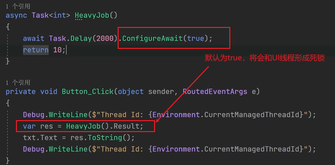

# C# Task

任务表示将完成的某个工作单元。这个工作单元可以在单独的线程中运行，也可以以同步方式启动一个任务，这需要等待**主调线程**。使用任务不仅可以获得一个抽象层，还可以对底层线程进行很多控制。因此，对于复杂的并行处理，为了更好的控制并行操作，优先使用`Task`类。

现代异步编程的核心是`Task` 和 `Task<T>` 对象，用来代替直接使用线程池的编码。


## 创建 Task

Task有三种创建方式：

- new Task() 
- Task.Factory.StartNew()
- Task.Run()

要获取任务返回结果，要使用泛型类或方法创建任务，例如 `Task<Tresult>`、`Task.Factory.StartNew<TResult>()`、`Task.Run<TResult>`。通过 其泛型的 的 `Result` 属性，可以获得返回结果。(不建议使用Result，有可能造成死锁)

### 构造函数创建

通过其构造函数创建一个任务，其构造函数定义为：

```csharp
public Task (Action action);
```

不传递参数：

```csharp
// 1.使用构成函数实例化一个task
var task = new Task(() =>
{
    Console.WriteLine($"当前任务的线程的ID：{Environment.CurrentManagedThreadId}");
});
task.Start();
Console.WriteLine($"task.id={task.Id}，task.status={task.Status}");

task.Wait();
Console.WriteLine($"task.id={task.Id}，task.status={task.Status}");

```

传递参数：

```csharp
var task2 = new Task((obj) =>
{
    Console.WriteLine($"当前任务的线程的ID：{Environment.CurrentManagedThreadId}，传入的值为：{obj}");
},"张三");
// 同步运行，只有任务运行完成之后，才会输出后续内容
task2.RunSynchronously(); // 等待任务的完成，类似于wait操作

Console.WriteLine($"task.id={task2.Id}，task.status={task2.Status}");
```

`.Start()` 方法用于启动一个任务。微软文档解释：启动 Task，并将它安排到当前的 TaskScheduler 中执行。


### Task.Factory.StartNew()

使用 `Task.Factory`属性用于创建和配置 `Task` 和 `Task<TResult>` 实例的工厂方法。

通过 `Task.Factory.StartNew()` 方法添加的任务，会进入线程池任务队列然后自动执行，不需要手动启动。

无参数：

```csharp
var task3 = Task.Factory.StartNew(()=> {
    Console.WriteLine($"当前任务的线程的ID：{Environment.CurrentManagedThreadId}");
});
task3.Wait();
Console.WriteLine($"task.id={task3.Id}，task.status={task3.Status}");
```

传递参数：

```csharp
var task4 = Task.Factory.StartNew((obj) => {
    Console.WriteLine($"当前任务的线程的ID：{Environment.CurrentManagedThreadId}，传入的值为：{obj}");
},"张三");
Console.WriteLine($"task.id={task4.Id}，task.status={task4.Status}");
```

使用TaskCreationOptions：

```csharp
Task.Factory.StartNew(() =>
{
    Console.WriteLine("① 开始执行");
    Thread.Sleep(TimeSpan.FromSeconds(1));

    Console.WriteLine("① 执行中");
    Thread.Sleep(TimeSpan.FromSeconds(1));

    Console.WriteLine("① 执行即将结束");
},TaskCreationOptions.LongRunning);
```


### Task.Run()

Task.Run适用于不需要传递参数的场景，功能最简单。

```csharp
var task5 = Task.Run(()=> {
    Console.WriteLine($"当前任务的线程的ID：{Environment.CurrentManagedThreadId}");
});
```


### 使用线程池的任务

下述示例提供了验证创建的Task是否使用的是线程池中的线程的代码。

首先定义如下两个方法，用来记录任务和线程信息：

```c#
private static object s_logLock = new object();
public static void Log(string title)
{
    //使用lock可以让其他方法并行调用Log()，避免lock内的代码被多个线程或任务交叉调用
    lock (s_logLock)
    {
        Console.WriteLine(title);
        Console.WriteLine($"Task ID:{Task.CurrentId?.ToString() ?? "没有Task存在"}，Thread ID：{ Thread.CurrentThread.ManagedThreadId}");
        //如果不是.NET Core 1.0运行库就执行该语句
        #if (!DNXCORE)
            Console.WriteLine("是否是线程池线程：" + Thread.CurrentThread.IsThreadPoolThread);
        #endif
        Console.WriteLine("是否是后台线程：" + Thread.CurrentThread.IsBackground);
        Console.WriteLine();
    }
}
//使用Task需要传入Action<object>委托，所以此处定义的方法的参数为Object类型
public static void TaskMethod(object obj)
{
    Log(obj?.ToString());
}
```

线程池提供了一个后台线程的池，它独自管理线程，可以根据需要增加或减少线程池中的线程数。线程池中的线程用于实现一些操作，之后仍然返回线程池中。

创建任务的4种方式：

1. 实例化`TaskFactory`类，并调用该实例的`StartNew()`方法。
2. 使用`Task`类的静态属性`Factory`来访问`TaskFactory`，以及调用`StartNew()`方法。它和第一种方式类似，但是没有第一种控制起来那么全面。
3. 使用`Task`类的构造函数，实例化Task对象。实例化时，任务不会立即运行，而是指定`Created`状态，接着调用`Task`类的`Start()`方法，来启动任务。
4. 调用`Task`类的`Run()`静态方法，立即启动任务。虽然`Run()`方法没有可以传递`Action<object>`委托的重载版本，但是可以通过传递`Action`类型的lambda表达式并在其实现中使用参数，可以模拟这种行为。

下面分别对这四种方式进行实现，示例如下：

```c#
public static void TasksUsingThreadPool()
{
    Task t1 = new TaskFactory().StartNew(TaskMethod, "使用TaskFactory实例化形式创建任务");
    Task t2 = Task.Factory.StartNew(TaskMethod, "使用Task的Factory属性形式创建任务");
    Task t3 = new Task(TaskMethod, "使用Task构造函数并调用实例的Start()形式创建任务");
    t3.Start();
    Task t4 = Task.Run(() => { TaskMethod("使用Task.Run()形式创建任务"); });
}
```

调用上述方法代码如下：

```c#
TaskDemo.TasksUsingThreadPool();
Console.WriteLine("-----程序执行完毕-----");
Console.Read();
```

执行结果如下所示：

```
-----程序执行完毕-----
使用Task的Factory属性形式创建任务
Task ID：1，Thread ID：3
是否是线程池线程：True
是否是后台线程：True

使用Task构造函数并调用实例的Start()形式创建任务
Task ID：2，Thread ID：4
是否是线程池线程：True
是否是后台线程：True

使用TaskFactory实例化形式创建任务
Task ID：3，Thread ID：6
是否是线程池线程：True
是否是后台线程：True

使用Task.Run()形式创建任务
Task ID：4，Thread ID：5
是否是线程池线程：True
是否是后台线程：True

```

上述通过结果可以看到，在输出了“程序执行完毕”之后，才执行创建的任务，并且使用了不同的线程。

而任务不一定要使用线程池中的线程，也可以使用其他线程。任务也可以同步运行，以相同的线程作为主调线程。如下所示：

```c#
public static void RunSynchronousTask()
{
    TaskMethod("主线程运行");
    var t1 = new Task(TaskMethod, "同步调用");
    //同步运行Task
    t1.RunSynchronously();
}
```

这里调用了`Task`的`RunSynchronously()`方法，输出结果如下：

```
主线程运行
Task ID：没有Task存在，Thread ID：1
是否是线程池线程：False
是否是后台线程：False

同步调用
Task ID：1，Thread ID：1
是否是线程池线程：False
是否是后台线程：False

-----程序执行完毕-----
```

在代码中，`TaskMethod()`方法首先在主线程上直接调用，然后在新创建的`Task`上调用，通过输出结果可以看出，主线程没有任务ID，也不是线程池中的线程。当调用`RunSynchronously()`方法后，会使用相同的线程作为主调线程，如果以前没有创建任务，就会创建一个新任务。

> 注意：在新的.net core运行库中，主线程是一个后台线程？？？

#### 使用单独线程的任务

如果任务的代码将长时间运行，就应该使用`TaskCreationOptions.LongRunning`告诉任务调度器创建一个新线程，而不是使用线程池中的线程。此时，线程可以不由线程池管理。当线程来自线程池时，任务调度器可以决定等待已经运行的任务完成，然后使用这个线程，而不是在线程池中创建一个新线程。

```c#
public static void LongRunningTask()
{
    var t1 = new Task(TaskMethod, "long runing", TaskCreationOptions.LongRunning);
    t1.Start();
}
```

执行结果如下：

```
-----程序执行完毕-----
long runing
Task ID：1，Thread ID：3
是否是线程池线程：False
是否是后台线程：True
```

使用`TaskCreationOptions.LongRunning`选项时，不会使用线程池中的线程，而是会创建一个新线程


## 取消 Task

取消任务常常应用于长时间运行的后台任务。对于取消任务，.NET提供了一种标准的机制。这种机制可用于基于任务的异步模式。

> 取消框架基于协助行为，不是强制性的。一个运行时间很长的任务需要检查自己是否被取消，在这种情况下，它的工作就是清理所有已打开的资源，并结束相关工作。

如果要取消Task，需要使用如下的构造函数创建Task，传入取消令牌。

```c#
public Task StartNew(Action action, CancellationToken cancellationToken);
```

取消基于[`CancellationTokenSource`](https://docs.microsoft.com/zh-cn/dotnet/api/system.threading.cancellationtokensource?view=netframework-4.7.2_)类，该类用于发送取消请求。请求发送给引用[`CancellationToken`](https://docs.microsoft.com/zh-cn/dotnet/api/system.threading.cancellationtoken?view=netframework-4.7.2)结构类的任务，其中`CancellationToken`结构与`CancellationTokenSource`类相关联。

`CancellationTokenSource`类还支持在指定时间后才取消任务。[`CancelAfter`](https://docs.microsoft.com/zh-cn/dotnet/api/system.threading.cancellationtokensource.cancelafter?view=netframework-4.7.2#System_Threading_CancellationTokenSource_CancelAfter_System_TimeSpan_)方法传入一个时间值，单位是毫秒，在该时间过后，就取消任务。

可以将`CancellationToken`传入异步方法，框架中的某些异步方法提供可以传入`CancellationToken`的重载版本，来支持取消任务。一旦取消，就会清理资源，之后抛出异常。

~~【注：取消任务之后，都会抛出异常，可以通过调试的方式，在catch块中进行捕获对应的异常信息。】（待验证）~~

简单的取消操作，示例一：

```csharp
static void Run(CancellationToken token) {
    int i = 1;
    while (!token.IsCancellationRequested) {
        Console.WriteLine("正在执行..."+(++i));
        Thread.Sleep(1000);
    }
}

static void Sample1() {
    CancellationTokenSource cts = new CancellationTokenSource();
	// 启动一个任务
   var task=  Task.Factory.StartNew(() => {
        Run(cts.Token);
    });

    // 当在控制台输入ctrl+c是触发
    Console.CancelKeyPress += (sender, e) => {
        cts.Cancel();
        task.Wait(); //此处Wait调用必不可少，在其他任务（这里是事件）中进行了取消操作，必须在该任务中等待取消的任务完成。
    };
    // 此处wait()的调用也必不可少
    task.Wait();
    Console.WriteLine("执行完成！");
    Console.Read();
}
```

重点在于执行了Cancel()调用后，要等待要取消的任务执行完成，否则后续操作将会受影响。

示例二，任务A执行完再执行任务B，当执行任务A时，取消任务B的执行：

```csharp
static void Sample2() {

    CancellationTokenSource source = new CancellationTokenSource();
    // 启动任务A
    var task = Task.Factory.StartNew(() => {
        for (int i = 0; i < 5; i++) {
            Console.WriteLine($"启动了任务A，当前线程：{Environment.CurrentManagedThreadId}，{DateTime.Now}，执行时间需要5秒");
            Thread.Sleep(1000);
        }
    })
    // 任务A执行完，继续执行任务B
    .ContinueWith(t => {
        Console.WriteLine($"任务B，当前线程：{Environment.CurrentManagedThreadId},我是延续任务");
    }, source.Token);

    Thread.Sleep(3000);
    // 暂停三秒后取消任务B的执行，任务A仍然会执行完成
    source.Cancel();
    // 或者直接使用CancelAfter方法
    //source.CancelAfter(3000); // 在3秒后执行取消操作
    
    Console.WriteLine("主线程要取消你了...");
    Console.ReadLine();
}
```

### Task.FromCanceled()

微软文档解释：创建 Task，它因指定的取消标记进行的取消操作而完成。

这里笔者抄来了一个[示例](https://stackoverflow.com/questions/25510766/how-to-create-a-cancelled-task)：

```csharp
var token = new CancellationToken(true);
Task task = Task.FromCanceled(token);
Task<int> genericTask = Task.FromCanceled<int>(token);
```

网上很多这样的示例，但是，这个东西到底用来干嘛的？new 就行了？

带着疑问我们来探究一下，来个示例：

```csharp
        public static Task Test()
        {
            CancellationTokenSource source = new CancellationTokenSource();
            source.Cancel();
            return Task.FromCanceled<object>(source.Token);
        }
        static void Main()
        {
            var t = Test();    // 在此设置断点，监控变量
            Console.WriteLine(t.IsCanceled);
         }
```

`Task.FromCanceled()` 可以构造一个被取消的任务。我找了很久，没有找到很好的示例，如果一个任务在开始前就被取消，那么使用 `Task.FromCanceled()` 是很不错的。


### 如何在内部取消任务

使用 `CancellationToken` 取消令牌传递参数，使任务取消。但是都是从外部传递的，这里来实现无需 `CancellationToken` 就能取消任务。

我们可以使用 `CancellationToken` 的 `ThrowIfCancellationRequested()` 方法抛出 `System.OperationCanceledException` 异常，然后终止任务，任务会变成取消状态，不过任务需要先传入一个令牌。

示例如下：

```csharp
/// <summary>
/// 能够完成多个任务的异步类型
/// </summary>
public class MyTaskClass
{
    private List<Action> _actions = new List<Action>();
    private CancellationTokenSource _source = new CancellationTokenSource();
    private CancellationTokenSource _sourceBak = new CancellationTokenSource();
    private Task _task;

    /// <summary>
    ///  添加一个任务
    /// </summary>
    /// <param name="action"></param>
    public void AddTask(Action action)
    {
        _actions.Add(action);
    }

    /// <summary>
    /// 开始执行任务
    /// </summary>
    /// <returns></returns>
    public Task StartAsync()
    {
        // _ = new Task() 对本示例无效
        _task = Task.Factory.StartNew(() =>
         {
             for (int i = 0; i < _actions.Count; i++)
             {
                 int tmp = i;
                 Console.WriteLine($"第 {tmp} 个任务");
                 if (_source.Token.IsCancellationRequested)
                 {
                     Console.ForegroundColor = ConsoleColor.Red;
                     Console.WriteLine("任务已经被取消");
                     Console.ForegroundColor = ConsoleColor.White;
                     _sourceBak.Cancel();
                     //此处抛出异常
                     _sourceBak.Token.ThrowIfCancellationRequested();
                 }
                 _actions[tmp].Invoke();
             }
         },_sourceBak.Token);
        return _task;
    }

    /// <summary>
    /// 取消任务
    /// </summary>
    /// <returns></returns>
    public Task Cancel()
    {
        _source.Cancel();

        // 这里可以省去
        _task = Task.FromCanceled<object>(_source.Token);
        return _task;
    }
}
```

Main 方法中：

```csharp
static void Main()
{
    // 实例化任务类
    MyTaskClass myTask = new MyTaskClass();

    for (int i = 0; i < 10; i++)
    {
        int tmp = i;
        myTask.AddTask(() =>
        {
            Console.WriteLine("     任务 1 Start");
            Thread.Sleep(TimeSpan.FromSeconds(1));
            Console.WriteLine("     任务 1 End");
            Thread.Sleep(TimeSpan.FromSeconds(1));
        });
    }

    // 相当于 Task.WhenAll()
    Task task = myTask.StartAsync();
    Thread.Sleep(TimeSpan.FromSeconds(1));
    Console.WriteLine($"任务是否被取消：{task.IsCanceled}");

    // 取消任务
    Console.ForegroundColor = ConsoleColor.Red;
    Console.WriteLine("按下任意键可以取消任务");
    Console.ForegroundColor = ConsoleColor.White;
    Console.ReadKey();

    var t = myTask.Cancel();    // 取消任务
    Thread.Sleep(TimeSpan.FromSeconds(2));
    Console.WriteLine($"任务是否被取消：【{task.IsCanceled}】");

    Console.ReadKey();
}
```

你可以在任一阶段取消任务。

示例二，同样抛出异常：

```csharp
public static void CancelTask()
{
    var cts = new CancellationTokenSource();
    cts.Token.Register(() => { Console.WriteLine("--- task cancelled"); });

    cts.CancelAfter(500);
    try
    {
        Task t1 = Task.Run(() =>
        {
            Console.WriteLine("in task");
            for (int i = 0; i < 20; i++)
            {
                Task.Delay(100).Wait();
                CancellationToken token = cts.Token;
                //是否请求了取消
                if (token.IsCancellationRequested)
                {
                    Console.WriteLine("得到取消请求");
                    //执行取消并直接抛出异常
                    token.ThrowIfCancellationRequested();
                    break;
                }
                Console.WriteLine("in loop");
            }
            Console.WriteLine("任务完成，没有取消");
        }, cts.Token); //把取消标记赋予TaskFactory

        t1.Wait();
    }
    catch (AggregateException ex)
    {
        Console.WriteLine($"异常：{ex.GetType().Name},{ex.Message}");
        foreach (var innerException in ex.InnerExceptions)
        {
            Console.WriteLine($"异常详情：{ex.InnerException.GetType()}, {ex.InnerException.Message}");
        }
    }
}
```

上述示例中，一旦取消任务，会抛出`TaskCanceledException`异常，它是从方法调用`ThrowifCancellationRequested()`中启动的。调用者等待任务时，会捕获`AggregateException`异常，它包含内部异常`TaskCanceledException`。

如果在一个也被取消的任务中运行`Parallel.For()`方法，这就可以用于取消的层次结构，任务的最终状态是`Canceled`。

上述示例执行结果：

```
in task
in loop
in loop
in loop
in loop
--- task cancelled
得到取消请求
异常：AggregateException,发生一个或多个错误。
异常详情：System.Threading.Tasks.TaskCanceledException, 已取消一个任务。
-----程序执行完毕-----
```


### 延迟取消与注册取消通知

#### 延迟取消

延迟取消调用的是source.Cancel()方法。上诉代码中，在执行任务B时，会检测source.Token，当发现已取消时，将不再执行。

```
Thread.Sleep(3000);
source.Cancel();
```

可以直接用下述代码替代：

```csharp
source.CancelAfter(3000); // 在3秒后执行取消操作
```

详细代码见下文。

#### 注册取消通知

核心在于调用source.Token.Register()方法。

综合示例：

```csharp
static void Sample2() {

    CancellationTokenSource source = new CancellationTokenSource();
    // 启动任务A
    var task = Task.Factory.StartNew(() => {
        for (int i = 0; i < 5; i++) {
            Console.WriteLine($"启动了任务A，当前线程：{Environment.CurrentManagedThreadId}，{DateTime.Now}，执行时间需要5秒");
            Thread.Sleep(1000);
        }
        
    })
    // 任务A执行完，继续执行任务B
    .ContinueWith(t => {
        Console.WriteLine($"任务B，当前线程：{Environment.CurrentManagedThreadId},我是延续任务");
    }, source.Token);

    //Thread.Sleep(3000);
    //// 暂停三秒后取消任务B的执行，任务A仍然会执行完成
    //source.Cancel();

    source.CancelAfter(3000); // 在3秒后执行取消操作
    //取消回调
    source.Token.Register(() => {
        Console.WriteLine("取消啦，我是回调函数！");
    });

    Console.WriteLine("主线程要取消你了...");
    Console.ReadLine();
}
```


## 父子 Task

父任务和子任务是由TaskCreationOptions来指定的，与父子任务相关的TaskCreationOptions枚举值如下：

| 枚举             | 值   | 说明                                                         |
| ---------------- | ---- | ------------------------------------------------------------ |
| AttachedToParent | 4    | 指定将任务附加到任务层次结构中的某个父级。                   |
| DenyChildAttach  | 8    | 指定任何尝试作为附加的子任务执行的子任务都无法附加到父任务，会改成作为分离的子任务执行。 |

注意，子任务使用了 TaskCreationOptions.AttachedToParent ，并不是指父任务要等待子任务完成后，父任务才能继续完往下执行；而是指父任务如果先执行完毕，那么必须等待子任务完成后，父任务才算完成。

而 `TaskCreationOptions.DenyChildAttach` 则不允许其它任务附加到外层任务中。

先看看非父子任务下，外层任务不会等待内嵌的任务完成，直接完成或返回结果：

```C#
static void Main()
{
    //两个任务没有从属关系，是独立的
    Task<int> task = new Task<int>(() =>
    {
        // 非子任务
        Task task1 = new Task(() =>
        {
            Thread.Sleep(TimeSpan.FromSeconds(1));
            for (int i = 0; i < 5; i++)
            {
                Console.WriteLine("     内层任务1");
                Thread.Sleep(TimeSpan.FromSeconds(0.5));
            }
        });
        task1.Start();
        return 666;
    });
    task.Start();
    Console.WriteLine($"任务运算结果是：{task.Result}");
    Console.WriteLine("\n-------------------\n");
    Console.ReadKey();
}
```

使用`TaskCreationOptions.AttachedToParent`实现父子任务，父任务等待子任务完成后，才能算完成任务，然后返回结果：

```csharp
 static void Main()
{
    // 父子任务
    Task<int> task = new Task<int>(() =>
    {
        // 子任务
        Task task1 = new Task(() =>
        {
            Thread.Sleep(TimeSpan.FromSeconds(1));
            for (int i = 0; i < 5; i++)
            {
                Console.WriteLine("     内层任务1");
                Thread.Sleep(TimeSpan.FromSeconds(0.5));
            }
        }, TaskCreationOptions.AttachedToParent);
        task1.Start();

        Console.WriteLine("最外层任务");
        return 666;
    });

    task.Start();
    Console.WriteLine($"任务运算结果是：{task.Result}");
    Console.WriteLine("\n-------------------\n");

    Console.ReadKey();
}
```

而 `TaskCreationOptions.DenyChildAttach` 则不允许其它任务附加到外层任务中。

TaskCreationOptions.DenyChildAttach 的使用示例：

```c#
static void Main()
{
    // 不允许出现父子任务
    Task task = new Task(() =>
    {
        Task task1 = new Task(() =>
        {
            Thread.Sleep(TimeSpan.FromSeconds(1));
            for (int i = 0; i < 5; i++)
            {
                Console.WriteLine("  内层任务1");
                Thread.Sleep(TimeSpan.FromSeconds(0.5));
            }
        }, TaskCreationOptions.AttachedToParent);
        task1.Start();

        Console.WriteLine("最外层任务");
        Thread.Sleep(TimeSpan.FromSeconds(1));
    }, TaskCreationOptions.DenyChildAttach); // 不收儿子

    task.Start();
    task.Wait();

    Console.ReadKey();
}
```

如果父任务是通过调用 Task.Run 方法而创建的，则可以隐式阻止子任务附加到其中。


## 延续 Task

### ContinueWith()

通过任务，可以指定在任务完成后，应开始运行另一个特定任务。连续任务通过在任务上调用`ContinueWith()`方法来定义，该方法需要传递一个Task类型参数的委托`Action<Task>`，该委托的`Task`类型代表着上一个任务，连续任务也可以使用`TaskFactory`类来定义。

`Task.ContinueWith()` 方法创建一个在 任务(Task)实例 完成时异步执行的延续任务。

`ContinueWith()` 重载方法很多，它们的参数都含有下面几种参数之一或多个。

- continuationAction：参数类型是Action 或 Func，表示一个要执行的任务。

- state：参数类型是Object，表示给延续任务传递的参数。

- cancellationToken：参数类型是CancellationToken，表示取消标记。

- continuationOptions：参数类型是TaskContinuationOptions，表示控制延续任务的创建和特性。

- scheduler：参数类型是TaskScheduler，表示要与延续任务关联并用于其执行过程的 TaskScheduler。

一个任务(Task) 是可以设置多个延续任务的，这些任务是并行的。

无论前一个任务如何结束，连续任务总是在它前一个任务结束时才启动。使用`TaskContinuationOptions`枚举中的值可以指定，连续任务只有在起始任务成功或失败结束时启动。该枚举常用的值有`OnlyOnFaulted`、`NotOnCanceled`、`OnlyOnCanceled`、`NotOnCanceled`和`OnlyOnRanToCompletion`等。

```c#
//任务如果出现异常，需要执行的任务
private static void DoOnError(Task obj)
{
    throw new NotImplementedException();
}
//指定只有在延续任务前面的任务引发了未处理异常的情况下才应安排延续任务。
Task t5 = t1.ContinueWith(DoOnError, TaskContinuationOptions.OnlyOnFaulted);
```

#### ContinueWith() 示例

示例一，依次顺序执行的任务：

```c#
Task task = new Task(() =>
{
    Console.WriteLine("     第一个任务");
    Thread.Sleep(TimeSpan.FromSeconds(2));
});

// 接下来第二个任务
task.ContinueWith(t =>
{
    Console.WriteLine($"     第二个任务}");
    Thread.Sleep(TimeSpan.FromSeconds(2));
});
task.Start();
```

示例二，一个任务设置多个延续任务，这些任务是并行的：

```c#
static void Main()
{
    Task task = new Task(() =>
    {
        Console.WriteLine("     第一个任务");
        Thread.Sleep(TimeSpan.FromSeconds(1));
    });

    // 任务1
    task.ContinueWith(t =>
    {
        for (int i = 0; i < 5; i++)
        {
            Console.WriteLine($"    任务1");
            Thread.Sleep(TimeSpan.FromSeconds(1));
        }
    });

    // 任务2
    task.ContinueWith(t =>
    {
        for (int i = 0; i < 5; i++)
        {
            Console.WriteLine($"     任务2");
            Thread.Sleep(TimeSpan.FromSeconds(1));
        }
    });

    // 任务1 和 任务2 属于同级并行任务
    task.Start();
}
```

示例三，具有嵌套关系的父子任务使用TaskContinuationOptions.AttachedToParent：

```c#
static void Main()
{
    // 父子任务
    Task<int> task = new Task<int>(() =>
    {
        // 子任务
        Task task1 = new Task(() =>
        {
            Thread.Sleep(TimeSpan.FromSeconds(1));
            Console.WriteLine("     内层任务1");
            Thread.Sleep(TimeSpan.FromSeconds(0.5));
        }, TaskCreationOptions.AttachedToParent);

        task1.ContinueWith(t =>
        {
            Thread.Sleep(TimeSpan.FromSeconds(1));
            Console.WriteLine("内层延续任务，也属于子任务");
            Thread.Sleep(TimeSpan.FromSeconds(0.5));
        }, TaskContinuationOptions.AttachedToParent);

        task1.Start();

        Console.WriteLine("最外层任务");
        return 666;
    });

    task.Start();
    Console.WriteLine($"任务运算结果是：{task.Result}");
    Console.WriteLine("\n-------------------\n");

    Console.ReadKey();
}
```

注意：`TaskContinuationOptions` 需要有嵌套关系的父子任务，才能生效。


### ConfigureAwait()

`.ConfigureAwait()` 如果要尝试将延续任务封送回原始上下文，则为 `true`；否则为 `false`。

我来解释一下， `.ContinueWith()` 延续的任务，当前驱任务完成后，延续任务会继续在此线程上继续执行。这种方式是同步的，前者和后者连续在一个线程上运行。

`.ConfigureAwait(false)` 方法可以实现异步，前驱方法完成后，可以不理会后续任务，而且后续任务可以在任意一个线程上运行。这个特性在 UI 界面程序上特别有用。

其使用方法如下：

```csharp
static void Main()
{
    Task<int> task = new Task<int>(()=>
    {
        Console.WriteLine("我是前驱任务");
        Thread.Sleep(TimeSpan.FromSeconds(1));
        return 666;
    });

    ConfiguredTaskAwaitable<int>.ConfiguredTaskAwaiter awaiter = task.ConfigureAwait(false).GetAwaiter();

    awaiter.OnCompleted(()=>
    {
        Console.WriteLine("前驱任务完成时，我就会继续执行");
    });
    task.Start();

    Console.ReadKey();
}
```

`ConfiguredTaskAwaitable<int>.ConfiguredTaskAwaiter` 拥有跟 `TaskAwaiter` 一样的属性和方法。

`.ContinueWith()` 跟 `.ConfigureAwait(false)` 还有一个区别就是 前者可以延续多个任务和延续任务的任务(多层)。后者只能延续一层任务(一层可以有多个任务)。

注意：在WPF或Winform程序中，当在主线程中调用async方法时，需要谨慎使用Task.Result获取该异步方法的结果。这是因为使用Result属性会阻塞主线程（UI线程），直到异步方法处理完成，而异步方法中含有await关键字，如果没有在await语句后面显式调用ConfigureAwait(false)，将会造成死锁。这是因为当异步方法中的await语句执行完后，将会切换到主线程中去，此时会和外部正在等待的UI线程形成死锁。**因此一定要避免使用Result来获取异步方法的结果，而是应该使用await语句**。




#### 同步上下文

有时候，为了执行某些动作，有些应用程序会绑定到指定的线程上。例如，在winform或WPF应用程序中，只有UI线程才能访问UI元素，这将会是一个问题。在未出现`async`和`await`之前，需要借助委托来解决这类问题，代码相对比较繁琐。

> 而使用`async`和`await`关键字，当`await`完成之后，不需要进行任何特别处理，就能访问UI线程。默认情况下，生成的代码就会把线程转换到拥有同步上下文的线程中。WPF设置了`DispatcherSynchronizationContex`t属性，winfrom设置了`WindowsFormsSynchronizationContext`属性。如果调用异步方法的线程分配了同步上下文，`await`完成之后将继续执行。默认情况下，使用了同步上下文。如果不使用相同的同步上下文，则必须调用Task方法`ConfigureAwait(continueOnCapturedContext:false)`。例如， 一个WPF应用程序，其`await`后面的代码没有用到任何的UI元素。在这种情况下，避免切换到同步上下文会执行的更快。


## Task 状态

可以通过下属属性获取Task的信息：

| 属性                    | 说明                                               |
| ----------------------- | -------------------------------------------------- |
| IsCanceled              | 获取此 Task 实例是否由于被取消的原因而已完成执行。 |
| IsCompleted             | 获取一个值，它表示是否已完成任务。                 |
| IsCompletedSuccessfully | 了解任务是否运行到完成。                           |
| IsFaulted               | 获取 Task是否由于未经处理异常的原因而完成。        |
| Status                  | 获取此任务的 TaskStatus。                          |

要检测一个任务是否出错(指任务因未经处理的异常而导致工作终止)，要使用 `IsCanceled` 和 `IsFaulted` 两个属性，只要任务抛出异常，`IsFaulted` 为 true。但是取消任务本质是抛出 `OperationCancelExcetion` 异常，不代表任务出错。

即使任务抛出了未经处理的异常，也算是完成了任务，因此 `IsCompleted` 属性，会为 true。

`Task.Status` 属性可以获取任务的状态。其属性类型是一个 TaskStatus 枚举，其定义如下：

| 枚举                         | 值   | 说明                                                         |
| ---------------------------- | ---- | ------------------------------------------------------------ |
| Canceled                     | 6    | 已经通过 CancellationToken 取消任务。                        |
| Created                      | 0    | 该任务已初始化，但尚未被计划。                               |
| Faulted                      | 7    | 由于未处理异常的原因而完成的任务。                           |
| RanToCompletion              | 5    | 已成功完成执行的任务。                                       |
| Running                      | 3    | 该任务正在运行，但尚未完成。                                 |
| WaitingForActivation         | 1    | 该任务正在等待 .NET Framework 基础结构在内部将其激活并进行计划。 |
| WaitingForChildrenToComplete | 4    | 该任务已完成执行，正在隐式等待附加的子任务完成。             |
| WaitingToRun                 | 2    | 该任务已被计划执行，但尚未开始执行。                         |

在使用并行任务时，`Task.Status` 的值，有一定规律：

- 如果有其中一个任务出现未经处理的异常，那么返回`TaskStatus.Faulted`；
- 如果所有任务都出现未经处理的异常，会返回 `TaskStatus. RanToCompletion`；
- 如果其中一个任务被取消(即使出现未经处理的异常)，会返回 `TaskStaus.Canceled`；


## Task 异常处理

异常捕获：

- 一旦异步方法抛出（或传递出）异常，该异常会放在返回的Task对象中，并且这个Task对象的状态变为“已完成”。
- 当await调用该Task对象时，await会获得并（重新）抛出该异常，并且保留着原始的栈轨迹。
- 因此如果想要捕获异常，必须对await语句进行try捕获。


进行中的任务发生了异常，不会直接抛出来阻止主线程执行，当获取任务处理结果或者等待任务完成时，异常会重新抛出。

```c#
static void Main()
{
    Task<int> task = new Task<int>(() =>
    {
        throw new Exception("反正就想弹出一个异常");
    });
    // 执行
    task.Start();
    Console.WriteLine("任务中的异常不会直接传播到主线程");
    Thread.Sleep(TimeSpan.FromSeconds(1));

    // 当任务发生异常，获取结果时会弹出
    int number = task.Result;
    // task.Wait(); 等待任务时，如果发生异常，也会弹出
    Console.ReadKey();
}
```

为了说明多个异步方法出现错误时的异常处理情况，我们先定义一个简单的方法，如下：

```c#
//注：该方法不是最终解决方案，终极方法见下述说明
public static async void ThrowAfter(int ms, string message)
{
    await Task.Delay(ms);
    throw new Exception(message);
}
```

上述方法将在指定的时间间隔抛出一个异常。如果直接在try/catch块中调用该异步方法，并且没有等待，就会捕获不到异常，代码如下：

```c#
//注：该方法不是最终解决方案，终极方法见下述说明
public static void DontHandle()
{
    try
    {
        ThrowAfter(200, "first");
    }
    catch (Exception ex)
    {
        Console.WriteLine(ex.Message);
    }
}
```

上述的代码并不能捕获到任何异常，这是因为`DontHandle()`方法在`ThrowAfter()`抛出异常之前，就已经执行完毕。正确的做法是使用`await`关键字等待`ThrowAfter()`方法执行完才能捕获。由于`ThrowAfter()`是一个void方法，返回`void`的异步方法不能使用`await`关键字进行等待，就无法捕获异常，因此异常方法最好返回一个`Task`类型。对上述方法进行重构：

```c#
//注：终极方法
public async static Task ThrowAfter(int ms, string message)
{
    await Task.Delay(ms);
    throw new Exception(message);
}
//注：终极方法
public async static void DontHandle()
{
    try
    {
        await ThrowAfter(200, "first");
    }
    catch (Exception ex)
    {
        Console.WriteLine(ex.Message);
    }
}
```

重构后的方法可以正常的捕获抛出的异常信息。

### 多个异步方法的异常处理

上述示例针对单一的异步方法比较容易捕获，如果是多个异步方法，使用上述这种做法并不能够捕获全部的异常。

例如：

```c#
//注：该方法不是最终解决方案，终极方法见下述说明
public static async void StartTwoTask()
{
    try
    {
        await ThrowAfter(2000, "first");
        await ThrowAfter(1000, "second");
    }
    catch (Exception ex)
    {
        Console.WriteLine(ex.Message);
    }
}
```

上述代码中，在第一个`ThrowAfter()`方法抛出异常后，try/catch代码块就会捕获到异常，直接跳过第二个`ThrowAfter()`方法的执行，因此本示例只能捕获第一个方法抛出的异常，并不能够捕获第二次抛出的异常。

如果采用`Task.WhenAll()`方法并行的调用这两个`ThrowAfter()`方法，代码如下：

```c#
//注：该方法不是最终解决方案，终极方法见下述说明
public async static void StartTwoTaskParallel()
{
    try
    {
        Task t1 = ThrowAfter(2000, "first");
        Task t2 = ThrowAfter(1000, "second");
        await Task.WhenAll(t1, t2);
    }
    catch (Exception ex)
    {
        Console.WriteLine(ex.Message);
    }
}
```

使用`Task.WhenAll`，不管任务是否抛出异常，都会等到两个任务完成。但是，如果只是单纯的使用`Task.WhenAll`，实际上并不能捕获所有的异常，上述代码只能捕获第一次调用抛出的异常，并不能捕获第二次抛出的异常。为了捕获所有的异常，需要结合使用`AggregateException`类型。

### 使用`AggregateException`信息捕获所有异常

并行调用异步方法捕获异常的终极解决方案如下：

```c#
//注：终极方案代码
public static async void ShowAggregatedException()
{
    Task taskResult = null;
    try
    {
        Task t1 = ThrowAfter(2000, "first");
        Task t2 = ThrowAfter(1000, "second");
        await (taskResult = Task.WhenAll(t1, t2));
    }
    catch (Exception ex)
    {
        Console.WriteLine(ex.Message);
        foreach(var ex1 in taskResult.Exception.InnerExceptions)
        {
            Console.WriteLine(ex1.Message);
        }
    }
}
```

通过外部任务的`Exception`属性，`Exception`属性是`AggregateException`类型的，这个类型定义了`InnerExceptions`属性，它包含了等待中的所有异常的列表，通过遍历列表，可以捕获每一次任务的异常信息。

### 全局捕获任务异常

`TaskScheduler.UnobservedTaskException` 是一个事件，其委托定义如下：

```csharp
public delegate void EventHandler<TEventArgs>(object? sender, TEventArgs e);
```

下面是一个示例：

请发布程序后，打开目录执行程序。

```csharp
    class Program
    {
        static void Main()
        {
            TaskScheduler.UnobservedTaskException += MyTaskException;

            Task.Factory.StartNew(() =>
             {
                 throw new ArgumentNullException();
             });
            Thread.Sleep(100);
            GC.Collect();
            GC.WaitForPendingFinalizers();

            Console.WriteLine("Done");
            Console.ReadKey();
        }
        public static void MyTaskException(object sender, UnobservedTaskExceptionEventArgs eventArgs)
        {
            // eventArgs.SetObserved();
            ((AggregateException)eventArgs.Exception).Handle(ex =>
            {
                Console.WriteLine("Exception type: {0}", ex.GetType());
                return true;
            });
        }
    }
```

`TaskScheduler.UnobservedTaskException` 到底怎么用，笔者不太清楚，效果难以观察。


## Task.Wait / WaitAll / WaitAny / WhenAll / WhenAny / Delay

Task.WhenAll 不会阻塞调用线程，而Wait、WaitAll、WaitAny 会阻塞调用线程。

### Task.WhenAll

`Task.WhenAll()` ：等待提供的所有 Task 对象完成执行过程。

```c#
static void Main()
{
    List<Task<int>> tasks = new List<Task<int>>();

    for (int i = 0; i < 5; i++)
        tasks.Add(Task.Run<int>(() =>
        {
            Console.WriteLine($"任务开始执行");
            return new Random().Next(0,10);
        }));

    Task<int[]> taskOne = Task.WhenAll(tasks);

    foreach (var item in taskOne.Result)
        Console.WriteLine(item);

    Console.ReadKey();
}
```

注意，当往一个Task集合中放入Task时，不能使用Task的构造函数来创建Task对象，而必须使用Task.Run或者StartNew()方法返回的Task对象才能放到集合中。下述代码虽然不报错，但是存在问题：

```c#
tasks.Add(new Task(() =>
{
    Console.WriteLine($"任务开始执行");
}));
```

这样写出的代码，无法使用Task.WhenAll启动。

### Task.WaitAll

`Task.WaitAll()` 会让当前线程等待所有任务执行完毕。并且 `Task.WaitAll()` 是没有泛型的，也么没有返回结果。

### Task.WhenAny

`Task.WhenAny()` 和 `Task.WhenAll()` 使用上差不多，`Task.WhenAll()` 当所有任务都完成时，才算完成，而 `Task.WhenAny()` 只要其中一个任务完成，都算完成。

```c#
static void Main()
{
    List<Task> tasks = new List<Task>();

    for (int i = 0; i < 5; i++)
        tasks.Add(Task.Run(() =>
        {
            Thread.Sleep(TimeSpan.FromSeconds(new Random().Next(0, 5)));
            Console.WriteLine("     正在执行任务");
        }));
    Task taskOne = Task.WhenAny(tasks);
    taskOne.Wait(); // 任意一个任务完成，就可以解除等待

    Console.WriteLine("有任务已经完成了");

    Console.ReadKey();
}
```

当然，`Task.WhenAny()` 也有泛型方法，可以返回结果。

### Task.Delay 和 Task.Wait

我们先定义一个简单的方法，在该方法中，等待3秒之后返回一个字符串：

```c#
public static string Greeting(string name)
{
    //等待3秒
    Task.Delay(3000).Wait(); //Wait方法用来等待之前的任务完成
    return "Hello," + name;
}
```

上述方法中使用了[`Wait()`](https://docs.microsoft.com/zh-cn/dotnet/api/system.threading.tasks.task.wait?view=netframework-4.7.2)方法，该方法是一个同步方法，它使调用线程等到当前任务完成。如果当前任务尚未开始执行，则`Wait()`方法尝试从调度程序中删除该任务，并在当前线程上内联执行该任务。如果无法执行此操作，或者当前任务已经开始执行，则会阻止调用线程，直到任务完成。 

### Task.Yield

`Yield()`：如果将释放CPU，从而允许其他任务运行，就可以调用`Task.Yield()`方法。该方法释放CPU，让其他任务运行。如果没有其他任务等待运行，调用`Task.Yield()`的任务就立即继续执行。否则，需要等到再次调度CPU，以调用任务。 

### Task.FromResult

从方法中返回任务。

返回任务和结果的方法声明为返回`Task<T>`。如果需要实现一个用同步代码定义的接口，就不需要为结果的值创建一个任务，可以使用`Task`类的`FromResult()`方法创建一个结果与完成的任务。该任务用状态`RanToCompletion`表示。

```c#
public Task<IEnumerable<string>> TaskMethodAsync()
{
    return Task.FromResult<IEnumerable<string>>(
        new List<string> { "one", "two" });
}
```


## TaskAwaiter

Task 有个 `GetAwaiter()` 方法，会返回`TaskAwaiter` 或`TaskAwaiter<TResult>`。

`TaskAwaiter` 表示等待异步任务完成的对象并为结果提供参数。

`TaskAwaiter` 类型的属性和方法如下：

属性：

| 属性        | 说明                                     |
| ----------- | ---------------------------------------- |
| IsCompleted | 获取一个值，该值指示异步任务是否已完成。 |

方法：

| 方法                      | 说明                                                        |
| ------------------------- | ----------------------------------------------------------- |
| GetResult()               | 结束异步任务完成的等待。                                    |
| OnCompleted(Action)       | 将操作设置为当 TaskAwaiter 对象停止等待异步任务完成时执行。 |
| UnsafeOnCompleted(Action) | 计划与此 awaiter 相关异步任务的延续操作。                   |

```c#
static void Main()
{
    Task<int> task = new Task<int>(()=>
    {
        Console.WriteLine("我是前驱任务");
        Thread.Sleep(TimeSpan.FromSeconds(1));
        return 666;
    });

    TaskAwaiter<int> awaiter = task.GetAwaiter();

    awaiter.OnCompleted(()=>
    {
        Console.WriteLine("前驱任务完成时，我就会继续执行");
    });
    task.Start();

    Console.ReadKey();
}
```


## `TaskCompletionSource<TResult>`类型

面提到提到过，创建任务的三种方法：`new Task()`、`Task.Run()`、`Task.Factory.SatrtNew()`，除了这三种方式之外，还有一种不常见的方式，通过TaskCompletionSource<TResult>类型来创建任务。

当需要创建表示一个通知（notification）的基于事件的任务时，例如大部分I/O型任务，此时可以使用`TaskCompletionSource<TResult>` 类型来创建Task。

`TaskCompletionSource<TResulr>` 类可以对任务的生命周期做控制。

首先要通过 `.Task` 属性，获得一个 `Task` 或 `Task<TResult>` 。

```csharp
TaskCompletionSource<int> task = new TaskCompletionSource<int>();
Task<int> myTask = task.Task;    //  Task myTask = task.Task;
```

然后通过 `task.xxx()` 方法来控制 `myTask` 的生命周期，但是呢，myTask 本身是没有任务内容的。

使用示例如下：

```csharp
static void Main()
{
    TaskCompletionSource<int> task = new TaskCompletionSource<int>();
    Task<int> myTask = task.Task;       // task 控制 myTask

    // 新开一个任务做实验
    Task mainTask = new Task(() =>
    {
        Console.WriteLine("我可以控制 myTask 任务");
        Console.WriteLine("按下任意键，我让 myTask 任务立即完成");
        Console.ReadKey();
        task.SetResult(666);
    });
    mainTask.Start();

    Console.WriteLine("开始等待 myTask 返回结果");
    Console.WriteLine(myTask.Result);
    Console.WriteLine("结束");
    Console.ReadKey();
}
```


## TaskScheduler

表示一个处理将任务排队到线程中的低级工作的对象。


### 自定义任务调度机制（TaskScheduler）

默认情况下，创建多个Task，他们的ThreadId可能是不同的，可以自定义TaskScheduler，实现同一个线程执行不同Task。

```csharp
internal class Program {

    private static void Main(string[] args) {
        var scheduler = new CustomTaskScheduler();
        for (int i = 0; i < 100; i++) {
            var task = Task.Factory.StartNew(() => {
                Console.WriteLine($"线程Id：{Environment.CurrentManagedThreadId}");
            }, CancellationToken.None, TaskCreationOptions.None, scheduler);
        }
        Console.ReadLine();
    }
}
// 自定义一个TaskScheduler，重写相关方法
public class CustomTaskScheduler : TaskScheduler {

    //定义一个Thread执行所有的Task
    private Thread th = null;

    private BlockingCollection<Task> collection = new BlockingCollection<Task>();

    public CustomTaskScheduler() {
        th = new Thread(() => {
            foreach (var task in collection.GetConsumingEnumerable()) {
                TryExecuteTask(task);
            }
        });
        th.Start();
    }

    protected override IEnumerable<Task> GetScheduledTasks() {
        return collection.ToArray();
    }

    protected override void QueueTask(Task task) {
        collection.Add(task);
    }

    protected override bool TryExecuteTaskInline(Task task, bool taskWasPreviouslyQueued) {
        throw new NotImplementedException();
    }
}
```


## async 和 await

`async`和`await`关键字只是编译器功能，实质是编译器会用`Task`类创建代码。

### async

微软文档：使用 `async` 修饰符可将方法、lambda 表达式或匿名方法指定为异步。

使用 async 修饰的方法，称为异步方法。

- async关键字加在方法声明上
- 主要目的是使方法内的await关键字生效
- 如果async方法有返回值，应返回Task<T>；如果没有返回值，应返回Task。（这些Task类型相当于future，用来在异步方法结束时通知主程序）
- 不要用void作为async方法的返回类型（只有在编写事件处理程序时，才可以返回void），一个普通的async方法，如果没有返回值，要返回Task，而不是void。
- 一个async方法是由多个同步执行的程序块组成的，每个同步程序块之间由await语句分隔。

例如：

为了命名规范，使用 async 修饰的方法，需要在方法名称后面加上 `Async` 。

```csharp
public async Task<int> TestAsync()  
{  
    // . . . .  
}
```

Lambda ：

```csharp
        static void Main()
        {
            Thread thread = new Thread(async () =>
            {
                await Task.Delay(0);
            });
        }
        public static async Task<int> TestAsync() => 666;
```

### await

微软文档：`await` 运算符暂停对其所属的 `async` 方法的求值，直到其操作数表示的异步操作完成。

异步操作完成后，`await` 运算符将返回操作的结果（如果有），如果你使用了 await ，那么**这段代码相当于变成同步了**。

==C#编译器会把`await`关键字后的所有代码放进`ContinueWith()`方法的代码块中来转换`await`关键字。==

`Task`类的`ContinueWith()`方法定义了任务完成后就调用的代码。指派给`ContinueWith()`方法的委托接收将已完成的任务作为参数传入，使用`Result`属性可以访问任务返回的结果。

- 在async方法内部，await关键字对它的参数（await关键字后面的内容）执行一个异步等待。
- await会检查其后的操作是否已经完成，如果完成了，就继续以同步的方式往下运行。否则，它会暂停async方法，并返回，留下一个未完成的Task。一段时间后，操作完成，async方法就恢复运行。
- 当使用await时，为了让每个同步程序块能够正确的在原始的上下文中恢复运行，建议在await中使用configureAwait方法，将参数continueOnCapturedContext设为false，这样每个恢复运行的同步程序块，将会忽略上下文，将会在线程池中的线程上继续运行。例如： await Task.Delay(TimeSpan.FromSeconds(1)).ConfigureAwait(false);
- await才是线程切换的起点，而不是async。


### async 和 await 使用说明

- `await`关键字用来修饰的是返回`Task[<T>]`的方法，而不是一个返回普通类型的方法，并不是方法名带有`async`就一定要使用await关键字修饰，需要根据该方法返回的类型进行确定。

- 在方法的内部使用了`await`关键字的方法，必须使用`async`关键字进行修饰。

- 如果方法内部没有await关键字修饰的表达式，哪怕函数被async修饰也只能算作同步方法，执行的时候也是同步执行的。例如：

  ```csharp
  public async Task<int> GetAge()
  {
  	return 10;
  }
  等同于：
  public async Task<int> GetAge()
  {
  	return await Task.FromResult(10);
  }
  ```

- 使用了`async`关键字修饰的方法，在被主线程调用时，该主线程并不会受方法内部的`await`关键字的影响，不会被阻塞，依然会运行。而方法内部使用`await`修饰的代码，在未完成前，其他代码不会被执行。

- 如果方法使用了async关键字修饰，无论该方法返回的是void还是Task或者Task<T>，该方法被调用时，如果主调线程没有使用await关键字，那么该方法都是以异步的方式被主线程执行的。也就是异步调用跟方法的返回值无关，而与async关键字修饰有关。一般来说，如果返回的是Task，都会使用async修饰，如果不想在方法调用时，被VS提示建议使用await关键字，可以将方法的返回值由Task改为void。

- 一旦在代码中使用了async，最好一直使用。

- 调用异步方法时，应该（在调用结束时）用await等待它返回的task对象。

- 不要在异步方法中使用Task.Wait或Task<T>.Result方法，因为它们会导致死锁。死锁的解决办法：1、使用ConfigureAwait(false)；2、使用await语句调用taskAsync异步方法来替换task.Wait()。


## 编排任务示例

### 任务A、任务B、任务C依次顺序执行

```csharp
public static void SayA() {
    Console.WriteLine("A开始执行");
    Console.WriteLine($"当前任务的线程的ID：{Environment.CurrentManagedThreadId}");
    Thread.Sleep(2000);
    Console.WriteLine("A执行完毕");
}

public static void SayB() {
    Console.WriteLine("B开始执行");
    Console.WriteLine($"当前任务的线程的ID：{Environment.CurrentManagedThreadId}");
    Thread.Sleep(1000);
    Console.WriteLine("B执行完毕");
}

public static void SayC() {
    Console.WriteLine("C开始执行");
    Console.WriteLine($"当前任务的线程的ID：{Environment.CurrentManagedThreadId}");
    Thread.Sleep(3000);
    Console.WriteLine("C执行完毕");
}

// 串行化Task
public static void ShunXu() {
    Console.WriteLine("串行执行任务");
    var task = Task.Factory.StartNew(() => {
        SayA();
    }).ContinueWith(t => {
        SayB();
    }).ContinueWith(t => {
        SayC();
    });

    task.Wait();
    Console.WriteLine("全部执行完成!");
    Console.Read();
}
```

### 任务A执行完后，任务B和任务C同时并行执行

```c#
static void Main()
{
    Task task = new Task(() =>
    {
        Console.WriteLine("     第一个任务");
        Thread.Sleep(TimeSpan.FromSeconds(1));
    });

    // 任务1
    task.ContinueWith(t =>
    {
        for (int i = 0; i < 5; i++)
        {
            Console.WriteLine($"    任务1");
            Thread.Sleep(TimeSpan.FromSeconds(1));
        }
    });

    // 任务2
    task.ContinueWith(t =>
    {
        for (int i = 0; i < 5; i++)
        {
            Console.WriteLine($"     任务2");
            Thread.Sleep(TimeSpan.FromSeconds(1));
        }
    });

    // 任务1 和 任务2 属于同级并行任务
    task.Start();
}
```

### 任务A和任务B并行执行完成后，执行任务C

核心在于调用WhenAll()和ContinueWith()方法。

```csharp
// 并行执行A和B，执行完成之后再执行C
public static void BingXing() {
    var tasks = new Task[2];
    tasks[0] = Task.Factory.StartNew(() => {
        SayA();
    });
    tasks[1] = Task.Factory.StartNew(() => {
        SayB();
    });
    Task.WhenAll(tasks).ContinueWith(t => {
        SayC();
    }).Wait();
    Console.WriteLine("全部执行完成!");
    Console.Read();
}
```

### 任务A里面包含子任务A1和A2，父任务A执行完成之后，再执行任务B

核心在于子任务指定TaskCreationOptions.AttachedToParent选项。

```csharp
public static void SayChildA() {
    Console.WriteLine("ChildA开始执行");
    Console.WriteLine($"当前任务的线程的ID：{Environment.CurrentManagedThreadId}");
    Thread.Sleep(2000);
    Console.WriteLine("ChildA执行完毕");
}
public static void SayChildB() {
    Console.WriteLine("ChildB开始执行");
    Console.WriteLine($"当前任务的线程的ID：{Environment.CurrentManagedThreadId}");
    Thread.Sleep(3000);
    Console.WriteLine("ChildB执行完毕");
}

//一个父Task包含2个子Task，子任务不执行完，父级任务是不能结束的
public static void FuZiTask() {
    var parentTask = Task.Factory.StartNew(() => {
        // 子task1
        var child1Task = Task.Factory.StartNew(() => {
            SayChildA();
        }, TaskCreationOptions.AttachedToParent);

        var child2Task = Task.Factory.StartNew(() => {
            SayChildB();
        }, TaskCreationOptions.AttachedToParent);
    });
	// 父级任务执行完成之后，再执行任务B
    parentTask.ContinueWith(t => {
        SayB();
    }).Wait();

    Console.WriteLine("全部执行完成!");
    Console.Read();
}
```

### 任务A里面包含子任务A1和A2，子任务需要顺序执行

```c#
static void Main()
{
    // 父子任务
    Task<int> task = new Task<int>(() =>
    {
        // 子任务
        Task task1 = new Task(() =>
        {
            Thread.Sleep(TimeSpan.FromSeconds(1));
            Console.WriteLine("     内层任务1");
            Thread.Sleep(TimeSpan.FromSeconds(0.5));
        }, TaskCreationOptions.AttachedToParent);

        task1.ContinueWith(t =>
        {
            Thread.Sleep(TimeSpan.FromSeconds(1));
            Console.WriteLine("内层延续任务，也属于子任务");
            Thread.Sleep(TimeSpan.FromSeconds(0.5));
        }, TaskContinuationOptions.AttachedToParent);

        task1.Start();

        Console.WriteLine("最外层任务");
        return 666;
    });

    task.Start();
    Console.WriteLine($"任务运算结果是：{task.Result}");
    Console.WriteLine("\n-------------------\n");

    Console.ReadKey();
}
```

注意：`TaskContinuationOptions` 需要有嵌套关系的父子任务，才能生效。


## 转换异步模式（将APM转换为TAP ）【补充了解，不常用】

把使用旧的异步模式（APM）的方法转换为基于任务的异步模式的方法（TAP）

并非.NET Framework的所有类都引入了新的异步方法，有些类只提供了BeginXXX方法和EndXXX方法的异步模式，没有提供基于任务的异步模式。我们可以把这些旧的异步模式转换为新的基于任务的异步模式。

为了模拟出BeginXXX和EndXXX这种形式的方法，对之前的同步方法`Greeting()`进行扩展：

```c#
public static string Greeting(string name)
{
    //等待3秒
    Task.Delay(3000).Wait(); //Wait方法用来等待之前的任务完成
    return "Hello," + name;
}
//定义一个委托
private static  Func<string, string> greetingInvoker = Greeting;

//模拟异步模式
private static IAsyncResult BeginGreeting(
    string name,AsyncCallback callback, object state)
{
    return greetingInvoker.BeginInvoke(name, callback, state);
}
//该方法返回来自于Greeting的结果
private static string EndGreeting(IAsyncResult ar)
{
    return greetingInvoker.EndInvoke(ar);
}
//使用新的基于任务的异步模式进行调用
public static async void ConvertingAsyncPattern()
{
    string s = await Task<string>.Factory.FromAsync<string>(
        BeginGreeting, EndGreeting, "测试", null);
    Console.WriteLine(s);
}
```

> 上述实例中，使用`TaskFactory`类的`FromAsync()`方法，把使用旧的异步模式的方法转换为基于任务的异步模式的方法（TAP）。其中，`Task`类型的第一个泛型参数`Task<string>`定义了调用方法的**返回值类型**。`FromAsync()`方法的泛型参数定义了方法的**输入类型**。`FromAsync()`方法的前两个参数是委托类型，传入`BeginGreeting`和`EndGreeting`方法的声明。紧跟这两个参数后面的是输入参数和对象状态参数。因对象状态没有用到，所以分配`null`值。因为`FromAsync()`方法返回`Task`类型，可以使用`await`修饰。


---

References：

- 《C#高级编程（第10版）》
- [C#概念——异步编程](https://docs.microsoft.com/zh-cn/dotnet/csharp/async)
- [.NET并行处理、并发和异步——异步概述](https://docs.microsoft.com/zh-cn/dotnet/standard/async)
- [C#指南——C#使用Async和await的异步编程](https://docs.microsoft.com/zh-cn/dotnet/csharp/programming-guide/concepts/async/)
- 《C#7,0 核心技术指南》

- [基于任务的异步模式（TAP）：简介和概述 - .NET | Microsoft Learn](https://learn.microsoft.com/zh-cn/dotnet/standard/asynchronous-programming-patterns/task-based-asynchronous-pattern-tap)

Last updated：2025-06-25
