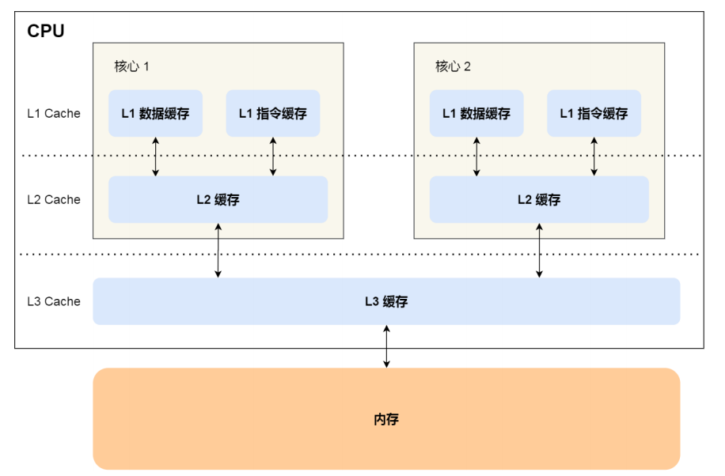

# C# 线程同步——Interlocked 类和 volatile 关键字

## Interlocked 类

对于常用的`i++`这种运算，在多线程中，它并不是线程安全的，它的操作包括从内存中获取一个值，给该值递增`1`，再将它存储回内存中。这些操作都可能被线程调度器打断。`Interlocked`类提供了以线程安全的方式递增、递减、交换和读取值的方法。

在使用`lock`语句对类似`i++`这种操作进行锁同步时，使用`Interlocked`类会快的多。但是，它只能用于简单的同步问题。

Interlocked 为多个线程共享的变量（简单值类型）提供原子操作。

使用 Interlocked 类 避免竞争条件，可以在不阻塞线程(lock、Monitor)的情况下，对目标对象做修改。

Interlocked 类是静态类，让我们先来看看 Interlocked 的常用方法：

| 方法                  | 作用                                                         |
| --------------------- | ------------------------------------------------------------ |
| ==CompareExchange()== | 比较两个数是否相等，如果相等，则替换第一个值。               |
| Decrement()           | 以原子操作的形式递减指定变量的值并存储结果。                 |
| Exchange()            | 以原子操作的形式，设置为指定的值并返回原始值。               |
| Increment()           | 以原子操作的形式递增指定变量的值并存储结果。                 |
| Add()                 | 对两个数进行求和并用和替换第一个整数，上述操作作为一个原子操作完成。 |
| Read()                | 返回一个以原子操作形式加载的值。                             |

C# 中赋值和一些简单的数学运算不是原子操作，受多线程环境影响，可能会出现问题。

错误示例：

```csharp
static void Main(string[] args)
{
    for (int i = 0; i < 5; i++)
    {
        Thread thread = new Thread(AddOne);
        thread.Start();
    }

    Thread.Sleep(TimeSpan.FromSeconds(2));
    Console.WriteLine("sum = " + sum);
}
```

运行上述代码，每次运行的结果都不一样。这是因为多个线程使用同一个变量进行操作时，并不知道此变量已经在其它线程中发生改变，导致执行完毕后结果不符合期望。

操作值类型时，其内存位置的值会被复制到 CPU 缓存中，例如 CPU1 将 sum 值复制到 L2 中，CPU1 还没有将计算后的结果放到 L3， CPU2 读取了一个旧值，即 CPU2 发生脏读，此时 CPU1、CPU2 操作的 `int sum` 导致数据混乱。



因此，这里就需要原子操作，==在某个时刻，必须只有一个线程能够进行某个操作==。而上面的操作，指的是读取、计算、写入这一过程。

当然，我们==可以使用 lock 或者 Monitor 来解决，但是这样会带来比较大的性能损失==。这时 Interlocked 就起作用了，对于一些简单的操作运算， Interlocked 可以实现原子性的操作。

#### Interlocked.Increment()、Interlocked.Decrement()

`Interlocked.Increment()` 是递增，而 `Interlocked.Decrement()` 是递减。

```csharp
public static void AddOne()
{
    for (int i = 0; i < 100_0000; i++)
    {
        Interlocked.Increment(ref sum);
    }
}
```

#### Interlocked.Exchange()

`Interlocked.Exchange()` 实现赋值运算。这个方法有多个重载，我们找其中一个来看看：

```csharp
public static int Exchange(ref int location1, int value);
```

意思是将 value 赋给 location1 ，然后返回 location1 改变之前的值。

```csharp
static void Main(string[] args)
{
    int a = 1;
    int b = 5;

    // a 改变前为1
    int result1 = Interlocked.Exchange(ref a, 2);

    Console.WriteLine($"a新的值 a = {a}   |  a改变前的值 result1 = {result1}");

    Console.WriteLine();

    // a 改变前为 2，b 为 5
    int result2 = Interlocked.Exchange(ref a, b);

    Console.WriteLine($"a新的值 a = {a}   | b不会变化的  b = {b}   |   a 之前的值  result2 = {result2}");
}
```

#### Interlocked.CompareExchange()

其中一个重载：

```csharp
public static int CompareExchange (ref int location1, int value, int comparand)
```

比较两个 32 位有符号整数是否相等，如果相等，则替换第一个值。

如果 `comparand` 和 `location1` 中的值相等，则将 `value` 存储在 `location1`中。 否则，不会执行任何操作。

==看准了，是 `location1` 和 `comparand` 比较！==

示例一，使用`lock`语句锁定对某个变量的访问，对该变量进行比较操作：

```c#
lock (obj)
{
    if (someState == null)
    {
        someState = newState;
    }
}
```

上述可以使用`Interlocked.CompareExchange()`方法进行改写，并且执行的更快：

```c#
Interlocked.CompareExchange(ref someState, newState, null);
```

示例二：

```csharp
 static void Main(string[] args)
{
    int location1 = 1;
    int value = 2;
    int comparand = 3;

    Console.WriteLine("运行前：");
    Console.WriteLine($" location1 = {location1}    |   value = {value} |   comparand = {comparand}");

    Console.WriteLine("当 location1 != comparand 时");
    int result = Interlocked.CompareExchange(ref location1, value, comparand);
    Console.WriteLine($" location1 = {location1} | value = {value} |  comparand = {comparand} |  location1 改变前的值  {result}");

    Console.WriteLine("当 location1 == comparand 时");
    comparand = 1;
    result = Interlocked.CompareExchange(ref location1, value, comparand);
    Console.WriteLine($" location1 = {location1} | value = {value} |  comparand = {comparand} |  location1 改变前的值  {result}");
}
```

#### Interlocked.Add()

对两个 32 位整数进行求和并用和替换第一个整数，上述操作作为一个原子操作完成。

```csharp
public static int Add (ref int location1, int value);
```

只能对 int 或 long 有效。

回到第一小节的多线程求和问题，使用 `Interlocked.Add()` 来替换`Interlocked.Increment()`。

```csharp
static void Main(string[] args)
{
    for (int i = 0; i < 5; i++)
    {
        Thread thread = new Thread(AddOne);
        thread.Start();
    }

    Thread.Sleep(TimeSpan.FromSeconds(10));
    Console.WriteLine("sum = " + sum);
}
private static int sum = 0;
public static void AddOne()
{
    for (int i = 0; i < 100_0000; i++)
    {
        Interlocked.Add(ref sum,1);
    }
}
```

#### Interlocked.Read()

返回一个以原子操作形式加载的 64 位值。

64位系统上不需要 Read 方法，因为64位读取操作已是原子操作。 在32位系统上，64位读取操作不是原子操作，除非使用 Read 执行。

```csharp
public static long Read (ref long location);
```

就是说 32 位系统上才用得上。具体场景我没有找到。


## volatile 关键字

这里直接引用官方文档的解释：

`volatile` 关键字指示一个字段可以由多个同时执行的线程修改。 出于性能原因，编译器，运行时系统甚至硬件都可能重新排列对存储器位置的读取和写入。即禁用缓存值，被修饰的变量的值在每个引用的线程都保持可见性，保证拿到的都是

据官方文档，`volatile` 关键字可应用于以下类型的字段：

- 引用类型。
- 指针类型（在不安全的上下文中）。 请注意，虽然指针本身可以是可变的，但是它指向的对象不能是可变的。 换句话说，不能声明“指向可变对象的指针”。
- 简单类型，如 `sbyte`、`byte`、`short`、`ushort`、`int`、`uint`、`char`、`float` 和 `bool`。
- 具有以下基本类型之一的 `enum` 类型：`byte`、`sbyte`、`short`、`ushort`、`int` 或 `uint`。
- 已知为引用类型的泛型类型参数。
- IntPtr 和 UIntPtr。

注意，volatile 只能用于引用类型或等于小于 32 位的值类型。


.NET 设计上是支持 32 位系统和 64 位系统的，而 long 类型固定是 64 位，在 32 位的系统下，CPU 寄存器执行指令时，寄存器一次只能处理 4 字节，要处理 long 类型，取内存就需要两次指令，高 4 字节和 低 4 字节是分开计算的，因此无法保证 long 的原子性。另外，在 32 位系统下，需要额外使用其它指令配合计算 long ，因此也会消耗一部分性能。

最简单的例子就是学 C 语言时，都会学到的结构体对齐。

奇怪，既然 long 、double 不行，为啥引用类型可以？

因为 `private volatile object obj;` 保存的是对象的引用地址，其地址长度跟 CPU 有关，取地址值时，只需要一次取数据指令即可。

关于 volatile 的使用方法有几个误区，第一个误区是，==volatile 不能保证数据隔离==。

踩坑代码：

```c#
private static volatile int sum = 0;
////单独执行一次，sum值为1000000
static void AddOne()
{
    for (int i = 0; i < 100_0000; i++)
    {
        sum += 1;
    }
}
static void Main(string[] args)
{
    for (int i = 0; i < 5; i++)
    {
        new Thread(AddOne).Start();
    }
    Thread.Sleep(TimeSpan.FromSeconds(10));
    Console.WriteLine("sum = " + sum);
    Console.ReadKey();
}
```

上述代码中，每调用一次AddOne()方法，sum的值都加1000000，因此启动了5个线程，期望的结果应该是5000000才对，而代码实际运行结果为，并且每次执行的结果都不一样：

```
sum = 1398807
```

原因在于：volatile 可以保证同一个字段被多个线程修改时，修改后的最新值能够被线程看到，避免发生脏读，**它无法解决多个线程同时写的问题**。==因此，千万不要简单的以为使用了volatile，就可以代替锁操作。==volatile的主要作用是：**解决多线程情况下，==一==写多读得情况。**


----


References：

- 《C# 7.0 核心技术指南》
- 《C#高级编程（第10版）》
- [2. 线程同步 · C# 多线程与异步](https://threads.whuanle.cn/2.thread_sync/)

Last updated：2025-08-31


