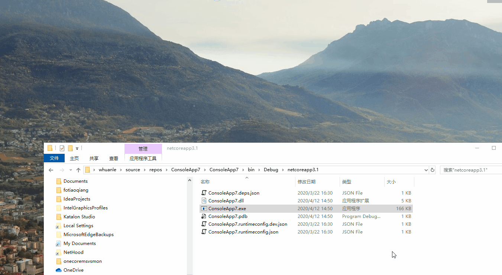
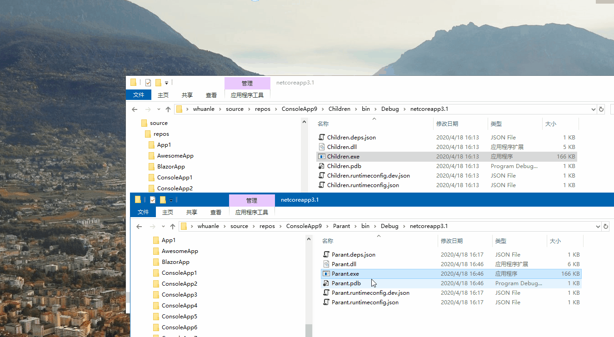

# C# 线程同步——Mutex（进程互斥锁）

`Mutex`（mutual exclusion，互斥）是.NET Framework中提供跨多个进程同步访问的一类。

> Mutex 是一种同步基元，Mutex 仅向一个线程授予独占访问共享资源的权限。这个权限依据就是 互斥体，当一个线程获取到互斥体后，其它线程也在试图获取互斥体时，就会被挂起(阻塞)，直到第一个线程释放互斥体。

当两个进程同时访问文件，文件本身就是一个共享资源了，从两个不同的进程同时访问共享资源会导致风险条件和不一致行为。使用Mutex可以很好的解决这个问题。

Mutex 只用于实现进程间的同步，它会耗费比较多的资源。Mutex 跟 lock 相似，但是 Mutex 支持多个进程，Mutex 大约比 lock 慢 20 倍，进程内请考虑 Monitor/lock。

Windows 操作系统中，Mutex 同步对象有两个状态：

- signaled：未被任何对象拥有；
- nonsignaled：被一个线程拥有；

### Mutex类

Mutex 类其构造函数如下：

| 构造函数                        | 说明                                                         |
| ------------------------------- | ------------------------------------------------------------ |
| Mutex()                         | 使用默认属性初始化 Mutex类的新实例。                         |
| Mutex(Boolean)                  | 使用 Boolean 值（指示调用线程是否应具有互斥体的初始所有权）初始化 Mutex 类的新实例。 |
| Mutex(Boolean, String)          | 使用 Boolean 值（指示调用线程是否应具有互斥体的初始所有权以及字符串是否为互斥体的名称）初始化 Mutex 类的新实例。 |
| Mutex(Boolean, String, Boolean) | 使用可指示调用线程是否应具有互斥体的初始所有权以及字符串是否为互斥体的名称的 Boolean 值和当线程返回时可指示调用线程是否已赋予互斥体的初始所有权的 Boolean 值初始化 Mutex 类的新实例。 |

Mutex 构造函数中的 String类型参数表示互斥体的名称，互斥体是全局的操作系统对象。只要给互斥体命名，这个互斥体就成为所有进程的全局互斥体，所以这个互斥体就可以保护不同进程间的共享资源。如果为 `name` 指定 `null` 或空字符串，则将创建一个本地 Mutex 对象，只会在进程内有效。因此如果要跨进程实现互斥，必须指定全局名称。

以下述构造函数为例：

```
public Mutex (bool initiallyOwned, string name, out bool createdNew);
```

通过 new 来实例化 Mutex 类，会检查系统中此互斥量 name 是否已经被使用，如果没有被使用，则会创建 name 互斥量并且此线程拥有此互斥量的使用权；此时 `createdNew == true`。

那么 initiallyOwned ，它的作用是是否允许线程是否能够获取到此互斥量的初始化所有权。因为我们希望只有一个程序能够在后台运行，因此我们要设置为 false。

第3个参数定义为输出参数，接收一个表示互斥是否为新建的布尔值。如果返回值为`false`，就表示互斥已经定义。互斥可以在另一个进程中定义，因为操作系统能够识别有名称的互斥，它由不同的进程共享。如果没有给互斥指定名称，互斥就是为命名的，不在不同的进程之间共享。

==Mutex 的 参数中，name 是非常有讲究的==。

在运行终端服务的服务器上，命名系统 mutex 可以有两个级别的可见性。

- 如果其名称以前缀 "Global\" 开头，则 mutex 在所有终端服务器会话中可见。
- 如果其名称以前缀 "Local\" 开头，则 mutex 仅在创建它的终端服务器会话中可见。 在这种情况下，可以在服务器上的其他每个终端服务器会话中存在具有相同名称的单独 mutex。

如果在创建已命名的 mutex 时未指定前缀，则采用前缀 "Local\"。 在终端服务器会话中，两个互斥体的名称只是它们的前缀不同，它们都是对终端服务器会话中的所有进程都可见。

也就是说，前缀名称 "Global\" 和 "Local\" 描述互斥体名称相对于终端服务器会话的作用域，而不是相对于进程。

请参考：

https://docs.microsoft.com/zh-cn/dotnet/api/system.threading.mutex?view=netcore-3.1#methods

https://www.cnblogs.com/suntp/p/8258488.html

Mutex 的常用方法如下：

| 方法                           | 说明                                                         |
| ------------------------------ | ------------------------------------------------------------ |
| Close()                        | 释放由当前 WaitHandle 占用的所有资源。                       |
| Dispose()                      | 释放由 WaitHandle 类的当前实例占用的所有资源。               |
| OpenExisting(String)           | 打开指定的已命名的互斥体（如果已经存在）。                   |
| ReleaseMutex()                 | 释放 Mutex一次。                                             |
| TryOpenExisting(String, Mutex) | 打开指定的已命名的互斥体（如果已经存在），并返回指示操作是否成功的值。 |
| WaitOne()                      | 阻止当前线程，直到当前 WaitHandle 收到信号。                 |
| WaitOne(Int32)                 | 阻止当前线程，直到当前 WaitHandle 收到信号，同时使用 32 位带符号整数指定时间间隔（以毫秒为单位）。 |
| WaitOne(Int32, Boolean)        | 阻止当前线程，直到当前的 WaitHandle 收到信号为止，同时使用 32 位带符号整数指定时间间隔，并指定是否在等待之前退出同步域。 |
| WaitOne(TimeSpan)              | 阻止当前线程，直到当前实例收到信号，同时使用 TimeSpan 指定时间间隔。 |
| WaitOne(TimeSpan, Boolean)     | 阻止当前线程，直到当前实例收到信号为止，同时使用 TimeSpan 指定时间间隔，并指定是否在等待之前退出同步域。 |

### Mutex 使用示例

#### 系统只能运行一个程序的实例

示例一，用于控制系统只能运行一个此程序的实例，不允许同时启动多次。

```csharp
class Program
{
    // 第一个程序
    const string name = "www.whuanle.cn";
    private static Mutex m;
    static void Main(string[] args)
    {
        // 本程序是否是 Mutex 的拥有者
        bool firstInstance;
        m = new Mutex(false,name,out firstInstance);
        if (!firstInstance)
        {
            Console.WriteLine("程序已在运行！按下回车键退出！");
            Console.ReadKey();
            return;
        }
        Console.WriteLine("程序已经启动");
        Console.WriteLine("按下回车键退出运行");
        Console.ReadKey();
        m.ReleaseMutex();
        m.Close();
        return;
    }
}
```

运行结果：



#### 接替运行

示例二，当同时点击一个程序时，只能有一个实例A可以运行，其它实例进入等待队列，等待A运行完毕后，然后继续运行队列中的下一个实例。

我们将每个程序比作一个人，模拟一个厕所坑位，每次只能有一个人上厕所，其他人需要排队等候。

使用 `WaitOne()` 方法来等待别的进程释放互斥量，即模拟排队；`ReleaseMutex()` 方法解除对坑位的占用。

```csharp
class Program
{
    // 第一个程序
    const string name = "www.whuanle.cn";
    private static Mutex m;
    static void Main(string[] args)
    {
        // wc 还有没有位置
        bool firstInstance;
        m = new Mutex(true,name,out firstInstance);

        // 已经有人在上wc
        if (!firstInstance)
        {
            // 等待运行的实例退出，此进程才能运行。
            Console.WriteLine("排队等待");
            m.WaitOne();
            GoWC();
            return;
        }
        GoWC();

        return;
    }

    private static void GoWC()
    {
        Console.WriteLine(" 开始上wc");
        Thread.Sleep(1000);
        Console.WriteLine(" 开门");
        Thread.Sleep(1000);
        Console.WriteLine(" 关门");
        Thread.Sleep(1000);
        Console.WriteLine(" xxx");
        Thread.Sleep(1000);
        Console.WriteLine(" 开门");
        Thread.Sleep(1000);
        Console.WriteLine(" 离开wc");
        m.ReleaseMutex();
        Thread.Sleep(1000);
        Console.WriteLine(" 洗手");
    }
}
```

运行效果：


上述示例中的下述代码：

```
m = new Mutex(true,name,out firstInstance);
```

一个程序结束后，要允许其它线程能够创建 Mutex 对象获取互斥量，需要将构造函数的第一个参数设置为 true。

你也可以改成 false，看看会报什么异常。

你可以使用 `WaitOne(Int32)` 来设置等待时间，单位是毫秒，超过这个时间就不排队了，去别的地方上厕所。

为了避免出现问题，请考虑在 finally 块中执行 `m.ReleaseMutex()`。

#### 进程同步示例

示例三，父进程 Parent 启动子进程 Children ，等待子进程 Children 执行完毕，子进程退出，父进程退出。

新建一个 .NET Core 控制台项目，名称为 Children，其 Progarm 中的代码如下：

```csharp
using System;
using System.Threading;

namespace Children
{
    class Program
    {
        const string name = "进程同步示例";
        private static Mutex m;
        static void Main(string[] args)
        {
            Console.WriteLine("子进程被启动...");
            bool firstInstance;

            // 子进程创建互斥体
            m = new Mutex(true, name, out firstInstance);

            // 按照我们设计的程序，创建一定是成功的
            if (firstInstance)
            {
                Console.WriteLine("子线程执行任务");
                DoWork();
                Console.WriteLine("子线程任务完成");

                // 释放互斥体
                m.ReleaseMutex();
                // 结束程序
                return;
            }
            else
            {
                Console.WriteLine("莫名其妙的异常，直接退出");
            }
        }
        private static void DoWork()
        {
            for (int i = 0; i < 5; i++)
            {
                Console.WriteLine("子线程工作中");
                Thread.Sleep(TimeSpan.FromSeconds(1));
            }
        }
    }
}
```

然后发布或生成项目，打开程序文件位置，复制线程文件路径。 创建一个新项目，名为 Parent 的 .NET Core 控制台，其 Program 中的代码如下：

```csharp
using System;
using System.Diagnostics;
using System.Threading;

namespace Parent
{
    class Program
    {
        const string name = "进程同步示例";
        private static Mutex m;
        static void Main(string[] args)
        {
            // 晚一些再执行，我录屏要对正窗口位置
            Thread.Sleep(TimeSpan.FromSeconds(3));
            Console.WriteLine("父进程启动！");

            new Thread(() =>
            {
                // 启动子进程
                Process process = new Process();
                process.StartInfo.UseShellExecute = true;
                process.StartInfo.CreateNoWindow = false;
                process.StartInfo.WorkingDirectory = @"../../../ConsoleApp9\Children\bin\Debug\netcoreapp3.1";
                process.StartInfo.FileName = @"../../../ConsoleApp9\Children\bin\Debug\netcoreapp3.1\Children.exe";
                process.Start();
                process.WaitForExit();
            }).Start();


            // 子进程启动需要一点时间
            Thread.Sleep(TimeSpan.FromSeconds(1));

            // 获取互斥体
            bool firstInstance;
            m = new Mutex(true, name, out firstInstance);

            // 说明子进程还在运行
            if (!firstInstance)
            {
                // 等待子进程运行结束
                Console.WriteLine("等待子进程运行结束");
                m.WaitOne();
                Console.WriteLine("子进程运行结束，程序将在3秒后自动退出");
                m.ReleaseMutex();
                Thread.Sleep(TimeSpan.FromSeconds(3));
                return;
            }
        }
    }
}
```

请将 Children 项目的程序文件路径，替换到 Parent 项目启动子进程的那部分字符串中。

然后启动 Parent.exe，可以观察到如下图的运行过程：




----


References：

- 《C# 7.0 核心技术指南》
- 《C#高级编程（第10版）》
- [2. 线程同步 · C# 多线程与异步](https://threads.whuanle.cn/2.thread_sync/)

Last updated：2025-08-31


