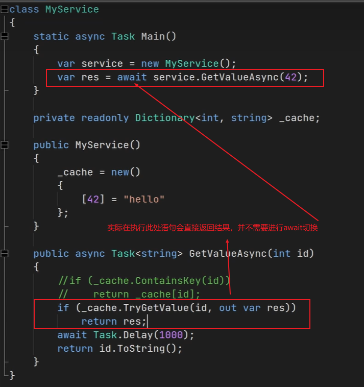
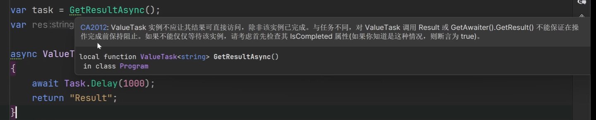

# ValueTask

在使用Task时，常常会出现如下使用await的情况，即方法的内部没有执行到await语句就直接进行了返回：



由于GetValueAsync方法是一个异步方法，所以它返回的仍然会是一个Task<string>类型的对象。这就意味着，即便我们本可以只返回一个值，我们依旧会多创建一个 Task 对象，这就导致了无端的内存开销。

>这种在异步任务中直接返回一个值的情况，我们称之为“同步完成”，或者“返回同步结果”。线程进入这个异步任务后，并没有碰到 `await` 关键字，而是直接返回。也就是说，这个异步任务自始至终都是在同一个线程上执行的。

所以，ValueTask 的主要作用就是解决这个问题。它在 .NET Core 2.0 被正式引入，并在 .NET Core 2.1 得到了增强（新增了 IValueTaskSource<T> 接口，从而使它可以拥有诸如 IsCompleted 等属性），并且还添加了非泛型的 ValueTask 类型。

**ValueTask 适用于可能返回一个 Value，也可能返回一个 Task 的情形**。

ValueTask 就是将之前返回的Task变为ValueTask即可：

```csharp
public async ValueTask<string> GetMessageAsync(int id)
{
    if (_cache.TryGetValue(id, out var message))
    {
        return message;
    }

    message = await GetMessageFromDatabaseAsync(id);
    _cache.TryAdd(id, message);

    return message;
}

```

此时，如果缓存中有数据，那么我们可以直接返回一个 ValueTask<T> 对象，而不需要再创建一个 Task<T> 对象。这样就避免了无端的堆内存开销；否则，我们才会创建 Task<T> 对象。或者说，在这种情况下，ValueTask 的性能会退化为 Task，甚至占用的内存也比Task形式的要多。

简单记忆：**当一个方法可能返回Value也可能返回Task时，就可以使用ValueTask，特别适用于返回Value的可能性远远大于Task的场景。**


## ValueTask 的注意事项（局限性）

- 除非万不得已，否则不建议使用ValueTask，就算使用，优先使用ValueTask<T>泛型版本，而不是不带泛型的ValueTask。

- ValueTask 不能被多次等待（await）

  `ValueTask` 底层会使用一个对象存储异步操作的状态，而它在被 `await` 后（可以认为此时异步操作已经结束），这个对象可能已经被回收，甚至有可能已经被用在别处（或者说，`ValueTask` 可能会从已完成状态变成未完成状态）。而 `Task` 是绝对不可能发生这种情况的，所以可以被多次等待。

- 不要用阻塞的方式获取 ValueTask的结果，而是只使用await语句来获取结果。

  ValueTask 所对应的 IValueTaskSource 并不需要支持在任务未完成时阻塞的功能，并且通常也不会这样做。这意味着，你无法像使用 Task 那样在 ValueTask 上调用 Wait、Result、GetAwaiter().GetResult() 等方法。

  但换句话说，如果你可以确定一个 ValueTask 已经完成（通过判断 IsCompleted 等属性的值），那么你可以通过 Result 属性来安全地获取 ValueTask 的结果。

  

- 不要在多个线程上同时等待一个 ValueTask

  ValueTask 在设计之初就只是用来解决 Task 在个别情况下的开销问题，而不是打算全面取代 Task。因此，Task 的很多优秀且便捷的特性它都不用有。其中一个就是线程安全的等待。

  也就是说，ValueTask 底层的对象被设计为只希望被一个消费者（或线程）等待，因此并没有引入线程安全等机制。尝试同时等待它可能很容易引入竞态条件和微妙的程序错误。而 Task 支持任意数量的并发等待。


----

References：

- [为什么我们需要 ValueTask？](https://blog.coldwind.top/posts/why-we-need-valuetask/)

Last updated：2025-06-26


