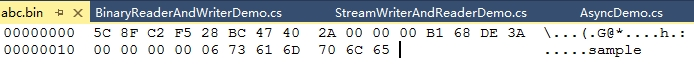

# C#文件和流

本文主要是对C#中的流进行详细讲解，关于C#中的文件操作，考虑到后期.net core跨平台，相关操作可能会发生很大变化，所以此处不对文件系统（包括目录、文件）过多的讲解，只会描述出在.net framework下常用的类，具体用法请参见官方API文档。


## 管理文件系统

在Windows上，用于浏览文件系统和执行操作的相关类有：

- `FileSystemInfo`：这是表示任何文件系统对象的基类。
- `FileInfo`和`File`：这些类表示文件系统上的文件。
- `DirectoryInfo`和`Directory`：这些类表示文件系统上的目录。
- `Path`：这个类包含的静态成员可以用于处理路径名。
- `DriveInfo`：这个类的属性和方法提供了指定驱动器的信息。

`Directory`类和`File`类只包含静态方法，不能被实例化。如果只对文件夹或文件执行一个操作，使用这个类就很有效，因为这样可以省去创建.NET对象的系统开销。

`DirectoryInfo`类和`FileInfo`类的成员都不是静态的，使用时需要被实例化。如果使用同一个对象执行多个操作，使用这些类就比较有效。【这是因为在构造它们将读取合适文件系统对象的身份验证和其他信息，无论对每个对象（类实例）调用多少方法，都不需要再次读取这些信息】

#### 检查驱动器信息

有时在处理文件和目录之前，需要检查驱动器信息，可以使用`DriveInfo`类实现。

`DriveInfo`类可以扫描系统，提供可用驱动器的列表，还可以进一步提供任何驱动器的大量细节信息。

关于`DriveInfo`的用法，请参考官方API说明：https://docs.microsoft.com/zh-cn/dotnet/api/system.io.driveinfo

#### 使用Path类处理文件和目录的路径

如果只是单纯的使用字符串连接操作符合并多个文件夹和文件时，很容易遗漏单个分隔符或使用太多的字符。可以使用`Path`类代替字符串拼接路径，`Path`类会添加缺少的分隔符，而且可以基于Windows和Unix系统，处理不同的平台需求。

`Path`类可以使用以下几个属性处理Windows和Unix平台的路径特殊符号：

- `Path.VolumeSeparatorChar`：提供特定于平台的卷分隔符。 此字段的值在Windows和Macintosh上为冒号（`:`），在UNIX操作系统上为斜杠（`/`）。这对于解析诸如“`c:\ windows`”或“`MacVolume:System Folder`”之类的路径非常有用。 
- `Path.DirectorySeparatorChar`：提供特定于平台的字符，用于分隔反映分层文件系统组织的路径字符串中的目录级别 ，该属性的值为左斜杠（`\`）。 
- `Path.AltDirectorySeparatorChar`：提供特定于平台的备用字符，用于分隔反映分层文件系统组织的路径字符串中的目录级别 。此字段可以设置为与[`DirectorySeparatorChar`](https://docs.microsoft.com/zh-cn/dotnet/api/system.io.path.directoryseparatorchar?view=netframework-4.7.2)相同的值。`AltDirectorySeparatorChar`和[`DirectorySeparatorChar`](https://docs.microsoft.com/zh-cn/dotnet/api/system.io.path.directoryseparatorchar?view=netframework-4.7.2)都可用于分隔路径字符串中的目录级别。 Windows、UNIX和Macintosh上该字段的值是斜杠（`/`）。
- `Path.PathSeparator`：特定于平台的分隔符，用于分隔环境变量中的路径字符串。 在基于Windows的桌面平台上，默认情况下，此字段的值为分号（`;`），但在其他平台上可能会有所不同。

除此之外，`Path`类还有如下几个非常适用的方法：

- `Path.GetInvalidPathChars()`：获取包含不允许在路径名中使用的字符的数组。
- `Path.GetInvalidFileNameChars()`：获取包含不允许在文件名中使用的字符的数组。
- `Path.GetTempPath()`：返回当前用户的临时文件夹的路径。
- `Path.GetTempFileName()`：在磁盘上创建磁唯一命名的零字节的临时文件并返回该文件的完整路径。
- `Path.GetRandomFileName()`：返回随机文件夹名或文件名。
- `Path.Combine()`：合并路径。
- `Path.ChangeExtension()`：更改路径字符串的扩展名。

#### 使用Environment类处理特殊文件夹

`Environment`类定义了一组特殊的文件夹。注意：该类不能用于.net core中。

`Environment`的`SpecialFolder`属性是一个巨大的枚举，通过该属性，可以得到window系统上的音乐、图片、程序文件、应用程序数据、以及许多其他文件夹的路径值。

除此之外，还可以调用`Environment.GetEnvironmentVariable()`方法，根据指定的环境变量名得到该变量的具体值。

关于`Environment`的具体使用，请参见官方API说明：https://docs.microsoft.com/zh-cn/dotnet/api/system.environment

#### 使用File、FileInfo和Directory、DirectoryInfo类处理文件和文件夹

`File`、`FileInfo`、`Directory`、`DirectoryInfo`的详细操作，可直接参见官方API文档。这里只对其中需要注意的地方进行叙述。

`File`类提供了简单创建文件并写入和读取文本的操作方法，如`File.WriteAllText()`、`File.ReadAllText()`方法，但是需要注意的是，使用`File`在字符串中读写文件只适用于小型文本文件。并且，以这种方式读取、保存完整的文件是有限制的。.NET字符串的限制是2GB，虽然对于许多文本文件而言，这已经足够了，但是最好不要让用户等待将1GB的文件加载到字符串中，这将非常耗时和耗资源，而应该使用流进行读写操作。


## 使用流处理文件

流是一个用于传输数据的对象，分为读取流和写入流。传输数据可以基于文件、内存、网络或其他任意数据源。.NET中提供了一下几种用来操作的流：

- `MemoryStream`：创建其后备存储为内存的流。 用来读写内存。
- `System.Net.Sockets.NetworkStream`：为网络访问提供基础数据流。 用来处理网络数据。
- `FileStream`：创建用来处理文件的流，支持同步和异步。这个类主要用于在二进制文件中读写二进制数据。
- `System.IO.Compression.DeflateStream`：提供使用`Deflate`算法压缩和解压缩流的方法和属性。 
- `System.Security.Cryptography.CryptoStream`： 定义将数据流链接到加密转换的流。

上述的这些类都派生自基类`Stream`，多个流之间可以相互链接（转换），相互写入。

对于文件的读写，最常用的类如下：

- `FileStream`：文件流，这个类主要用于在二进制文件中读写二进制数据。
- `StreamReader`和`StreamWriter`：这两个类专门用于读写文本格式的流产品API。可以通过它们的基类看出主要针对的是文本格式的文件。
- `BinaryReader`和`BinaryWriter`：这两个类专门用于读写二进制格式的流产品API。


#### 各种流如何选择

在不使用其他流的情况下，单纯的使用`FileStream`既可以处理文本格式的文件也可以处理二进制数据文件，它是基于字节来读取或写入数据的。对于文本文件，可能需要先分析文本文件的编码，以便能够正确读取和写入不同编码格式的文本。

如果内容是文本格式的文件，推荐使用`StreamReader`和`SreamWriter`进行读写操作，不需要考虑编码格式问题，默认采用`UTF-8`编码（可在构造函数中自定义编码格式）。

如果内容是二进制格式的文件，推荐使用BinaryReader和BinaryWriter进行读写操作，将以二进制格式而不是文本格式写入文件，并且不需要使用任何编码。


## 使用文件流FileStream

可以使用`FileStream`的构造函数来创建`FileStream`对象，除了这种方式外，还可以直接使用`File`类的`OpenRead()`方法创建`FileStream`，`OpenRead()`方法打开一个文件（类似于`FileMode.Open`），返回一个可以读取的流（`FileAccess.Read`），也允许其他进程执行读取访问（`FileShare.Read`）。对应的写入流可以使用`File.OpenWrite()`方法得到。

无论是读取流还是写入流，它们都是`FileStream`对象，只是对应的`FileAccess`代表的操作不同，建议在给流对象命名时，最好有是读取还是写入的标识名。

#### 获取流相关信息

在下面的示例中，分别获取`Stream`类的成员属性，得到流处理相关信息。

```c#
private void ShowStreamInfomation(FileStream stream)
{
    Console.WriteLine("当前流是否可读取:" + stream.CanRead);
    Console.WriteLine("当前流是否可写入:" + stream.CanWrite);
    Console.WriteLine("当前流是否支持搜索:" + stream.CanSeek);
    Console.WriteLine("当前流是否可以超时:" + stream.CanTimeout);
    Console.WriteLine("当前流长度:" + stream.Length);
    Console.WriteLine("当前流的位置:" + stream.Position);
    //如果可以超时
    if (stream.CanTimeout)
    {
        Console.WriteLine("流在尝试读取多少毫秒后超时:" + stream.ReadTimeout);
        Console.WriteLine("流在尝试写入多少毫秒后超时:" + stream.WriteTimeout);
    }
}
```

#### 分析文本文件的编码

对于文本文件，首先是读取流中的第一个字节——序言。序言提供了文件如何编码的信息（使用的文本编码格式），这也称为字节顺序标记（`Byte Order Mark，BOM`）。可以使用如下方法，获取`BOM`：

```c#
private Encoding GetEncoding(FileStream stream)
{
    //如果当前流不支持检索就抛出异常
    if (!stream.CanSeek) throw new ArgumentException("require a stream that can seek");

    Encoding encoding = Encoding.ASCII;
    //定义缓冲区，这里只是为了将BOM格式写入到该字节数组中
    byte[] bom = new byte[5];
    //从流中读取字节块，填充bom字节数组的同时，返回读入缓冲区的总字节数
    //注意流可能小于缓冲区。如果没有更多的字符可用于读取，Read()方法就返回0，此时没有数据写入到缓冲区
    int nRead = stream.Read(bom, offset: 0, count: 5);

    if (bom[0] == 0xff && bom[1] == 0xfe && bom[2] == 0 && bom[3] == 0)
    {
        Console.WriteLine("UTF-32");
        //将该流的当前位置设置为给定值，从流的开始位置起
        stream.Seek(4, SeekOrigin.Begin);
        return Encoding.UTF32;
    }
    else if (bom[0] == 0xff && bom[1] == 0xfe)
    {
        Console.WriteLine("UTF-16, little endian");
        stream.Seek(2, SeekOrigin.Begin);
        return Encoding.Unicode;
    }
    else if (bom[0] == 0xfe && bom[1] == 0xff)
    {
        Console.WriteLine("UTF-16,big endian");
        stream.Seek(2, SeekOrigin.Begin);
        return Encoding.BigEndianUnicode;
    }
    else if (bom[0] == 0xef && bom[1] == 0xbb && bom[2] == 0xbf)
    {
        Console.WriteLine("UTF-8");
        stream.Seek(3, SeekOrigin.Begin);
        return Encoding.UTF8;
    }
    stream.Seek(0, SeekOrigin.Begin);
    return encoding;
}
```

上述方法中，使用`Read()`方法将流的前`5`个字节写入到字节数组中，接着对`5`个字节的值进行比对，找出最终的编码格式，并把流定位在编码字符后的位置。

#### 读取流

当创建`FileStream`对象后，就可以使用`Read()`方法对文件进行读取。可以使用循环重复此过程，直到该方法返回`0`为止。详细说明见示例中的注释描述：

```c#
private void ReadFileUsingFileStream(string fileName)
{
    //每次读取的字节数
    const int BUFFERSIZE = 4096;
    using (var stream = new FileStream(fileName, FileMode.Open, FileAccess.Read, FileShare.Read))
    {
        ShowStreamInfomation(stream);
        Encoding encoding = GetEncoding(stream);

        byte[] buffer = new byte[BUFFERSIZE];
        bool completed = false;
        do
        {
            int nread = stream.Read(buffer, 0, BUFFERSIZE);
            //如果没有字节被读取，就跳出循环
            if (nread == 0) completed = true;
            //如果最终读取的字节数小于缓冲区的字节数大小
            if (nread < BUFFERSIZE)
            {
                //Clear()方法用于清除数组中不需要的多余元素
                //将buffer数组从索引nread处开始清理，清理的元素个数为BUFFERSIZE - nread
                //这样就将未填满的buffer中，多余的字节给清理调用
                Array.Clear(buffer, nread, BUFFERSIZE - nread);
            }
            Console.WriteLine($"读取 {nread} 字节");
            //将读取到缓冲区buffer中的数据，按照指定的编码格式，转换为字符串并输出
            //此处可以直接调用encoding.GetString(buffer)
            string s = encoding.GetString(buffer, 0, nread);
            Console.WriteLine(s);
        } while (!completed);
    }
}
```

#### 写入流

除了使用`FileStream`构造方法外，可以使用`File.OpenWrite()`方法创建一个可以写入的流。接着可以调用`WriteByte()`方法写入一个字节，或者调用`Write()`方法写入包含多个字节的字节数组。

下述示例说明了如何进行写入流的操作，详细说明见代码中的注释描述：

```c#
public static void WriteTextFile()
{
    string tempTextFileName = Path.ChangeExtension(Path.GetTempFileName(), "txt");
    using (FileStream stream = File.OpenWrite(tempTextFileName))
    {
        //在写入文本之前，需要先写入序言信息
        //返回使用UTF-8的字节序列，preamble即为编码为UTF-8的字节序列，它代表文件的序言信息
        byte[] preamble = Encoding.UTF8.GetPreamble();
        //写入序言信息为UTF-8到文件流中
        stream.Write(preamble, 0, preamble.Length);

        string hello = "你好，C#！";
        //将字符串转换为字节数组写入到文件流中
        byte[] buffer = Encoding.UTF8.GetBytes(hello);
        stream.Write(buffer, 0, buffer.Length);
        Console.WriteLine("文件:" + stream.Name + "，已经写入");
    }
}
```

#### 复制流

可以直接调用`Stream`类的`CopyTo()`方法，**将一个流写入到另一个流中**。

```c#
public static void CopyUsingStream2(string inputFile, string outputFile)
{
    using (var inputStream = File.OpenRead(inputFile))
    {
        using (var outputStream = File.OpenWrite(outputFile))
        {
            //从当前流中读取字节并将其写入到另一流中
            inputStream.CopyTo(outputStream);
        }
    }
}
```

#### 随机对流进行切块读取

为了说明对流进行切块读取的操作，先写入流到一个文件中，写入时，使用了`StreamWriter`流（该流特别适合文本格式的文件写入操作，在之后会详细讲解），代码如下：

```c#
private const string SampleFilePath = "./samplefile.data";

public static async void CreateSampleFileAsync(int nRecords)
{
    //虽然FileStream没有使用using或者调用释放方法，但是在StreamWriter销毁时，StreamWriter会控制所使用的资源，并销毁流
    FileStream stream = File.Create(SampleFilePath);
    //StreamWriter用于文本流的写入
    using (var writer = new StreamWriter(stream))
    {
        var r = new Random();
        var records = Enumerable.Range(0, nRecords).Select(x => new
        {
            Number = x,
            Text = $"Sample text {r.Next(200)}",
            Date = new DateTime(Math.Abs((long)((r.NextDouble() * 2 - 1) * DateTime.MaxValue.Ticks)))
        });

        foreach (var rec in records)
        {
            string date = rec.Date.ToString("d", CultureInfo.InvariantCulture);
            string s = $"#{rec.Number,8}; {rec.Text,-20}; {date}#{Environment.NewLine}";
            await writer.WriteAsync(s);
        }
    }
}
```

上述代码中，随机获取日期格式的时间写入到文件中，调用代码如下：

```c#
FileStreamDemo.CreateSampleFileAsync(1000);
```

执行完成后，文件中将会写入1000行数据，写入的内容如下：

```
#     988; Sample text 131     ; 06/02/4085#
#     989; Sample text 168     ; 02/25/8671#
#     990; Sample text 93      ; 07/31/1218#
#     991; Sample text 67      ; 03/22/7271#
#     992; Sample text 193     ; 04/26/6755#
#     993; Sample text 72      ; 09/01/9993#
#     994; Sample text 11      ; 05/22/6211#
#     995; Sample text 24      ; 01/04/5765#
#     996; Sample text 70      ; 08/08/1013#
#     997; Sample text 148     ; 04/11/8407#
#     998; Sample text 187     ; 07/16/2297#
#     999; Sample text 168     ; 01/11/5624#
```

接着对写入的文件进行随机定位读取，使用`Steam`类的`Seek()`方法定位流中的光标。读取流的代码如下：

```c#
public static void RandomAccessSample()
{
    //每次读取的字节数
    const int RECORDSIZE = 100;
    try
    {
        using (FileStream stream = File.OpenRead(SampleFilePath))
        {
            byte[] buffer = new byte[RECORDSIZE];
            do
            {
                try
                {
                    Console.WriteLine("record numer (or 'bye' to end):");
                    //接收用户输入的行号
                    string line = Console.ReadLine();
                    if ("BYE".Equals(line)) break;

                    int record;
                    if (int.TryParse(line, out record))
                    {
                        //设定流的读取位置
                        stream.Seek((record - 1) * RECORDSIZE, SeekOrigin.Begin);
                        stream.Read(buffer, 0, RECORDSIZE);
                        string s = Encoding.UTF8.GetString(buffer);
                        Console.WriteLine("record:" + s);
                    }
                }
                catch (Exception ex)
                {
                    Console.WriteLine(ex.Message);
                }
            } while (true);
        }
    }
    catch (FileNotFoundException)
    {
        Console.WriteLine("文件不存在！");
    }
}
```


## 使用文本格式流StreamReader和StreamWriter

如果是处理文本格式的文件，使用`FileStream`类读写操作时，需要使用字节数组，比较繁琐。可以直接使用`StreamReader`和`StreamWriter`类读写`FileStream`，无须处理字节数组和编码，会容易很多。

使用这两个类的`StreamReader.ReaderLine()`和`StreamWriter.WriterLine()`方法，可以一次读写一行文本。在读取文件时，流会自动确定下一个回车符的位置，并在该处停止读取。在写入文件时，流会自动把回车符和换行符追加到文本的末尾。并且，使用`StreamWriter`和`StreamReader`类，不需要担心文件中使用的编码方式。

#### 使用StreamReader类读取文本格式数据

```c#
public static void ReadFileUsingReader(string fileName)
{
    var stream = new FileStream(fileName, FileMode.Open, FileAccess.Read, FileShare.Read);
    //该构造方法接收一个Stream对象
    using (var reader = new StreamReader(stream))
    {
        //当前流位置是否在流末尾
        while (!reader.EndOfStream)
        {
            string line = reader.ReadLine();
            Console.WriteLine(line);
        }
    }
}
```

使用`StreamReader`类，不需要处理字节数组和编码。注意：`StreamReader`默认使用`UTF-8`编码。在该类的构造方法的重载版本中，可以指定`detectEncodingFromByteOrderMarks`参数，用来指定是否可以让`StreamReader`使用文件中的序言定义的编码。也可以使用重载版本中的另一个指定`Encoding`参数的方法，显示的指定编码。还可以使用重载版本中的指定`bufferSize`参数的方法，用来设置要使用的缓冲区大小。默认为`1024`字节。此外，还可以指定关闭读取器时，不应该关闭底层流。默认情况下，关闭读取器时（使用`Dispose()`方法），会关闭底层流。

如果不使用实例化的方式构造`StreamReader`对象，也可以使用`File`类的`OpenText()`方法创建。

`StreamReader`还允许把内容读入一个字符数组中。这类似于`Stream`类的`Read()`方法，但是它读入的是`char`字符数组，而不是`byte`字节数组。注意：`char`类型使用两个字节。这适合于`16`位`Unicode`但不适合于`UTF-8`（其中，一个字符的长度可以是`1`到`6`个字节）。

#### 使用StreamWriter类写入文本格式数据

```c#
public static void WriteFileUsingWriter(string fileName,string [] lines)
{
    var outputStream = File.OpenWrite(fileName);
    using(var writer=new StreamWriter(outputStream))
    {
        //获取UTF-8代表的序言转换的字节数组
        byte[] preable = Encoding.UTF8.GetPreamble();
        //先写入编码格式
        outputStream.Write(preable, 0, preable.Length);
        //在写入字符串数组
        writer.Write(lines);
    }
}
```

`StreamWriter`默认使用UTF-8格式写入文本内容。通过在构造方法中设置`Encoding`对象，可以定义替代的内容。另外，类似于`StreamReader`的构造方法，`StreamWriter`允许指定缓冲区的大小，以及关闭写入器时是否不应该关闭底层流。

`StreamWriter`的`Writer()`方法定义了多个重载版本，允许传递字符串和一些.NET数据类型，使用传递.NET数据类型的方法，这些都会使用指定的编码变成字符串。


## 使用二进制文件流BinaryReader和BinaryWriter将数据以二进制格式写入到文件中

对于内容是二进制格式的文件，可以使用`FileStream`流进行读写，此时需要使用字节数组执行读写操作。除此之外，还可以使用`BinaryReader`和`BinaryWriter`对二进制文件进行读写，它们不需要使用任何编码，并且是以二进制格式而不是文本格式写入到文件中。

#### 使用BinaryWriter将数据以二进制格式写入到文件中

```c#
public static void WriteFileUsingBinaryWriter(string binFile)
{
    var outputStream = File.Create(binFile);
    using (var writer = new BinaryWriter(outputStream))
    {
        double d = 47.47;
        int i = 42;
        long l = 987654321;
        string s = "sample";
        writer.Write(d);
        writer.Write(i);
        writer.Write(l);
        writer.Write(s);
    }
}
```

`BinaryWriter.Write()`方法有很多的重载版本，可以将不同类型的数据以二进制的格式写入到文件中，包括基本数据类型和字节数组等。调用上述方法，将会生成一个二进制格式的文件。可以使用Visual Studio进行打开，打开后的内容如下：



#### 使用BinaryReader将二进制格式的数据从文件中进行读取

```c#
public static void ReadFileUsingBinaryReader(string binFile)
{
    var inputStream = File.Open(binFile, FileMode.Open);
    using(var reader=new BinaryReader(inputStream))
    {
        //读取并定位
        double d= reader.ReadDouble();
        int i = reader.ReadInt32();
        long l = reader.ReadInt64();
        string s = reader.ReadString();
        Console.WriteLine($"d:{d} \t i:{i} \t l:{l} \t s:{s} ");
    }
}
```

注意：读取的类型应该和写入的类型相同才能够按照正确顺序读取。读取的结果如下：

```c#
d:47.47          i:42    l:987654321     s:sample
```

> 读取文件的顺序必须完全匹配写入的顺序，创建自己的二进制格式时，需要知道存储的内容和方式，并用相应的方式读取。旧的Word文档doc使用二进制文件格式，新的docx文件扩展是ZIP文件。


## 压缩文件

.NET中压缩文件常用的类型有以下几种：

- `DeflateStream`：可以使用该类完成文件的压缩和解压操作。
- `GZipStream`：可以使用该类完成文件的压缩和解压操作，它和`DeflateStream`使用相同的压缩算法（事实上，`GZipStream`在后台使用`DeflateStream`），但`GZipStream`增加了循环冗余校验，来检测数据的损坏情况。使用`GZipStream`创建的压缩文件，可以使用第三方工具GZip直接打开。
- `ZipArchive`：使用`ZipArchive`可以创建和读取ZIP文件。ZIP文件，可以直接在Windows资源管理器中打开查看。

#### 使用DeflateStream压缩/解压文件

压缩示例：

```c#
public static void CompressFile(string fileName, string compressedFileName)
{
    //读取要压缩的文件
    using (FileStream inputStream = File.OpenRead(fileName))
    {
        //创建要写入的文件
        FileStream outputStream = File.OpenWrite(compressedFileName);

        //创建压缩流，构造方法指明最终写入的文件流
        using (var compressStream = new DeflateStream(outputStream, CompressionMode.Compress))
        {
            //将读取的文件流写入到压缩流中
            inputStream.CopyTo(compressStream);
        }
    }
}
```

如上所示，可以将多个流链接起来，在将一个文件压缩到另一个文件中时，需要指明读取流（`inputStream`)和写入流（`outputStream`），然后创建一个压缩流`DeflateStream`对象，在构造方法中，指明了将要写入的文件流`outputStream`，**同时使用`CompressionMode.Compress`表示压缩操作**，最后使用了`CopyTo()`方法，将读取流`inputStream`复制到压缩流中，实现压缩。除了`CopyTo()`方法外，还可以使用`Write()`方法或其他功能写入`inputStream`流。

可以使用如下代码进行调用：

```c#
DeflateStreamAndGZipStreamDemo.CompressFile("samplefile.data", "b.ys");
```

解压示例：

```c#
public static void DecompressFile(string fileName)
{
    //创建文件读取流
    FileStream inputStream = File.OpenRead(fileName);
    //这里为了直接输出文件内容使用了MemoryStream，可以换成FileStream用来保存解压后的文件
    using (MemoryStream outputStream = new MemoryStream())
    {
        //解压读取的文件
        using (var compressStream = new DeflateStream(inputStream, CompressionMode.Decompress))
        {
            //将解压流写入到内存流中，以便后续直接输出
            compressStream.CopyTo(outputStream);
            //定位内存流的当前位置
            outputStream.Seek(0, SeekOrigin.Begin);
            //将内存流的内容使用StreamReader输出文本
            using (var reader = new StreamReader(outputStream, 
                Encoding.UTF8, 
                detectEncodingFromByteOrderMarks: 
                true, 
                bufferSize: 4096, 
                //注意：此参数很有用途
                leaveOpen: true))
            {
                string result = reader.ReadToEnd();
                Console.WriteLine(result);
            }
        }
    }
}
```

上述代码中，最重要的是创建`DeflateStream`对象时，在构造方法中指定的`CompressionMode.Decompress`，表示解压缩。其他说明见代码中的注释描述。

#### 使用ZipArchive压缩文件

可以使用`ZipArchive`创建Zip压缩文件。`ZipArchive`包含多个`ZipArchiveEntry`对象，**`ZipArchive`类不是一个流，但是它使用流进行读写**。

压缩示例：

```c#
public static void CreateZipFile(string directory, string zipFile)
{
    //将要穿件的压缩文件对应的写入流
    FileStream zipStream = File.OpenWrite(zipFile);

    using (var archive = new ZipArchive(zipStream, ZipArchiveMode.Create))
    {
        //获取目录下的所有文件
        IEnumerable<string> files = Directory.EnumerateFiles(directory, "*", SearchOption.TopDirectoryOnly);
        foreach (var file in files)
        {
            //针对每个文件创建ZipArchiveEntry对象
            ZipArchiveEntry entry = archive.CreateEntry(Path.GetFileName(file));
            //创建每个文件对应的读取流
            using (FileStream inputSream = File.OpenRead(file))
            //打开ZipArchiveEntry对象的压缩流
            using (Stream outputStream = entry.Open())
            {
                //将文件写入到压缩流中
                inputSream.CopyTo(outputStream);
            }
        }
    }
}
```


## 使用FileSystemWatcher监视文件的更改

使用`FileSystemWatcher`可以监视文件的更改。事件在创建、重命名、删除和更改文件时触发。

示例代码：

```c#
public static void WatchFiles(string path, string filter)
{
    var watcher = new FileSystemWatcher(path, filter)
    {
        //是否应该监视指定目录的子目录
        IncludeSubdirectories = true
    };
    //创建文件或目录时发生
    watcher.Created += OnFileChanged;
    //更改文件或目录时发生
    watcher.Changed += OnFileChanged;
    //删除文件或目录时触发
    watcher.Deleted += OnFileChanged;
    //重命名文件或目录时触发
    watcher.Renamed += OnFileRenamed;
    //开始启用监听
    watcher.EnableRaisingEvents = true;
    Console.WriteLine("文件监视中。。。");
}
private static void OnFileChanged(object sender, FileSystemEventArgs e)
{
    Console.WriteLine(e.Name + "\t" + e.ChangeType);
}
private static void OnFileRenamed(object sender, RenamedEventArgs e)
{
    Console.WriteLine($"旧名称：{e.OldName} 新名称：{e.Name}  Type：{e.ChangeType}");
}
```

在当前目录下监听所有的文件或文件夹，调用上述代码：

```c#
WatcherFileDemo.WatchFiles("./", "*");
```

可以在Debug目录中创建一个文本文件，试着修改文件名和文件内容，可以看到输出的内容。


## 使用内存映射的文件

内存映射文件允许访问文件，或在不同的进程中共享内存。内存映射文件技术有以下几个场景和特点：

- 使用文件地图，快速随机访问大文件
- 在不同的进程或任务之间共享文件或内存
- 使用访问器直接从内存位置进行读写
- 基于流进行读写

> 内存映射文件API允许使用物理文件或共享的内存，其中把系统的页面文件用作后备存储器。共享的内存可以大于可用的物理内存，所以需要一个后备存储器。可以为特定的文件或共享的内存创建一个内存映射文件。使用这两个选项，可以给内存映射指定的名称。使用名称，允许不同的进程访问同一个共享的内存。
>
> 创建了内存映射之后，就可以创建一个视图。视图用于映射完整内存映射文件的一部分，以访问它，进行读写。
>
> 注：【该段引用的文字翻译的很晦涩，不是很明白】
>
> 下面将用一个示例来说明具体的使用，在`Run()`方法中，启动多个任务，一个用于创建内存映射文件和写入数据，另一个任务用于读取数据。

```c#
//创建两个事件状态，用来收发信号
private ManualResetEventSlim _mapCreated = new ManualResetEventSlim(initialState: false);
private ManualResetEventSlim _dataWritenEvent = new ManualResetEventSlim(initialState: false);
//映射名称
private const string MAPNAME = "SampleMap";
public void Run()
{
    //启动一个用于创建内存映射文件和写入数据的任务
    Task.Run(() => WriterAsync());
    //启动一个读取数据的任务
    Task.Run(() => Reader());
    Console.WriteLine("任务已经启动...");
    Console.Read();
}
```

注：由于后序代码会用到事件状态和内存映射名称，所以上述代码在开头先进行了声明。

#### 使用访问器创建内存映射文件

访问器来自于`MemoryMappedFile`对象的`CreateViewAccessor()`方法进行创建，得到`MemoryMappedViewAccessor`类型的访问视图，用于访问共享的内存。使用视图访问器，可以定义这一任务使用的偏移量和大小，可以使用的大小的最大值是内存映射文件的大小。

写入器：

```c#
private async Task WriterAsync()
{
    try
    {
        //创建一个基于内存打车内存映射文件
        using (MemoryMappedFile mappedFile = MemoryMappedFile.CreateOrOpen(
            MAPNAME, 10000, MemoryMappedFileAccess.ReadWrite))
        {
            //给事件_mapCrated发出信号，给其他任务提供信息，说明已经创建了内存映射文件，可以打开它了
            _mapCreated.Set();
            Console.WriteLine("shared memory segment created");
            //创建视图访问器，用来访问共享的内存
            using (MemoryMappedViewAccessor accessor = mappedFile.CreateViewAccessor(
                0, 10000, MemoryMappedFileAccess.Write))
            {
                for (int i = 0, pos = 0; i < 100; i++, pos += 4)
                {
                    //将数据写入到共享内存中
                    accessor.Write(pos, i);
                    Console.WriteLine($"written {i} at position {pos}");
                    await Task.Delay(10);
                }
                //写入完数据后，给事件发出信号，通知读取器，现在可以开始读取了
                _dataWritenEvent.Set();
                Console.WriteLine("data written");
            }
        }
    }
    catch (Exception ex)
    {
        Console.WriteLine("writer " + ex.Message);
    }
}
```

读取器：

```c#
private void Reader()
{
    try
    {
        Console.WriteLine("reader");
        //读取器首先等待创建内存映射文件
        _mapCreated.Wait();
        Console.WriteLine("reader starting");
        //打开内存映射文件
        using (MemoryMappedFile mappedFile = MemoryMappedFile.OpenExisting(
            MAPNAME, MemoryMappedFileRights.Read))
        {
            //创建一个视图访问器
            using (MemoryMappedViewAccessor accessor = mappedFile.CreateViewAccessor(
                0, 10000, MemoryMappedFileAccess.Read))
            {
                //等待设置_dataWritenEvent
                _dataWritenEvent.Wait();
                Console.WriteLine("reading can start now");
                for (int i = 0; i < 400; i += 4)
                {
                    int result = accessor.ReadInt32(i);
                    Console.WriteLine($"reading {result} from position {i}");
                }
            }
        }
    }
    catch (Exception ex)
    {
        Console.WriteLine("reader " + ex.Message);
    }
}
```

#### 使用流创建内存映射文件

除了用内存映射文件写入原始数据类型之外，还可以使用了流。可以使用`MemoryMappedFile`对象的`CreateViewStream()`方法创建一个`MemoryMappedViewStream`类型的流，它映射到内存映射文件的视图，并具有指定的偏移、大小和访问类型。以此来代替之前的`MemoryMappedViewAccessor`。

下面的代码将使用流的方式创建内存映射文件，和之前不同之处在于使用`MemoryMappedViewStream`替换了`MemoryMappedViewAccessor`，其他基本类似，具体见代码注释说明。

写入器：

```c#
private async Task WriterUsingStreams()
{
    try
    {
        using (MemoryMappedFile mappedFile = MemoryMappedFile.CreateOrOpen(
            MAPNAME, 10000, MemoryMappedFileAccess.ReadWrite))
        {
            _mapCreated.Set();
            Console.WriteLine("shared memory segment created");
            //在映射内定义一个视图，注意此处和之前的CreateViewAccessor()的不同
            MemoryMappedViewStream stream = mappedFile.CreateViewStream(
                0, 10000, MemoryMappedFileAccess.Write);
            using (var writer = new StreamWriter(stream))
            {
                //为了用每次写入的内容刷新缓存，此处需要设置为true
                writer.AutoFlush = true;
                for (int i = 0; i < 100; i++)
                {
                    string s = "some data " + i;
                    Console.WriteLine($"writing {s} at {stream.Position}");
                    //StreamWriter以缓存的方式写入操作，所以流的位置不是在每个写入操作中都更新，只在写入器写入块时才更新
                    //所以，每次写入的内容都需要刷新缓存，可以手动调用writer.Flush()方法，也可以在写入之前设置writer.AutoFlush = true
                    await writer.WriteLineAsync(s);
                }
            }
            _dataWritenEvent.Set();
        }
    }
    catch (Exception ex)
    {
        Console.WriteLine("writer " + ex.Message);
    }
}
```

读取器：

```c#
private async Task ReaderUsingStreams()
{
    try
    {
        Console.WriteLine("reader");
        _mapCreated.Wait();
        Console.WriteLine("reader starting");
        using (MemoryMappedFile mappedFile = MemoryMappedFile.OpenExisting(
            MAPNAME, MemoryMappedFileRights.Read))
        {
            MemoryMappedViewStream stream = mappedFile.CreateViewStream(
                0, 10000, MemoryMappedFileAccess.Read);
            using (var reader = new StreamReader(stream))
            {
                _dataWritenEvent.Wait();
                Console.WriteLine("reading can start now");
                for (int i = 0; i < 100; i++)
                {
                    long pos = stream.Position;
                    string s = await reader.ReadLineAsync();
                    Console.WriteLine($"read {s} from {pos}");
                }
            }
        }
    }
    catch (Exception ex)
    {
        Console.WriteLine("reader " + ex.Message);
    }
}
```


## 使用管道通信

> 为了在线程和进程之间通信，在不同的系统之间快速通信，可以使用管道。在.NET中，管道实现为流，因此不仅可以把字节发送到管道，还可以使用流的所有特性，如读取器和写入器。
>
> 管道实现为不同的类型：一种是命名管道，其中的名称可用于连接到每一端，另一种是匿名管道。匿名管道不能用于不同系统之间的通信；只能用于一个父子进程之间的通信或不同任务之间的通信。
>
> 命名管道可以是双向的，对应的`PipeDirection`可以为`InOut`（见下述代码示例）；而匿名管道只能是单向的。

#### 创建命名管道服务器

通过创建`NamedPipeServerStream`的一个新实例，来创建服务器。`NamedPipeServerStream`派生自基类`PipeStream`，`PipeStream`派生自`Stream`基类，因此可以使用了流的所有功能。（例如，可以创建`CrytoStream`或`GZipStream`，把加密或压缩的数据写入命名管道）。

```c#
//创建命名管道服务器
private static void PipesReader(string pipeName)
{
    try
    {
        //创建对象，构造函数需要管道的名称，通过管道通信的多个进程可以使用该管道
        //第二个参数定义了管道的方向，此处用于读取，因此设置为了向内
        using (var pipeReader = new NamedPipeServerStream(pipeName, PipeDirection.In))
        {
            //命名管道等待写入的连接
            pipeReader.WaitForConnection();
            Console.WriteLine("reader connected");

            const int BUFFERSIZE = 256;
            bool completed = false;
            while (!completed)
            {
                byte[] buffer = new byte[BUFFERSIZE];
                //管道服务器把消息读入缓冲区数组
                int nRead = pipeReader.Read(buffer, 0, BUFFERSIZE);
                //获取消息内容并打印显示
                string line = Encoding.UTF8.GetString(buffer, 0, nRead);
                Console.WriteLine(line);
                if (line == "bye")
                    completed = true;
            }
        }
        Console.WriteLine("completed reading");
        Console.ReadLine();
    }
    catch (Exception ex)
    {
        Console.WriteLine(ex.Message);
    }
}
```

在使用构造函数创建`NamedPipeServerStream`实例时，可以用命名管道配置的其他一些选项如下：

- 可以把枚举`PipeTransmissionMode`设置为`Byte`或`Message`。设置为`Byte`，就发送一个连接的流，设置为`Message`，就可以检索每条消息。
- 使用管道选项，可以指定`WriteThrough`立即写入管道，而不缓存。
- 可以为输入和输出配置缓冲区大小。
- 配置管道安全性，指定谁允许读写管道。 
- 可以配置管道句柄的可继承性，这对与子进程进行通信是很重要的。

因为`NamedPipeServerStream`是一个流，所以可以使用`StreamReader`，而不是读取字节数组，因此上述代码可简化为：

```c#
//简化版
private static void PipesReader2(string pipeName)
{
    try
    {
        var pipeReader = new NamedPipeServerStream(pipeName, PipeDirection.In);
        using (var reader = new StreamReader(pipeReader))
        {
            pipeReader.WaitForConnection();
            Console.WriteLine("reader connected");
            bool completed = false;

            while (!completed)
            {
                string line = reader.ReadLine();
                Console.WriteLine(line);
                if (line == "bye")
                    completed = true;
            }
        }
        Console.WriteLine("completed reading");
        Console.ReadLine();
    }
    catch (Exception ex)
    {
        Console.WriteLine(ex.Message);
    }
}
```

#### 创建命名管道客户端

上述创建的服务器用于读取消息，下面需要创建客户端用于写入数据。

通过实例化一个`NamedPipeClientStream`对象来创建客户端。因为命名管道可以在网络上通信，所以需要服务器名称、管道的名称和管道的方向。

```c#
public static void PipesWriter(string pipeName)
{
    var pipeWriter = new NamedPipeClientStream("TheRokcs", pipeName, PipeDirection.Out);
    using (var writer = new StreamWriter(pipeWriter))
    {
        //连接管道
        pipeWriter.Connect();
        Console.WriteLine("writer connected");
        bool completed = false;
        while (!completed)
        {
            string input = Console.ReadLine();
            if (input == "bye")
                completed = true;
            //把消息发送给服务器，默认情况下，消息不立即发送，而是缓存起来。
            writer.WriteLine(input);
            //调用Flush()把消息推送到服务器上
            writer.Flush();
        }
    }
    Console.WriteLine("completed writing");
}
```

执行时，需要同时启动两个项目，分别代表服务器和客户端，一个输入另一个回应。

#### 创建匿名管道

下面示例中，将创建两个彼此通信的任务，由于该方式使用的不是特别多，所以具体说明自行查阅官方API，此处只是一个简单的示例。

公共部分：

```c#
private string _pipeHandle;
//创建一个信号状态（是否有收到信号）
private ManualResetEventSlim _pipeHandleSet;

public void Run()
{
    _pipeHandleSet = new ManualResetEventSlim(initialState: false);
    Task.Run(() => Reader());
    Task.Run(() => Writer());
}
```

服务器部分：

```c#
//服务端
private void Writer()
{
    try
    {
        //把服务器充当读取器
        var pipeReader = new AnonymousPipeServerStream(PipeDirection.In, HandleInheritability.None);
        using (var reader = new StreamReader(pipeReader))
        {
            //获取管道的客户端句柄，被转换为一个字符串后赋予变量_pipeHandle
            //这个变量以后有充当写入器的客户端使用
            _pipeHandle = pipeReader.GetClientHandleAsString();
            Console.WriteLine("pipe handle:" + _pipeHandle);
            _pipeHandleSet.Set();

            bool end = false;
            while (!end)
            {
                string line = reader.ReadLine();
                Console.WriteLine(line);
                if (line == "end")
                    end = true;
            }
            Console.WriteLine("finished reading");
        }
    }
    catch (Exception ex)
    {
        Console.WriteLine(ex.Message);
    }
}
```

客户端部分：

```c#
//客户端
private void Reader()
{
    Console.WriteLine("anonymous pipe writer");
    //客户端等到变量_pipeHandleSet发出信号
    _pipeHandleSet.Wait();
    //收到信号后，就打开由_pipeHandle变量引用的管道句柄
    var pipeWriter = new AnonymousPipeClientStream(PipeDirection.Out, _pipeHandle);
    using (var writer = new StreamWriter(pipeWriter))
    {
        writer.AutoFlush = true;
        Console.WriteLine("starting writer");
        for (int i = 0; i < 5; i++)
        {
            writer.WriteLine("Message " + i);
            Task.Delay(500).Wait();
        }
        Console.WriteLine("end");
    }
}
```


## 基于Windows运行库使用文件和流（Winfrom/WPF）

- `FileInputStream`
- `FileOutputStream`
- `RandomAccessStreams`
- `DataReader`、`DataWriter`

关于这些类的使用，此处不做详细介绍，可查询官方API文档。


## 关于流的总结

- 如果需要将字符串转换为字节数组，可以调用 `Encoding.UTF8.GetBytes(str)`方法。
- `FileStream`流是基于字节数组进行写入或读取的，对应的方法为`Write()`和`Read()`，除此之外，常常还需要定位流中光标的位置，此时需要调用`Seek()`方法。


## 扩展与补充

字符串、字节数组之间的相互转换：

```c#
string str = "你好吗？好好学习，天天向上！";

//将字符串转换为字节
byte[] bs = Encoding.UTF8.GetBytes(str);

//将字节数组转换为等效字符串，实际应用中可以存储该字符串到文件中
string abc = Convert.ToBase64String(bs);
Console.WriteLine("将字节数组转换为字符串:");
Console.WriteLine(abc);

//将等效字符串还原为数组
byte[] bs2 = Convert.FromBase64String(abc);

//将字节数组转换为字符串
Console.WriteLine("还原后的结果：");
Console.WriteLine(Encoding.UTF8.GetString(bs2));
```


------


### 参考资源

- 《C#高级编程（第10版）》


本文后续会随着知识的积累不断补充和更新，内容如有错误，欢迎指正。  

最后一次更新时间 ：2018-08-09

------


