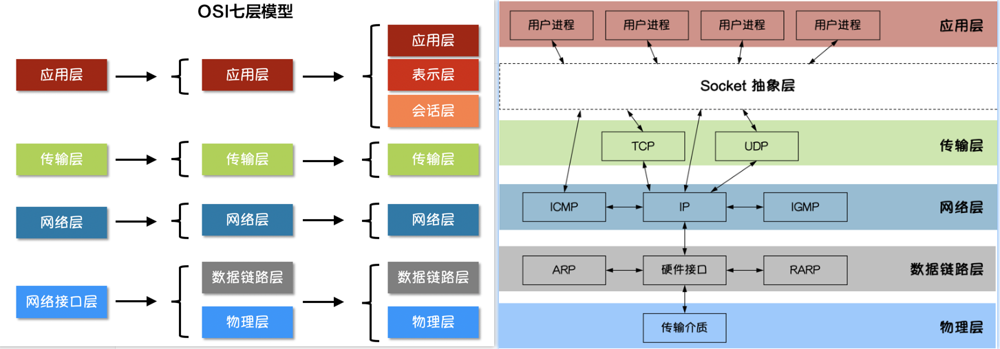
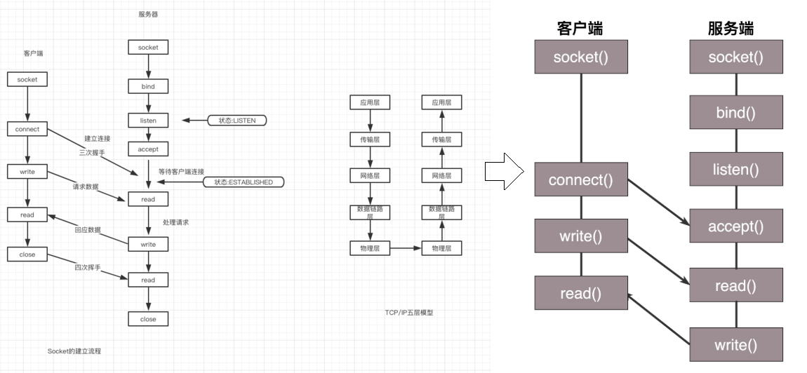
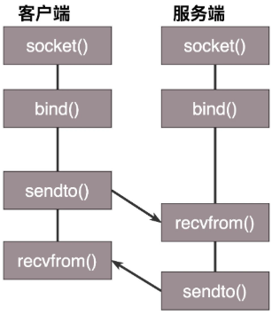

# C# 网络编程


## Socket




>应用层常见协议：HTTP,HTTPS,FTP,SMTP,POP3等
>
>传输层常见协议：TCP、UDP，LVS
>
>网络层常见协议：IP

Socket是应用层与TCP/IP协议族通信的中间软件抽象层，它是一组接口。在设计模式中，Socket其实就是一个门面模式，它把复杂的TCP/IP协议族隐藏在Socket接口后面，对用户来说，一组简单的接口就是全部，让Socket去组织数据，以符合指定的协议。

所以说, 要想能够对客户端http请求进行回应的话, 就首先需要建立起来TCP连接, 也就是socket. 即Socket是连接HTTP与TCP之间的介质。

>套接字(Socket)，就是对网络中不同主机上的应用进程之间进行双向通信的端点的抽象。
>
>可以将套接字看作不同主机间的进程进行双间通信的端点，它构成了单个主机内及整个网络间的编程界面。
>
>Socket(套接字) 可以看成是两个网络应用程序进行通信时，各自通信连接中的端点，这是一个逻辑上的概念。它是网络环境中进程间通信的 API(应用程序编程接口)，也是可以被命名和寻址的通信端点，使用中的每一个套接字都有其类型和一个与之相连进程。通信时其中一个网络应用程序将要传输的一段信息写入它所在主机的 Socket 中，该 Socket 通过与网络接口卡(NIC)相连的传输介质将这段信息送到另外一台主机的 Socket 中，使对方能够接收到这段信息。 Socket 是由 IP 地址和端口结合的，提供向应用层进程传送数据包的机制。


### Socket编程

Socket编程指的是基于 TCP 和 UDP 协议的网络编程，因此分为TCP网络编程和 UDP网络编程。

从低到高关系：TCP/IP协议 =>TCP socket编程 => HTTP

基于 TCP 协议的 Socket 程序函数调用过程：




基于 UDP 协议的 Socket 程序函数调用过程：



#### 补充：TCP通信中的三次握手、四次挥手

SYN（Synchronize Sequence Numbers）：同步序列编号

ACK（Acknowledge character）：即时确认字符

Fin（Finish）：表示关闭连接

ISN（Inital Sequence Number）：初始化序列号

三次握手（建立连接）：

1. 客户端首先发送一个SYN包告诉服务端我的ISN是X；
2. 服务端收到SYN包后，回复给客户端一个ACK确认包，告诉客户端说我收到了；接着服务端顺便也要告诉客户端自己的ISN，于是服务端也发送了一个SYN包告诉客户端我的ISN是Y；
3. 客户端收到后，回复服务端一个ACK确认包说我知道了。

四次挥手（断开连接）：

1. 客户端发送一个FIN包告诉服务端已经没数据需要发给服务端了；
2. 服务端收到后回复一个ACK确认包说我知道了；
3. 然后服务端自己也没数据发送给客户端后，服务端也发送一个FIN包给客户端，告诉客户端也没有数据发给客户端了；
4. 客户端收到后，就会回复一个ACK确认包说我知道了。

#### Socket编程常用的 API 方法作用和参数

- socket()：根据指定的地址族、数据类型和协议来分配一个 socket 的描述字及其所用的资源。

  ```csharp
  int socket(int domain, int type, int protocol);
  
  domain:协议族，常用的有AF_INET、AF_INET6、AF_LOCAL、AF_ROUTE其中AF_INET代表使用ipv4地址
  type:socket类型，常用的socket类型有，SOCK_STREAM、SOCK_DGRAM、SOCK_RAW、SOCK_PACKET、SOCK_SEQPACKET等
  protocol:协议。常用的协议有，IPPROTO_TCP、IPPTOTO_UDP、IPPROTO_SCTP、IPPROTO_TIPC等
  ```

- bind()：把一个地址族中的特定地址赋给 socket

  ```csharp
  int bind(int sockfd, const struct sockaddr *addr, socklen_t addrlen);
  
  sockfd:socket描述字，也就是socket引用
  addr:要绑定给sockfd的协议地址
  addrlen:地址的长度
  ```

- listen()：监听 socket

  ```csharp
  int listen(int sockfd, int backlog);
  
  sockfd:要监听的socket描述字
  backlog:相应socket可以排队的最大连接个数 
  ```

- connect()：连接某个 socket

  ```csharp
  int connect(int sockfd, const struct sockaddr *addr, socklen_t addrlen);
  
  sockfd:客户端的socket描述字
  addr:服务器的socket地址
  addrlen:socket地址的长度
  ```

- accept()： TCP 服务器监听到客户端请求之后，调用 accept()函数取接收请求

  ```csharp
  int accept(int sockfd, struct sockaddr *addr, socklen_t *addrlen);
  
  sockfd:服务器的socket描述字
  addr:客户端的socket地址
  addrlen:socket地址的长度
  ```

- read()：读取 socket 内容
  ```csharp
  ssize_t read(int fd, void *buf, size_t count);
  
  fd:socket描述字
  buf：缓冲区
  count：缓冲区长度
  ```

- write()：向 socket 写入内容，其实就是发送内容

  ```csharp
  ssize_t write(int fd, const void *buf, size_t count);
  
  fd:socket描述字
  buf：缓冲区
  count：缓冲区长度
  ```

- close()

  ```csharp
  int close(int fd);
  socket标记为以关闭 ，使相应socket描述字的引用计数-1，当引用计数为0的时候，触发TCP客户端向服务器发送终止连接请求。
  ```


