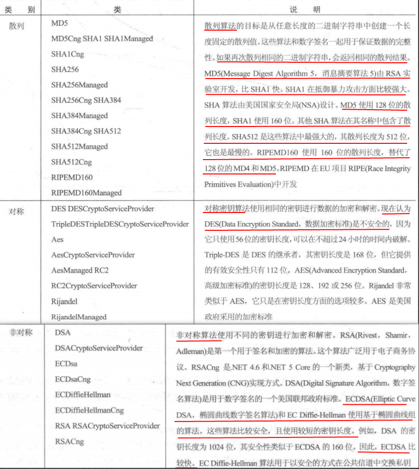

# C#数据应用安全性

确保应用程序安全的用户方面是一个两阶段过程：用户首先需要进行身份验证，再进行授权，以验证该用户是否可以使用需要的资源。

## 验证用户信息（Windows客户端程序）

安全性的两个基本支柱是身份验证和授权。身份验证是标识用户的过程。授权在验证了所标识用户是否可以访问特定资源之后进行。

#### 使用windows Identity

使用windows标识可以验证运行应用程序的用户。一般应用于windows客户端程序。

`WindowsIndentity`类表示一个Windows用户，如果没有用Windows账户标识用户，也可以使用实现了`IIdentity`接口的其他类。通过`IIdentity`接口可以访问用户名、该用户是否通过身份验证，以及验证类型等信息。

不仅仅是`WindowsIdentity`，所有的标识类都实现了`IIdentity`接口。

```c#
public class WindowsIdentity : ClaimsIdentity, ISerializable, IDeserializationCallback, IDisposable{}
public class ClaimsIdentity : IIdentity{}
```

示例：

```c#
/// <summary>
/// 输出WindowsIdentity的信息
/// </summary>
/// <returns></returns>
private static WindowsIdentity ShowIdentityInformation()
{
    // 返回表示当前 Windows 用户的WindowsIdentity 对象。
    WindowsIdentity identity = WindowsIdentity.GetCurrent();
    if (identity == null)
    {
        Console.WriteLine("not a windows identity");
        return null;
    }
    //省份类型
    Console.WriteLine("IdentityType:"+identity);
    //windows登录名
    Console.WriteLine("Name:"+identity.Name);
    //是否对用户进行了身份验证
    Console.WriteLine("Authenticated:"+identity.IsAuthenticated);
    //省份验证类型
    Console.WriteLine("Authentication Type:"+identity.AuthenticationType);
    //该用户是否为匿名账户
    Console.WriteLine("Anonymous?"+identity.IsAnonymous);
    Console.WriteLine("Access Token:"+identity.AccessToken.DangerousGetHandle());
    Console.WriteLine();
    return identity;
}
```

#### Windows Principal

`WindowsPrincipal`是一个包含用户的标识和用户的所属角色的类。它实现了`IPrincipal`接口，`IPrincipal`接口定义了`identity`属性和`IsInRole()`方法，`Identity`属性返回`IIdentity`对象，在`IsInRole()`方法中，可以验证用户是否是指定角色的一个成员。角色是有相同安全权限的用户集合，同时它是用户的管理单元。角色可以是Windows组或自己定义的一个字符串集合。

```c#
public class WindowsPrincipal : ClaimsPrincipal{}
public class ClaimsPrincipal : IPrincipal{}
```

.NET中的`Principal`类有`WindowsPrincipal`、`GenericPrincipal`和`RolePrincipal`。从.NET 4.5开始，这些`Principal`类型派生自`ClaimsPrincipal`类，而`ClaimsPrincipal`实现了接口`IPrincipal`接口。你也可以创建实现了`IPrincipal`接口或派生自`ClaimsPrincipal`类的自定义`Principal`类。

在Windows中，用户所属的所有Windows组映射到角色。重载`IsInRole()`方法，以接受安全标识符、角色字符串或`WindowsBuiltInRole`枚举的值。

示例：

```c#
/// <summary>
/// 输出Principal的额外信息
/// </summary>
/// <param name="identity"></param>
/// <returns></returns>
private static WindowsPrincipal ShowPrincipal(WindowsIdentity identity)
{
    Console.WriteLine("Show principal information");
    WindowsPrincipal principal = new WindowsPrincipal(identity);
    
    if(principal==null)
    {
        Console.WriteLine("not a windows Principal");
        return null;
    }
    //当前用户是否属于内置的角色User
    Console.WriteLine("Users?"+principal.IsInRole(WindowsBuiltInRole.User));
    //当前用户是否属于内置的角色Administrator
    Console.WriteLine("Administrators?"
                      +principal.IsInRole(WindowsBuiltInRole.Administrator));
    Console.WriteLine();
    return principal;
}
//调用代码
WindowsIdentity identity = ShowIdentityInformation();
WindowsPrincipal principal = ShowPrincipal(identity);
```

使用`WindowsPrincipal`可以很容易的访问当前用户及其角色的详细信息，可以利用这些信息决定允许或者拒绝用户执行某些操作。一般在用于Windows客户端程序时，非常有用，例如可以限定只有管理员或指定的Windows用户组才能运行该程序。

#### 使用声明

声明（Claim）提供了比角色更大的灵活性。AD（Active Directory）或其他账户身份验证服务，建立了关于用户的声明。例如：用户名的声明、用户所属的组的声明、或关于年龄的声明等。

示例：

```c#
 /// <summary>
 /// 写入声明信息
 /// </summary>
 /// <param name="claims"></param>
 private static void ShowClaims(IEnumerable<Claim> claims)
 {
     Console.WriteLine("Claims");
     foreach(var claim in claims)
     {
         //获取声明的主题
         Console.WriteLine("Subject:"+claim.Subject);
         //获取声明的颁发者
         Console.WriteLine("Issuer:"+claim.Issuer);
         //获取声明的声明类型
         Console.WriteLine("Type:"+claim.Type);
         //获取声明的值类型
         Console.WriteLine("Value type:"+claim.ValueType);
         //获取声明的值
         Console.WriteLine("Value:"+claim.Value);
         //获取跟此声明关联的其他属性值
         foreach (var prop in claim.Properties)
         {
             Console.WriteLine( $"\tProperty:{prop.Key} {prop.Value}");
         }
         Console.WriteLine();
     }
 }
```

调用：

```c#
WindowsIdentity identity = ShowIdentityInformation();
WindowsPrincipal principal = ShowPrincipal(identity);
//添加声称
identity.AddClaim(new Claim("Age", "24"));
ShowClaims(principal.Claims);

//使用HasClaim测试声明是否可用
identity.HasClaim(c => c.Type == ClaimTypes.Name);
//检索特定的声明
var gropuClaims = identity.FindAll(c => c.Type == ClaimTypes.GroupSid);
```

注意：声明类型可以是一个简单的字符串，例如前面使用的“`Age`”类型。


## 加密数据

对称加密：可以使用同一个密钥进行加密和解密。

不对称加密：使用不同的密钥（公钥/私钥）进行加密和解密。

公钥/私钥总是成对创建。公钥可以由任何人使用，它甚至可以放在Web站点上，但私钥必须安全的加锁。

使用对称密钥的加密和解密算法比使用非对称密钥的算法快得多。对称密钥的问题是密钥必须以安全的方式互换。在网络通信中，一种方式是先使用非对称的密钥进行密钥互换，再使用对称密钥加密通过网络发送的数据。

在.NET Framework中，可以使用`System.Security.Cryptography`命名空间中的类来加密。它实现了几个对称算法和非对称算法。

图片中的表格列出了`System.Security.Cryptography`命名空间中的加密类及其功能：



表格中不同的算法类用于不同的目的，例如有些类以Cng（`Cryptography Next Generation`的简称）作为前缀或后缀，CNG是本机Crypto API的更新版本，这个API可以使用基于提供程序的模型，编写独立于算法的程序。

没有`Cng`、`Managed`或`CryptoServiceProvider`后缀的类是抽象基类，如`MD5`。

`Managed`后缀表示这个算法用托管代码实现，其他类可能封装了本地Windows API调用。

`CryptoServiceProvider`后缀用于实现了抽象基类的类。

`Cng`后缀用于利用新Cryptography CNG API的类。

#### 使用ESDSA算法创建和验证签名

ECDSA比较安全，且使用较短的密钥长度，与DSA相比，ECDSA更快更安全。

下面的示例中，首先创建一个签名，并使用私钥加密，然后使用公钥访问。

```c#
using System;
using System.Security.Cryptography;
using System.Text;

namespace Safety_Sample
{
    /*
     * 使用ECDSA算法进行签名。Alice创建一个签名，它用Alice的私钥加密，可以使用Alice的公钥访问
     */
    internal class SigningDemo
    {
        private CngKey _aliceKeySignature;
        private byte[] _alicePubKeyBlob;
        public void Run()
        {
            //创建Alice的密钥
            InitAliceKeys();
            byte[] aliceData = Encoding.UTF8.GetBytes("Alice");
            //给字符串签名
            byte[] aliceSignature = CreateSignature(aliceData, _aliceKeySignature);
            //将加密的签名写入控制台
            Console.WriteLine("Alice created signature:" + Convert.ToBase64String(aliceSignature));
            //使用公钥验证该签名是否真的来自于Alice
            if (VerifySignature(aliceData, aliceSignature, _alicePubKeyBlob))
            {
                Console.WriteLine("Alice signature verified successfully");
            }
        }
        /// <summary>
        /// 验证签名是否正确，使用公钥检查签名
        /// </summary>
        /// <param name="data"></param>
        /// <param name="signature">签名后的数据</param>
        /// <param name="pubKey">公钥字节数组</param>
        /// <returns></returns>
        private bool VerifySignature(byte[] data, byte[] signature, byte[] pubKey)
        {
            bool retValue = false;
            //导入CngKey对象
            using(CngKey key = CngKey.Import(pubKey, CngKeyBlobFormat.GenericPublicBlob))
            using (var signingAlg=new ECDsaCng(key))
            {
#if NET46
                retValue = signingAlg.VerifyData(data, signature);
                signingAlg.Clear();
#else
                //验证签名
                retValue = signingAlg.VerifyData(data, signature, HashAlgorithmName.SHA512);
#endif
            }
            return retValue;
        }

        /// <summary>
        /// 创建签名
        /// </summary>
        /// <param name="data"></param>
        /// <param name="key"></param>
        /// <returns></returns>
        private byte[] CreateSignature(byte[] data, CngKey key)
        {
            byte[] signature;
            //使用ECDsaCng创建签名,ECDsaCng的构造函数接收包含公钥和私钥的CngKey类对象
            using (ECDsaCng signingAlg = new ECDsaCng(key))
            {
#if NET46
                signature = signingAlg.SignData(data);
                signingAlg.Clear();
#else
                //对数据进行签名（加密）
                signature = signingAlg.SignData(data, HashAlgorithmName.SHA512);
#endif
            }
            return signature;
        }

        /// <summary>
        /// 创建新的密钥对
        /// </summary>
        private void InitAliceKeys()
        {
            //创建密钥对，CngKey包含公钥和私钥数据
            _aliceKeySignature = CngKey.Create(CngAlgorithm.ECDsaP521);
            
            //导出密钥对中的公钥，后面将要使用它来验证签名
            _alicePubKeyBlob = _aliceKeySignature.Export(CngKeyBlobFormat.GenericPublicBlob);
        }
    }
}
```

在上述代码中，千万不要使用`Encoding`类把加密的数据转换为字符串，因为`Encoding`类验证和转换`Unicode`不允许使用的无效值，因此把字符串转换回字节数组会得到另一个结果。

在创建密钥对时，除了使用`CngKey.Create()`方法外，还可以使用`CngKey.Open()`方法打开存储在密钥存储器中的已有密钥。

#### 使用EC Diffie-Hellman算法实现安全的数据交换

下面的示例相对复杂，使用EC Diffie-Hellman算法交换一个对称密钥，以进行安全的传输。

```c#
using System;
using System.IO;
using System.Security.Cryptography;
using System.Text;
using System.Threading.Tasks;

namespace Safety_Sample
{
    /*
     * 使用EC Diffie-Hellman算法交换一个对称密钥，以进行安全的传输
     */

    internal class SecureTransferDemo
    {
        private CngKey _aliceKey;
        private CngKey _bobKey;

        private byte[] _alicePubKeyBlob;
        private byte[] _bobPubKeyBlob;

        public static void Run()
        {
            SecureTransferDemo std = new SecureTransferDemo();
            std.RunAsync().Wait();
        }

        public async Task RunAsync()
        {
            try
            {
                CreateKeys();
                byte[] encrytpedData = await AliceSendsDataAsync("This is a secret message for Bob");
                await BobReceivesDataAsync(encrytpedData);
            }
            catch (Exception ex)
            {
                Console.WriteLine(ex.Message);
            }
        }

        /// <summary>
        /// 使用EC Diffie-Hellman512 算法创建密钥对
        /// </summary>
        private void CreateKeys()
        {
            _aliceKey = CngKey.Create(CngAlgorithm.ECDiffieHellmanP521);
            _bobKey = CngKey.Create(CngAlgorithm.ECDiffieHellmanP521);
            _alicePubKeyBlob = _aliceKey.Export(CngKeyBlobFormat.EccPublicBlob);
            _bobPubKeyBlob = _bobKey.Export(CngKeyBlobFormat.EccPublicBlob);
        }

        /// <summary>
        /// 加密
        /// </summary>
        /// <param name="message"></param>
        /// <returns></returns>
        private async Task<byte[]> AliceSendsDataAsync(string message)
        {
            Console.WriteLine("Alice sends message:" + message);
            byte[] rawData = Encoding.UTF8.GetBytes(message);
            byte[] encryptedData = null;
            //创建ECDiffieHellmanCng对象，并使用Alice的密钥对初始化它
            using (ECDiffieHellmanCng aliceAlgorithm = new ECDiffieHellmanCng(_aliceKey))
            using (CngKey bobPubKey = CngKey.Import(_bobPubKeyBlob, CngKeyBlobFormat.EccPublicBlob))
            {
                //使用Alice的密钥对和Bob的公钥创建一个对称密钥，返回的对称密钥使用对称算法AES加密数据
                byte[] symmKey = aliceAlgorithm.DeriveKeyMaterial(bobPubKey);
                Console.WriteLine("Alice creates thsi symmetric key with Bobs public key Information:" + Convert.ToBase64String(symmKey));
                //
                using (AesCryptoServiceProvider aes = new AesCryptoServiceProvider())
                {
                    aes.Key = symmKey;
                    aes.GenerateIV();
                    using (ICryptoTransform encryptor = aes.CreateEncryptor())
                    using (MemoryStream ms = new MemoryStream())
                    {
                        using (CryptoStream cs = new CryptoStream(ms, encryptor, CryptoStreamMode.Write))
                        {
                            await ms.WriteAsync(aes.IV, 0, aes.IV.Length);
                            cs.Write(rawData, 0, rawData.Length);
                        }
                        encryptedData = ms.ToArray();
                    }
                    //在访问内存流中的加密数据之前，必须关闭加密流，否则加密数据就会丢失最后的位
                    aes.Clear();
                }
            }

            Console.WriteLine("Alice:message is encrypted:" + Convert.ToBase64String(encryptedData));
            Console.WriteLine();
            return encryptedData;
        }

        /// <summary>
        /// 解密
        /// </summary>
        /// <param name="encrytpedData"></param>
        /// <returns></returns>

        private async Task BobReceivesDataAsync(byte[] encrytpedData)
        {
            Console.WriteLine("Bob receives encrypted data");
            byte[] rawData = null;
            //读取未加密的初始化矢量
            AesCryptoServiceProvider aes = new AesCryptoServiceProvider();
            //BlockSize属性返回块的位数，除以8就可以计算出字节数。
            int nBytes = aes.BlockSize / 8;
            byte[] iv = new byte[nBytes];
            for (int i = 0; i < iv.Length; i++)
            {
                iv[i] = encrytpedData[i];
            }
            //实例化一个ECDiffieHellmanCng对象，使用Alice的公钥，从DeriveKeyMaterial()方法中返回对称密钥
            using (ECDiffieHellmanCng bobAlgorithm = new ECDiffieHellmanCng(_bobKey))
            using (CngKey alicePubKey = CngKey.Import(_alicePubKeyBlob, CngKeyBlobFormat.EccPublicBlob))
            {
                byte[] symmKey = bobAlgorithm.DeriveKeyMaterial(alicePubKey);
                Console.WriteLine("Bob creates this symmetric key with Alices public key information:" + Convert.ToBase64String(symmKey));

                aes.Key = symmKey;
                aes.IV = iv;
                using (ICryptoTransform decryptor = aes.CreateDecryptor())
                using (MemoryStream ms = new MemoryStream())
                {
                    using (CryptoStream cs = new CryptoStream(ms, decryptor, CryptoStreamMode.Write))
                    {
                        await cs.WriteAsync(encrytpedData, nBytes, encrytpedData.Length - nBytes);
                    }
                    rawData = ms.ToArray();
                    Console.WriteLine("Bob decrypts mesage to:" + Encoding.UTF8.GetString(rawData));
                }
                aes.Clear();
            }
        }
    }
}
```

关于该示例的详细说明，请参阅原书24.3.2章节。

#### 使用RSA散列签名

RSA是一个广泛使用的非对称算法，在.NET中使用`RSACng`类。`RSACng`类基于CNG API，其用法类似于之前使用的`ECDSACng`类。

示例代码如下，在该示例中，Alice创建一个文档，散列它，以确保它不会改变，给它加上签名，保证是Alice生成了文档。Bob接收文件，并检查Alice的担保，以确保文件没有被篡改。

```c#
using System;
using System.Linq;
using System.Security.Cryptography;
using System.Text;

namespace Safety_Sample
{
    /*
     * 该示例中，Alice创建一个文档，散列它，以确保它不会改变，给它加上签名，保证是Alice生成了文档。Bob接收文件，并检查Alice的担保，以确保文件没有被篡改
     */

    internal class RSADemo
    {
        private CngKey _aliceKey;
        private byte[] _alicePubKeyBlob;

        public void Run()
        {
            //创建一个文档、散列码、签名
            AliceTasks(out byte[] document, out byte[] hash, out byte[] signature);
            BobTasks(document, hash, signature);
        }

        private void AliceTasks(out byte[] data, out byte[] hash, out byte[] signature)
        {
            //创建Alice所需的密钥
            InitAliceKeys();
            //将消息转换为一个字节数组
            data = Encoding.UTF8.GetBytes("Best greetings from Alice");
            //散列字节数组
            hash = HashDocument(data);
            //添加一个签名
            signature = AddSignatureToHash(hash, _aliceKey);
        }

        /// <summary>
        /// 使用RSA算法创建密钥
        /// </summary>
        private void InitAliceKeys()
        {
            //创建公钥和私钥
            _aliceKey = CngKey.Create(CngAlgorithm.Rsa);
            //公钥只提供给Bob，所以公钥使用Export方法提取
            _alicePubKeyBlob = _aliceKey.Export(CngKeyBlobFormat.GenericPublicBlob);
        }

        /// <summary>
        /// 创建散列码
        /// </summary>
        /// <param name="data"></param>
        /// <returns></returns>
        private byte[] HashDocument(byte[] data)
        {
            /*
             * 散列码使用一个散列算法SHA384类创建
             * 不管文档存在多久，散列码的长度总是相同
             * 再次为相同的文档创建散列码，会得到相同的散列码
             * Bob需要在文档上使用相同的算法，如果返回相同的散列码，就说明文档没有改变
             */

            using (SHA384 hashAlg = SHA384.Create())
            {
                return hashAlg.ComputeHash(data);
            }
        }

        /// <summary>
        /// 添加签名
        /// </summary>
        /// <param name="hash"></param>
        /// <param name="key"></param>
        /// <returns></returns>
        private byte[] AddSignatureToHash(byte[] hash, CngKey key)
        {
            /*
             * 添加签名，可以保证文档来自Alice
             *
             */
            //使用RSACng给散列签名
            using (RSACng signingAlg = new RSACng(key))
            {
                //给散列签名时，SignHash方法需要了解散列算法,此处基于HashAlgorithmName.SHA384算法传入
                byte[] signed = signingAlg.SignHash(hash, HashAlgorithmName.SHA384, RSASignaturePadding.Pss);
                return signed;
            }
        }

        /// <summary>
        /// 接收文档数据、散列码和签名
        /// </summary>
        /// <param name="data"></param>
        /// <param name="hash"></param>
        /// <param name="signature"></param>
        private void BobTasks(byte[] data, byte[] hash, byte[] signature)
        {
            //导入Alice的公钥
            CngKey aliceKey = CngKey.Import(_alicePubKeyBlob, CngKeyBlobFormat.GenericPublicBlob);
            //验证签名是否有效
            if (!IsSignatureValid(hash, signature, aliceKey))
            {
                Console.WriteLine("signature not valid");
                return;
            }
            //验证文档是否不变
            if (!IsDocumentUnchanged(hash, data))
            {
                Console.WriteLine("doucment was changed");
                return;
            }
            Console.WriteLine("signature valid,doucment unchanged");
            Console.WriteLine("document from Alice:" + Encoding.UTF8.GetString(data));
        }

        /// <summary>
        /// 验证签名是否有效
        /// </summary>
        /// <param name="hash"></param>
        /// <param name="signature"></param>
        /// <param name="key"></param>
        /// <returns></returns>
        private bool IsSignatureValid(byte[] hash, byte[] signature, CngKey key)
        {
            using (RSACng signingAlg = new RSACng(key))
            {
                return signingAlg.VerifyHash(hash, signature, HashAlgorithmName.SHA384, RSASignaturePadding.Pss);
            }
        }

        /// <summary>
        /// 验证文档数据是否发生了改变
        /// </summary>
        /// <param name="hash"></param>
        /// <param name="data"></param>
        /// <returns></returns>
        private bool IsDocumentUnchanged(byte[] hash, byte[] data)
        {
            byte[] newHash = HashDocument(data);
            //验证散列码是否相同
            return newHash.SequenceEqual(hash);
        }
    }
}
```

#### 实现数据的保护（略）

最新的基于`Microsoft.AspNetCore.DataProtection`命名空间下的类实现，可以用于Web 数据的保护。由于版本更新问题，原书中的示例已不能使用。具体见原书24.3.4章节。


## 文件资源的访问控制

> 在操作系统中，资源（如文件和注册表键，以及命名管道的句柄）都使用访问控制列表（ACL）来保护。
>
> 资源有一个关联的安全描述符，安全描述符包含了资源拥有者的信息，并引用了两个访问控制列表：自由访问控制列表（`Discretionary Access Control List`，DACL）和系统访问控制列表（`System Access Control List`，SACL）。DACL用来确定谁有访问权；SACL用来确定安全事件日志的审核规则。
>
> ACL包含一个访问控制项（`Access Control Entries`，ACE）列表。ACE包含类型、安全标识符和权限。
>
> 在DACL中，ACE的类型可以运行访问或拒绝访问。

读取和修改访问控制的类在`System.Security.AccessControl`命名空间下。

下面的示例演示了如何读取和设置文件的控制权限：

```c#
using System;
using System.IO;
using System.Security.AccessControl;
using System.Security.Principal;

namespace Safety_Sample
{
    internal class SecurityDemo
    {
        /*
         * 如何从文件中读取访问控制列表（访问权限）
         */

        public static void Run(string[] args)
        {
            string filename = null;
            if (args.Length == 0)
            {
                return;
            }

            filename = args[0];

            using (FileStream stream = File.Open(filename, FileMode.Open))
            {
                //获取文件的访问控制列表（ACL）
                FileSecurity securityDescriptor = stream.GetAccessControl();
                //返回DACL
                /*
                 * GetAccessRules方法可以确定是否应使用继承的访问规则，
                 * 最后一个参数定义了应返回的安全标识符的类型，可能的类型有NTAccount和SecurityIdentifier,
                 * 这两个类都表示用户或组
                 * NTAccount类按名称查找安全对象
                 * SecurityIdentifier类按唯一的安全标识符查找安全对象
                 */
                AuthorizationRuleCollection rules = securityDescriptor.GetAccessRules(true, true, typeof(NTAccount));
                //返回SACL
                //securityDescriptor.GetAuditRules();
                //AuthorizationRule对象是ACE的.NET表示
                foreach (AuthorizationRule rule in rules)
                {
                    FileSystemAccessRule fileRule = rule as FileSystemAccessRule;
                    Console.WriteLine("Access type:" + fileRule.AccessControlType);
                    Console.WriteLine("Rights:" + fileRule.FileSystemRights);
                    Console.WriteLine("Identity:" + fileRule.IdentityReference.Value);
                    Console.WriteLine();
                }
            }
        }

        /// <summary>
        /// 设置访问权限
        /// </summary>
        /// <param name="filename"></param>
        private void WriteAcl(string filename)
        {
            NTAccount salesIdentity = new NTAccount("Sales");
            NTAccount developersIdentity = new NTAccount("Developers");
            NTAccount everyOneIdentity = new NTAccount("Everyone");
            //拒绝Sales组写入访问权限
            FileSystemAccessRule salesAce = new FileSystemAccessRule(salesIdentity, FileSystemRights.Write, AccessControlType.Deny);
            //给Everyone组提供了读取访问权限
            FileSystemAccessRule everyoneAce = new FileSystemAccessRule(everyOneIdentity, FileSystemRights.Read, AccessControlType.Allow);
            //给Developers组提供了全部控制权限
            FileSystemAccessRule developersAce = new FileSystemAccessRule(developersIdentity, FileSystemRights.FullControl, AccessControlType.Allow);

            FileSecurity securityDescriptor = new FileSecurity();
            securityDescriptor.SetAccessRule(everyoneAce);
            securityDescriptor.SetAccessRule(developersAce);
            securityDescriptor.SetAccessRule(salesAce);

            File.SetAccessControl(filename, securityDescriptor);
        }
    }
}
```

注：可以打开文件的属性窗口，选择“安全”选项卡进行验证。

## 使用数字证书对程序集进行签名（略）

一般用于C/S客户端程序。具体参见原书24.5章节。


------


### 参考资源

- 《C#高级编程（第10版）》


本文后续会随着知识的积累不断补充和更新，内容如有错误，欢迎指正。  

最后一次更新时间 ：2018-09-04

------


