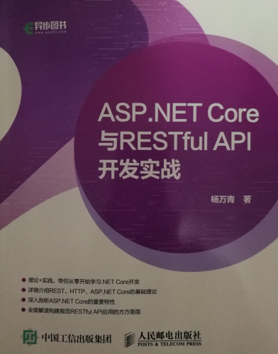

# 《ASP.NET Core 与RESTful API开发实战》知识索引

书名：《ASP.NET Core 与RESTful API开发实战》

## REST相关的6个架构约束

来源：第一章 REST简介；1.1.3 REST约束；P2

**遵循这些约束的Web服务才是真正的REST风格的服务（RESTful服务）**

## REST风格与RPC风格的区别

来源：第一章 REST简介；1.1.4 对REST的错误理解；P5

## 媒体类型（Content Type，或MIME类型）的介绍

来源：第一章 REST简介；1.2.3 媒体类型；P7

用于指定资源的内容类型（Content Type），也称为媒体类型。

其语法为type/subtype，它由类型与子类型两个字符串构成，中间用“/”分隔，并且不允许空格存在。

## HTTP方法介绍

来源：第一章 REST简介；1.2.5 HTTP方法；P9

GET、POST、PUT、DELETE、PATCH、HEAD和OPTIONS，各种之间的介绍和不同。

比较重要的：PUT和POST的区别和使用；PUT和PATCH的区别和使用；HEAD与GET的区别和使用；

## HTTP状态码

来源：第一章 REST简介；1.2.7 状态码；P12

常见的HTTP状态码介绍。