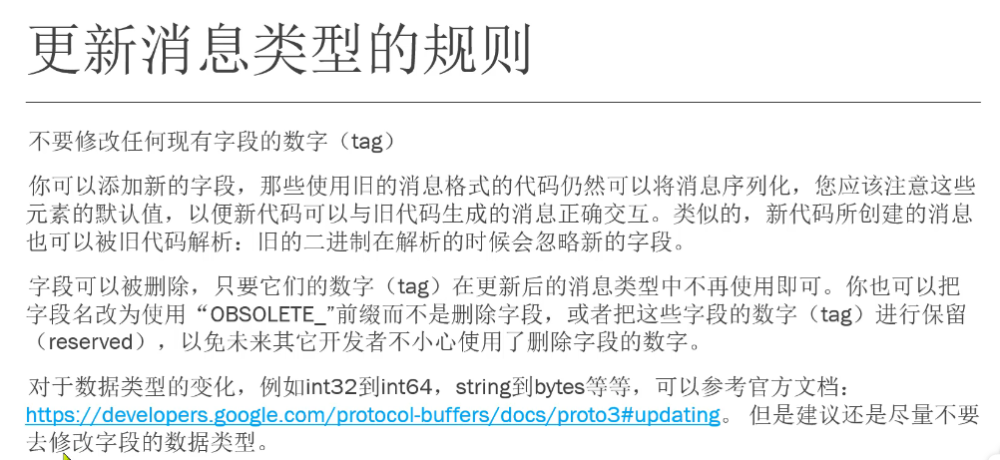

# gRPC 在 .NET 中的使用


### 身份认证

这里指的不是用户的身份认证，而是指多个server和client之间，他们如何识别出来谁是谁，并且能安全的进行消息传输。

在身份认证这方面：gRPC一共有4中身份认证的机制：

- 不采取任何措施的连接，也就是不安全的连接。
- TLS/SSL连接。
- 基于Google Token的身份认证。
- 自定义的身份认证提供商。


### RPC 模式

- 简单模式（Simple RPC）：这种模式最为传统，即客户端发起一次请求，服务端响应一个数据。

  ```protobuf
  rpc 方法名(请求类型) returns(响应类型)  //即使不需要参数，仍然需要传递一个空的请求类型
  ```

- 服务端数据流模式（Server-side streaming RPC）：这种模式是客户端发起一次请求，服务返回一段连续的数据流。例如，客户端向服务端发送一个股票代码，服务端就把该股票的实时数据源源不断的返回给客户端。

  ```protobuf
  rpc 方法名(请求类型) returns(stream 响应类型)
  ```

- 客户端数据流模式（Client-side streaming RPC）：与服务端数据流模式相反，这次是客户端源源不断的向服务端发送数据流，而在发送结束后，由服务端返回一个响应。例如，物联网终端向服务器报送数据。

  ```
  rpc 方法名(stream 请求类型) returns(响应类型)
  ```

- 双向数据流模式（Bidirectional streaming RPC）：客户端和服务端都可以向对方发送数据流，这个时候双方的数据可以同时互相发送，也就是可以实现实时交互。例如，聊天机器人。

  ```
  rpc 方法名(stream 请求类型) returns(stream 响应类型)
  ```





### proto文件管理方案

- 使用单独的Git仓库管理proto文件
- 使用 git submodule方式，将proto文件集成到工程目录中
- 