# JavaScript 异步编程

JavaScript常用的异步方式：

- 定时器
- Promise
- async 语法糖，本质还是Promise。


## Promise


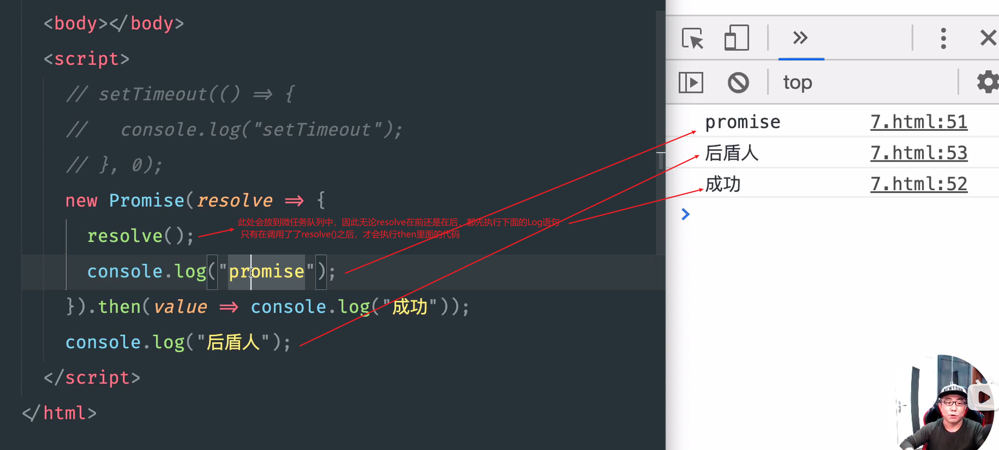

then函数里面的任务称为微任务。resolve中的代码块称为宏任务，宏任务中调用resolve()函数，将会触发then中的微任务的执行。


### Promise 语法

#### 完整语法

```js
new Promise((resolve, reject) => {
        //resolve("解决状态");
         reject("拒绝状态");
      }).then(
        (value) => {
          console.log(value);
        },
        (reason) => {
          console.log(reason);
        }
      ).catch(error =>{
    	//捕获then中抛出的异常
    		console.log(error);
        })
		.finally(()=>{
    //无论成功失败都会执行
    		console.log("");
		});
```

resolve和reject只能触发一个。

Promise和then是配套出现的。catch语句通常放在要捕获的then语句之后，用来捕获异常。

示例一：

```js
let p1 = new Promise((resolve, reject) => {
        resolve("发送消息");
        //reject("拒绝消息");
      })
        .then(
          (value) => {
            console.log(value);
            return "哈哈哈哈哈哈哈";
          },
          (reason) => {
            console.log("error:", reason);
            return "呜呜呜呜呜呜呜呜呜";
          }
        )
        .then(
          (value) => {
            console.log("接收上一个Promise发送过来的消息：", value);
          },
          (reason) => console.log("拒绝的消息：", reason)
        );
```

输出：

```
发送消息
promise.html:28 接收上一个Promise发送过来的消息： 哈哈哈哈哈哈哈
```

在then中返回promise实现链式调用：

```js
let p1 = new Promise((resolve, reject) => {
        resolve("发送消息");
        //reject("拒绝消息");
      })
        //代码块T1
        .then(
          (value) => {
            console.log(value);
            // 代码块V1，此处直接返回Promise对象，对该对象的处理（成对出现的then语句）为代码块T2
            return new Promise((resolve, reject) => {
              resolve("哈哈哈哈哈哈哈");
            });
          },
          (reason) => {
            console.log("error:", reason);
            return "呜呜呜呜呜呜呜呜呜";
          }
        )
        //代码块T2，是对上述代码块V1中返回的Promise的处理，从而实现链式调用
        .then(
          (value) => {
            //区域B1
            console.log("接收上一个Promise发送过来的消息：", value);
          },
          (reason) => console.log("拒绝的消息：", reason)
        );
```

输出：

```
发送消息
promise.html:32 接收上一个Promise发送过来的消息： 哈哈哈哈哈哈哈
```

==只要在then1中返回promise，在then1之后的then2就是对返回的promise的处理。即后面的then就是对前面返回的promise的处理。==

尽量避免then中嵌套then，例如下述这种不推荐：

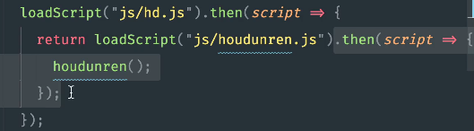

而应该改为：

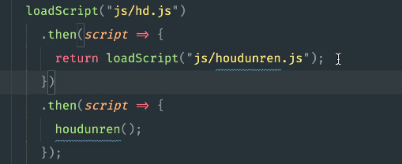


#### 简略语法

```js
Promise.resolve("哈哈哈哈哈哈").then(value=>{console.log(value)});
```


### Promise 示例

#### 示例一，根据Promise动态加载图片：

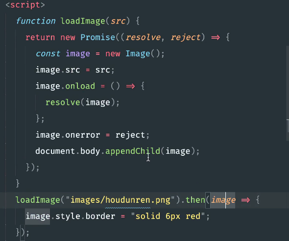

#### 示例二，动态加载js文件，并调用js文件中的方法：

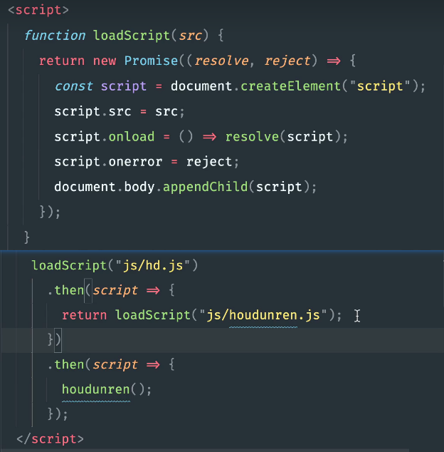

#### 示例三，根据Promise实现Ajax请求后的链式操作：

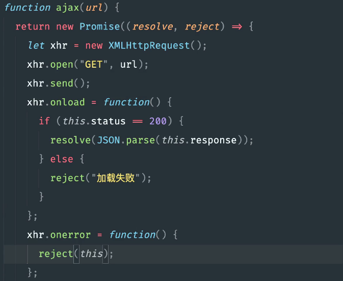

调用方式：

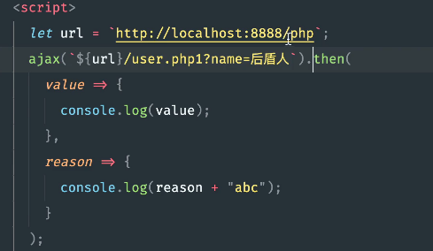

还可以在then中，继续调用Ajax返回promise，从而在后面的then中对返回的promise进行处理：

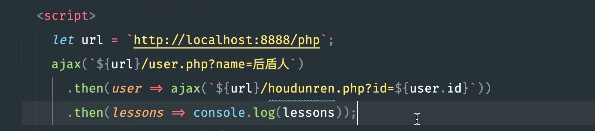


## async 与 await

async 和 await 的本质使用的是Promise，只不过是语法糖而已。

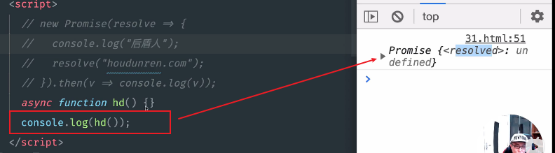

当async方法中直接返回一个字符串，本质是返回了一个Promise对象，之后可以直接调用then函数，接收完成传递的对象。

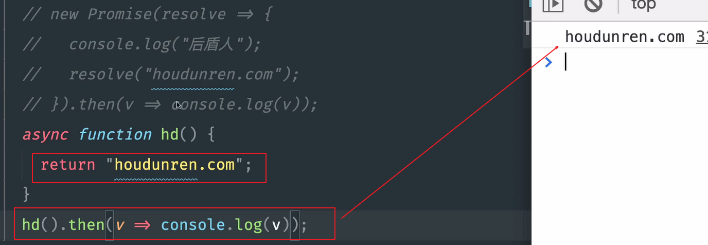

可以直接在async函数中返回Promise，需要注意必须要调用resolve函数来通知完成。

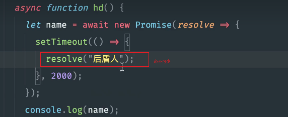


Promise对象的then处理，使用await语法糖。

await必须放在async函数中使用。

示例，休眠函数的封装和调用：

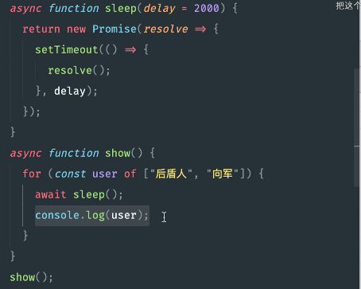

async声明和使用的几种方式：

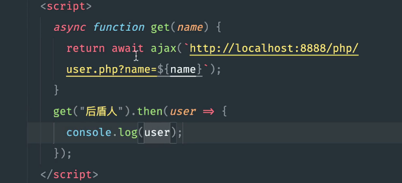

async中的错误处理：

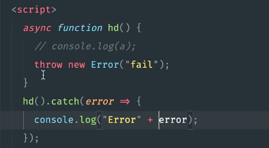

await的错误处理：调用Try...catch：

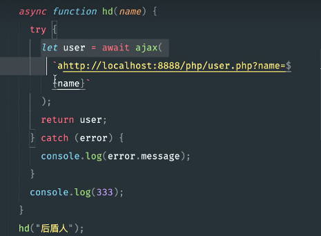

await并行执行：

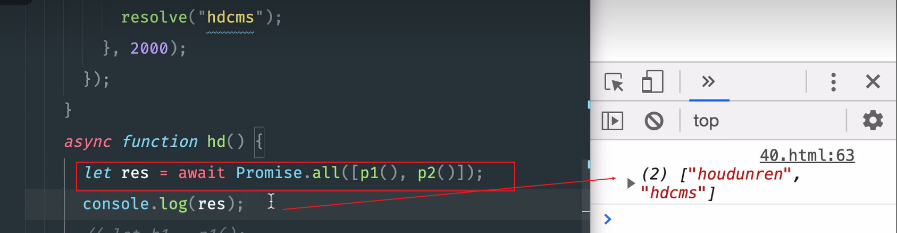


## 定时器

### setInterval

重复执行的定时器的使用：

```js
//   定时器封装，主线程必须先执行完成之后，才能执行定时器中的任务
    function interval(callback, delay = 100) {
        let id = setInterval(() => callback(id), delay);
    }

    interval(timeId => {
        const div = document.querySelector("div");
        let left = parseInt(window.getComputedStyle(div).left);
        div.style.left = left + 10 + "px";
        console.log(left);
        if (left >= 200) {
            clearInterval(timeId);

            interval(timeId => {
                let width = parseInt(window.getComputedStyle(div).width);
                div.style.width = width - 5 + "px";
                if (width <= 20) {
                        clearInterval(timeId);
                }
            }, 100);


        }

    })
```

上述通过Promise进行封装：

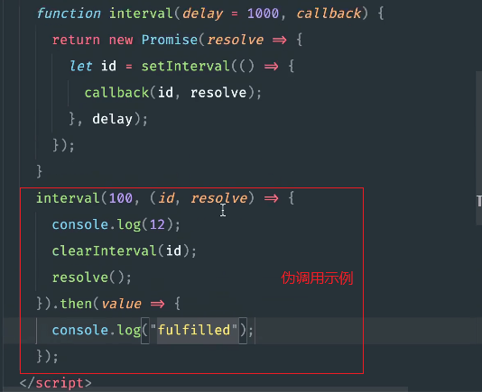

对封装的进行调用：

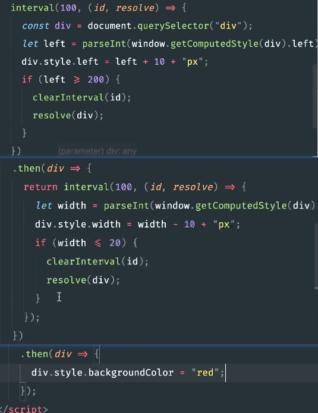

### setTimeout

使用Promise封装实现Timeout函数：


使用方式：2秒钟之后输出，再过2秒再次输出：

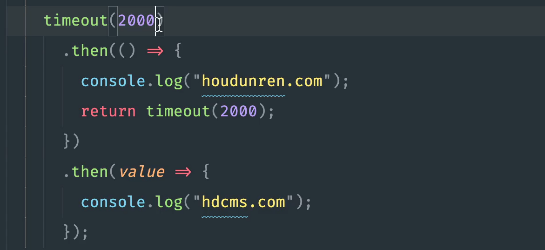


----

- [Promise](https://www.houdunren.com/doc/article/4/40)
- [JS 异步_img.onload异步-CSDN博客](https://blog.csdn.net/qq_34115899/article/details/106628678)