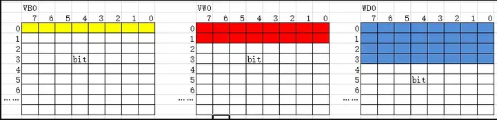

# PLC 地址模型

地址的单位，从小到大：

- 位（b，bit）
- 字节（B，Byte），1B=8b
- 字（W，Word），1W=2B
- 双字（D，Double Word），1D=2W=4B

西门子PLC的存储区以字节为单位：

数值表示起始位置（从0开始）。

V0.0：表示第0个字节第0个位；

VB0：表示第0个字节；

VW6：表示由2个字节组成，由VB6、VB7组成。

VD4：表示由4个字节组成，由VB4，VB5、VB6、VB7组成。

由于不同单位代表的空间有重叠：

- VW0=VB0+VB1
- VD0=VW0+VW1=VB0+VB1+VB2+VB3

所以，当使用了VB0后，不建议使用VW0，数据存储空间有重叠，会出现覆盖现象，造成数据混乱。

所以，在使用了VB0后，若要使用字的空间时，可以使用VW1(指第2、3行)，而不是VW0,这样，VB0和VW1在存储空间上，没有叠加部分，不会出现互相干扰的情况。VD的使用和VB、VW的干扰是同理的。

以VD100为例：

VD100表示使用了VB100开头的四个字节，分别是VB100，VB101，VB102，VB103，这四个字节已经被占用了。

VD101表示使用了VB101开头的四个字节，分别是VB101，VB102，VB103，VB104，这四个字节已经被占用了。

VD102表示使用了VB102开头的四个字节，分别是VB102，VB103，VB104，VB105，这四个字节已经被占用了。

VD103表示使用了VB103开头的四个字节，分别是VB103，VB104，VB105，VB107，这四个字节已经被占用了。

可以看到，从VD100到VD103，之间始终有重叠的部分，使用了VD100之后，VD101，VD102，VD103就不要再用了，需要使用的时候就要从VD104开头了。

所以在使用的时候，遵循下述规矩：

- 凡是双字VD，最后结尾都是0，4，8，12 ，16，20……等4的倍数
- 凡是字VW，结尾都是2的倍数
- 凡是位，都是带小数点的

