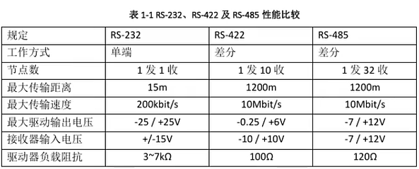
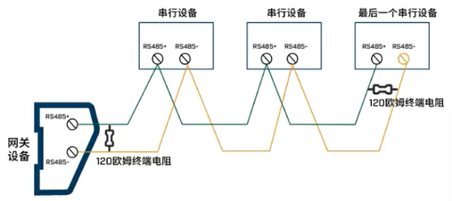
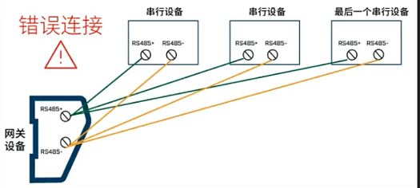

# Modbus 通信协议介绍

Modbus是一种通信协议，由莫迪康（Modicon，现施耐德电气 Schneider Electric）公司于1979年发布，旨在为可编程逻辑控制通信提供标准。Modbus是为了解决PLC控制器之间通信的问题。

Modbus 协议特点：

- 免费、开放、无版权要求
- 报文（协议消息帧）格式简单紧凑，通俗易懂，厂商容易集成
- 不仅可以使用在串口通信，比如RS232、RS485、RS422，还可以用于以太网、光纤、蓝牙、无线等多种通信介质。

Modbus协议是一种应用层报文传输协议，包括ASCII、RTU、TCP三种报文类型。

Modbus报文帧分为：

- RTU
- ASCII
- TCP

通信介质：

- 串口：串口通信的接口标准有RS232（扫码枪、仪表）、RS485（PLC、仪表）、RS422（不常用）
- 以太网：TCP、UDP

**串口传输通常选择RTU或ASCII模式；以太网传输一般使用TCP模式**。

根据不同报文帧和通信介质分为以下通信协议：

- ==ModbusRTU==：RTU报文帧+串口（常用）
- ModbusRTUOverTCP：RTU报文帧 + TCP
- ModbusRTUOverUDP：RTU报文帧 + UDP
- ModbusASCII：ASCII报文帧 + 串口
- ModbusASCIIOverTCP：ASCII报文帧 + TCP
- ModbusASCIIOverUDP：ASCII报文帧 + UDP
- ==ModbusTCP==：TCP报文帧 + TCP（常用）
- ModbusUDP：TCP报文帧 + UDP

由于不够安全，TCP报文帧几乎很少通过串口通信，而是通过以太网。

## Modbus 存储区和功能码

### 存储区

Modbus协议主要用于实现不同设备间的数据交互和通信，为了管理数据，引入了存储区的概念。类似于可编程逻辑控制器（PLC）中的存储区。

不同品牌的PLC定义了各自特有的存储区，比如：

- 西门子PLC：定义了M、Q、V、DB存储区
- 三菱PLC：定义了X、Y、M、D、W存储区

#### 存储区的分类

Modbus协议的存储区根据数据类型分为：

- 布尔类型：用于存储布尔变量，被称为**线圈**。
- 字类型：用于存储一般数据，被称为**寄存器**。

根据存储区的读写特性，存储区分为：

- 只读类型：只读存储区仅允许读取数据，不能写入，在Modbus协议中，只读存储区被称为**输入**。
- 可读可写类型：可读可写存储区允许读取和写入数据，在Modbus协议中，可读可写存储区被称为**输出**。

由此根据数据类型和读写特性，Modbus协议规定了四种类型存储区：

| 存储区名称                 | 数据类型  | 读写特性 | 存储区代号 |
| -------------------------- | --------- | -------- | ---------- |
| 输出线圈                   | 布尔/线圈 | 可读可写 | 0区        |
| 输入线圈                   | 布尔/线圈 | 只读     | 1区        |
| 输入寄存器                 | 字/寄存器 | 只读     | 3区        |
| 输出寄存器（保持型寄存器） | 字/寄存器 | 可读可写 | 4区        |

- 输出寄存器在Modbus协议规范中一般称为**保持型寄存器**。
- 根据Modbus协议的规定，每个存储区都有一个特定的代号，用数字形式表示，注意没有2区。

注意：这里的输入和输出不是字面意思“输入”和“输出”，而是应该理解为只读和可读写。

### 功能码

上述四个存储区，根据读取和写入操作，组合出下述几种行为：

- 读取输入线圈
- 读取输出线圈
- 读取输入寄存器
- 读取输出寄存器（读取保持型寄存器）
- 写入输出线圈
  - 写入单个线圈
  - 写入多个线圈
- 写入输出寄存器
  - 写入单个寄存器
  - 写入多个寄存器

注意：输入线圈和输入寄存器是只读的，不能进行写入，因此可以进行写入操作的存储区只有输出线圈和输出寄存器。而写入方式有单个写入和多个写入。因此写入操作最终分为四种行为，即写入单个线圈，写入多个线圈，写入单个寄存器，写入多个寄存器。

以上8中行为编号，形成Modbus的8大功能码：

| 功能码    | 说明                                   |
| --------- | -------------------------------------- |
| 0x 01     | 读取输出线圈                           |
| 0x 02     | 读取输入线圈                           |
| 0x 03     | **读取保持型寄存器**（读取输出寄存器） |
| 0x 04     | 读取输入寄存器                         |
| 0x 05     | 写入单个线圈                           |
| 0x 06     | 写入单个寄存器                         |
| ==0x 0F== | 写入**多个**线圈                       |
| ==0x 10== | 写入**多个**寄存器                     |

注意：上述中的输入和输出，非字面意思的“输入”和“输出”，而是应当作“只读”和“可读可写”来代替。

由于功能码是在存储区的基础上衍生而来的，因此只要知道功能码，就可以定位到具体的存储区。例如功能码为0x10，表示写入多个寄存器，对应的存储区为输出寄存器（保持型寄存器），即4区。

#### 异常功能码

异常功能码通常以8开头，如0x81，0x83等，用来表示不同类型的通信异常情况。

异常功能码与正常功能码之间的关系为：

异常功能码 = 正常功能码 + 0x80

## ModbusRTU 通信协议

Modbus 协议在**串口通信**介质中有两种主要的通信协议格式：Modbus RTU和Modbus ASCII，它们发送报文数据的格式几乎一样。

Modbus 报文是以字节为单位，使用十六进制来表示的。

ModbusRTU==读取==行为的**发送**报文格式：

| 读取行为发送报文        | 读取输出线圈  | 读取输入线圈  | 读取保持型寄存器 | 读取输入寄存器 |
| ----------------------- | ------------- | ------------- | ---------------- | -------------- |
| 从站地址（1字节）       | 例：0x01      | 例：0x01      | 例：0x01         | 例：0x01       |
| 功能码（1字节，固定值） | 0x01          | 0x02          | 0x03             | 0x04           |
| 起始地址（2字节）       | 例：0x00 0x13 | 例：0x00 0x04 | 例：0x00 0x6B    | 例：0x00 0x0A  |
| 线圈数量（2字节）       | 例：0x00 0x1B | 例：0x00 0x20 | ×                | ×              |
| 寄存器数量（2字节）     | ×             | ×             | 例：0x00 0x02    | 例：0x00 0x02  |
| CRC（2字节）            | 例：0x8D 0xC4 | 例：0x38 0x13 | 例：0x12 0x26    | 例：0x51 0xC9  |

上述四种行为的**接收**报文格式都一样，如下：

| 读取行为接收报文     | 读取输出线圈            | 读取输入线圈            | 读取保持型寄存器        | 读取输入寄存器          |
| -------------------- | ----------------------- | ----------------------- | ----------------------- | ----------------------- |
| 从站地址（1字节）    | 例：0x01                | 例：0x01                | 例：0x01                | 例：0x01                |
| 功能码（1字节）      | 0x01                    | 0x02                    | 0x03                    | 0x04                    |
| 字节数（1字节）      | 例：0x04                | 例：0x04                | 例：0x04                | 例：0x04                |
| 字节1~字节N（N字节） | 例：0xCD 0x6B 0xB2 0x05 | 例：0xCD 0x6B 0xB2 0x05 | 例：0xCD 0x6B 0xB2 0x05 | 例：0xCD 0x6B 0xB2 0x05 |
| CRC（2字节）         | 例：0x00 0x02           | 例：0x00 0x02           | 例：0x00 0x02           | 例：0x00 0x02           |

- 从站地址：用一个字节表示这段报文是要发送给那个设备或来自哪个设备。
- 功能码：8大行为固定值，表示这段报文要做什么，通过功能码就可以定位到存储区号。用1个字节表示。
- **起始地址**：用2个字节表示。报文中的起始地址指的是地址索引，对于任意一个存储区，地址索引都是从0开始的，对应的Modbus地址与存储区是相关的。如输出线圈，起始地址0对应Modbus地址00001；输入线圈，起始地址0对应Modbus地址10001；输入寄存器，起始地址0对应Modbus地址30001；保持型寄存器，起始地址0对应Modbus地址40001。所有通信报文使用的都是地址索引。
- 线圈数量：用2个字节表示要读取的线圈的数量，用16进制表示。例如读取27个线圈，对应的十六进制即为0x00 0x1B。
- 寄存器数量：用2个字节表示要读取的寄存器的数量，用16进制表示。例如读取2个寄存器，对应的十六进制为0x00 0x02。
- 字节数：接收报文中的字节数指的是返回的数据的字节数，用2个字节表示。
  - 对于线圈来说，如果读取的线圈数量是27个，8个线圈占用一个字节，因此至少需要4个字节。字节数等于 = 线圈数量÷8向上取整。
  - 对于寄存器来说，如果读取的寄存器数量是2个，**1个寄存器占用2个字节**，因此至少需要4个字节。字节数 = 寄存器数量 * 2
- 字节1~字节N：字节数为几，就返回几个字节的数据。
  - 对于线圈来说，如果读取的线圈数量是27个，字节数返回4个字节，这里就包含这4个字节每个位上对应的每个线圈的值。
  - 对于寄存器来说，如果读取的寄存器数量是2个，字节数将会返回4个字节，分别对应2个寄存器的值。
- CRC：对报文数据进行CRC校验产生的校验码。

ModbusRTU==写入==行为（只有输出类型的存储区支持写入）的**发送**报文格式：

| 写入行为发送报文  | 写入输出单线圈                          | 写入输出单寄存器 | 写入输出多线圈                                             | 写入输出多寄存器                                             |
| ----------------- | --------------------------------------- | ---------------- | ---------------------------------------------------------- | ------------------------------------------------------------ |
| 从站地址（1字节） | 例：0x01                                | 例：0x01         | 例：0x01                                                   | 例：0x01                                                     |
| 功能码（1字节）   | 0x05                                    | 0x06             | 0x0F                                                       | 0x10                                                         |
| 起始地址（2字节） | 例：0x00 0x1A                           | 例：0x00 0x10    | 例：0x00 0x13                                              | 例：0x00 0x10                                                |
| 断通标志（2字节） | 0x00 0x00 = false  0xFF 0x00 = true | ×                | ×                                                          | ×                                                            |
| 数量（2字节）     | ×                                       | ×                | 例：0x00 0x0A                                              | 例：0x00 0x02                                                |
| 字节数（1字节）   | ×                                       | ×                | 例：0x02                                                   | 例：0x04                                                     |
| 写入值            | ×                                       | 例：0x03 0x00    | 字节数指定几个字节，写入值就是几个字节。 例：0x0F 0x03 | 字节数指定几个字节，写入值就是几个字节。 例：0x01 0x0A 0x01 0x10 |
| CRC（2字节）      | 例：0xAD 0xFD                           | 例：0x88 0xFF    | 例：0xA2 0x6A                                              | 例：0xD3 0x01                                                |

- 断通标志：只用于写入单线圈，用2个字节表示。固定值0x00 0x00表示False，0xFF 0x00表示true。
- 数量：仅当写入的是多线圈或多寄存器时，使用数量表示将要连续写入的线圈或寄存器的个数。
  - 对于写入多线圈来说，表示连续写入的线圈的个数，例如连续写入10个线圈，对应的十六进制表示为0x00 0x0A。
  - 对与写入多寄存器来说，表示连续写入的寄存器的个数，例如连续写入2个寄存器，使用十六进制表示为0x00 0x02。
- 字节数：由数量计算得来。
  - 对于线圈来说，如果写入的线圈数量是10个，8个线圈占用一个字节，因此至少需要2个字节。字节数等于 = 线圈数量÷8向上取整。
  - 对于寄存器来说，如果写入的寄存器数量是2个，**1个寄存器占用2个字节**，因此至少需要4个字节。字节数 = 寄存器数量 * 2
- 写入值：当写入的是多线圈或寄存器时，写入值表示多个线圈或寄存器的值。
  - 对于多线圈来说，例如写入10个线圈，对应的字节数为2，表示写入2个字节，第一个字节对应前8个线圈，第二个字节对应后面的线圈。
  - 对于多寄存器来说，例如写入2个寄存器，对应的字节数为4，前两个字节对应第一个寄存器，后两个字节对应第二个寄存器。

ModbusRTU==写入==行为的**接收**报文格式：

- 写入单线圈接收报文与发送报文一致，原报文返回。
- 写入单寄存器的发送和接收的报文一致，原报文返回。
- 写入多线圈和写入多寄存器的接收报文格式如下：

| 接收报文          | 写入多线圈    | 写入多寄存器  |
| ----------------- | ------------- | ------------- |
| 从站地址（1字节） | 例：0x01      | 例：0x01      |
| 功能码（1字节）   | 0x0F          | 0x10          |
| 起始地址（2字节） | 例：0x00 0x13 | 例：0x10 0x00 |
| 数量（2字节）     | 例：0x00 0x0A | 例：0x00 0x02 |
| CRC（2字节）      | 例：0x24 0x09 | 例：0x40 0x0D |

### 串口通信的接口标准

- RS232：只能一对一
- RS485
- RS422

### 一主多从原理

对于Modbus RTU来说，一般使用主站，从站表示通信角色，主站相当于客户端，从站相当于服务器。

主站：主动发送指令的终端，类似于浏览器，如上位机。

从站：被动提供数据的终端，类似于服务器，如仪表。

PLC既可以做主站也可以做从站。

  一主多从：从站地址不允许重复。实现一主多从的前提：

- 接口标准要支持，RS-232不能实现。
- 协议报文要支持。

### 接线方法

正确的接线方式，采用“手拉手接线”方法：

“星型接法”是错误的接线方式：

这种方式很容易造成信号反射导致总线不稳定。虽然有的时候整个系统不出问题，但是有的时候则总是出现问题，又很难查找原因，建议在布线时就采用手拉手连接方式，便于后期问题排查。

串口的速度，取决于波特率，波特率越大，速度越块。

串口的读取，是使用线程循环取值。

## ModbusTCP/UDP 通信协议

对于ModbusTCP通信来说，他是基于TCP/IP的，一般使用服务器和客户端表示通信双方的角色。

ModbusTCP==读取==行为的**发送**报文格式：

| 读取行为发送报文        | 读取输出线圈  | 读取输入线圈  | 读取保持型寄存器 | 读取输入寄存器 |
| ----------------------- | ------------- | ------------- | ---------------- | -------------- |
| 事务处理标识符（2字节） | 0x00 0x00     | 0x00 0x00     | 0x00 0x00        | 0x00 0x00      |
| 协议标识符（2字节）     | 0x00 0x00     | 0x00 0x00     | 0x00 0x00        | 0x00 0x00      |
| 长度（2字节）           | 例：0x00 0x06 | 例：0x00 0x06 | 例：0x00 0x06    | 例：0x00 0x06  |
| 单元标识符（1字节）     | 例：0x01      | 例：0x01      | 例：0x01         | 例：0x01       |
| 功能码（1字节，固定值） | 0x01          | 0x02          | 0x03             | 0x04           |
| 起始地址（2字节）       | 例：0x00 0x13 | 例：0x00 0x04 | 例：0x00 0x6B    | 例：0x00 0x0A  |
| 线圈数量（2字节）       | 例：0x00 0x1B | 例：0x00 0x20 | ×                | ×              |
| 寄存器数量（2字节）     | ×             | ×             | 例：0x00 0x02    | 例：0x00 0x02  |

上述四种行为的**接收**报文格式都一样，如下：

| 读取行为接收报文        | 读取输出线圈            | 读取输入线圈            | 读取保持型寄存器        | 读取输入寄存器          |
| ----------------------- | ----------------------- | ----------------------- | ----------------------- | ----------------------- |
| 事务处理标识符（2字节） | 0x00 0x00               | 0x00 0x00               | 0x00 0x00               | 0x00 0x00               |
| 协议标识符（2字节）     | 0x00 0x00               | 0x00 0x00               | 0x00 0x00               | 0x00 0x00               |
| 长度（2字节）           | 例：0x00 0x07           | 例：0x00 0x07           | 例：0x00 0x07           | 例：0x00 0x07           |
| 单元标识符（1字节）     | 例：0x01                | 例：0x01                | 例：0x01                | 例：0x01                |
| 功能码（1字节）         | 0x01                    | 0x02                    | 0x03                    | 0x04                    |
| 字节数（1字节）         | 例：0x04                | 例：0x04                | 例：0x04                | 例：0x04                |
| 字节1~字节N（N字节）    | 例：0xCD 0x6B 0xB2 0x05 | 例：0xCD 0x6B 0xB2 0x05 | 例：0xCD 0x6B 0xB2 0x05 | 例：0xCD 0x6B 0xB2 0x05 |

- 事务处理标识符：可理解为报文的编号。服务器会复制客户端的事务处理标识符并进行相应。虽然事务处理标识符本身并无实际意义，但是在通信过程中起到了唯一标识和匹配请求与响应的作用。通常情况下，我们会采用自增的方式生成事务处理标识符，以确保其唯一性和顺序性。
- 协议标识符：协议标识符的设计初衷是用于区分不同的协议，在实际应用中，由于Modbus协议是唯一的，因此设定的固定值为0x00 0x00，占用2个字节长度。
- 长度：指示报文中后续部分（不包含事务/协议和长度本身）的字节个数，报文中的后面有几个字节就是几。读取操作的报文长度是固定的，值为0x06，即后面是6个字节。
- 单元标识符：单元标识符类似于从站地址，用于区分不同的设备或子设备。
- 功能码：8大行为固定值，表示这段报文要做什么，通过功能码就可以定位到存储区号。用1个字节表示。
- **起始地址**：用2个字节表示。报文中的起始地址指的是地址索引，对于任意一个存储区，地址索引都是从0开始的，对应的Modbus地址与存储区是相关的。如输出线圈，起始地址0对应Modbus地址00001；输入线圈，起始地址0对应Modbus地址10001；输入寄存器，起始地址0对应Modbus地址30001；保持型寄存器，起始地址0对应Modbus地址40001。所有通信报文使用的都是地址索引。
- 线圈数量：用2个字节表示要读取的线圈的数量，用16进制表示。例如读取27个线圈，对应的十六进制即为0x00 0x1B。
- 寄存器数量：用2个字节表示要读取的寄存器的数量，用16进制表示。例如读取2个寄存器，对应的十六进制为0x00 0x02。

- 字节数：接收报文中的字节数指的是返回的数据的字节数，用2个字节表示。
  - 对于线圈来说，如果读取的线圈数量是27个，8个线圈占用一个字节，因此至少需要4个字节。字节数等于 = 线圈数量÷8向上取整。
  - 对于寄存器来说，如果读取的寄存器数量是2个，**1个寄存器占用2个字节**，因此至少需要4个字节。字节数 = 寄存器数量 * 2
- 字节1~字节N：字节数为几，就返回几个字节的数据。
  - 对于线圈来说，如果读取的线圈数量是27个，字节数返回4个字节，这里就包含这4个字节每个位上对应的每个线圈的值。
  - 对于寄存器来说，如果读取的寄存器数量是2个，字节数将会返回4个字节，分别对应2个寄存器的值。
- CRC：对报文数据进行CRC校验产生的校验码。

ModbusTCP==写入==行为的**发送**报文格式：

| 写入行为发送报文        | 写入输出单线圈                          | 写入输出单寄存器 | 写入输出多线圈                                               | 写入输出多寄存器                                             |
| ----------------------- | --------------------------------------- | ---------------- | ------------------------------------------------------------ | ------------------------------------------------------------ |
| 事务处理标识符（2字节） | 0x00 0x00                               | 0x00 0x00        | 0x00 0x00                                                    | 0x00 0x00                                                    |
| 协议标识符（2字节）     | 0x00 0x00                               | 0x00 0x00        | 0x00 0x00                                                    | 0x00 0x00                                                    |
| 长度（2字节）           | 例：0x00 0x06                           | 例：0x00 0x06    | 例：0x00 0x09                                                | 例：0x00 0x0B                                                |
| 单元标识符（1字节）     | 例：0x01                                | 例：0x01         | 例：0x01                                                     | 例：0x01                                                     |
| 功能码（1字节）         | 0x05                                    | 0x06             | 0x0F                                                         | 0x10                                                         |
| 起始地址（2字节）       | 例：0x00 0x1A                           | 例：0x00 0x10    | 例：0x00 0x13                                                | 例：0x00 0x87                                                |
| 断通标志（2字节）       | 0x00 0x00 = false  0xFF 0x00 = true | ×                | ×                                                            | ×                                                            |
| 数量（2字节）           | ×                                       | ×                | 例：0x00 0x0A                                                | 例：0x00 0x02                                                |
| 字节数（1字节）         | ×                                       | ×                | *                                                            | 例：0x04                                                     |
| 写入值                  | ×                                       | 例：0x03 0x00    | 线圈数量÷8向上取整是几，写入值就是几个字节。 例：0x0F 0x03 | 寄存器数量*2是几，写入值就是几个字节。 例：0x01 0x0A 0x01 0x10 |

- 断通标志：只用于写入单线圈，用2个字节表示。固定值0x00 0x00表示False，0xFF 0x00表示true。
- 数量：仅当写入的是多线圈或多寄存器时，使用数量表示将要连续写入的线圈或寄存器的个数。
  - 对于写入多线圈来说，表示连续写入的线圈的个数，例如连续写入10个线圈，对应的十六进制表示为0x00 0x0A。
  - 对与写入多寄存器来说，表示连续写入的寄存器的个数，例如连续写入2个寄存器，使用十六进制表示为0x00 0x02。
- 字节数：由数量计算得来。
  - 对于线圈来说，如果写入的线圈数量是10个，8个线圈占用一个字节，因此至少需要2个字节。字节数等于 = 线圈数量÷8向上取整。
  - 对于寄存器来说，如果写入的寄存器数量是2个，**1个寄存器占用2个字节**，因此至少需要4个字节。字节数 = 寄存器数量 * 2
- 写入值：当写入的是多线圈或寄存器时，写入值表示多个线圈或寄存器的值。
  - 对于多线圈来说，例如写入10个线圈，对应的字节数为2，表示写入2个字节，第一个字节对应前8个线圈，第二个字节对应后面的线圈。
  - 对于多寄存器来说，例如写入2个寄存器，对应的字节数为4，前两个字节对应第一个寄存器，后两个字节对应第二个寄存器。

ModbusTCP==写入==行为的**接收**报文格式：

- 写入单线圈接收报文与发送报文一致，原报文返回。
- 写入单寄存器的发送和接收的报文一致，原报文返回。
- 写入多线圈和写入多寄存器的接收报文格式如下：

| 接收报文                | 写入多线圈    | 写入多寄存器  |
| ----------------------- | ------------- | ------------- |
| 事务处理标识符（2字节） | 例：0x00 0x00 | 例：0x00 0x00 |
| 协议标识符（2字节）     | 例：0x00 0x00 | 例：0x00 0x00 |
| 长度（2字节）           | 例：0x00 0x06 | 例：0x00 0x06 |
| 单元标识符（1字节）     | 例：0x01      | 例：0x01      |
| 功能码（1字节）         | 0x0F          | 0x10          |
| 起始地址（2字节）       | 例：0x00 0x13 | 例：0x00 0x87 |
| 数量（2字节）           | 例：0x00 0x0A | 例：0x00 0x02 |

