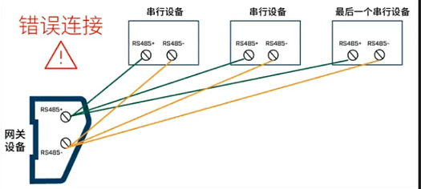

# Modbus 通信协议介绍

Modbus是一种通信协议，由莫迪康（Modicon，现施耐德电气 Schneider Electric）公司于1979年发布，旨在为可编程逻辑控制通信提供标准。Modbus是为了解决PLC控制器之间通信的问题。

Modbus 协议特点：

- 免费、开放、无版权要求
- 报文（协议消息帧）格式简单紧凑，通俗易懂，厂商容易集成
- 不仅可以使用在串口通信，比如RS232、RS485、RS422，还可以用于以太网、光纤、蓝牙、无线等多种通信介质。

Modbus协议是一种应用层报文传输协议，包括ASCII、RTU、TCP三种报文类型。

串口传输通常选择RTU或ASCII模式；以太网传输一般使用TCP模式。

Modbus报文帧分为：

- RTU
- ASCII
- TCP

通信介质：

- 串口：串口通信的接口标准有RS232（扫码枪、仪表）、RS485（PLC、仪表）、RS422（不常用）
- 以太网：TCP、UDP

根据不同报文帧和通信介质分为以下通信协议：

- ==ModbusRTU==：RTU报文帧+串口（常用）
- ModbusRTUOverTCP：RTU报文帧 + TCP
- ModbusRTUOverUDP：RTU报文帧 + UDP
- ModbusASCII：ASCII报文帧 + 串口
- ModbusASCIIOverTCP：ASCII报文帧 + TCP
- ModbusASCIIOverUDP：ASCII报文帧 + UDP
- ==ModbusTCP==：TCP报文帧 + TCP（常用）
- ModbusUDP：TCP报文帧 + UDP

由于不够安全，TCP报文帧几乎很少通过串口通信，而是通过以太网。

通信的本质是数据交互。

## 串口通信的接口标准

- RS232：只能一对一
- RS485
- RS422

## 一主多从原理

主站：主动发送指令的终端，类似于浏览器，如上位机。

从站：被动提供数据的终端，类似于服务器，如仪表。

PLC既可以做主站也可以做从站。

  一主多从：从站地址不允许重复。实现一主多从的前提：

- 接口标准要支持，RS-232不能实现。
- 协议报文要支持。

### 接线方法

正确的接线方式，采用“手拉手接线”方法：

“星型接法”是错误的接线方式：

这种方式很容易造成信号反射导致总线不稳定。虽然有的时候整个系统不出问题，但是有的时候则总是出现问题，又很难查找原因，建议在布线时就采用手拉手连接方式，便于后期问题排查。

串口的速度，取决于波特率，波特率越大，速度越块。

串口的读取，是使用线程循环取值。

