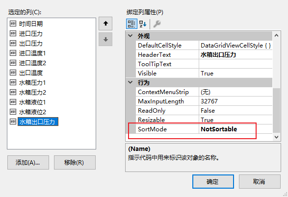

# DataGridView 设置步骤

1. 取消三个勾选

   

2. 设置背景颜色 和 BorderStyle

   

3. 添加列，将最后一列的AutoSizeMode设置为Fill，这样可避免出现滚动条

   

4. 设置绑定属性

   

5. 设置列的宽度，和取消排序占用的空间（否则列设置为居中将会偏左），==SortMode = NotSortable==

   

6. 设置DataGridView外观：

   - ==EnableHeaderVisualStyles = False==
   - ColumnHeaderDefaultCellStyle：Alignment = MiddleCenter，ForeColor、 BackColor
   - ColumnHeaderBorderStyle = Single
   - ColumnHeaderHeightSizeMode = DisableResizing，禁止调整标题的高度，标题内容单行显示
   - ColumnHeaderHeight = 45
   - AllowUserToResizeColumns、AllowUserToResizeRows = False
   - DefaultCellStyle：Alignment = MiddleCenter
   - RowTemplate：Height =35 
   - RowHeadersWidth：行标题的宽度
   - RowHeadersDefaultCellStyle：Alignment = MiddleCenter

7. 如果是DataSource绑定，需要设置 ：AutoGenerateColumns = false

8. 绑定行号DataGridViewHelper
