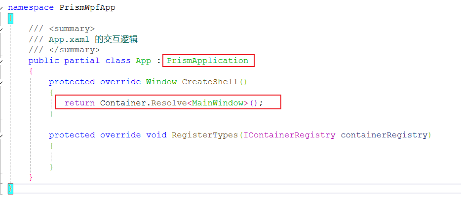
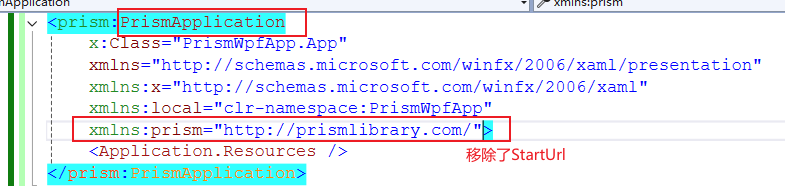
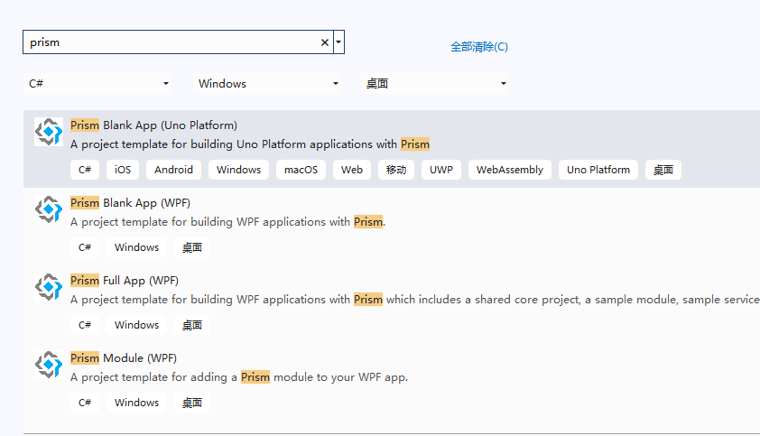
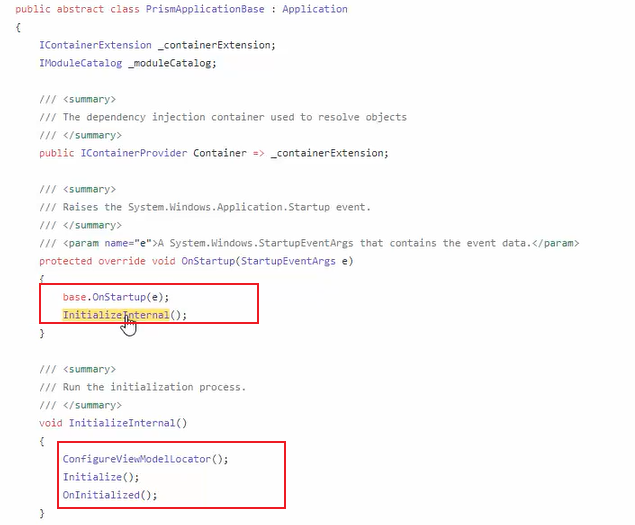
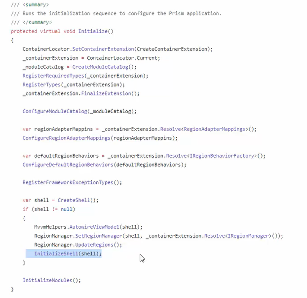
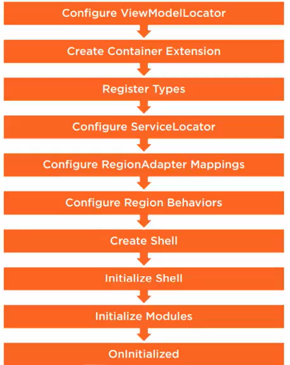
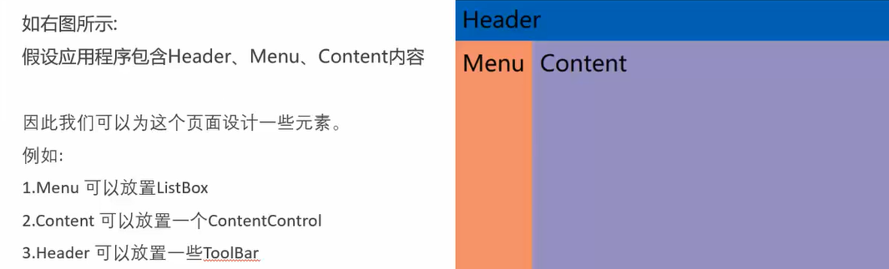
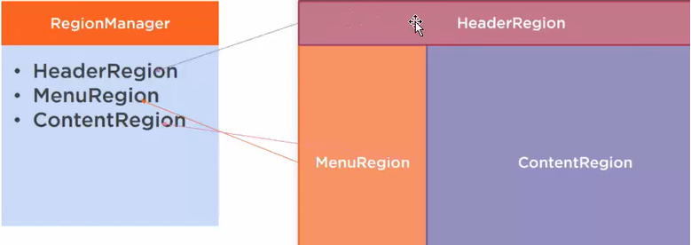
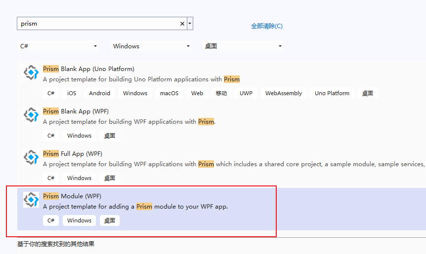
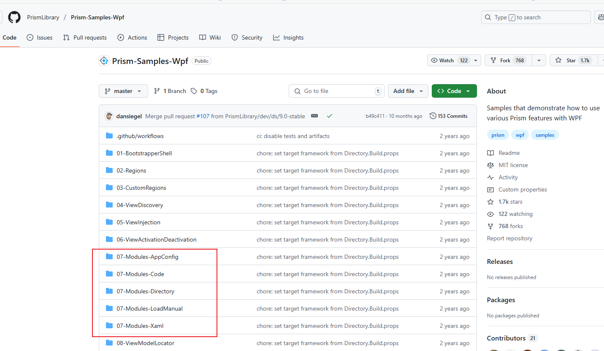

# Prism 框架的使用

需要安装的包：

- Prism.DryIoc 8.0：Prism容器，安装了该包之后，会自动引入Prism.Wpf 包。


## 创建新的Prism项目

### 方式一：手动将普通项目改为Prism项目

- 将App改为派生自PrismApplication：

  

  

  ### 方式二：按照Prism提供的项目模板，能够快速的创建Prism项目

  需要安装的扩展：

  - Prism Template Pack

  安装了该扩展之后，新建WPF项目时，就可以选择基于Prism的模板进行创建项目：

  

- Prism Blank app：空白项目
- 

## Prism初始化过程

Prism初始化过程可以查看Prism源码中的Prism/src/Wpf/Prism.Wpf/PrismApplicationBase.cs实现。





初始化过程：




## Prism中的核心元素

包括：

- Region（区域）

- Module（模块）

- MVVM（视图注入）

- Event Aggregator（事件聚合器）

- Navigation（导航）

- Dialog（对话）

### Region

Region作为Prism当中模块化的核心功能，其主要目的是弱化了模板与模板之间的耦合关系。



Prism中，可以不再为其固定内容，从而有了区域的概念。现在，将页面每个部分定义一个唯一区域（Region），那么在运行时，可以对每个区域动态设置内容。



每个区域的具体内容通常由用户控件构成：

ViewA.xaml：

```xaml
<UserControl
    x:Class="PrismBlankApp.ViewModels.ViewA"
    xmlns="http://schemas.microsoft.com/winfx/2006/xaml/presentation"
    xmlns:x="http://schemas.microsoft.com/winfx/2006/xaml"
    xmlns:d="http://schemas.microsoft.com/expression/blend/2008"
    xmlns:local="clr-namespace:PrismBlankApp.ViewModels"
    xmlns:mc="http://schemas.openxmlformats.org/markup-compatibility/2006"
    d:DesignHeight="450"
    d:DesignWidth="800"
    mc:Ignorable="d">
    <Grid Background="Yellow">
        <TextBlock
            HorizontalAlignment="Center"
            VerticalAlignment="Center"
            FontSize="50"
            Text="ViewA" />
    </Grid>
</UserControl>
```

将ViewA填充到指定的Region中，MainWindow.xaml：

```xaml
<Window x:Class="PrismBlankApp.Views.MainWindow"
        xmlns="http://schemas.microsoft.com/winfx/2006/xaml/presentation"
        xmlns:x="http://schemas.microsoft.com/winfx/2006/xaml"
        xmlns:prism="http://prismlibrary.com/"
        prism:ViewModelLocator.AutoWireViewModel="True"
        Title="{Binding Title}" Height="350" Width="525" >
    <Grid>
        <ContentControl  x:Name="myCtl" prism:RegionManager.RegionName="ContentRegion" />
    </Grid>
</Window>
```

由于使用了内置的模型绑定，因此指定填充的内容，通常在ViewModel中间进行设置，MainWindowViewModel.cs：

```csharp
public class MainWindowViewModel : BindableBase
{
    private string _title = "Prism Application";
    private readonly IRegionManager regionManager;

    public string Title
    {
        get { return _title; }
        set { SetProperty(ref _title, value); }
    }

    public MainWindowViewModel(IRegionManager regionManager)
    {
        this.regionManager = regionManager;
        //实现区域填充
        regionManager.RegisterViewWithRegion("ContentRegion", typeof(ViewA));
    }
}
```

定义Region名称有两种方式：

1. RegionManager.RegionName，在XAML中定义区域名称，在ViewModel中实现区域填充。

   ```xaml
   <ContentControl  x:Name="myCtl" prism:RegionManager.RegionName="ContentRegion" />
   ```

2. RegionManager.SetRegionName，在XAML后台代码中指定某个元素作为Region，并指定区域名称。也是在ViewModel中实现区域填充。

   ```csharp
   public MainWindow()
   {
       InitializeComponent();
       RegionManager.SetRegionName(myCtl, "ContentRegion");  
   }
   ```

#### RegionManager

RegionManager可以通过自带的容器注入到ViewModel中：

```csharp
private readonly IRegionManager regionManager;
public MainWindowViewModel(IRegionManager regionManager)
{
	this.regionManager = regionManager;
}
```

RegionManager用来实现以下功能：

- 定义区域

  ```csharp
  regionManager.RegisterViewWithRegion("ContentRegion", typeof(ViewA));
  ```

- 维护区域集合，通过regionManager.Regions属性。

- 提供对区域的访问：

  ```csharp
   var region = regionManager.Regions["ContentRegion"];
  ```

- 合成视图

- 区域导航

#### RegionAdapter（区域适配器）

只有实现了区域适配器的元素，才可以作为填充内容的容器。

在Prism中，内置了几个区域适配器：

- ContentControlRegionAdapter，适用于：派生自ContentControl类型的控件
- ItemsControlRegionAdapter，适用于：派生自ItemsControl类型的控件
- SelectorRegionAdapter,适用于ComboBox、ListBox、Ribbon、TabControl

实现自己的RegionAdapter，将StackPanel作为填充容器：

```csharp
public class StackPanelRegionAdaper : RegionAdapterBase<StackPanel>
{
    public StackPanelRegionAdaper(IRegionBehaviorFactory regionBehaviorFactory) : base(regionBehaviorFactory)
    {
    }

    protected override void Adapt(IRegion region, StackPanel regionTarget)
    {
        region.Views.CollectionChanged += (s, e) =>
        {
            if (e.Action == System.Collections.Specialized.NotifyCollectionChangedAction.Add)
            {
                foreach(FrameworkElement item in e.NewItems)
                {
                    regionTarget.Children.Add(item);
                }
            }

        };
    }

    protected override IRegion CreateRegion()
    {
        return new Region();
    }
}
```

App.xaml.cs中进行注册：

```csharp
public partial class App
{
    protected override Window CreateShell()
    {
        return Container.Resolve<MainWindow>();
    }

    protected override void RegisterTypes(IContainerRegistry containerRegistry)
    {

    }

    protected override void ConfigureRegionAdapterMappings(RegionAdapterMappings regionAdapterMappings)
    {
        base.ConfigureRegionAdapterMappings(regionAdapterMappings);
        //regionAdapterMappings.RegisterMapping(typeof(StackPanel), Container.Resolve<StackPanelRegionAdaper>());
        regionAdapterMappings.RegisterMapping<StackPanel, StackPanelRegionAdaper>();
    }
}
```

MainWindow.xaml中为StackPanel指定区域名称：

```xaml
<Grid>
    <StackPanel x:Name="myCtl" prism:RegionManager.RegionName="ContentRegion" />
</Grid>
```

MainWindowViewModel.cs中填充区域：

```csharp
public class MainWindowViewModel : BindableBase
{
    private string _title = "Prism Application";

    public string Title
    {
        get { return _title; }
        set { SetProperty(ref _title, value); }
    }
    private readonly IRegionManager regionManager;

    public MainWindowViewModel(IRegionManager regionManager)
    {
        this.regionManager = regionManager;
        regionManager.RegisterViewWithRegion("ContentRegion", typeof(ViewA));
    }
}
```


### Module

创建Module实际上是将模块独立于类库存在，主程序通过加载类库添加模块。Module中可以包含视图、业务逻辑等，以类库的形式存在。

创建Module，可以使用Prism模板进行创建：



在官方示例中，共提供了5中Module配置方式：



- 通过App.Config中指定Module
- 通过代码方式指定Module
- 通过目录的方式
- 通过XAML方式
- 通过加载程序集的方式

#### 视图注入

应用程序模块后，每个子模块中的视图可以独立的进行依赖注入。再使用IRegionManager来实现页面导航。

步骤：

1. 利用Region进行导航功能；
2. 使用Module将应用程序模块化；
3. 将独立模块的视图、服务使用注入到容器当中。

原始代码：

```csharp
public class ModuleAModule : IModule
{
    public void OnInitialized(IContainerProvider containerProvider)
    {
        var regionManager = containerProvider.Resolve<IRegionManager>();
        regionManager.RegisterViewWithRegion("ContentRegion", typeof(ViewA));
    }

    public void RegisterTypes(IContainerRegistry containerRegistry)
    {
        
    }
}
```

改为视图注入：

```csharp
public class ModuleAModule : IModule
{
    public void OnInitialized(IContainerProvider containerProvider)
    {
        var regionManager = containerProvider.Resolve<IRegionManager>();
        var region = regionManager.Regions["ContentRegion"];
        region.RequestNavigate("ViewA");
        //regionManager.RegisterViewWithRegion("ContentRegion", typeof(ViewA));
    }

    public void RegisterTypes(IContainerRegistry containerRegistry)
    {
        containerRegistry.RegisterForNavigation<ViewA>();
    }
}
```


### MVVM 应用

- 需要ViewModel派生自BindableBase
- 属性Set操作，需要调用SetProperty()方法
- 使用DelegateCommand声明简单命令
- 使用CompositeCommand声明复合命令
- 使用IEventAggregator订阅和发布消息

### IEventAggregator


只有先订阅了消息接收的事件，才能接收其他通过该事件推送的消息。

例如：AViewModel订阅了一个消息接收的事件，然后BViewModel当中给指定该事件推送消息，此时AViewModel接收BViewModel推送的内容。

```csharp
public class ViewAViewModel : BindableBase
{
    private string _message;
    public string Message
    {
        get { return _message; }
        set { SetProperty(ref _message, value); }
    }

    public DelegateCommand OpenCommand { get; }
    public DelegateCommand ChanageCommand1 { get; }
    public DelegateCommand ChanageCommand2 { get; }
    public CompositeCommand OpenAll { get; }

    public DelegateCommand ReceivedCommand { get; set; }
    public DelegateCommand SendCommand { get; set; }
    public DelegateCommand CannelSubscribeCommand { get; set; }

    public ViewAViewModel(IEventAggregator eventAggregator)
    {
        Message = "View A from your Prism Module";
        OpenCommand = new DelegateCommand(() =>
        {
            Message = "消息1";

        });

        ChanageCommand1 = new DelegateCommand(() => { Message += "ChanageCommand1"; });
        ChanageCommand2 = new DelegateCommand(() => { Message += "ChanageCommand2"; });

        OpenAll = new CompositeCommand();
        OpenAll.RegisterCommand(ChanageCommand1);
        OpenAll.RegisterCommand(ChanageCommand2);

        ReceivedCommand = new DelegateCommand(() =>
        {
            //订阅消息，只有先订阅了消息，才能接受发送的消息
            eventAggregator.GetEvent<MessageInfo>().Subscribe(
                OnMessageReceived,
                ThreadOption.PublisherThread,
                false,
                msg => msg.Equals("wy"));  //添加过滤器，只允许发送的是小写的wy才传送给订阅者
        });

        SendCommand = new DelegateCommand(() =>
        {
            //发送消息
            eventAggregator.GetEvent<MessageInfo>().Publish("Wy");

        });

        CannelSubscribeCommand = new DelegateCommand(() =>
        {
            //取消订阅
            eventAggregator.GetEvent<MessageInfo>().Unsubscribe(OnMessageReceived);

        });
    }

    public void OnMessageReceived(string message)
    {
        Message += message;
    }

}

internal class MessageInfo : PubSubEvent<string>
{
}
```

### Navigation（导航）

用于视图的动态切换、回退、以及参数传递等功能。

导航功能相关的对象：

- INavigationAware：需要进行导航的View对应的ViewModel要实现该接口。
- IConfirmNavigationRequest：派生自INavigationAware的字接口，提供了触发导航前的确认导航服务。

ViewB.xaml：

```xaml
<UserControl
    x:Class="PrismBlankApp.Views.ViewB"
    xmlns="http://schemas.microsoft.com/winfx/2006/xaml/presentation"
    xmlns:x="http://schemas.microsoft.com/winfx/2006/xaml"
    xmlns:d="http://schemas.microsoft.com/expression/blend/2008"
    xmlns:local="clr-namespace:PrismBlankApp.Views"
    xmlns:mc="http://schemas.openxmlformats.org/markup-compatibility/2006"
    xmlns:prism="http://prismlibrary.com/"
    d:DesignHeight="450"
    d:DesignWidth="800"
    prism:ViewModelLocator.AutoWireViewModel="True"
    mc:Ignorable="d">
    <Grid Background="Green">
        <TextBlock
            HorizontalAlignment="Center"
            VerticalAlignment="Center"
            FontSize="30"
            Text="{Binding Title}" />

    </Grid>
</UserControl>
```

ViewBViewModel.cs：

```csharp
public class ViewBViewModel : BindableBase, INavigationAware
{
    private string title;

    public string Title
    {
        get { return title; }
        set { SetProperty(ref title, value); }
    }


    public bool IsNavigationTarget(NavigationContext navigationContext)
    {
        return true;
    }

    /// <summary>
    /// 导航离开当前页时触发
    /// </summary>
    /// <param name="navigationContext"></param>
    /// <exception cref="NotImplementedException"></exception>
    public void OnNavigatedFrom(NavigationContext navigationContext)
    {

    }

    /// <summary>
    /// 导航完成前，接收用户传递的参数一级是否允许导航等控制
    /// </summary>
    /// <param name="navigationContext"></param>
    /// <exception cref="NotImplementedException"></exception>
    public void OnNavigatedTo(NavigationContext navigationContext)
    {
    	//获取参数
        this.Title = navigationContext.Parameters.GetValue<string>("Value");
    }
}
```

ViewC.xaml：

```xaml
<UserControl
    x:Class="PrismBlankApp.Views.ViewC"
    xmlns="http://schemas.microsoft.com/winfx/2006/xaml/presentation"
    xmlns:x="http://schemas.microsoft.com/winfx/2006/xaml"
    xmlns:d="http://schemas.microsoft.com/expression/blend/2008"
    xmlns:local="clr-namespace:PrismBlankApp.Views"
    xmlns:mc="http://schemas.openxmlformats.org/markup-compatibility/2006"
    xmlns:prism="http://prismlibrary.com/"
    d:DesignHeight="450"
    d:DesignWidth="800"
    prism:ViewModelLocator.AutoWireViewModel="True"
    mc:Ignorable="d">
    <Grid Background="Red">
        <TextBlock
            HorizontalAlignment="Center"
            VerticalAlignment="Center"
            FontSize="30"
            Text="{Binding Title}" />

    </Grid>
</UserControl>
```

ViewCViewModel.cs，此处实现IConfirmNavigationRequest接口，添加了导航前的确认服务：

```csharp
public class ViewCViewModel : BindableBase, IConfirmNavigationRequest
{
    private string title;

    public string Title
    {
        get { return title; }
        set { SetProperty(ref title, value); }
    }

    public void ConfirmNavigationRequest(NavigationContext navigationContext, Action<bool> continuationCallback)
    {
        bool result = MessageBox.Show("确认要离开当前页吗？", "提示", MessageBoxButton.OKCancel) == MessageBoxResult.OK;
        continuationCallback(result);
       
    }

    public bool IsNavigationTarget(NavigationContext navigationContext)
    {
        return true;
    }

    /// <summary>
    /// 导航离开当前页时触发
    /// </summary>
    /// <param name="navigationContext"></param>
    /// <exception cref="NotImplementedException"></exception>
    public void OnNavigatedFrom(NavigationContext navigationContext)
    {

    }

    /// <summary>
    /// 导航完成前，接收用户传递的参数一级是否允许导航等控制
    /// </summary>
    /// <param name="navigationContext"></param>
    /// <exception cref="NotImplementedException"></exception>
    public void OnNavigatedTo(NavigationContext navigationContext)
    {
        this.Title = navigationContext.Parameters.GetValue<string>("wy");
    }
}
```

在MainWindow.xaml中应用上述两个界面：

```xaml
<DockPanel>
    <StackPanel
        HorizontalAlignment="Center"
        DockPanel.Dock="Top"
        Orientation="Horizontal">
        <Button
            Width="100"
            Height="40"
            Margin="5"
            Command="{Binding OpenViewBCommand}"
            Content="ViewB" />
        <Button
            Width="100"
            Height="40"
            Margin="5"
            Command="{Binding OpenViewCCommand}"
            Content="ViewC" />

        <Button
            Width="100"
            Height="40"
            Margin="5"
            Command="{Binding GoForwordCommand}"
            Content="向前" />

        <Button
            Width="100"
            Height="40"
            Margin="5"
            Command="{Binding GoBackCommand}"
            Content="返回" />
    </StackPanel>
    <ContentControl prism:RegionManager.RegionName="ViewBRegion" />
</DockPanel>
```

MainWindowViewModel.cs：

```csharp
public class MainWindowViewModel : BindableBase
{
    private string _title = "Prism Application";

    //导航记录
    private IRegionNavigationJournal journal;

    public string Title
    {
        get { return _title; }
        set { SetProperty(ref _title, value); }
    }

    private readonly IRegionManager regionManager;
    public DelegateCommand OpenViewBCommand { get; }
    public DelegateCommand OpenViewCCommand { get; }
    public DelegateCommand GoBackCommand { get; }
    public DelegateCommand GoForwordCommand { get; }

    public MainWindowViewModel(IRegionManager regionManager)
    {
        this.regionManager = regionManager;
        OpenViewBCommand = new DelegateCommand(OpenViewB);
        OpenViewCCommand = new DelegateCommand(OpenViewC);
        GoBackCommand = new DelegateCommand(() =>
        {
            journal.GoBack();
        });

        GoForwordCommand = new DelegateCommand(() =>
        {
            journal.GoForward();
        });
    }

    private void OpenViewB()
    {
        //方式一传递参数：
        NavigationParameters param = new NavigationParameters();
        param.Add("Value", "Hello");
        regionManager.RequestNavigate("ViewBRegion", "pageA", arg =>
        {
            journal = arg.Context.NavigationService.Journal;
        }, param);
    }

    private void OpenViewC()
    {
        //方式二：另一种传参形式，类似于url
        regionManager.RequestNavigate("ViewBRegion", "ViewC?wy=small");
    }
}
```

在App.xaml.cs中注册导航：

```csharp
protected override void RegisterTypes(IContainerRegistry containerRegistry)
{
    //注册导航
    containerRegistry.RegisterForNavigation<ViewB>("pageA"); //设置导航别名为pageA
    containerRegistry.RegisterForNavigation<ViewC>();
}
```


### Dialog

使用Dialog可以实现对话框模式的窗体交互。可以传递值。

- IDialogAware
- DialogParameters

App.xaml.cs：

```csharp
protected override void RegisterTypes(IContainerRegistry containerRegistry)
{
    //注册对话
    containerRegistry.RegisterDialog<MsgView, MsgViewModel>("myDialog");//设置别名为myDialog，如果不设置默认为窗体名称msgView
}
```

MsgViewModel.cs：

```csharp
public class MsgViewModel : BindableBase, IDialogAware
{
    public DelegateCommand OkCommand { get; }
    public DelegateCommand CancelCommand { get; }
    private string title;

    public string Title
    {
        get { return title; }
        set { title = value; SetProperty(ref title, value); }
    }

    public MsgViewModel()
    {
        OkCommand = new DelegateCommand(() =>
        {
            var param = new DialogParameters();
            param.Add("text", this.Title);
            RequestClose?.Invoke(new DialogResult(ButtonResult.OK, param));
        });

        CancelCommand = new DelegateCommand(() =>
        {
            RequestClose?.Invoke(new DialogResult(ButtonResult.Cancel));
        });
    }

    public event Action<IDialogResult> RequestClose;

    public bool CanCloseDialog()
    {
        return true;
    }

    public void OnDialogClosed()
    {
    }

    public void OnDialogOpened(IDialogParameters parameters)
    {
        this.Title = parameters.GetValue<string>("p1");
    }
}
```

MainWindowViewModel.cs：

```csharp
public DelegateCommand DialogCommand { get; }

public MainWindowViewModel(IRegionManager regionManager, IDialogService dialog)
{
    this.regionManager = regionManager;
    this.dialog = dialog;
  
    DialogCommand = new DelegateCommand(() =>
    {
        DialogParameters param = new DialogParameters();
        param.Add("p1", "好好学习，天天向上");
        dialog.ShowDialog("myDialog", param, (arg) =>
        {
            if (arg.Result == ButtonResult.OK)
            {
                var text = arg.Parameters.GetValue<string>("text");
                MessageBox.Show(text);
            }
            else if(arg.Result == ButtonResult.Cancel)
            {
                MessageBox.Show("关闭");
            }
        });
    });
}
```


