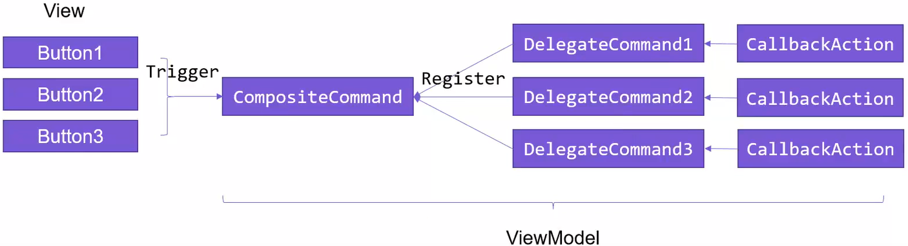

# Prism - Commands（命令服务）

命令表示应用程序任务，并且跟踪任务是否能够被执行。

在Prism里Command相关的对象都被集成到Prism框架中（Prism.Commands）方便开发者使用。

命令的使用分为4个步骤：

1. VM层定义命令（待参命令则需要在命令的尖括号内指定参数类型）
2. View层绑定命令
3. 指定命令源
4. 指定执行命令的控件


## Command 

用法一，不需要关注命令是否可用：

```csharp
SaveUserRegistCommand = new DelegateCommand(SaveUserRegist);
```

用法二，根据某个属性判断是否可用：

```csharp
SaveUserRegistCommand = new DelegateCommand(SaveUserRegist).ObservesCanExecute(() => IsInvalid);
```

用法三，监听某个属性的变化来判断命令是否可用：

```csharp
SaveUserRegistCommand = new DelegateCommand(SaveUserRegist, CanSaveUserRegist)
               .ObservesProperty(() => User.Mail);
```


## Composite Commands（复合命令）

CompositeCommand（复合命令）的作用为执行一组Command。

命令的使用分为5个步骤：

1. VM层定义复合命令以及命令；
2. 将命令注册到复合命令中；
3. View层绑定命令；
4. 指定命令源；
5. 指定执行命令的控件。



通过CompositeCommand去注册多个DelegateCommand子命令，在界面触发CompositeCommand复合命令时，其注册的各个子命令也会逐个触发。（一次动作，多个效果）

```csharp
public CompositeCommand TempCompoCommand { get => _tempCompoCommand ?? (_tempCompoCommand = new CompositeCommand()); }
public DelegateCommand PrintMsg1Command { get => _printMsg1Command ?? (_printMsg1Command = new DelegateCommand(PrintMsgAction)); }
public DelegateCommand PrintMsg2Command { get => _printMsg2Command ?? (_printMsg2Command = new DelegateCommand(PrintMsgAction)); }


public MainWindowViewModel(IRegionManager regionManager, IModuleCatalog moduleCatalog,
    ILogger logger,IDialogService dialogService,IEventAggregator eventAggregator)
{
    _dialogService = dialogService;
    _logger = logger;
    _regionManager = regionManager;
    _moduleCatalog = moduleCatalog;
    _eventAggregator = eventAggregator;
    //注册子命令
    TempCompoCommand.RegisterCommand(PrintMsg1Command);
    TempCompoCommand.RegisterCommand(PrintMsg2Command);
}
```


## Async Commands 


## Error Handling

