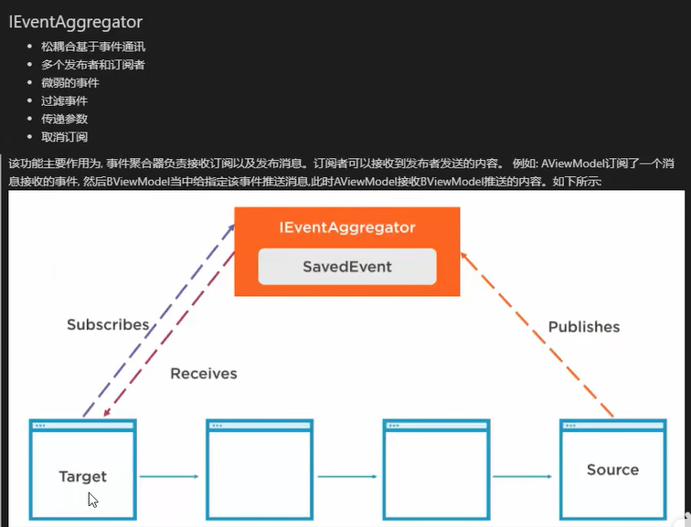

# Prism - EventAggregator（事件聚合器）

### IEventAggregator



只有先订阅了消息接收的事件，才能接收其他通过该事件推送的消息。

例如：AViewModel订阅了一个消息接收的事件，然后BViewModel当中给指定该事件推送消息，此时AViewModel接收BViewModel推送的内容。

```csharp
public class ViewAViewModel : BindableBase
{
    private string _message;
    public string Message
    {
        get { return _message; }
        set { SetProperty(ref _message, value); }
    }

    public DelegateCommand OpenCommand { get; }
    public DelegateCommand ChanageCommand1 { get; }
    public DelegateCommand ChanageCommand2 { get; }
    public CompositeCommand OpenAll { get; }

    public DelegateCommand ReceivedCommand { get; set; }
    public DelegateCommand SendCommand { get; set; }
    public DelegateCommand CannelSubscribeCommand { get; set; }

    public ViewAViewModel(IEventAggregator eventAggregator)
    {
        Message = "View A from your Prism Module";
        OpenCommand = new DelegateCommand(() =>
        {
            Message = "消息1";

        });

        ChanageCommand1 = new DelegateCommand(() => { Message += "ChanageCommand1"; });
        ChanageCommand2 = new DelegateCommand(() => { Message += "ChanageCommand2"; });

        OpenAll = new CompositeCommand();
        OpenAll.RegisterCommand(ChanageCommand1);
        OpenAll.RegisterCommand(ChanageCommand2);

        ReceivedCommand = new DelegateCommand(() =>
        {
            //订阅消息，只有先订阅了消息，才能接受发送的消息
            eventAggregator.GetEvent<MessageInfo>().Subscribe(
                OnMessageReceived,
                ThreadOption.PublisherThread,
                false,
                msg => msg.Equals("wy"));  //添加过滤器，只允许发送的是小写的wy才传送给订阅者
        });

        SendCommand = new DelegateCommand(() =>
        {
            //发送消息
            eventAggregator.GetEvent<MessageInfo>().Publish("Wy");

        });

        CannelSubscribeCommand = new DelegateCommand(() =>
        {
            //取消订阅
            eventAggregator.GetEvent<MessageInfo>().Unsubscribe(OnMessageReceived);

        });
    }

    public void OnMessageReceived(string message)
    {
        Message += message;
    }

}

internal class MessageInfo : PubSubEvent<string>
{
}
```


