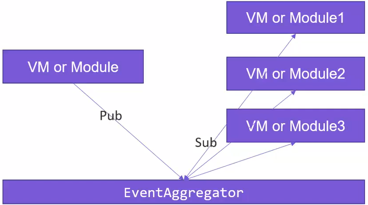

# Prism - EventAggregator（事件聚合器）

EventAggregator（聚合事件），在Prism框架当中是单独的一层，例如：可用于View或Model之间做消息通知（传值）。它是由PubSubEvent<T>和IEventAggregator支撑。

聚合事件的使用分为：

1. 发布消息
2. 订阅消息




### IEventAggregator


只有先订阅了消息接收的事件，才能接收其他通过该事件推送的消息。

例如：AViewModel订阅了一个消息接收的事件，然后BViewModel当中给指定该事件推送消息，此时AViewModel接收BViewModel推送的内容。

```csharp
public class ViewAViewModel : BindableBase
{
    private string _message;
    public string Message
    {
        get { return _message; }
        set { SetProperty(ref _message, value); }
    }

    public DelegateCommand OpenCommand { get; }
    public DelegateCommand ChanageCommand1 { get; }
    public DelegateCommand ChanageCommand2 { get; }
    public CompositeCommand OpenAll { get; }

    public DelegateCommand ReceivedCommand { get; set; }
    public DelegateCommand SendCommand { get; set; }
    public DelegateCommand CannelSubscribeCommand { get; set; }

    public ViewAViewModel(IEventAggregator eventAggregator)
    {
        Message = "View A from your Prism Module";
        OpenCommand = new DelegateCommand(() =>
        {
            Message = "消息1";

        });

        ChanageCommand1 = new DelegateCommand(() => { Message += "ChanageCommand1"; });
        ChanageCommand2 = new DelegateCommand(() => { Message += "ChanageCommand2"; });

        OpenAll = new CompositeCommand();
        OpenAll.RegisterCommand(ChanageCommand1);
        OpenAll.RegisterCommand(ChanageCommand2);

        ReceivedCommand = new DelegateCommand(() =>
        {
            //订阅消息，只有先订阅了消息，才能接受发送的消息
            eventAggregator.GetEvent<MessageInfo>().Subscribe(
                OnMessageReceived,
                ThreadOption.PublisherThread,
                false,
                msg => msg.Equals("wy"));  //添加过滤器，只允许发送的是小写的wy才传送给订阅者
        });

        SendCommand = new DelegateCommand(() =>
        {
            //发送消息
            eventAggregator.GetEvent<MessageInfo>().Publish("Wy");

        });

        CannelSubscribeCommand = new DelegateCommand(() =>
        {
            //取消订阅
            eventAggregator.GetEvent<MessageInfo>().Unsubscribe(OnMessageReceived);

        });
    }

    public void OnMessageReceived(string message)
    {
        Message += message;
    }

}

internal class MessageInfo : PubSubEvent<string>
{
}
```


EventAggregator还有取消订阅、消息过滤功能。

取消订阅：是为了管理pub/sub特性所占用的资源，富客户端应用随着业务、时间的变化而复杂。极大的可能会导致客户端里穿插上百个消息，会导致代码非常混乱。所以在代码中慎用pub/sub这个特性，或即时取消不用的订阅，因为这套机制存在强引用关系不会随着作用域的结束而结束（GC无法回收）。如果任由发展会导致客户端内存上涨，解决这个问题除了即时取消订阅，还可以在订阅时指定KeepSubcriberRefenceAlve参数为false。

消息过滤：也是管理pub/sub的手段之一，通过指定特定的消息类型来细化区分pub/sub消息传递。


