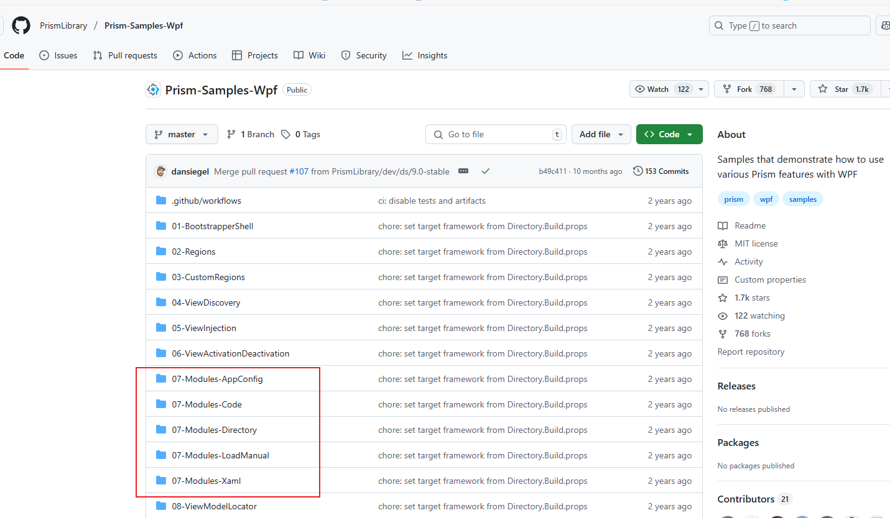

# Prism - Module

### Module

创建Module实际上是将模块独立于类库存在，主程序通过加载类库添加模块。Module中可以包含视图、业务逻辑等，以类库的形式存在。

创建Module，可以使用Prism模板进行创建：


在官方示例中，共提供了5中Module配置方式：



- 通过App.Config中指定Module
- 通过代码方式指定Module
- 通过目录的方式
- 通过XAML方式
- 通过加载程序集的方式

#### 视图注入

应用程序模块后，每个子模块中的视图可以独立的进行依赖注入。再使用IRegionManager来实现页面导航。

步骤：

1. 利用Region进行导航功能；
2. 使用Module将应用程序模块化；
3. 将独立模块的视图、服务使用注入到容器当中。

原始代码：

```csharp
public class ModuleAModule : IModule
{
    public void OnInitialized(IContainerProvider containerProvider)
    {
        var regionManager = containerProvider.Resolve<IRegionManager>();
        regionManager.RegisterViewWithRegion("ContentRegion", typeof(ViewA));
    }

    public void RegisterTypes(IContainerRegistry containerRegistry)
    {
        
    }
}
```

改为视图注入：

```csharp
public class ModuleAModule : IModule
{
    public void OnInitialized(IContainerProvider containerProvider)
    {
        var regionManager = containerProvider.Resolve<IRegionManager>();
        var region = regionManager.Regions["ContentRegion"];
        region.RequestNavigate("ViewA");
        //regionManager.RegisterViewWithRegion("ContentRegion", typeof(ViewA));
    }

    public void RegisterTypes(IContainerRegistry containerRegistry)
    {
        containerRegistry.RegisterForNavigation<ViewA>();
    }
}
```

App.xaml.cs：

```csharp
 protected override void ConfigureModuleCatalog(IModuleCatalog moduleCatalog)
 {
     moduleCatalog.AddModule<ModuleA.ModuleAModule>();
 }
```

