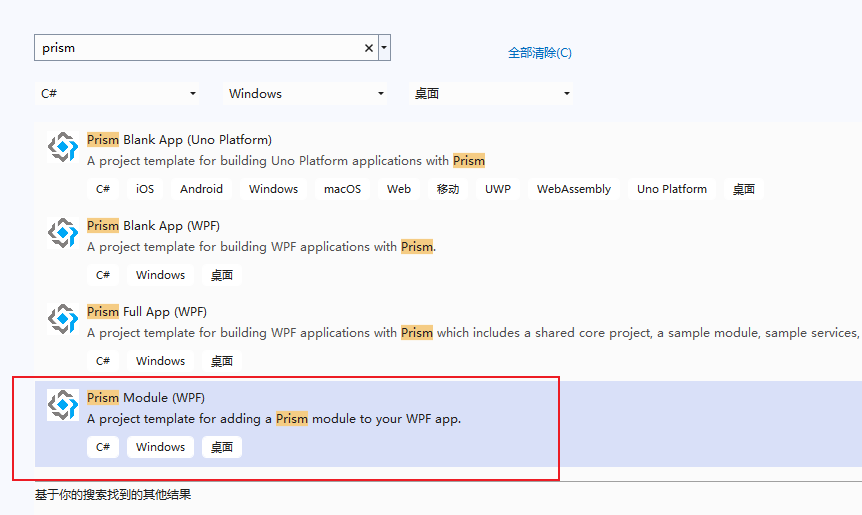

# Prism - Module（模块）

具有特定功能，且独立存在则称为模块。

模块化应用程序是指被划分为一组松散耦合的功能单元（称为模块）的应用程序，这些单元可以集成到更大的应用程序中。客户端模块封装了应用程序整体功能的一部分，通常代表一组相关的关注点。它可以包含一系列相关组件，例如应用程序功能（包括用户界面和业务逻辑），或应用程序基础架构（例如用于日志记录或用户身份验证的应用程序级服务）。模块彼此独立，但可以以松散耦合的方式相互通信。使用模块化应用程序设计可以让您更轻松地开发、测试、部署和维护应用程序。

Prism 支持以下模块化应用程序开发功能：

- 用于注册命名模块和每个模块位置的模块目录；您可以通过以下方式创建模块目录：
  - 通过在代码或可扩展应用程序标记语言 (XAML) 中定义模块
  - 通过发现目录中的模块，您可以加载所有模块，而无需在集中目录中明确定义
  - 通过在配置文件中定义模块
  - 模块的声明元数据属性支持初始化模式和依赖关系
- 对于模块加载：
  - 依赖关系管理，包括重复和循环检测，以确保模块按正确的顺序加载，并且仅加载和初始化一次
  - 按需和后台下载模块，以最大限度地减少应用程序启动时间；其余模块可以在后台或需要时加载和初始化
- 与依赖注入容器集成以支持模块之间的松散耦合。


创建Module，可以使用Prism模板进行创建：



在官方示例中，共提供了5中Module配置方式：


- 通过App.Config中指定Module
- 通过代码方式指定Module
- 通过目录的方式
- 通过XAML方式
- 通过加载程序集的方式


## 引入Module

### 通过目录加载DLL文件引入模块


#### 视图注入

应用程序模块后，每个子模块中的视图可以独立的进行依赖注入。再使用IRegionManager来实现页面导航。

步骤：

1. 利用Region进行导航功能；
2. 使用Module将应用程序模块化；
3. 将独立模块的视图、服务使用注入到容器当中。

原始代码：

```csharp
public class ModuleAModule : IModule
{
    public void OnInitialized(IContainerProvider containerProvider)
    {
        var regionManager = containerProvider.Resolve<IRegionManager>();
        regionManager.RegisterViewWithRegion("ContentRegion", typeof(ViewA));
    }

    public void RegisterTypes(IContainerRegistry containerRegistry)
    {
        
    }
}
```

改为视图注入：

```csharp
public class ModuleAModule : IModule
{
    public void OnInitialized(IContainerProvider containerProvider)
    {
        var regionManager = containerProvider.Resolve<IRegionManager>();
        var region = regionManager.Regions["ContentRegion"];
        region.RequestNavigate("ViewA");
        //regionManager.RegisterViewWithRegion("ContentRegion", typeof(ViewA));
    }

    public void RegisterTypes(IContainerRegistry containerRegistry)
    {
        containerRegistry.RegisterForNavigation<ViewA>();
    }
}
```

App.xaml.cs：

```csharp
 protected override void ConfigureModuleCatalog(IModuleCatalog moduleCatalog)
 {
     moduleCatalog.AddModule<ModuleA.ModuleAModule>();
 }
```


----

References:

- [Modular Application Development Using Prism Library | Prism](https://docs.prismlibrary.com/docs/modularity/index.html)


Last updated：2025-06-22


