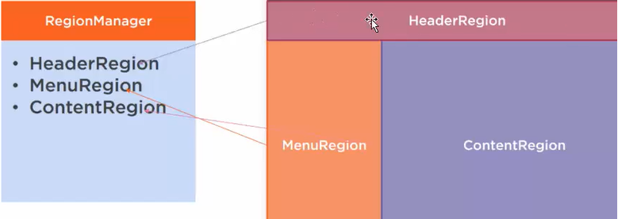

# Prism - Region（区域）

Region是应用程序UI的逻辑区域（具体的表现为容器控件），Views在Region中展现，很多中控件可以被用作Region：ContentControl、ItemsControl、ListBox、TabControl。

Views能在Regions编程或者自动呈现，Prism也提供了Region导航的支持。这么设计主要是为了解耦让内容显示灵活具有多样性。


## Region

Region作为Prism当中模块化的核心功能，其主要目的是弱化了模板与模板之间的耦合关系。


Prism中，可以不再为其固定内容，从而有了区域的概念。现在，将页面每个部分定义一个唯一区域（Region），那么在运行时，可以对每个区域动态设置内容。



每个区域的具体内容通常由用户控件构成：

ViewA.xaml：

```xaml
<UserControl
    x:Class="PrismBlankApp.ViewModels.ViewA"
    xmlns="http://schemas.microsoft.com/winfx/2006/xaml/presentation"
    xmlns:x="http://schemas.microsoft.com/winfx/2006/xaml"
    xmlns:d="http://schemas.microsoft.com/expression/blend/2008"
    xmlns:local="clr-namespace:PrismBlankApp.ViewModels"
    xmlns:mc="http://schemas.openxmlformats.org/markup-compatibility/2006"
    d:DesignHeight="450"
    d:DesignWidth="800"
    mc:Ignorable="d">
    <Grid Background="Yellow">
        <TextBlock
            HorizontalAlignment="Center"
            VerticalAlignment="Center"
            FontSize="50"
            Text="ViewA" />
    </Grid>
</UserControl>
```

将ViewA填充到指定的Region中，MainWindow.xaml：

```xaml
<Window x:Class="PrismBlankApp.Views.MainWindow"
        xmlns="http://schemas.microsoft.com/winfx/2006/xaml/presentation"
        xmlns:x="http://schemas.microsoft.com/winfx/2006/xaml"
        xmlns:prism="http://prismlibrary.com/"
        prism:ViewModelLocator.AutoWireViewModel="True"
        Title="{Binding Title}" Height="350" Width="525" >
    <Grid>
        <ContentControl  x:Name="myCtl" prism:RegionManager.RegionName="ContentRegion" />
    </Grid>
</Window>
```

由于使用了内置的模型绑定，因此指定填充的内容，通常在ViewModel中间进行设置，MainWindowViewModel.cs：

```csharp
public class MainWindowViewModel : BindableBase
{
    private string _title = "Prism Application";
    private readonly IRegionManager regionManager;

    public string Title
    {
        get { return _title; }
        set { SetProperty(ref _title, value); }
    }

    public MainWindowViewModel(IRegionManager regionManager)
    {
        this.regionManager = regionManager;
        //实现区域填充
        regionManager.RegisterViewWithRegion("ContentRegion", typeof(ViewA));
    }
}
```

定义Region名称有两种方式：

1. RegionManager.RegionName，在XAML中定义区域名称，在ViewModel中实现区域填充。

   ```xaml
   <ContentControl  x:Name="myCtl" prism:RegionManager.RegionName="ContentRegion" />
   ```

2. RegionManager.SetRegionName，在XAML后台代码中指定某个元素作为Region，并指定区域名称。也是在ViewModel中实现区域填充。

   ```csharp
   public MainWindow()
   {
       InitializeComponent();
       RegionManager.SetRegionName(myCtl, "ContentRegion");  
   }
   ```


## RegionManager

RegionManager主要实现维护区域集合，提供对区域的访问、合成视图、区域导航、定义区域。

RegionManager可以通过自带的容器注入到ViewModel中：

```csharp
private readonly IRegionManager regionManager;
public MainWindowViewModel(IRegionManager regionManager)
{
	this.regionManager = regionManager;
}
```

RegionManager用来实现以下功能：

- 定义区域

  ```xaml
  <ContentControl  x:Name="myCtl" prism:RegionManager.RegionName="ContentRegion" />
  ```

- 注册视图到区域

  ```csharp
  regionManager.RegisterViewWithRegion("ContentRegion", typeof(ViewA));
  ```

- 维护区域集合，通过regionManager.Regions属性。

  ```csharp
  var contentRegion = regionManager.Regions["ContengRegion"];
  //contentRegion.Context
  //contentRegion.Remove()：移除视图
  //contentRegion.Activate()：激活视图
  //foreach(var item in contentRegion.ActiveViews)
  //{
  //		contengRegion.Activate(item);
  //}
  ```

- 提供对区域的访问：

  ```csharp
   var region = regionManager.Regions["ContentRegion"];
  ```

- 合成视图

- 区域导航


## RegionAdapter（区域适配器）

RegionAdapter 主要作用为特定的控件创建相应的Region，并将控件与Region进行绑定，然后为Region添加一些行为。

因为并不是所有的控件都可以作为Region的，需要为需要定义为Region的控件添加RegionAdapter。

一个RegionAdapter需要实现IRegionAdapter接口，如果你需要自定义一个RegionAdapter，可以通过继承RegionAdapterBase类来省去一些工作。

**只有实现了区域适配器的元素，才可以作为填充内容的容器**。

在Prism中，内置了几个区域适配器：

- ContentControlRegionAdapter，适用于派生自ContentControl类型的控件，创建一个SingleActiveRegion并将其与ContentControl绑定。
- ItemsControlRegionAdapter，适用于派生自ItemsControl类型的控件，创建一个AllActiveRegion并将其与ItemsControl绑定。
- SelectorRegionAdapter，创建一个Region并将其与Selector绑定。
- TabControlRegionAdapter：创建一个Region并将其与TabCControl绑定。

实现自己的RegionAdapter，将StackPanel作为填充容器：

```csharp
public class StackPanelRegionAdaper : RegionAdapterBase<StackPanel>
{
    public StackPanelRegionAdaper(IRegionBehaviorFactory regionBehaviorFactory) : base(regionBehaviorFactory)
    {
    }

    protected override void Adapt(IRegion region, StackPanel regionTarget)
    {
        region.Views.CollectionChanged += (s, e) =>
        {
            if (e.Action == System.Collections.Specialized.NotifyCollectionChangedAction.Add)
            {
                foreach(FrameworkElement item in e.NewItems)
                {
                    regionTarget.Children.Add(item);
                }
            }

        };
    }

    protected override IRegion CreateRegion()
    {
        return new Region();
    }
}
```

App.xaml.cs中进行注册：

```csharp
public partial class App
{
    protected override Window CreateShell()
    {
        return Container.Resolve<MainWindow>();
    }

    protected override void RegisterTypes(IContainerRegistry containerRegistry)
    {

    }

    protected override void ConfigureRegionAdapterMappings(RegionAdapterMappings regionAdapterMappings)
    {
        base.ConfigureRegionAdapterMappings(regionAdapterMappings);
        //regionAdapterMappings.RegisterMapping(typeof(StackPanel), Container.Resolve<StackPanelRegionAdaper>());
        regionAdapterMappings.RegisterMapping<StackPanel, StackPanelRegionAdaper>();
    }
}
```

MainWindow.xaml中为StackPanel指定区域名称：

```xaml
<Grid>
    <StackPanel x:Name="myCtl" prism:RegionManager.RegionName="ContentRegion" />
</Grid>
```

MainWindowViewModel.cs中填充区域：

```csharp
public class MainWindowViewModel : BindableBase
{
    private string _title = "Prism Application";

    public string Title
    {
        get { return _title; }
        set { SetProperty(ref _title, value); }
    }
    private readonly IRegionManager regionManager;

    public MainWindowViewModel(IRegionManager regionManager)
    {
        this.regionManager = regionManager;
        regionManager.RegisterViewWithRegion("ContentRegion", typeof(ViewA));
    }
}
```

