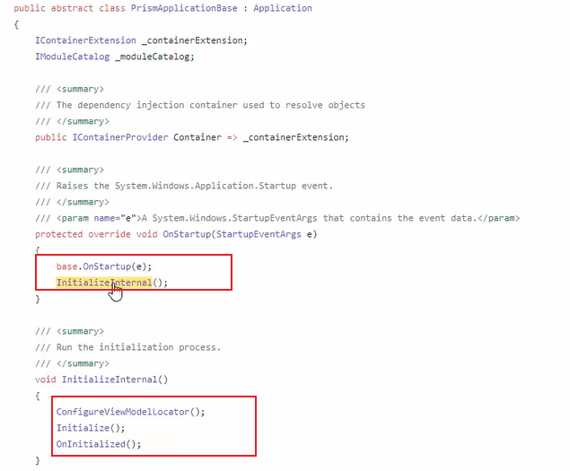

# Prism介绍和项目搭建

Prism官方文档地址：https://docs.prismlibrary.com/docs/

Prism的Github地址：https://github.com/PrismLibrary


Prism 是一个用于在 WPF、.NET MAUI、Uno Platform 和 Xamarin Forms 中构建松散耦合、可维护且可测试的 XAML 应用程序的框架。Prism实现了多种设计模式，突出架构设计的松耦合、关注点分离等原则。使用设计模式和Prism提供的额外能力，你可以通过独立开发的松耦合组件轻松的集成到整个应用程序中，从而开发一个应用程序。


Prism为了实现下列目的：

- 创建能够由模块组成的程序，这些模块能够被单独的编写、组装、部署，并且对于程序来说是可选的。
- 最小化团队之间的依赖，让每个团队专注于特定的领域。比如UI、逻辑代码实现或者架构代码的开发。
- 通过架构提高不同团队之间的复用能力
- 通过抽象团队通用服务提高程序质量
- 迭代添加新的功能


使用Prism需要安装的包：

- Prism.DryIoc 8.0：Prism容器，安装了该包之后，会自动引入Prism.Wpf 包。

为了能够创建基于Prism的项目，还需要安装VS扩展工具：

- Prism Template Pack

安装了该扩展之后，新建WPF项目时，就可以选择基于Prism的模板进行创建项目：


创建项目时，选择“Prism Blank app”（空白项目）。

创建模块时，选择“Prism Module”。


**如何手动将普通项目改为Prism项目？**

- 将App改为派生自PrismApplication：

  

  


## Prism体系结构


Application：创建Prism应用程序，初始化Bootstraper。

Bootstrapper：是用来初始化应用程序级别的组件和服务。它也被用来配置和初始化Module catalog 和 Shell的View和View Model。

Modules：是能够独立开发、测试、部署的功能单元。Moduless可以被设计成实现特定业务逻辑的模块（如Profile Management），也可以被设计成实现通用基础设施或服务的模块。

Shell：是宿主应用程序（host application），modules将会被load到Shell中。Shell定义了应用程序的整体布局和结构，而不关系寄宿其中的Module，Shell通常实现通用的application Service 和 infrastructure，而应用的逻辑则实现在具体的Module中，同时Shell也提供了应用程序的顶层窗口。

Services：是用来实现非UI相关功能的逻辑，例如logging、exception management、data access。Services可以被定义在应用程序中或者是Module中，Services通常被注册在依赖注入容器中，使得其它的组件可以很容易的定位这个服务。

Container：注入服务、其他模块依赖。


## Prism初始化过程

Prism初始化过程可以查看Prism源码中的Prism/src/Wpf/Prism.Wpf/PrismApplicationBase.cs实现。




初始化过程：


## Prism中的核心元素

包括：

- Region（区域）

- Module（模块）

- MVVM（视图注入）

- Event Aggregator（事件聚合器）

- Navigation（导航）

- Dialog（对话）


### Prism MVVM 约定

- 视图必须位于Views命名空间下，通常在Views目录中
- 视图模型的名称必须以ViewModel结尾，且位于ViewModels命名空间下，通常位于ViewModels目录中

可以使用下述方法实现不同文件夹的Model和View访问：


如果想要某个View和指定的Model进行绑定，也可以直接使用下述方法：

```csharp
 /// <summary>
 /// 用于将ViewModel与View进行关联
 /// </summary>
 protected override void ConfigureViewModelLocator()
 {
     base.ConfigureViewModelLocator();
     ViewModelLocationProvider.Register(typeof(MainWindow).ToString(), typeof(MainWindowViewModel));
 }
```


- 需要ViewModel派生自BindableBase
- 属性Set操作，需要调用SetProperty()方法
- 使用DelegateCommand声明简单命令
- 使用CompositeCommand声明复合命令
- 使用IEventAggregator订阅和发布消息


