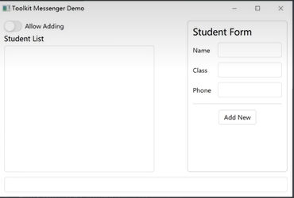
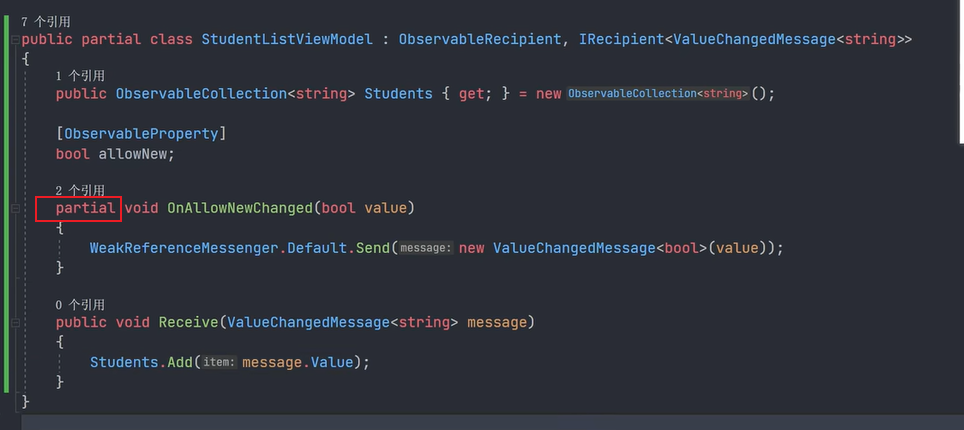
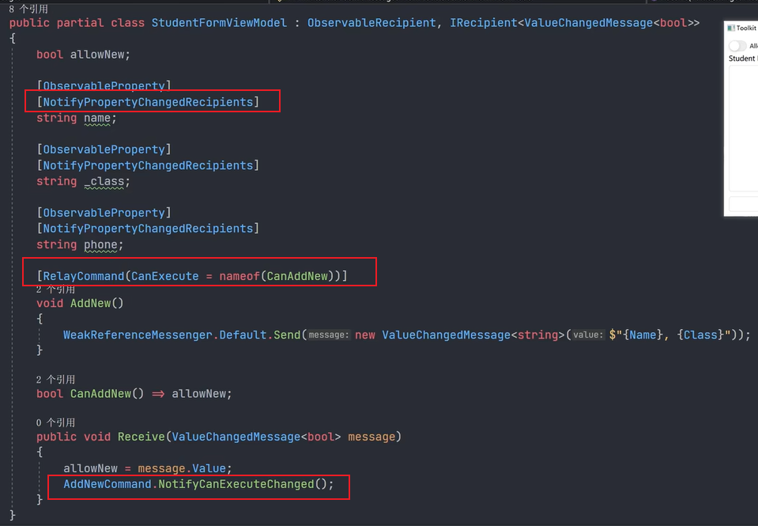
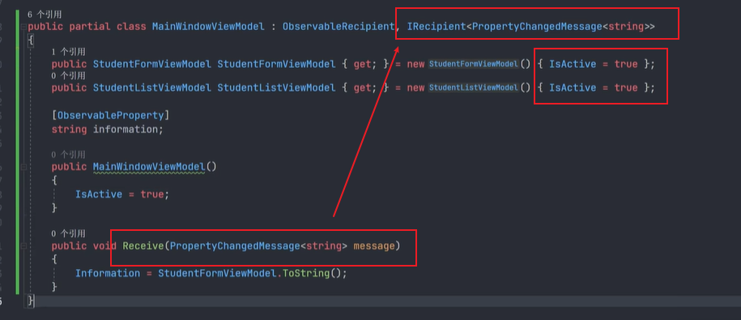
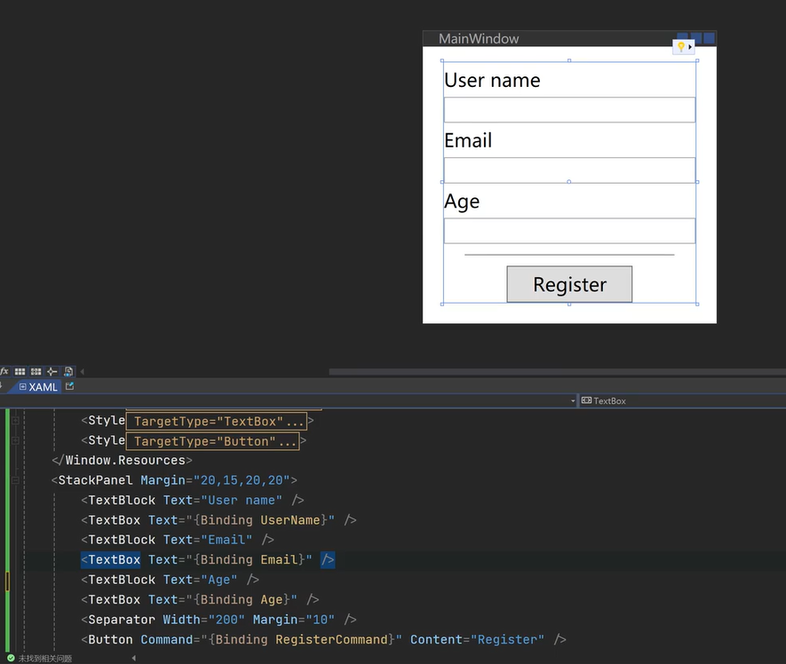
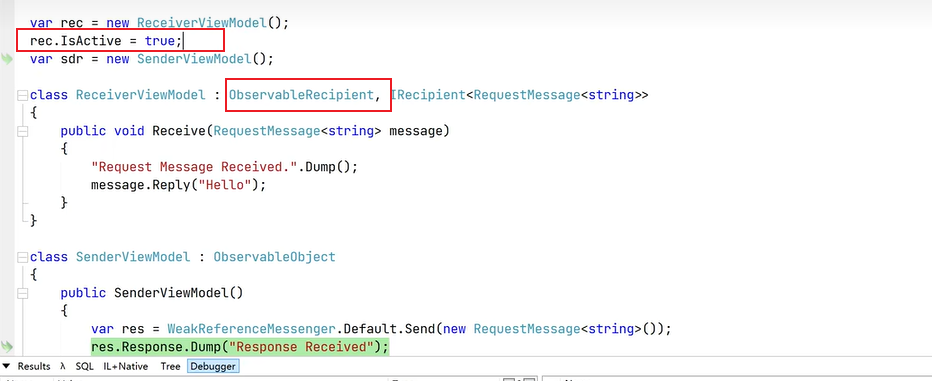

# CommunityToolkit 框架的使用

Nuget包：

- CommunityToolkit.Mvvm

官方文档：[MVVM 工具包简介 - Community Toolkits for .NET | Microsoft Learn](https://learn.microsoft.com/zh-cn/dotnet/communitytoolkit/mvvm/)

官方示例：[CommunityToolkit/MVVM-Samples: Sample repo for MVVM package](https://github.com/CommunityToolkit/MVVM-Samples)

## ObservableObject

ObservableObject 用于ViewModel的包装。

修饰属性的时候使用[ObservableProperty]特性，将会自动生成可进行变化通知的属性，并且可以生成部分方法，通过部分方法，可以进行事件的发布和订阅。

常用特性：

- [ObservableProperty]
- [NotifyPropertyChangedRecipients]：自动生成Broadcast方法的调用。
- [NotifyCanExecuteChangedFor]：通知更新

## ObservableRecipient

派生自ObservableObject ，在ObservableObject 的基础上做了额外的事，用于和Messenger打交道。

主要用于ViewModel之间的通信。使用ObservableRecipient时，需要将其属性isActive设为true。

例如如下界面是由三个用户控件和ViewModel构成，每个ViewModel的代码如下：

allowNew属性的值在更改时，会触发OnAllowNewChanged方法，发送消息。

StudentFormViewModel中，在文本框内容发生变化的时候，使用Broadcast通知MainViewModel。

IsActive默认为false，只有设为true，才会起作用。

### Broadcast方法

属性发生改变的时候，进行广播。

## ObservableValidator

## IMessenger

用于ViewModel之间的通信。

WeakReferenceMessenger（弱引用） 和 StrongReferenceMessenger（强引用）

弱引用与强引用：强引用不容易被GC回收。

内置的Message：

- ValueChangedMessage<>
- PropertyChangedMessage：用于属性传值
- RequestMessage

RequestMessage示例：

上述也可以使用ObservableRecipient实现同样的效果：

Event Aggregator（事件聚合者）

