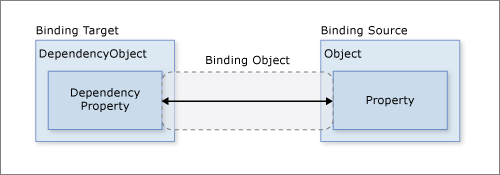
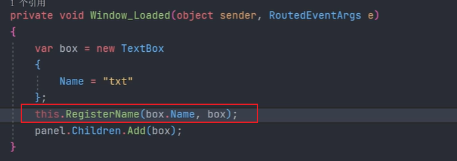

# 绑定

Binding 音译为“绑定”，Binding更注重表达它是一种像桥梁一样的关联关系。两端分别是Binding的源（Source）和目标（Target）。

Binding的两端分别是源（Source，数据从哪来）和目标（Target，数据到哪去）。一般情况下，Binding源是逻辑层的对象，Binding目标是UI层的控件对象。

目标属性在数据绑定中始终是依赖属性。

数据绑定生效的前提是一定要进行数据上下文的设置。

应用绑定有两种方式：

- 在XAML文件中，使用Binding标记扩展（本质是调用了BindingOperations.SetBinding方法）
- 在C#代码中，使用BindingOperations.SetBinding方法（见下文）

WPF中的Binding有：

- Binding
- MultiBidding：有时候 UI 需要显示的信息由不止一个数据来源决定，这时候就需要使用 **MultiBinding** ，即多路 Binding。
- PriorityBinding：用于在多个绑定源之间进行优先级绑定。PriorityBinding将多个Binding对象按照优先级顺序进行排列，并将数据绑定到第一个能够提供有效值的Binding对象上。


## 绑定的实现

将一个简单的数据源绑定到UI上需要进行以下几个操作：

- 定义数据源类型，一般为ViewModel实体
- ViewModel实体实现接口 INotifyPropertyChanged，并在需要进行变化通知的属性的set语句中触发PropertyChanged事件。
- 将该ViewModel进行UI绑定，调用 BindingOperations.SetBinding方法。
- UI元素使用Binding的Path指定源的某个属性进行绑定。

注意：上述表述的是普通的属性（非依赖属性）绑定到UI的某个属性时需要进行的操作，依赖属性本身具有通知变化的能力，不需要显式的实现INotifyPropertyChanged接口。

上述几个操作可以直接简化两个过程：定义数据源和绑定控件。



### 定义数据源模型

在定义数据模型时，为了实现属性值变化后能够通知Binding，让Binding把变化传递给UI，需要将该类实现INotifyPropertyChanged接口，并且在需要进行变化通知的属性中，显式触发该接口的PropertyChanged事件，这个属性即为Binding的路径（Path）。

```c#
public class Student : INotifyPropertyChanged
{
    public event PropertyChangedEventHandler? PropertyChanged;

    private string name;

    public string Name
    {
        get { return name; }
        set
        {
            name = value;
            if (this.PropertyChanged != null)
            { this.PropertyChanged(this, new PropertyChangedEventArgs("Name")); }
        }
    }
}
```

当Name属性的值发生变化时，PropertyChanged事件就会被激发，Binding接收到这个事件后发现事件的消息告诉它是名为Name的属性发生了值的改变，于是就会通知Binding目标端的UI元素显示新的值。

### 使用Binding把数据源和UI元素连接起来

把数据源和目标连接在一起的核心是调用BindingOperations.SetBinding方法。

xaml内容：

```xaml
<StackPanel>
    <TextBox x:Name="txtName" BorderBrush="Black" Margin="5"/>
    <Button Content="Add" Margin="5" Click="Button_Click"/>
</StackPanel>
```

后端代码：

```c#
 private Student myStu = new Student { Name = "张" };

 public MainWindow()
 {
     InitializeComponent();
     Binding _binding = new Binding();
     _binding.Source = myStu;
     _binding.Path = new PropertyPath("Name");
     //UI绑定
     BindingOperations.SetBinding(this.txtName, TextBox.TextProperty, _binding);
 }
private void Button_Click(object sender, RoutedEventArgs e)
{
    myStu.Name += "N";
}
```

### BindingOperations.SetBinding(...)

该方法用于将数据源和目标进行绑定。

```c#
public static BindingExpressionBase SetBinding(DependencyObject target, DependencyProperty dp, BindingBase binding);
```

参数说明：

- target：用于指定Binding的目标
- dp：用于为Binding指明把数据送达到目标的哪个属性。通过这个参数的类型可以知道：==目标属性在数据绑定中始终是依赖属性==
- binding：指定使用哪个Binding实例将数据源与目标关联起来。

由于FrameworkElement对BindingOperations.SetBinding(...)进行了封装，名称也叫SetBinding(...)，只是参数不同。FrameworkElement是WPF所有UI元素的父类，这从侧面向我们传递了这样一个思想——微软希望SetBinding（即作为数据目标）的对象是UI元素。因此实际使用中，更多的是直接调用控件的SetBinding方法进行绑定。

上述示例代码可以简化为：

```c#
this.txtName.SetBinding(TextBox.TextProperty, new Binding("Name") { Source = myStu = new Student() });
```


## Binding 标记扩展

上述是在C#代码中实现UI与数据源的绑定，如果要在XAML中实现同样的功能，就需要使用Binding标记扩展。

Binding标记扩展语法：

```
Attribute1="{Binding Path=p1,...}"
```

例如，下述XAML代码：

```xaml
<TextBox x:Name="txtName" Text="{Binding Path=Value, ElementName=mySlider}"/>
```

等同于C#代码：

```c#
this.txtName.SetBinding(TextBox.TextProperty,new Binding("Value") { ElementName="mySlider" }); 
```

因为C#代码中可以直接访问控件对象，所以一般不会使用ElementName，而是直接使用Source来指定控件对象。

等同于下述代码：

```C#
this.txtName.SetBinding(TextBox.TextProperty,new Binding("Value") { Source=mySlider });   
```

注意：在XAML中使用标记扩展进行绑定时，由于XAML不能访问C#代码中的成员，因此不能直接在标记扩展中使用Source属性来指定C#代码中的成员，即使设置了也无效。 


## Binding 的Mode属性（数据绑定的几种模式）


控制Binding数据流向的是Binding对象的Mode属性，它的类型是BindingMode枚举。该枚举值分别为：

- OneWay：只在更改绑定源（源）时更新绑定目标（目标），无需监视目标属性的更改。
- TwoWay：导致更改源属性或目标属性时自动更新另一方。 这种类型的绑定适用于可编辑的表单或其他完全交互式 UI 方案。
- OneWayToSource：和OneWay方向相反，在目标属性更改时，更新源属性。
- OnTime：在应用程序启动或数据上下文更改时，更新绑定目标。 这是实质上是 OneWay 绑定的一种简化形式，它在源值不更改的情况下提供更好的性能。
- Default：Binding的模式会根据目标的实际情况来确定，如果是可编辑的（如TextBox.Text属性），采用双向模式，若是只读的（如TextBlock.Text）采用单向模式。

补充：对于 TwoWay 或 OneWayToSource 绑定，可以通过设置 UpdateSourceTrigger 属性来控制目标到源的更新。

总结：

- OneWay：只根据源更新目标
- OneWayToSource：只根据目标更新源
- TwoWay：源和目标一起更新
- OnTime：仅在初始化绑定的时候更新


## Binding 的 Path属性

Path用于获取或设置绑定源属性的路径，它的类型是System.Windows.PropertyPath，而不是字符串类型。

数据源中只要是对外暴露的属性，都可以通过Path来指定。Path的有以下几种使用形式。

### 形式一：简单形式

```xaml
<TextBox x:Name="textBox1" Text="{Binding Path=Value,ElementName=slider1}" />
```

等效的C#代码是：

```c#
Binding binding=new Binding(){Path=new PropertyPath("Value"), Source=this.slider1};
//或者简写为：Binding binding=new Binding("Value"){Source = this.slider1 };
this.textBox1.SetBinding(TextBox.TextProperty,binding);
```

### 形式二：多级形式

允许指定属性的下级属性进行绑定，如下述代码中的TextBox的Text属性的Length属性。

```xaml
<TextBox x:Name="txtName" />
<TextBox x:Name="txtBox2" Text="{Binding Path=Text.Length, ElementName=txtName,Mode=OneWay}"/>
```

等效的C#代码：

```c#
this.txtBox2.SetBinding(TextBox.TextProperty, new Binding("Text.Length"){ Source=this.txtName, Mode=BindingMode.OneWay});
```

### 形式三：集合类型的索引器形式

集合类型的索引器也是属性，称为带参属性，因此同样可以通过Path来指定。

例如，在文本框中显示另一个文本框中的第四个字符：

```xaml
<TextBox x:Name="txtName" />
<TextBox x:Name="txtBox2" Text="{Binding Path=Text.[3], ElementName=txtName,Mode=OneWay}"/>
```

等效的C#代码：

```
this.txtBox2.SetBinding(TextBox.TextProperty, new Binding("Text.[3]"){ Source=this.txtName, Mode=BindingMode.OneWay});
```

也可以直接将Text.[3]中的“.”省掉，一样可以正常工作。

### 形式四：Path=. 或直接省略不写

当绑定的数据源是一个基本类型，例如string、int这种数据，无法指出是通过它的哪种属性来访问数据的，此时可以将Path设置为.的形式。

```xaml
<StackPanel>
    <StackPanel.Resources>
        <sys:String x:Key="myStr">
            这是一段文字
        </sys:String>
    </StackPanel.Resources> 
    <TextBox x:Name="txtName" Text="{Binding Path=.,Source={StaticResource ResourceKey=myStr}}" /> 
</StackPanel>
```

上述代码可以简写为：

```
Text="{Binding .,Source={StaticResource ResourceKey=myStr}}"
```

或

```
Text="{Binding Source={StaticResource ResourceKey=myStr}}"
```

注意：这种简写方式并不是没有指定Path，而是省略掉了而已。与之等效的C#代码如下：

```c#
string myStr="一句哈";
//注意：作为Path的"."是不能省略的
this.txtName.SetBinding(TextBlock.TextProperty,new Binding("."){Source=myString});
```

### C# 代码中的Path其他形式

当集合或者DataView作为数据源时，如果想把它的默认元素当作Path使用，可以使用这样的语法：

```c#
List<string> strs = new List<string>() { "One", "Two" };
//绑定集合中的默认元素（默认元素为集合的第一个元素），结果为One
this.txtName.SetBinding(TextBox.TextProperty,new Binding("/") { Source = strs });
//获取默认元素的长度，结果显示为3
this.txtName.SetBinding(TextBox.TextProperty, new Binding("/Length") { Source = strs });
//获取默认元素的下标为2的字符，结果为e
this.txtName.SetBinding(TextBox.TextProperty, new Binding("/[2]") { Source = strs });
```

如果集合元素的属性仍然是一个集合，我们想把子级集合中的元素当作Path，则可以使用多级斜线的语法。例如：

```C#
class City
{
	public string Name{get;set;}
}
calss Province
{
	public string Name{get;set;}
	public List<City> CityList{get;set;}
}
class Country
{
	public string Name{get;set;}
	public List<Province> ProvinceList{get;set;}
}
List<Country> countryList=new List<country>{..};
this.txtName.SetBinding(TextBox.TextProperty,new Binding("/ProvinceList/CityList.Name"){Source =countryList});
```


## Binding的 Source（数据源关联方式）

数据源的来源有以下几种：

- 把普通的CLR类型单个对象指定为Source，例如用户自定义的类，需要该类型实现INotifyPropertyChanged接口即可。
- 把普通的CLR集合类型对象指定为Source，常见的如数组、`List<T>`、`ObservableCollection<T>`，一般会把集合类型数据作为ItemsControl派生类的数据源来使用。
- 把ADO.NET数据对象指定为Source，如DataTable和DataView
- 使用XmlDataProvider 把XML数据指定为Source。
- 把依赖对象（Dependency Object）指定为Source。依赖对象中的依赖属性可以直接作为Binding的Path，而无需实现INotifyPropertyChanged接口，准确的说INotifyPropertyChanged接口主要用于于普通的CLR属性作为Binding的Path。
- 把容器的DataContext指定为Source（WPF Data Binding 的默认行为）
- 通过ElementName指定Source，即把一个控件当作另一个控件的Source
- 通过Binding的RelativeSource属性相对的指定Source。
- 把ObjectDataProvider对象指定为Source
- 把使用LinQ检索得到的数据作为Binding的Source


### 使用ElementName指定Source

使用ElementName需要特别注意，该属性与可视化树息息相关，如果设置的元素脱离了可视化树，将不会被绑定。

常见的ToolTip、和ContextMenu这些，都不适合。


### 使用 DataContext 作为Binding的源

DataContext属性被定义在FrameworkElement类里，这个类是WPF控件的基类，这意味着所有的WPF控件（包括容器控件）都具有该属性。在UI元素树的每个结点都有DataContext。

DataContext本身也是一个依赖属性，这意味着可以使用Binding把它关联到一个数据源上。

当一个Binding只知道自己的Path而不知道自己的Source时，它会沿着UI元素树一路向树的根部（上级或父级）找过去，每路过一个结点就要看看这个结点的DataContext是否具有Path所指定的属性，如果有，那就把这个DataContext对象作为自己的Source，如果没有就继续找下去，如果到了树的根部还没有找到，那这个Binding就没有Source，因而也不会得到数据。

注意：这里的“Binding沿着UI树向上找”只是一种错觉，实际Binding并没有这么智能。之所以会有这种效果是因为DataContext是一个“依赖属性“，依赖属性有一个很重要的特点就是当你没有为控件的某个依赖属性显式赋值时，控件会把自己容器的属性”借过来“当作自己的属性值。

```xaml
<Window x:Class="WpfApp.MainWindow"
     	...
        xmlns:local="clr-namespace:WpfApp"
        xmlns:sys="clr-namespace:System;assembly=mscorlib">
    <StackPanel>
        <StackPanel.DataContext>
            <local:Student Age="12" Name="张三"/>
        </StackPanel.DataContext>
        <StackPanel>
            <TextBox Text="{Binding Path=Age}" Margin="5"/>
            <TextBox Text="{Binding Path=Name}" Margin="5"/>
        </StackPanel>
    </StackPanel>
</Window>
```

> 当为一个Binding只指定Path不指定Source时，Binding会沿着逻辑树一直向上找、查看每个结点的DataContext属性，如果DataContext引用的对象具有Path指定的属性名，Binding就会把这个对象当作自己的数据源。

### 使用资源作为Binding源

在Resources中定义的x:key，都可以用作Binding的源。


使用Binding绑定该类中的属性、常量和静态属性、枚举：


### 使用集合对象作为列表控件的ItemsSource

WPF中的列表控件派生自ItemsControl类，ItemsSource属性可以接收一个IEnumerate接口派生类的实例作为自己的值。

```xaml
<StackPanel>
    <TextBox x:Name="txtName"/>
    <ListBox x:Name="myList"/>
</StackPanel>
```

C#代码：

```c#
myList.ItemsSource = new List<Student>() {
    new Student { Name="张三",Age=10},
    new Student { Name="李四",Age=20},
};
myList.DisplayMemberPath = "Name";
//为Text设置Binding
this.txtName.SetBinding(TextBox.TextProperty, new Binding("SelectedItem.Age") { Source = this.myList });
```

注意：上述代码只是简单演示，真正工作中，在使用集合类型作为列表控件的ItemsSource时，一般会优先使用`ObservableCollection<T>`代替List`<T>`，因为`ObservableCollection<T>`类实现了INotifyCollectionChanged,和INotifyPropertyChanged接口，能把集合的变化立刻通知给它的列表控件，改变会立刻显现出来。

### 使用ADO.NET对象作为Binding数据源

下述示例使用ListView控件来显示一个DataTable，这也是工作中常见的使用。

```xaml
<ListView x:Name="listViewStudents">
    <ListView.View>
        <GridView>
            <GridView.Columns>
                <GridViewColumn Header="编号" Width="60" DisplayMemberBinding="{Binding Id}"/>
                <GridViewColumn Header="年龄" Width="60" DisplayMemberBinding="{Binding Age}"/>
                <GridViewColumn Header="名称" Width="60" DisplayMemberBinding="{Binding Name}"/>
            </GridView.Columns>
        </GridView>
    </ListView.View>
</ListView>
```

上述代码中需要注意的地方有：

- GridView 和 ListView不是同一级别的控件。在官方文档中，GridView表示 ListView控件的以列形式显示数据项的视图模式，GridView是ViewBase的派生类，ListView是ListBox的派生类，而ListView的成员属性View刚好是ViewBase类型，指向了GridView而已。因此GridView可以作为ListView的View来使用，而不能当做独立的控件来使用。
- <GridView.Columns>标签是内容属性标签，可省略。
- GridView中使用DisplayMemberBinding进行数据绑定。

C#代码：

```c#
List<Student> students = new List<Student>()
{
    new Student{Id=1, Age=20, Name="张三"},
    new Student{Id=2, Age=40, Name="李四"},
};
//为了方便直接使用json将集合转换为json字符串再转换为Table
var data= JsonConvert.SerializeObject(students);
var dt= JsonConvert.DeserializeObject<DataTable>(data);
this.listViewStudents.ItemsSource = dt.DefaultView;
```

上述代码使用了DataTable的DefaultView属性进行了转化。当然也可以直接使用DataTable，此时需要将DataTable对象放到DataContext属性里，同时显式的关联ItemsSource。

同样的效果，代码如下：

```c#
//直接将DataTable放到DataContext中
this.listViewStudents.DataContext = dt;
//此句必不可少
this.listViewStudents.SetBinding(ListView.ItemsSourceProperty, new Binding());
```

上述代码中，Binding实例既没有指定Path，也没有指定Source，依然可以正常工作。


### 使用XML数据作为Binding源

对XML数据的处理有两种方式：

1. 通过LINQ To XML直接将XML数据转换为集合或者DataTable，然后使用上述示例中的集合绑定进行处理。
2. 通过 XmlDataProvider 获取数据并绑定

首先定义如下内容的xml文件：

```xml
<?xml version="1.0" encoding="utf-16"?>
<StudentList>
  <Student Id="1">
    <Age>20</Age>
    <Name>张三</Name>
  </Student>
  <Student Id="2">
    <Age>40</Age>
    <Name>李四</Name>
  </Student>
</StudentList>
```

在C#代码中，通过XmlDataProvider绑定源：

```c#
XmlDocument doc = new XmlDocument();
doc.Load(new StreamReader(@"D:\a.xml", Encoding.UTF8));

XmlDataProvider dataProvider = new XmlDataProvider();
dataProvider.Document = doc;
dataProvider.XPath = @"/StudentList/Student";

this.listViewStudents.DataContext = dataProvider;
this.listViewStudents.SetBinding(ListView.ItemsSourceProperty, new Binding());
```

~~上述代码先通过XmlDocument进行读取，再关联到XmlDataProvider上，也可以直接使用XmlDataProvider的Source属性，用它直接指向xml文件所在的位置。~~【待验证】

XAML代码：

```xaml
<ListView x:Name="listViewStudents">
    <ListView.View>
        <GridView>
            <GridView.Columns>
                <GridViewColumn Header="编号" Width="60" DisplayMemberBinding="{Binding XPath=@Id}"/>
                <GridViewColumn Header="年龄" Width="60" DisplayMemberBinding="{Binding XPath=Age}"/>
                <GridViewColumn Header="名称" Width="60" DisplayMemberBinding="{Binding XPath=Name}"/>
            </GridView.Columns>
        </GridView>
    </ListView.View>
</ListView>
```

需要注意的是：

- 当使用XML数据作为Binding的Source时，使用XPath属性而不是Path属性来指定数据的来源。
- XPath=@Id中的@符号加字符串表示的是XML元素的Attribute，不加@符号的字符串表示的是子级元素，这是XML语言的功能语法。

下面的示例中，直接将XML内容定义在xaml中，使用TreeView控件进行数据绑定。

```xaml
<Window.Resources>
    <XmlDataProvider x:Key="xdp" XPath="FileSystem/Folder">
        <x:XData>
            <FileSystem xmlns="">
                <Folder Name="Books">
                    <Folder Name="Programming">
                        <Folder Name="Windows">
                            <Folder Name="WPF"/>
                            <Folder Name=".NET"/>
                            <Folder Name="C#"/>
                        </Folder>
                    </Folder>
                    <Folder Name="Tools">
                        <Folder Name="开发"/>
                        <folder Name="游戏"/>
                    </Folder>
                </Folder>
            </FileSystem>
        </x:XData>
    </XmlDataProvider>
</Window.Resources>

<Grid>
    <TreeView ItemsSource="{Binding Source={StaticResource xdp}}">
        <TreeView.ItemTemplate>
            <HierarchicalDataTemplate ItemsSource="{Binding XPath=Folder}">
                <TextBlock Text="{Binding XPath=@Name}"/>
            </HierarchicalDataTemplate>
        </TreeView.ItemTemplate>
    </TreeView>
</Grid>
```

注意：如果把XmlDataProvider直接写在xaml代码里，那么它的XML数据需要放在 `<x:XData>...</x:Xdata>`标签里。


### 使用ObjectDataProvider对象作为Binding源

ObjectDataProvider用于把对象包装后作为数据源提供给Binding。

所谓的包装，指的是把一个类型的实例对象传递给ObjectDataProvider的ObjectInstance属性，并通过配置其他属性达到包装的效果。

例如，假设存在下述类型:

```c#
public class SumDemo
{
    public string Append(string x,string y)
    {
        return x + y;
    }
}
```

将该类型对象包装到ObjectDataProvider中：

```c#
ObjectDataProvider odp = new ObjectDataProvider();
odp.ObjectInstance = new SumDemo();
odp.MethodName = "Append";
odp.MethodParameters.Add("1");
odp.MethodParameters.Add("2");
```

注意：MethodParameters属性是类型敏感的，因此添加的参数值必须符合MethodName指定的方法的参数类型。

创建Binding并关联ObjectDataProvider：

```c#
//以ObjectDataProvider对象为Source创建Binding
Binding bindingToArg1 = new Binding("MethodParameters[0]")
{
    Source = odp,
    BindsDirectlyToSource = true,
    UpdateSourceTrigger = UpdateSourceTrigger.PropertyChanged
};
this.txt1.SetBinding(TextBox.TextProperty, bindingToArg1);

Binding bindingToArg2 = new Binding("MethodParameters[1]")
{
    Source = odp,
    BindsDirectlyToSource = true,
    UpdateSourceTrigger = UpdateSourceTrigger.PropertyChanged
};
this.txt2.SetBinding(TextBox.TextProperty, bindingToArg2);

//当数据源本身就代表数据的时候，就使用“.”作Path
this.txt3.SetBinding(TextBox.TextProperty, new Binding(".") { Source = odp });
```

上述代码中，BindsDirectlyToSource = true表示的是告诉Binding对象只负责从UI元素收集到的数据写入其直接Source（即ObjectDataProvider对象）而不是被ObjectDataProvider对象包装着的SumDemo对象。

注意：在把ObjectDataProvider对象当作Binding的Source来使用时，这个对象本身就代表了数据，所以最后一行代码中的Path使用的是“.”，而非其Data属性。

xaml代码如下：

```xaml
<StackPanel>
    <TextBox x:Name="txt1"/>
    <TextBox x:Name="txt2"/>
    <TextBox x:Name="txt3"/>
</StackPanel>
```

### 使用CollectionViewSource作为Binding源


###  使用 Binding 的 RelativeSource通过相对位置来设置控件的数据源

见下文。


## Binding 的 RelativeSource

通过相对位置来设置控件的数据源。

下述示例中，TextBox位于几个容器的最内层，其所有的外层容器都有Name属性，使用RelativeSource来进行相对位置的数据源搜索。

```c#
<Grid x:Name="g1">
    <DockPanel x:Name="d2">
        <Grid x:Name="g3">
            <StackPanel x:Name="s4">
                <TextBox x:Name="txtBox"/>
                <TextBox Text="{Binding RelativeSource={RelativeSource Mode=FindAncestor, AncestorType={x:Type Grid},AncestorLevel=1},Path=Name}"/>
                <TextBox x:Name="txtSelf" Text="{Binding RelativeSource={RelativeSource Mode=Self},Path=Name}"/>
            </StackPanel>
        </Grid>
    </DockPanel>
</Grid>
```

C# 代码：

```c#
RelativeSource rs = new RelativeSource(RelativeSourceMode.FindAncestor);
rs.AncestorLevel = 2;
rs.AncestorType=typeof(Grid);
this.txtBox.SetBinding(TextBox.TextProperty,new Binding("Name"){ RelativeSource = rs });
```

第一个文本框使用C#代码的形式显式绑定；第二个文本框直接在XAML中使用标记扩展语句进行了绑定；第三个文本框直接关联自身。

RelativeSource的属性介绍：

- Mode：元素查找的模式有以下四种：
  - FindAncestor（默认）
  - Self
  - TemplatedParent
  - PreviousData

- AncestorType：告诉Binding寻找哪个类型的对象作为自己的源，不是这个类型的对象会被跳过。
- AncestorLevel：指的是以Binding目标控件为起点的层级偏移量，依次向外找。上述代码中的第一个文本框AncestorLevel设置为2，表示找到的是第二层的Grid，因此文本框的结果是g1，而第二个文本框设置AncestorLevel=1，因此将会找到g3。AncestorLevel从1开始。


## ElementName 和 RelativeSource 的局限性

> 本小节来自于[十月的寒潮的视频](https://www.bilibili.com/video/BV1wV4y187JQ?spm_id_from=333.788.videopod.sections&vd_source=e3d65fed6c5d2bee448a9a010e7d9a81)讲解。

ElementName 和 RelativeSource 的存在的局限性：

- ElementName 要求 Visual Tree（可视化树） 以及 NameScope（命名范围）。
- RelativeSource 要求 Visual Tree。

它们在特殊情况下会存在局限性，例如：

1. 代码后台生成的控件，不会被自动添加到当前根节点所在的NameScope中，当界面的元素是通过C#程序动态添加到界面上时，ElementName形式就会绑定失败。

   

   

2. 目标并没有Visual Tree（比如 Tag 或 DataGridTextColumn，这两个指定的值不会出现在Visual Tree上面，因此在这两个上面进行绑定会失败）

   

   

3. 目标在运行时会跑到“别处”（比如 Tooltip 或 ContextMenu），目标与源不在同一个Visual Tree结构上，将会绑定失败。

   

解决方案：

1. 使用RegisterName方法，为控件添加NameScope。

   

2. 后台通过引用依赖属性来建立绑定。

   

3. 如果条件允许，那么可以使用{x:Reference} 或 RelativeSource。x:Reference是从XAML文档中搜索对应名称的对象，注意搜素的对象不能是自己的父级，会导致循环依赖错误。例如不能使用x:Reference指定为Window，Window是所有控件的父级。

   

   

4. 想办法接力（Tooltip 与 ContextMenu 都拥有 PlacementTarget 属性）

   

   

5. ==使用 BindingProxy==，自定义一个派生自Freezable的子类（推荐，万解方案），Freezable常用于动画。

   

   


## Binding 的 StringFormat

对于Text属性的绑定可以直接使用StringFormat：


对于Content属性的绑定，可以使用ContentStringFormat：


## Binding 的 TargetNullValue 和 FallbackValue

TargetNullValue：当未绑定源时，显式的值。


FallbackValue：绑定失败时，显示的值。


设计的时候，可以使用d:Text来显示将要呈现的效果。


## 数据转换与校验

Binding用于数据有效性检验的关卡是它的ValidationRules属性；用于数据类型转换的关卡是它的Converter属性。


### Binding的数据校验

Binding进行校验时的默认行为是认为来自Source的数据总是正确的，只有来自Target的数据才有可能有问题（因为Target多为UI控件，所以等价于用户输入的数据），为了不让有问题的数据污染Source所以需要校验。换句话说，Binding只在Target被外部方法更新时校验数据，而来自Binding的Source数据更新Target时是不会进行校验的。如果想改变这种行为，或者说当来自Source的数据也有可能出问题时，就需要将校验条件的ValidatesOnTargetUpdated属性设为true。

==也就是说，默认情况下，数据校验用于Target的数据变化（如UI组件录入）会影响Source时的情况，如果想要Source的数据变化影响Target也要进行数据校验时，需要将校验条件的ValidatesOnTargetUpdated属性设为true。==

Binding的ValidationRules属性类型是Collection<ValidationRule>，可以为每个Binding设置多个数据校验条件，每个条件是一个ValidationRule类型对象。

ValidationRule类是个抽象类，需要创建它的派生类并实现它的Validate方法，该方法的返回值是ValidationResult类型对象，如果校验通过，就把ValidationResult对象的IsValid属性设置为true，反之，需要把IsValid属性设置为false，并为其ErrorContent属性设置一个合适的消息内容。

```xaml
    <StackPanel>
        <TextBox x:Name="txtBox"/>
        <TextBlock x:Name="txtShow" />
    </StackPanel>
```

实现ValidationRule抽象类：

```c#
public class TextValidationRule : ValidationRule
{
    public override ValidationResult Validate(object value, CultureInfo cultureInfo)
    {
        if (value.ToString().Contains('.'))
        {
            return new ValidationResult(false, "不能包含.");
        }
        return new ValidationResult(true, null);
    }
}
```

在C#代码中建立Binding：

```c#
Binding binding = new Binding("Text") { Source = this.txtBox };
binding.UpdateSourceTrigger = UpdateSourceTrigger.PropertyChanged;

TextValidationRule txtVr = new TextValidationRule();
txtVr.ValidatesOnTargetUpdated = true;
binding.ValidationRules.Add(txtVr);
binding.NotifyOnValidationError = true;
this.txtShow.SetBinding(TextBlock.TextProperty, binding);
this.txtShow.AddHandler(Validation.ErrorEvent, new RoutedEventHandler((s, e) => {
    var err = Validation.GetErrors(this.txtBox);
    if (err.Count>0)
    {
        MessageBox.Show(err[0].ErrorContent.ToString());
    }
}));
```

【上述代码执行无弹窗提示，待解决】

在创建Binding时，要把Binding对象的NotifyOnValidationError属性设为true，这样，当数据校验失败的时候，Binding会像报警器一样发出信号。这个信号会以Binding对象的Target为起点在UI元素树上传播。信号每到达一个结点，如果这个结点上设置有对这种信号的侦听器（事件处理器），那么这个侦听器就会被触发用以处理这个信号。信号处理完后，程序员还可以选择是让信号继续向下传播还是就此终止——这就是路由事件，信号在UI元素树上的传递过程就称为路由（Route）。


### binding的数据转换

数据转换：==当Source端Path所关联的数据与Target端目标属性数据类型不一致时，可以添加数据转换器（Data Converter）。==

创建转换器，只需要创建一个类并让这个类实现IValueConverter接口，该接口的定义如下：

```c#
public interface IValueConverter
{
    //数据从源流向目标时被调用
    object Convert(object value, Type targetType, object parameter, CultureInfo culture);     
    //数据从目标返回源时被调用
    object ConvertBack(object value, Type targetType, object parameter, CultureInfo culture);
}
```

当数据从Binding的Source流向Target时，Convert方法将被调用；反之ConvertBack方法将被调用。

这两个方法的参数一模一样：

- 第一个参数object，最大限度的保证了Converter的重用性（可以在方法体内对实际类型进行判断）
- 第二个参数用于确定方法的返回类型，这里的targetType指的是最终要返回的类型，不是Binding中的Target，更应该是outputType。
- 第三个参数用于把额外的信息传入方法，若需要传递多个信息则可以把信息放入一个集合对象来传入方法。

Binding对象的Mode属性会影响到这两个方法的调用。如果Mode为TwoWay或Default行为与TwoWay一致，则两个方法都有可能被调用；如果Mode为OneWay或Default行为与OneWay一致，则只有Convert方法会被调用；其他情况同理。

#### Converter综合示例

首先创建几个自定义数据类型：

```c#
//种类
public enum Category
{
    Bomber,
    Fighter
}

//状态
public enum State
{
    Available,
    Locked,
    Unknown
}

public class Plane
{
    public Category Category { get; set; }
    public string Name { get; set; }
    public State State { get; set; }
}
```

创建两个Converter：一个是由Category类型单向转换为string类型，另一个是在State类型与bool?类型之间双向转换。

```c#
public class CategoryToSourceConverter : IValueConverter
{
    //将Category转换为字符串
    public object Convert(object value, Type targetType, object parameter, CultureInfo culture)
    {
        Category c = (Category)value;
        switch (c)
        {
            case Category.Bomber:
                return "Bomber";

            case Category.Fighter:
                return "Fighter";

            default:
                return null;
        }
    }

    //不会被调用
    public object ConvertBack(object value, Type targetType, object parameter, CultureInfo culture)
    {
        throw new NotImplementedException();
    }
}

public class StateToNullableBoolConverter : IValueConverter
{
    //将State转换为bool?
    public object Convert(object value, Type targetType, object parameter, CultureInfo culture)
    {
        State s = (State)value;
        switch (s)
        {
            case State.Available:
                return true;

            case State.Locked:
                return false;

            case State.Unknown:
            default:
                return null;
        }
    }

    //将bool?转换为State
    public object ConvertBack(object value, Type targetType, object parameter, CultureInfo culture)
    {
        bool? nb = (bool?)value;
        switch (nb)
        {
            case true:
                return State.Available;

            case false:
                return State.Locked;

            default:
                return State.Unknown;
        }
    }
}
```

在XAML代码中使用Converter的两种方式：

- 把Converter以资源的形式放在资源词典中（本例使用的方式）
- 为Converter准备一个静态属性，形成单件模式，在XAML代码里使用{x:Static}标签扩展来访问。

在XAML中使用Converter：

```xaml
<!--以资源的形式创建两个Converter实例-->
<Window.Resources>
    <local:CategoryToSourceConverter x:Key="cts"/>
    <local:StateToNullableBoolConverter x:Key="stnb"/>
</Window.Resources>

<StackPanel>
    <ListBox x:Name="listBoxPlane">
        <ListBox.ItemTemplate>
            <DataTemplate>
                <StackPanel Orientation="Horizontal">
                    <!--将Category枚举通过转换器显示为字符串-->
                    <TextBlock Text="{Binding Path=Category,Converter={StaticResource cts}}" Width="60"/>
                    <TextBlock Text="{Binding Path=Name}" Width="60"/>
                    <!--将State转换为bool类型，并在获取数据时将bool自动转换为State枚举值-->
                    <CheckBox IsThreeState="True" IsChecked="{Binding Path=State,Converter={StaticResource stnb}}"/>
                </StackPanel>
            </DataTemplate>
        </ListBox.ItemTemplate>
    </ListBox>
    <Button x:Name="btnGet" Content="获取数据" Click="btnGet_Click"/>
</StackPanel>
```

初始化和事件处理代码：

```c#
public void InitData()
{
	List<Plane> planeList = new List<Plane>
    {
        new Plane{ Category = Category.Bomber,Name="B1",State=State.Unknown},
        new Plane{ Category = Category.Bomber,Name="B2",State=State.Available},
        new Plane{ Category = Category.Fighter,Name="F1",State=State.Available},
        new Plane{ Category = Category.Fighter,Name="F2",State=State.Locked},
        new Plane{ Category = Category.Bomber,Name="B3",State=State.Locked},
        new Plane{ Category = Category.Fighter,Name="F3",State=State.Unknown},
    };
	this.listBoxPlane.ItemsSource = planeList;
}

private void btnGet_Click(object sender, RoutedEventArgs e)
{
    foreach (Plane p in listBoxPlane.Items)
    {
        //State使用了双向绑定，因此能够自动将bool类型数据通过转换器转换为State枚举值
        MessageBox.Show($"Category={p.Category}，Name={p.Name}，State={p.State}");
    }
}
```


### 数据转换与校验总结

- 数据校验的方向是根据校验条件的ValidatesOnTargetUpdated属性的值来确定的，默认情况下，该值为false，表示只在Target影响Source进行校验；如果值设为true，表示Source影响Target时也会进行校验。
- 数据转换的方向的执行由实现IValueConverter接口的两个方法决定：当数据从Binding的Source流向Target时，Convert方法将被调用；反之ConvertBack方法将被调用。而控制数据是从Source流向Target，还是从Target流向Source，是根据Binding对象的Mode属性的值来决定的。
- 


## MultiBinding（多路Binding）

当UI需要显示的信息由不止一个数据来源决定，这时候就需要使用MultiBinding，即多路Binding。MultiBinding与Binding一样均以BindingBase类为基类，因此凡是能使用Binding对象的场合都能使用MultiBinding。

MultiBinding具有一个名为Bindings的属性，其类型是Collection<BindingBase>，通过这个属性MultiBinding把一组Binding对象聚合起来，处在这个集合中的Binding对象可以拥有自己的数据校验与转换机制，他们汇集起来的数据将共同决定传往MultiBinding目标的数据。

创建MultiBinding的Converter，需要实现IMultiValueConverter接口。

下述示例，实现只要有一个文本框未输入内容，提交按钮就不可用。

```xaml
<StackPanel>
    <TextBox x:Name="txt1" />
    <TextBox x:Name="txt2" />
    <TextBox x:Name="txt3" />
    <TextBox x:Name="txt4" />
    <Button x:Name="btnSubmit" Content="提交"/>
</StackPanel>
```

创建MultiBinding的Converter：

```c#
public class LogonMultiBindingConverter : IMultiValueConverter
{
    public object Convert(object[] values, Type targetType, object parameter, CultureInfo culture)
    {
        if (!values.Cast<string>().Any(string.IsNullOrEmpty))
        {
            return true;
        }
        return false;
    }

    //MultiBinding指定为OneWay，因此不会被调用
    public object[] ConvertBack(object value, Type[] targetTypes, object parameter, CultureInfo culture)
    {
        throw new NotImplementedException();
    }
}
```

创建MultiBinding并关联控件：

```c#
//准备基础Binding
Binding b1 = new Binding("Text") { Source = this.txt1 };
Binding b2 = new Binding("Text") { Source = this.txt2 };
Binding b3 = new Binding("Text") { Source = this.txt3 };
Binding b4 = new Binding("Text") { Source = this.txt4 };

//准备MultiBinding
MultiBinding mb = new MultiBinding() { Mode = BindingMode.OneWay };
//注意：MultiBinding对Add子Binding的顺序是敏感的
mb.Bindings.Add(b1);
mb.Bindings.Add(b2);
mb.Bindings.Add(b3);
mb.Bindings.Add(b4);
mb.Converter = new LogonMultiBindingConverter();

//将Button与MultiBinding对象关联
this.btnSubmit.SetBinding(Button.IsEnabledProperty, mb);
```

注意：

- MultiBinding对于添加子级Binding的顺序是敏感的，因为这个顺序决定了汇集到Converter里数据的顺序。
- MultiBinding的Converter实现的是IMultiValueConverter接口。


扩展阅读：

- [数据绑定概述 - WPF .NET | Microsoft Learn](https://learn.microsoft.com/zh-cn/dotnet/desktop/wpf/data/?view=netdesktop-7.0)
- 