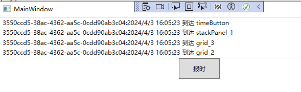

# 路由事件

在winform程序中，事件的激发与响应都是直接模式，即事件宿主发生的事件直接由事件响应者的事件处理器来处理，而WPF中的事件在其基础上升级为可传递的消息模型，即在由UI布局组件构成的树形结构上的某个结点激发出某个事件时，这个事件可以在UI组件树沿着一定的方向传递且经过多个中专结点（即路由），开发者在事件的路由的过程中就可以选择被恰当的处理。

WPF中的大多数事件被称为路由事件（Routed Event）。

路由事件是可以调用元素Tree中的多个侦听器上的处理程序的事件。

当UI组件树上的某个元素触发了事件，该事件可以在UI组件树沿着一定的方向传递，开发者可以在事件被路由过程中进行处理。（只要路由事件发生，它就会进入可视树，所以我们要做的就是使用可视结构来执行事件的路由。）

UI组件树分为逻辑树（Logical Tree）和可视元素树（Visual Tree）。

- Logical Tree：完全由布局控件和控件构成，每个结点不是布局组件就是控件。如果想在Logical Tree上导航或查找元素，可以使用LogicalTreeHelper类。
- Visual Tree：在Logical Tree的基础上，进行更细微级别的组件呈现。如果想在Visual Tree上导航或查找元素，可以使用VisualTreeHelper类。

当一个路由事件被激发后，是沿着Visual Tree传递的，而不是Logical Tree，因为只有这样，藏在Template里的控件才能把消息送出来。

CLR事件（Winform中的事件或使用event关键字修饰的事件）与路由事件的区别：

- CLR事件激发时，发送者直接将消息通过事件订阅交送给事件响应者，事件响应者使用其事件处理器方法对事件的发生做出响应、驱动程序逻辑按客户需求运行；
- 路由事件的事件拥有者和事件响应者之间则没有直接显式的订阅关系，事件的拥有者只负责激发事件，事件将由谁响应它并不知道，事件的响应者则安装有事件侦听器，针对某类事件进行侦听，当有此类事件传递至此时，事件响应者就使用事件处理器来响应事件并决定事件是否可以继续传递。

> 有点类似于JS处理HTML中的事件模型，在winform中，只是单纯的事件，而wpf中的XAML更接近于HTML中元素的事件模型，如按照树形结构依次向外引发。这样当需要处理树形元素上的同一类型的事件时，就不需要为每个元素定义事件，而只需要在引发事件的最内层元素定义路由事件即可。

路由事件根据注册的策略不同，分为：

- 冒泡事件，从下到上传播事件。例如一个按钮的内部包含了另一个按钮，当点击内部按钮时，会先触发内部按钮的Click事件，然后再触发外部按钮的Click事件。
- 隧道事件，从上到下传播事件。例如常见的鼠标移动相关的事件很多都是隧道事件，以preview开头。
- 直接事件，Winform中的事件模式。


## 自定义路由事件

注：需要先熟练掌握C#中的事件的相关知识，包括事件的完整声明和简略声明两种形式，因为路由事件的定义和C#中事件的定义类似，只是在此基础上，添加了额外的方法进行注册和包装而已。


自定义路由事件的步骤：

1. 定义路由事件参数，创建需要让事件携带的信息（派生自RoutedEventArgs类，如果没有附加参数可以直接使用RoutedEventArgs）。
2. 声明并注册路由事件
3. 为路由事件添加CLR事件包装
4. 激发路由事件，将事件携带的信息与路由事件进行关联

### 第一步：定义路由事件参数

当事件需要携带额外的参数时，可以使用如下形式进行定义，需派生自RoutedEventArgs，且构造函数的类型为RoutedEvent，这样才能将事件参数与路由事件进行关联。

```c#
class ReportTimeEventArgs : RoutedEventArgs
{
    public ReportTimeEventArgs(RoutedEvent routedEvent, object source) : base(routedEvent, source)
    {
    }
    public string Message { get; set; }
}
```

在WPF中，如果事件不需要传递任何额外细节，可使用RoutedEventArgs类。如果事件需要传递额外的信息，那么需要使用派生自RoutedEventArgs的各种事件类（如MouseButtonEventArgs），由于每个WPF事件参数类都继承自RoutedEventArgs类，所以每个WPF事件处理程序都可以访问与事件路由相关的信息。

#### 路由事件参数补充说明

为什么需要定义路由事件参数：

在C#中的事件声明中，通常为事件会定义一个事件约束委托（见C#事件笔记），对应的WPF中内置了一个这样的事件约束委托：

```C#
public delegate void RoutedEventHandler(object sender, RoutedEventArgs e);
```

可以看到第二个参数即为RoutedEventArgs类型，正是因为这个事件委托约束，如果事件不需要传递任何额外细节，可直接使用RoutedEventArgs，当需要额外的参数时，通常使用派生该类型的子类。


### 第二步：声明并注册路由事件

使用EventManager类的RegisterRoutedEvent方法进行注册。

```c#
//声明并注册路由事件
public static readonly RoutedEvent ReportTimeEvent = EventManager.RegisterRoutedEvent(
    "ReportTime", RoutingStrategy.Bubble, typeof(EventHandler<ReportTimeEventArgs>), typeof(TimeButton));
```

#### EventManager.RegisterRoutedEvent(...)

该方法定义如下：

```c#
public static RoutedEvent RegisterRoutedEvent(string name, RoutingStrategy routingStrategy, Type handlerType, Type ownerType);
```

- name：路由事件的名称。==按微软的建议，这个字符串应该与RoutedEvent变量的前缀和CLR事件包装器的名称一致==。因为底层算法与依赖属性类似，需要使用这个字符串去生成用于注册路由事件的Hash Code，所以这个字符串不能为空。
- routingStrategy：路由事件的策略。有3种路由策略：
  - Bubble：冒泡式，路由事件由事件的激发者出发，向它的上级容器一层一层路由，直至最外层容器。
  - Tunnel：隧道式，事件的路由方向正好与Bubble策略相反，是由UI树的根向事件激发控件移动。
  - Direct：直达式。模仿CLR直接事件，直接将事件消息送达时间处理器。
- handlerType：指定事件处理器的类型。事件处理器的返回值类型和参数列表必须与此参数指定的委托保持一致，不然会导致在编译时抛出异常。
- ownerType：用于指明路由事件的宿主（拥有者）是哪个类型。与依赖属性类似，这个类型和第一个参数name的值共同参与一些底层算法且产生这个路由事件的Hash Code 并被注册到程序的路由事件列表中。

#### 为什么需要注册路由事件

在C#中的事件完整声明过程中，事件使用如下形式进行定义：

```C#
private StudyEventHandler studyEventHandler;
public event StudyEventHandler Study
{
    add
    {
        this.studyEventHandler += value;
    }
    remove
    {
        this.studyEventHandler -= value;
    }
}
```

而WPF中的路由事件是在事件的基础上，在add和remove中，分别调用了AddHandler和RemoveHandler方法（见下文中的第三步），而这两个方法的第一个参数都是RoutedEvent，因此需要先声明RoutedEvent类型的对象。只是这个对象不是直接实例化出来的，而是通过EventManager.RegisterRoutedEvent方法生成的。

### 第三步：为路由事件添加CLR事件包装

和使用CLR属性包装依赖属性的代码格式类似，只是关键字 get 和 set 被替换为 add 和 remove。

当使用操作符（+=）添加对路由事件的侦听处理时，add 分支的代码被调用；

当使用操作符（-=）移除对此事件的侦听时，remove分支的代码被调用。

包装后的CLR事件只是看上去像一个直接事件，本质上不过是在当前元素（路由的第一站）上调用AddHandler和RemoveHandler而已。

代码如下：

```c#
//CLR事件包装器
public event RoutedEventHandler ReportTime
{
    add { this.AddHandler(ReportTimeEvent, value); }
    remove { this.RemoveHandler(ReportTimeEvent, value); }
}
```

XAML编辑器也是靠这个CLR事件包装器来产生自动提示。

#### RoutedEventHandler

系统内置的一个独立的委托：

```
public delegate void RoutedEventHandler(object sender, RoutedEventArgs e);
```

该委托的作用是用来约束路由事件，

#### AddHandler

AddHandler方法源自UIElement类，也就是说，WPF中的所有控件都具有这个方法。用于为指定的路由事件添加路由事件处理程序，将处理程序添加到当前元素上的处理程序集合。

```c#
AddHandler(RoutedEvent, Delegate)
```

### 第四步：激发路由事件并关联事件参数

激发路由事件需要先创建RoutedEventArgs的实例，通过在其构造函数中传入路由事件实例，实现事件参数与路由事件的关联，然后调用元素的RaiseEvent方法（继承自UIElement类）把事件发送出去。

```c#
//激发路由事件的方法，在用户单击鼠标时会被调用
protected override void OnClick()
{
    base.OnClick();
    //创建RoutedEventArgs实例
    ReportTimeEventArgs args = new ReportTimeEventArgs(ReportTimeEvent, this);
    args.Message = Guid.NewGuid().ToString()+":"+ DateTime.Now;
    this.RaiseEvent(args);
}
```

注意：==传统直接事件的激发是通过调用CLR事件的Invoke方法实现的，而路由事件的激发与作为其包装器的CLR事件毫不相干==。例如上述路由事件的激发是通过鼠标单击时被调用，与CLR事件包装器RoutedEventHandler没有任何关系。

RaiseEvent()方法负责为每个已经通过AddHandler()方法注册的调用程序引发事件。

### 完整代码

```c#
public partial class MainWindow : Window
{
    public MainWindow()
    {
        InitializeComponent();
    }

    //事件触发代码
    private void ReportTimeHandler(object sender, ReportTimeEventArgs e)
    {
        FrameworkElement element = sender as FrameworkElement;
        string timeStr = e.Message;
        string content = $"{timeStr} 到达 {element.Name}";
        this.listBox.Items.Add(content);
        
        if(element == this.grid_2)
        {
            //停止事件传递
            e.Handled = true;
        }
    }
}

internal class TimeButton : Button
{
    //声明和注册路由事件
    public static readonly RoutedEvent ReportTimeEvent = EventManager.RegisterRoutedEvent(
        "ReportTime", RoutingStrategy.Bubble, typeof(EventHandler<ReportTimeEventArgs>), typeof(TimeButton));

    //CLR事件包装器
    public event RoutedEventHandler ReportTime
    {
        add { this.AddHandler(ReportTimeEvent, value); }
        remove { this.RemoveHandler(ReportTimeEvent, value); }
    }

    //激发路由事件的方法，在用户单击鼠标时会被调用
    protected override void OnClick()
    {
        base.OnClick(); //保证Button原有功能正常使用，Click事件能被激发
        ReportTimeEventArgs args = new ReportTimeEventArgs(ReportTimeEvent, this);
        args.Message = Guid.NewGuid().ToString() + ":" + DateTime.Now;
        this.RaiseEvent(args);
    }
}

internal class ReportTimeEventArgs : RoutedEventArgs
{
    public ReportTimeEventArgs(RoutedEvent routedEvent, object source) : base(routedEvent, source)
    {
    }

    public string Message { get; set; }
}
```

XAML界面代码：

所有的控件均侦听按钮事件。

```xaml
<Window x:Class="WpfApp1.MainWindow"
        xmlns="http://schemas.microsoft.com/winfx/2006/xaml/presentation"
        xmlns:x="http://schemas.microsoft.com/winfx/2006/xaml"
        xmlns:d="http://schemas.microsoft.com/expression/blend/2008"
        xmlns:mc="http://schemas.openxmlformats.org/markup-compatibility/2006"
        xmlns:local="clr-namespace:WpfApp1"
        mc:Ignorable="d"
        Title="MainWindow" Height="450" Width="800" x:Name="window_1"
        local:TimeButton.ReportTime="ReportTimeHandler">
    <Grid x:Name="grid_1" local:TimeButton.ReportTime="ReportTimeHandler">
        <Grid x:Name="grid_2" local:TimeButton.ReportTime="ReportTimeHandler">
            <Grid x:Name="grid_3" local:TimeButton.ReportTime="ReportTimeHandler">
                <StackPanel x:Name="stackPanel_1" local:TimeButton.ReportTime="ReportTimeHandler">
                    <ListBox x:Name="listBox"/>
                    <local:TimeButton x:Name="timeButton" Width="80" Height="40" Content="报时"
                    local:TimeButton.ReportTime="ReportTimeHandler"/>
                </StackPanel>
            </Grid>
        </Grid>
    </Grid>
</Window>
```

运行上述代码，事件将会按照冒泡方式被传递，直到元素为grid_2时，将RoutedEventArgs实例的Handled设为true，停止路由事件的传递。



WPF中元素的很多事件都是路由事件。


## 使用内置的路由事件

首先在XAML中定义UI树形结构：

```xaml
<Grid x:Name="gridRoot" Background="Lime">
    <Grid x:Name="gridA" Margin="10" Background="Blue">
        <Grid.ColumnDefinitions>
            <ColumnDefinition/>
            <ColumnDefinition/>
        </Grid.ColumnDefinitions>
        <Canvas x:Name="canvasLeft" Grid.Column="0" Background="Red" Margin="10">
            <Button x:Name="buttonLeft" Content="Left" Width="40" Height="100" Margin="10"/>
        </Canvas>
        <Canvas x:Name="canvasRight" Grid.Column="1" Background="Yellow" Margin="10">
            <Button x:Name="buttonRight" Content="Right" Width="40" Height="100" Margin="10"/>
        </Canvas>
    </Grid>
</Grid>
```

当单击内部的两个按钮时，Button.Click事件就会沿着Button从内到外传递。

为gridRoot添加针对Button.Click事件的侦听器。

```c#
public partial class MainWindow : Window
{
    public MainWindow()
    {
        InitializeComponent();
        this.gridRoot.AddHandler(Button.ClickEvent, new RoutedEventHandler(MyButtonClicked));
    }

    private void MyButtonClicked(object sender, RoutedEventArgs e)
    {
        //弹出gridRoot
        MessageBox.Show((sender as FrameworkElement).Name);
        //弹出button的name
        MessageBox.Show((e.OriginalSource as FrameworkElement).Name);
    }
}
```

AddHandler方法源自UIElement类，也就是说，所有UI控件都具有这个方法。

上述代码中，AddHandler方法的第一个参数是Button.ClickEvent而不是Button.Click。这是因为WPF的事件系统也使用了与属性系统类似的“静态字段→包装器”的策略。也就是说，路由事件本身是一个RoutedEvent类型的静态成员变量（Button.ClickEvent），Button还有一个与之对应的Click事件（CLR包装）专门用于对外界暴露这个事件。

上述是在C#代码中添加路由事件处理器，也可以直接在XAML中进行绑定。

XAML实现同样效果的代码：

```xaml
<Grid x:Name="gridRoot" Background="Lime" Button.Click="MyButtonClicked">
...
</Grid>
```


## RoutedEventArgs

### Handled

当需要让一个路由事件在某个结点处不再继续传递，可以将RoutedEventArgs的Handled属性设置为true，表示路由事件“已经被处理”了，不必再往下传递了。

### Source与OriginalSource

路由事件是沿着VisualTree传递的，RoutedEventArgs 的 Source表示的是LogicalTree（逻辑树）上的消息源头，而OriginalSource 表示VisualTree（可视元素树）上的源头。

当需要知道某个事件是由哪个控件发出来的，可以使用OriginalSource属性。


## 附加事件

这里附加事件中的附加不能理解为附加属性里的附加，而是因为定义的方式类似于附加才叫附加事件。

附加事件不同于附加属性，附加事件中的“附件”，确切的说，UIElement类是路由事件宿主与附加事件宿主的分水岭，不单是因为从UIElement类开始才具备了在界面上显示的能力，还因为RaiseEvent、AddHandler和RemoveHandler 这些方法也定义在UIElement类中。

因此，**如果在一个非UIElement派生类中注册了路由事件，则这个类的实例既不能自己激发（Raise）此路由事件，也无法自己侦听此路由事件，只能把这个事件的激发“附着”在某个具有RaiseEvent方法的对象上，借助这个对象的RaiseEvent方法把事件发送出去，同时事件的侦听任务也只能交给别的对象去做。**

实际工作中，很少会把附加事件定义在下述示例中的Student这种与业务逻辑相关的类中，而是定义在像Binding、Mouse、Keyboard这种全局的Helper类中。

自定义附加事件按照约定需要实现如下几点：

- 为目标UI元素添加附加事件侦听器的包装器是一个名为Add*Handler的public static方法，星号代表事件名称（与注册时间时的名称一致）。此方法接收两个参数，第一个参数是事件的侦听者（类型为DependencyObject），第二个参数为事件的处理器（RoutedEventHandler委托类型）。

  例如：

  ```c#
  public static void AddNameChangedHandler(DependencyObject d, RoutedEventHandler h)
  {
      UIElement e = d as UIElement;
      if (e != null)
      {
          e.AddHandler(Student.NameChangedEvent, h);
      }
  }
  ```

- 解除UI元素对附加事件侦听的包装器是名为`Remove*Handler`的public Static方法，星号亦为事件名称，参数与`Add*Handler`一致。

  例如：

  ```c#
  public static void RemoveNameChangedHandler(DependencyObject d, RoutedEventHandler h)
  {
      UIElement e = d as UIElement;
      if (e != null)
      {
          e.RemoveHandler(Student.NameChangedEvent, h);
      }
  }
  ```

附件事件的完整示例代码：

```c#
public class Student
{
    //声明并定义路由事件
    public static readonly RoutedEvent NameChangedEvent = EventManager.RegisterRoutedEvent(
        "NameChanged", RoutingStrategy.Bubble, typeof(RoutedEventHandler), typeof(Student));

    //为界面元素添加路由事件侦听
    public static void AddNameChangedHandler(DependencyObject d, RoutedEventHandler h)
    {
        UIElement e = d as UIElement; ;
        if (e != null)
        {
            e.AddHandler(Student.NameChangedEvent, h);
        }
    }

    public static void RemoveNameChangedHandler(DependencyObject d, RoutedEventHandler h)
    {
        UIElement e = d as UIElement;
        if (e != null)
        {
            e.RemoveHandler(Student.NameChangedEvent, h);
        }
    }

    public int Id { get; set; }
    public string Name { get; set; }
}
```

事件处理：

```c#
public partial class MainWindow : Window
{
    public MainWindow()
    {
        InitializeComponent();
        //为外层Grid添加路由事件侦听器
        Student.AddNameChangedHandler(this.gridMain, new RoutedEventHandler(this.StudentNameChangedHandler));
        //this.gridMain.AddHandler(Student.NameChangedEvent, new RoutedEventHandler(this.StudentNameChangedHandler));
    }

    private void button1_Click(object sender, RoutedEventArgs e)
    {
        Student stu = new Student { Id = 101, Name = "Tim" };
        stu.Name = "Tom";

        RoutedEventArgs arg = new RoutedEventArgs(Student.NameChangedEvent, stu);
        this.button1.RaiseEvent(arg);
    }

    private void StudentNameChangedHandler(object sender, RoutedEventArgs e)
    {
        MessageBox.Show((e.OriginalSource as Student).Id.ToString());
    }
}
```

xaml：

```xaml
<Grid x:Name="gridMain">
    <Button x:Name="button1" Content="OK" Width="80" Height="40" Click="button1_Click"/>
</Grid>
```


