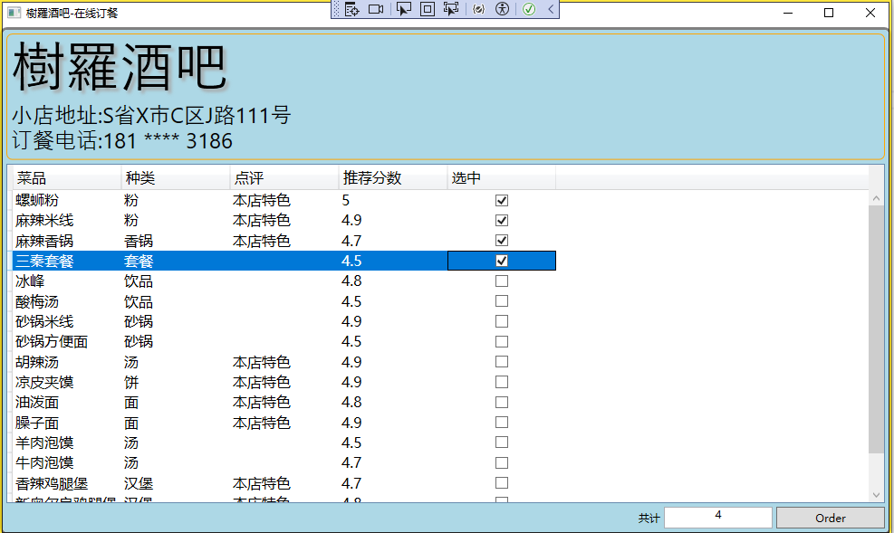
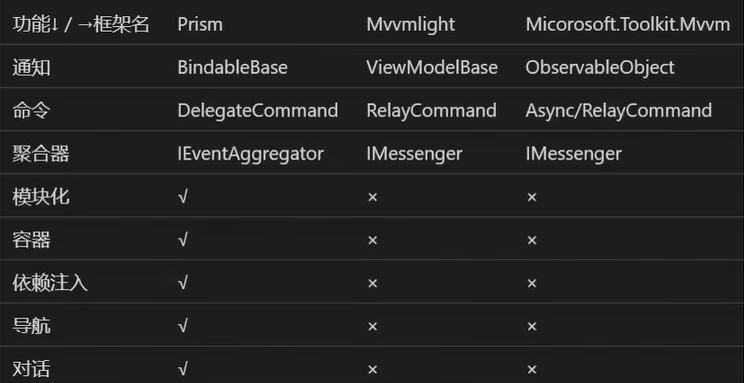

# MVVM

MVVM = Model - View - ViewModel

ViewModel 与 View 的沟通：

- 传递数据：依靠数据属性（DataBinding）
- 传递操作：依靠命令属性（ICommand）


## MVVM的实现

核心在于如何将ViewModel展示到View上，即实现ViewModel的数据绑定和命令操作。XAML后台代码应该是空的或最少的代码，不再包含大量的控件事件，而是使用命令代替传统的事件处理。

在基于MVVM架构的基础上，只有通过实现INotifyPropertyChanged接口的ViewModel才能够用于Data Binding。

 

## 复杂示例绑定的应用

最终效果：



XAML界面代码：

```xaml
<Window x:Class="WpfMvvmTest03.MainWindow"
        xmlns="http://schemas.microsoft.com/winfx/2006/xaml/presentation"
        xmlns:x="http://schemas.microsoft.com/winfx/2006/xaml"
        xmlns:d="http://schemas.microsoft.com/expression/blend/2008"
        xmlns:mc="http://schemas.openxmlformats.org/markup-compatibility/2006"
        xmlns:local="clr-namespace:WpfMvvmTest03.ViewModels"
        xmlns:sys ="clr-namespace:System;assembly=System"
        mc:Ignorable="d"
        Title="{Binding Restaurant.Name ,StringFormat=\{0\}-在线订餐}"  Height="600" Width="1000">
    <!--<Window.DataContext>
        <local:MainWindowViewModel/>
    </Window.DataContext>-->
    <Border BorderBrush="Gray" BorderThickness="3" CornerRadius="6" Background="LightBlue">
        <Grid x:Name="Root" Margin="4">
            <Grid.RowDefinitions>
                <RowDefinition Height="Auto"/>
                <RowDefinition Height="*"/>
                <RowDefinition Height="Auto"/>
            </Grid.RowDefinitions>
            <Border BorderBrush="Orange" BorderThickness="1" CornerRadius="6" Padding="4">
                <StackPanel>
                    <StackPanel Orientation="Horizontal">
                        <StackPanel.Effect>
                            <DropShadowEffect Color="LightGray"/>
                        </StackPanel.Effect>
                        <TextBlock Text="" FontSize="60" FontFamily="LiShu"/>
                        <TextBlock Text="{Binding Restaurant.Name}" FontSize="60" FontFamily="LiShu"/>
                    </StackPanel>
                    <StackPanel Orientation="Horizontal">
                        <TextBlock Text="小店地址:" FontSize="24" FontFamily="LiShu"/>
                        <TextBlock Text="{Binding Restaurant.Address}" FontSize="24" FontFamily="LiShu"/>
                    </StackPanel>
                    <StackPanel Orientation="Horizontal">
                        <TextBlock Text="订餐电话:" FontSize="24" FontFamily="LiShu"/>
                        <TextBlock Text="{Binding Restaurant.PhoneNumber}" FontSize="24" FontFamily="LiShu"/>
                    </StackPanel>
                </StackPanel>
            </Border>
            <DataGrid AutoGenerateColumns="False" GridLinesVisibility="None" CanUserDeleteRows="False"
                      CanUserAddRows="False" Margin="0,4" Grid.Row="1" FontSize="16" ItemsSource="{Binding DishMenu}">
                <DataGrid.Columns>
                    <DataGridTextColumn Header="菜品" Binding="{Binding Dish.Name}" Width="120"/>
                    <DataGridTextColumn Header="种类" Binding="{Binding Dish.Category}" Width="120"/>
                    <DataGridTextColumn Header="点评" Binding="{Binding Dish.Comment}" Width="120"/>
                    <DataGridTextColumn Header="推荐分数" Binding="{Binding Dish.Score}" Width="120"/>
                   <!-- 由于Grid默认的复选框组件有bug，必须双击才可以选中，因此此处使用自定义模板的形式来处理-->
                    <DataGridTemplateColumn Header="选中" SortMemberPath="IsSelected" Width="120">
                        <DataGridTemplateColumn.CellTemplate>
                            <DataTemplate>
                                <CheckBox IsChecked="{Binding IsSelected, UpdateSourceTrigger=PropertyChanged}"
                                          VerticalAlignment="Center" HorizontalAlignment="Center"
                                          Command="{Binding DataContext.SelectMenuItemCommand,RelativeSource={RelativeSource Mode=FindAncestor,AncestorType={x:Type DataGrid}}}">

                                </CheckBox>
                            </DataTemplate>
                        </DataGridTemplateColumn.CellTemplate>
                    </DataGridTemplateColumn>
                </DataGrid.Columns>   
            </DataGrid>
            <StackPanel Orientation="Horizontal" HorizontalAlignment="Right" Grid.Row="2">
                <TextBlock Text="共计" VerticalAlignment="Center"/>
                <TextBox IsReadOnly="True" TextAlignment="Center" Width="120" Text="{Binding Count}" Margin="4,0"/>
                <Button Content="Order" Height="24" Width="120" Command="{Binding PlaceOrderCommand}">
                </Button>
            </StackPanel>
        </Grid>
    </Border>
</Window>
```

xaml后台：

```csharp
public partial class MainWindow : Window
{
    public MainWindow()
    {
        InitializeComponent();
        this.DataContext = new MainWindowViewModel();
    }
}
```

ViewModel代码：

BindableBase来自于Prism框架。

```csharp
class MainWindowViewModel:BindableBase
{
    public DelegateCommand PlaceOrderCommand { get; set; }
    public DelegateCommand SelectMenuItemCommand { get; set; }

    private int count;

    public int Count
    {
        get { return count; }
        set 
        {
            count = value;
            this.RaisePropertyChanged("Count");
        }
    }

    private Restaurant restaurant;

    public Restaurant Restaurant
    {
        get { return restaurant; }
        set
        {
            restaurant = value;
            this.RaisePropertyChanged("Restaurant");
        }
    }

    private List<DishMenuItemViewModel> dishMenu;

    public List<DishMenuItemViewModel> DishMenu
    {
        get { return dishMenu; }
        set 
        { 
            dishMenu = value;
            this.RaisePropertyChanged("DishMenu");    
        }
    }

    public MainWindowViewModel()
    {
        this.LoadRestaurant();
        this.LoadDishMenu();
        this.PlaceOrderCommand = new DelegateCommand(new Action(this.PlaceOrderCommandExecute));
        this.SelectMenuItemCommand = new DelegateCommand(new Action(this.SelectMenuItemCommandExecute));

    }

    private void SelectMenuItemCommandExecute()
    {
        this.Count = this.DishMenu.Count(i => i.IsSelected == true);
    }

    private void PlaceOrderCommandExecute()
    {
        var selectedDishes = this.dishMenu.Where(i => i.IsSelected == true).Select(i => i.Dish.Name).ToList();
        IOrderSevice orderSevice = new MockOrderService();
        orderSevice.PlaceOrder(selectedDishes);
        MessageBox.Show("订餐成功！");
    }

    private void LoadDishMenu()
    {
        XmlDataService ds = new XmlDataService();
        var dishes = ds.GetAllDishes();
        this.dishMenu = new List<DishMenuItemViewModel>();
        foreach (var dish in dishes)
        {
            DishMenuItemViewModel item = new DishMenuItemViewModel();
            item.Dish = dish;
            this.DishMenu.Add(item);
        }
    }

    private void LoadRestaurant()
    {
        this.Restaurant = new Restaurant();
        this.Restaurant.Name = "樹羅酒吧";
        this.Restaurant.Address = "S省X市C区J路111号";
        this.Restaurant.PhoneNumber = "181 **** 3186";

    }
}

class DishMenuItemViewModel:BindableBase
{
    public Dish Dish { get; set; }

    private bool isSelected;
                
    public bool IsSelected
    {
        get { return isSelected; }
        set 
        { 
            isSelected = value;
            this.RaisePropertyChanged("IsSelected");
        }
    }


}
```


## 场景的MVVM框架

常见的MVVM框架当中，基本都围绕了ICommand、INotifyPropertyChanged封装实现绑定、通知等功能。

而对于不同的框架之间，在实现相同功能上，大部分只是表现在写法不同，下图列举了几个常见的框架的区别：



