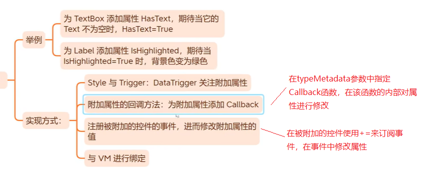

# 属性（Dependency  Property）

CLR属性：使用get/set 对字段（类中的变量，Field）进行封装访问的叫属性（Property）。

依赖属性（dependency  property）：也称为关联属性，它是WPF中通过包装器模拟成CLR属性的用于样式、动画、数据绑定等WPF功能的属性。

>传统的.NET开发中，一个对象所占用的内存空间在调用new操作符进行实例化的时候就已经决定了，而WPF允许对象在被创建的时候并不包含用于存储数据的空间（即字段所占用的空间），只保留在需要用到数据时能够获得默认值、借用其他对象数据或实时分配空间的能力。这种对象就被称为依赖对象（Dependency Object），而它这种实时获取数据的能力则依靠依赖属性（Dependency Property）来实现。
>
>——《深入浅出WPF》

WPF的属性系统：关联属性的内部实现都是通过WPF属性系统完成的，它完成了对绑定等多项功能的支持。

本人更推荐将依赖属性称为关联属性，这是因为在实现关联属性时，通过GetValue和SetValue在对一个关联属性的更改将导致其他属性值的变化，其与其他属性之间具有关联这一特点。典型的例子就是主题相关的属性。


## 实现关联属性

实现关联属性分为两步：

1. 完成对关联属性的声明和注册：当需要让WPF的属性系统支持新创建的属性时，必须通过Register函数向WPF的属性系统进行注册，使其可以被属性系统所感知。
2. 使用CLR属性定义的方式对关联属性进行包装：通过CLR属性定义中的set和get函数对GetValue和SetValue进行包装，使后台代码可以通过对CLR属性直接进行赋值的方法完成对WPF属性系统中所记录信息的更改，实现了与CLR代码无缝衔接。

定义依赖属性的通用形式或语法如下：

```csharp
public class DerivedClass : DependencyObject
{
    public object NewObject
    {
        get { return GetValue(NewObjectProperty); }
        set { SetValue(NewObjectProperty, value); }
    }
    public static readonly DependencyProperty NewObjectProperty =
        DependencyProperty.Register("NewObject", typeof(object), typeof(DerivedClass), new PropertyMetadata(null));
}
```

快捷键：propdp+两次Tab

以Control自带的依赖属性PaddingProperty为例：


创建依赖属性的注意事项和关键点：

- 需要在派生自DependencyObject的类中进行定义。**只能为依赖对象（继承自DependencyObject的类）添加依赖项属性。WPF中的控件大部分都间接继承自了DependencyObject类**。

- 必须通过DependencyProperty.Register()方法进行注册，使其可以被属性系统所感知。

- ==Register函数所带入的第一个参数表示新注册的关联属性在属性系统中的名称==。不要任意设置关联属性的注册名称，通常要与其注册的结果的名称相对应。

- Register函数返回最终的注册结果，通常使用static readonly进行修饰，按照约定名称以“Property”结尾。

- 不要在关联属性的CLR属性包装中添加任何附加逻辑。

  > 当创建属性封装器时，应当只包含对SetValue()和GetValue()方法的调用，不应当添加任何验证属性值的额外代码或引发事件的代码等。这是因为WPF中的其他功能可能会忽略属性封装器，并直接调用SetValue()和GetValue()方法（一个例子是，在运行时解析编译过的XAML文件）。
  >
  > ——《深入浅出WPF》

- 不要随意地将所有的属性设置为关联属性。**如何决定一个属性是否需要被实现为关联属性**：

  - 当该属性在XAML中需要进行绑定（XAML标记扩展语法{Binding}）或样式设置、动画设置时。
  - 当XAML中的其他关联属性需要继承该属性的值时。
  - 当该属性在修改时需要发送修改通知或者影响界面其他关联属性时。


>由于DependencyObject是WPF系统中相当底层的一个基类（FrameworkElement --> UIElement --> Visual --> DependencyObject），WPF的所有UI都继承自该类，因此WPF中的所有元素全是依赖对象，同时WPF的类库在设计时充分利用了依赖属性的优势，UI控件的绝大多数属性都已经依赖化，都是依赖属性。
>
>——《深入浅出WPF》

**依赖属性为什么是静态的并且只读的**？

依赖属性应该始终对所有控件可用，因此它应该是共享的，并且不希望该类的对象一次又一次的被创建，所以应该始终是静态的。而使用readonly是为了防止其在使用的过程中被更改。

个人理解总结：

要想使用关联属性，必须先将其注册才能够被属性系统所感知。而注册的结果使用static readonly修饰，可以保证其只会被注册一次且可以在各个其他类中访问该注册结果。注册的结果是一个DependencyProperty类型的对象，而对该对象的访问和操作，通常又是通过属性包装器来完成的。


## 关联属性详解

### DependencyProperty.Register()

向属性系统中注册关联属性，返回注册的结果。

DependencyProperty.Register()方法共有三种重载形式：

```c#
public static DependencyProperty Register(string name, Type propertyType, Type ownerType)
public static DependencyProperty Register(string name, Type propertyType, Type ownerType, PropertyMetadata typeMetadata)
public static DependencyProperty Register(string name, Type propertyType, Type ownerType, PropertyMetadata typeMetadata, ValidateValueCallback validateValueCallback)
```

- name：表示新注册的关联属性在属性系统中的名称。~~用来指明以哪个CLR属性作为这个依赖属性的包装器，或者说此依赖属性支持的是哪个CLR属性~~。

- propertyType：需要注册的关联属性的类型。即该关联属性存储的值是什么类型。

- ownerType：将要注册的关联属性的所有者。通常指定为注册关联属性时所在的类。对该参数的理解最好结合AddOwner()方法一块思考。

- typeMetadata：表示当前所注册的关联属性所使用的元数据。

- validateValueCallback：用来设置关联属性在更改之前需要调用的回调函数，该回调函数可接受或拒绝新值。通常，该回调函数用于捕获违反属性月约束的明细错误。该函数通过返回一个布尔类型数值决定是否接受对该属性的设置。注意：ValidateValueCallback函数不能访问被设置属性所在实例，也就不能根据该实例中的各种相关状态决定该属性的值。问被设置属性所在实例操作，可以在元数据中的CoerceValueCallback函数中实现。

  ```
  public static DependencyProperty Register(string name, Type propertyType, Type ownerType, PropertyMetadata typeMetadata, ValidateValueCallback validateValueCallback)
  ```

  示例：

```c#
public class MyVisualB : FrameworkElement
{
    public static readonly DependencyProperty FillBrushProperty = DependencyProperty.Register(
       name: "FillBrushB",
       propertyType: typeof(Brush),
       ownerType: typeof(MyVisualB),
       typeMetadata: new FrameworkPropertyMetadata(
            //设置依赖项属性默认值
            Brushes.Red, FrameworkPropertyMetadataOptions.AffectsRender
                //当依赖项属性的值被修改后会调用
                //new PropertyChangedCallback(FillBrushPropertyChanged)
                ));
}
```

#### 内部实现原理

> 在Register函数中所使用的关联属性名称实际上是后台代码用来访问关联属性的索引值。通过该索引，后台代码可以快速访问WPF的属性系统为存储关联属性所维持的属性记录表。这也就是在调用Register函数后将得到的DependencyProperty实例用一个静态变量记录起来的原因。
>
> ——《WPF全视角分析》

- 依赖对象的依赖属性是static修饰的，因此依赖属性不保存在依赖对象中。
- DependencyProperty中定义了一个Hashtable类型的PropertyFromName变量，用来存放所有注册的DependencyProperty实例。
- DependencyProperty.Register(...)的实现是内部调用了RegisterCommon(...)方法，RegisterCommon的内部，通过实例化FromNameKey对象，将CLR属性名字符串和其宿主类型（依赖对象的类型）进行hash code重写，从而实现每对“CLR属性-依赖对象类型”所决定的DependencyProperty实例就是唯一的。此时如果尝试使用同一个CLR属性名称和同一个宿主类型（依赖对象类型）进行注册，程序会抛出异常。
- RegisterCommon(...)方法的内部实例化DependencyProperty对象，并将其放到Hashtable中。

一句话概括DependencyProperty对象的创建与注册：

==使用CLR属性名和宿主类型生成hash code，创建一个DependencyProperty实例，把hash code和该实例作为key-value对存入全局的、名为PropertyFromName的Hashtable中。这样，WPF属性系统通过CLR属性名和宿主类型就可以从这个全局的Hashtable中检索出对应的DependencyProperty实例。==

注意：这里的全局Hashtable使用的key 由CLR属性名哈希值和宿主类型哈希值经过运算得到的，并不是DependencyProperty实例的哈希值。


#### PropertyMetadata（FrameworkPropertyMetadata ）

在注册关联属性时，需要提供元数据信息。元数据提供了对属性特性更改，属性更改回调等多种功能。

PropertyMetadata相关类型的派生关系：

FrameworkPropertyMetadata => UIPropertyMetadata => PropertyMetadata => Object

如何选择：

- 如果关联属性是定义在FrameworkElement类的派生类中，选择 FrameworkPropertyMetadata （优先选择）。
- 由于FrameworkElement派生自UIElement，因此在FrameworkElement类之上的定义关联属性的，选择 UIPropertyMetadata 。
- 最后什么额外的信息都不需要，就选择PropertyMetadata 。

FrameworkPropertyMetadata 的构造函数的参数包含了PropertyMetadata 和 UIPropertyMetadata  需要的参数，因此这里只对 FrameworkPropertyMetadata 最复杂的构造进行详细讲解。

FrameworkPropertyMetadata 有多个版本的构造函数，最复杂的一个定义如下：

```csharp
public FrameworkPropertyMetadata(
	object defaultValue, 
	FrameworkPropertyMetadataOptions flags, 
	PropertyChangedCallback propertyChangedCallback, 
	CoerceValueCallback coerceValueCallback, 
	bool isAnimationProhibited, 
	UpdateSourceTrigger defaultUpdateSourceTrigger);
```

- defaultValue：设置该属性在默认情况下具有指定的值。一旦设置后，如果后期需要将该属性设置为注册时指定的该值，需要调用DependencyObject的ClearValue函数，而不是通过属性赋值的方式来指定。

- FrameworkPropertyMetadataOptions：定依赖项对象的特性，如布局或数据绑定，它们与系统进行交互。该值是一个枚举值，具体参见[FrameworkPropertyMetadataOptions](https://learn.microsoft.com/zh-cn/dotnet/api/system.windows.frameworkpropertymetadataoptions?view=windowsdesktop-6.0)。

- PropertyChangedCallback：属性更改回调函数。

- CoerceValueCallback：属性强制更新时的回调函数。该函数可以决定代码对属性的赋值是否合法。如果是，那么该函数可以简单的接受该值，也可以在函数定义中对该值进行修改。如果不是，该函数可以通过返回DependencyPropery.UnsetValue拒绝此次赋值。该回调函数可将新值修改为更能被接受的值。该回调函数通常用于处理，为相同对象设置的依赖项属性值相互冲突的问题。这些值本身可能是合法的，但当同时应用时它们是不相容的。

  ```csharp
  public FrameworkPropertyMetadata(object defaultValue, FrameworkPropertyMetadataOptions flags, PropertyChangedCallback propertyChangedCallback, CoerceValueCallback coerceValueCallback)
  ```

- isAnimationProhibited：用来标识当前所创建的属性是否支持WPF的动画功能在其上进行操作。

- UpdateSourceTrigger：在绑定中所使用的默认触发器。

注意：属性封装器不是验证数据或引发事件的正确位置，而是使用依赖项属性回调函数。应当在声明DependencyProperty对象时，通过DependencyProperty.ValidateValueCallback回调函数进行验证操作，而事件的触发应当通过FrameworkPropertyMetadata.PropertyChangedCallback回调函数中进行。CoerceValueCallback和ValidateValueCallback都可以阻止非法值。

这些参数中指定的函数调用的先后顺序：

1. 首先，CoerceValueCallback方法有机会修改提供的值（通常，使提供的值和其他属性相容），或者返回DependencyProperty.UnsetValue，这将完全拒绝修改。
2. 接下来激活ValidateValueCallback方法。该方法返回true亿接受一个值作为合法值，或者返回false拒绝值。与CoerceValueCallback方法不同，ValidateValueCallback方法不能访问设置属性的实际对象，这意味着不能检查其他属性值。
3. 最后，如果前两个阶段都获得成功，就会出发PropertyChangedCallback方法，此时，如果希望为其他类提供通知，可以引发更改事件。


### DependencyProperty.GetHashCode()

每个DependencyProperty实例都具有一个名为GlobalIndex的int类型属性，它的值是经过一些算法处理得到的，可以确保每个DependencyProperty实例的GlobalIndex是唯一的。

```c#
public override int GetHashCode()
{
    return GlobalIndex;
}
```

通过源码可以看到，GlobalIndex属性值也就是DependencyProperty实例的哈希值。因此通过GlobalIndex可以直接检索到某个DependencyProperty实例。


### DependencyObject.GetValue(...)

DependencyObject的GetValue(...)的核心是内部调用了GetValueEntry(...)方法。该方法返回的是EffectiveValueEntry实例，EffectiveValueEntry的所有构造函数中都包含一个DependencyProperty类型的参数，换句话说，每个EffectiveValueEntry都关联着一个DependencyProperty。EffectiveValueEntry类具有一个名为PropertyIndex的属性，这个属性的值实际上就是与之关联的DependencyProperty的GlobalIndex属性值。

在DependencyObject中，还定义如下成员变量：

```c#
 private EffectiveValueEntry[] _effectiveValues;
```

这个数组依据每个成员的PropertyIndex属性值（来源于GlobalIndex）进行排序。

每个DependencyObject实例都自带一个EffectiveValueEntry类型数组，当某个依赖属性的值要被读取时，算法就会从这个数组中去检索值，如果数组中没有包含这个值，算法会返回依赖属性的默认值（默认值由依赖属性的DefaultMetadata来提供）。

依赖属性的值除了通过EffectiveValueEntry数组和默认值提供外，还可以通过其他途径获得，可能来自于元素的Style或Theme，也可能由上层元素继承下来，还可能是在某个动画过程的控制下不断变化而来。


## WPF 依赖项属性值变化的通知机制

> 该部分内容来自于《WPF编程宝典》4.1.4章节。

每个依赖项属性都支持的两个关键行为：更改通知和动态值识别。

==依赖属性不需要显式实现INotifyPropertyChanged接口，就具有数据绑定过程中当属性的值发生改变时与之关联的Binding对象就可以得到通知的能力==。

### 更改通知

当属性值发生变化时，依赖项属性不会自动引发事件以通知属性值发生了变化。相反，它们会触发受保护的名为OnPropertyChangedCallback()的方法。该方法通过两个WPF服务（数据绑定和触发器）传递信息，并调用PropertyChangedCallback回调函数（如果已经定义了该函数）。

换句话说，当属性变化时，如果希望进行响应，有两种方式：

- 数据绑定：使用属性值创建绑定
- 触发器：编写能够自动改变其他属性或开始动画的触发器

### 动态值识别

本质上，依赖项属性依赖于多个属性提供者，每个提供者都有各自的优先级。当从属性检索值时，WPF属性系统会通过一系列步骤获取最终值。

按照以下优先级从低到高的属性排列的因素来决定基本值：

1. 默认值：由FrameworkPropertyMetadata对象设置的值，优先级最低。
2. 继承而来的值：假设设置了FrameworkPropertyMetadata.Inherits标志，并为包含层次中的某个元素提供了值。
3. 来自主题样式的值
4. 来自项目样式的值
5. 本地值：使用代码或XAML直接为对象设置的值，优先级最高。

WPF按照上面优先级确定依赖项属性的基本值。这样做的优点是它占用的资源较少，如果没有显式的为属性设置本地值，WPF将从样式、其他元素或默认值中检索值。这时，就不需要内存来保存值。但基本值未必就是最后从属性中检索到的值，还需要考虑其他几个可能改变属性值的提供者。

WPF决定属性值的四步骤过程：

1. 确定基本值。
2. 如果属性是使用表达式设置的，就对表达式进行求值。WPF支持两类表达式：数据绑定和资源。
3. 如果属性是动画的目标，就应用动画。
4. 运行CoerceValueCallback回调函数来修正属性值。


## AddOwner - 共享的依赖项属性

同一个依赖项属性在不同的类中被共用。

例如，TextBlock.FontFamily属性和Control.FontFamily属性都指向TextElement类中定义的TextElement.FontFamilyPropery依赖项属性。当使用样式自动设置TextBlock.FontFamily属性时，样式也会影响Control.FontFamily属性，因为这两个类使用同一个依赖项属性。

通过调用DependencyProperty.AddOwner()方法实现依赖项属性的重用（共享）：

```csharp
static TextBlock()
{
    ...
    FontFamilyProperty = TextElement.FontFamilyProperty.AddOwner(typeof(TextBlock));
    FontStyleProperty = TextElement.FontStyleProperty.AddOwner(typeof(TextBlock));
    FontWeightProperty = TextElement.FontWeightProperty.AddOwner(typeof(TextBlock));
    ...
}
```

上述代码中，FontStyle不属于TextBlock本身的依赖属性，而是在TextElement中定义的附加属性（AddOwner也可以实现附加属性的共用），这里通过AddOwner实现共用，这样就可以在TextBlock元素上，使用属性赋值的方式来设置值了。


AddOwner()的重载形式：

```csharp
public DependencyProperty AddOwner(Type ownerType)
public DependencyProperty AddOwner(Type ownerType, PropertyMetadata typeMetadata)
```

AddOwner()方法的参数刚好和注册依赖项属性的所需参数一样。

注意：AddOwner()不仅适用于依赖属性，也适用于附加属性。


## 只读依赖属性


只读属性可以用于样式、触发器等与属性相关的绑定。


## 依赖属性（Dependency Property）综合应用

### 自定义依赖对象和依赖属性

```csharp
public class Student : DependencyObject
{
    public static readonly DependencyProperty NameProperty =
            DependencyProperty.Register("Name", typeof(string), typeof(Student));
}
```

XAML文件代码：

```xaml
<StackPanel>
    <TextBox x:Name="txtbox1" BorderBrush="Black" Margin="5"/>
    <TextBox x:Name="txtbox2" BorderBrush="Black" Margin="5"/>
    <Button Content="OK" Margin="5" Click="Button_Click"/>
</StackPanel>
```

C# 代码：

```c#
private void Button_Click(object sender, RoutedEventArgs e)
{
    Student stu = new();
    stu.SetValue(Student.NameProperty, this.txtbox1.Text);
    txtbox2.Text= (string)stu.GetValue(Student.NameProperty);
}
```

上述代码中，分别调用了DependencyObject的SetValue(..)和GetValue(..)方法进行了依赖属性值的设置和读取。

通过上述代码可以看到，即使Student中没有定义Name的CLR属性，依然不影响依赖属性的使用。

#### 为依赖属性添加CLR属性外包装

快捷键：propdp+两次Tab

依赖属性依靠DependencyObject的SetValue和GetValue两个方法进行对外界的暴露，大多数情况下会为依赖属性添加一个CLR属性外包装。

```c#
 public class Student : DependencyObject
 {
     public string Name
     {
         get { return (string)GetValue(NameProperty); }
         set { SetValue(NameProperty, value); }
     }
     public static readonly DependencyProperty NameProperty =
             DependencyProperty.Register("Name", typeof(string), typeof(Student));
 }
```

这样在为依赖属性设置值时，可以直接通过属性赋值的方式进行即可。

改进后的代码：

```c#
private void Button_Click(object sender, RoutedEventArgs e)
{
    Student stu = new();
    stu.Name = this.txtbox1.Text;
    this.txtbox2.Text = stu.Name;
}
```

如果不关心底层的实现，下游程序员在使用依赖属性时与使用单纯的CLR属性感觉别无二致。

同时，为依赖对象的依赖属性添加了CLR属性包装，有了这个包装，就相当于为依赖对象准备了用于暴露数据的Binding Path。也就是说，现在的依赖对象已经具备了扮演数据源和数据目标双重角色的能力。

对Student进行扩展，添加SetBinding方法实现类似FrameworkElement类的SetBinding方法：

```c#
public class Student : DependencyObject
{
    public string Name
    {
        get { return (string)GetValue(NameProperty); }
        set { SetValue(NameProperty, value); }
    }
    public static readonly DependencyProperty NameProperty =
            DependencyProperty.Register("Name", typeof(string), typeof(Student));

    //SetBinding 包装
    public BindingExpressionBase SetBinding(DependencyProperty dp, BindingBase binding)
    {
        return BindingOperations.SetBinding(this, dp, binding);
    }
}
```

尽管Student类没有实现INotifyPropertyChanged接口，当属性的值发生改变时与之关联的Binding对象依然可以得到通知，依赖属性默认带有这样的功能，天生就是合格的数据源。

```c#
public partial class MainWindow : Window
{
    Student stu = new();
    public MainWindow()
    {
        InitializeComponent();
        stu.SetBinding(Student.NameProperty, new Binding("Text") { Source=txtbox1});
        //注意：这个stu必须是类成员，不能是函数中的局部变量，否则绑定将失效。
        txtbox2.SetBinding(TextBox.TextProperty, new Binding("Name") { Source = stu });
    }
}
```

运行程序，当txtbox1中输入字符串时，txtbox2就会同步显示。


## 附加属性（Attached Properties）

附加属性也是一种依赖项属性，不同之处在于附加属性被应用到的类并非定义附加属性的那个类。

附加属性的作用是将属性与数据类型（宿主或依赖对象）解耦，让数据类型的设计更加灵活。

附加属性的本质仍然是依赖属性，二者仅在注册和包装器上有一点区别。

可以为已有的控件添加附加属性，这样就不需要通过派生类来完成。

**附加属性不是必须要定义在DependencyObject派生类中**。

定义附加属性，需要使用RegisterAttached()方法。

创建附加属性快捷键：propa+ 两次Tab


附加属性的作用是对其他类中的属性进行赋值，因此需要传递外部的DependencyObject对象作为参数。

附加属性的绑定应用：


附加属性与依赖属性在创建时的相同点与区别：

- 都使用 public static readonly 三个关键字修饰。
- 附加属性使用DependencyProperty.RegisterAttached(...)来声明，但参数和DependencyProperty.Register(...)方法无异。
- 依赖属性使用CLR属性对GetValue和SetValue两个方法进行包装，而附加属性则通过两个方法（非属性形式）分别进行包装。

C#程序中使用附加属性：

```c#
class Human: DependencyObject
{
}
private void Button_Click(object sender, RoutedEventArgs e)
{
    Human hu = new Human();
    School.SetGrade(hu, 6); //调用附加属性设置值
    int grade = School.GetGrade(hu);
    MessageBox.Show(grade.ToString());
}
```

由于上述SetGrade(..)的内部调用的依然是DependencyObject实例的SetValue(..)方法，而DependencyObject实例传入的为Human实例，==因此该附加属性最终还是作用在Human上，只是定义寄宿在了School类中而已==。

### 只读附加属性

DependencyProperty.RegisterAttachedReadOnly

### 附加属性的应用




----

References:

- 《深入浅出WPF》
- 《WPF全视角分析》
- 《WPF编程宝典》

Last updated：2025-07-03