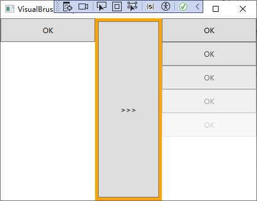

# 图形与绘画


## 形状（Shape）

WPF的基本图形都派生自Shape类，主要有以下几个：

- Line：直线段，可以设置其笔触（Stroke）。
- Rectangle：矩形，既有笔触，又有填充（Fill）。
- Ellipse：椭圆，长、宽相等的椭圆即为正圆，既有笔触又有填充。
- Polygon：多边形，由多条直线段围成的闭合区域，既有笔触又有填充。
- Polyline：折线（不闭合），由多条首尾相接的直线段组成。
- Path：路径（闭合区域），基本图形中功能最强大的一个，可由若干直线、圆弧、贝塞尔曲线组成。

Shape类的常用属性：

- Stroke：获取或设置 Brush，用于指定 Shape **边框**绘制的方式（凡是Brush的派生类均可以给该属性赋值，可以直接设置为颜色字符串）。
- Fill：获取或设置 Brush，它指定形状内部上色的方式。
- Width： 获取或设置元素的宽度。
- Height： 获取或设置元素的建议高度。
- StrokeDashArray：获取或设置 Double 值的集合，这些值指示用于勾勒形状轮廓的虚线和间隙样式。
- StrokeThickness：获取或设置 Shape 边框的宽度。

- StrokeEndLineCap：设置线条末端的线帽形状。


## 画刷（Brush）

Shape的Stroke属性用于指定Shape边框绘制的方式，其类型为Brush，注意Brush是一个抽象类，因此当需要使用到Brush时，通常使用Brush派生类的实例为Shape的属性赋值。

常用的派生自Brush类的有：

- SolidColorBrush：实心画刷。在XAML中可以使用颜色名称字符串直接赋值。
- LinearGradientBrush：线性渐变画刷。色彩沿设定的直线方向、按设定的变化点进行渐变。
- RadialGradientBrush：径向渐变画刷。色彩沿半径的方向、按设定的变化点进行渐变，形成圆形填充。
- ImageBrush：使用图片（Image）作为填充内容。
- DrawingBrush：使用矢量图（Vector）和位图（Bitmap）作为填充内容。
- VisualBrush：使用控件的可视化形象进行填充。 

VisualBrush示例：

```xaml
    <Grid>
        <Grid.ColumnDefinitions>
            <ColumnDefinition Width="160"/>
            <ColumnDefinition Width="*"/>
            <ColumnDefinition Width="160"/>
        </Grid.ColumnDefinitions>

        <StackPanel x:Name="stackPanelLeft" Background="White">
            <Button x:Name="realButton" Content="OK" Height="40"/>
        </StackPanel>
        <Button Content=">>>" Grid.Column="1" Margin="5" Click="Button_Click"/>
        <StackPanel Grid.Column="2" x:Name="stackpanelRight" Background="White"/>
    </Grid>
```

xaml后台代码：

```c#
public partial class VisualBrushSample : Window
{
    public VisualBrushSample()
    {
        InitializeComponent();
    }
    double o = 1.0;
    private void Button_Click(object sender, RoutedEventArgs e)
    {
        VisualBrush vBrush = new VisualBrush(this.realButton);
        Rectangle rect = new Rectangle();
        rect.Width = realButton.ActualWidth;
        rect.Height = realButton.ActualHeight;
        rect.Fill = vBrush;
        rect.Opacity = o;
        o -= 0.2;
        this.stackpanelRight.Children.Add(rect);
    }
}
```

运行效果：




## Line（线条）

Line表示两个坐标点连接的线条，可以画线段、虚线、渐变线段。

重要属性：

- X1、Y1：起点坐标
- X2、Y2：终点坐标

```xaml
<Grid>
    <!--虚线线点的间隔密度-->
    <Line X1="10" Y1="20" X2="400" Y2="20" StrokeDashArray="2,4,6,8" Stroke="Red" StrokeThickness="2"/>
    
    <!--线段末端的形状，可以是三角形、半圆形、矩形或无线帽-->
    <Line X1="10" Y1="40" X2="400" Y2="40" Stroke="Green" StrokeThickness="10" StrokeEndLineCap="Triangle"/>

    <!--渐变色线条-->
    <Line X1="10" Y1="80" X2="400" Y2="80" StrokeThickness="20" StrokeEndLineCap="Round">
        <Line.Stroke>
            <LinearGradientBrush EndPoint="0,0.5" StartPoint="1,0.5">
                <GradientStop Color="Blue"/>
                <GradientStop Offset="1"/>
            </LinearGradientBrush>
        </Line.Stroke>
    </Line>
</Grid>
```

最终效果：


## Rectangle（矩形）

矩形由填充（Fill）和笔触（Stroke，即边线）构成。

可以实现比Line（线条）更复杂的效果，通常用在需要使用背景填充的场景。

使用Rectangle绘制矩形的示例：

```xaml
<Grid>
    <Grid.RowDefinitions>
        <RowDefinition/>
        <RowDefinition/>
    </Grid.RowDefinitions>
    <Grid.ColumnDefinitions>
        <ColumnDefinition/>
        <ColumnDefinition/>
        <ColumnDefinition/>
    </Grid.ColumnDefinitions>
    <!--实心填充-->
    <Rectangle Grid.Row="0" Grid.Column="0" Stroke="Blue" Fill="LightBlue"/>

    <!--线性渐变-->
    <Rectangle Grid.Column="1">
        <Rectangle.Fill>
            <LinearGradientBrush StartPoint="0,0" EndPoint="1,1">
                <GradientStop Color="#FF0011" Offset="0"/>
                <GradientStop Color="#5ce8ff" Offset="0.25"/>
                <GradientStop Color="#FF9534" Offset="0.6"/>
                <GradientStop Color="#FF0398" Offset="1"/>
            </LinearGradientBrush>
        </Rectangle.Fill>
    </Rectangle>

    <!--图片填充-->
    <Rectangle Grid.Column="2">
        <Rectangle.Fill>
            <ImageBrush ImageSource="/OIP.jpg" Viewport="0,0,0.3,0.15" TileMode="Tile"/>
        </Rectangle.Fill>
    </Rectangle>

    <!--矢量图填充-->
    <Rectangle Grid.Row="1" Grid.Column="0">
        <Rectangle.Fill>
                <DrawingBrush Viewport="0,0,0.2,0.2" TileMode="Tile">
                <DrawingBrush.Drawing>
                    <GeometryDrawing Brush="LightBlue">
                        <GeometryDrawing.Geometry>
                            <EllipseGeometry RadiusX="10" RadiusY="10"/>
                        </GeometryDrawing.Geometry>
                    </GeometryDrawing>
                </DrawingBrush.Drawing>
            </DrawingBrush>
        </Rectangle.Fill>
    </Rectangle>

    <!--线性渐变填充边框-->
    <Rectangle Grid.Column="1" Grid.Row="1" StrokeThickness="20">
        <Rectangle.Stroke>
                <LinearGradientBrush StartPoint="0,0" EndPoint="1,1">
                <GradientStop Color="Yellow" Offset="0.3"/>
                <GradientStop Color="MediumSeaGreen" Offset="1"/>
            </LinearGradientBrush>
        </Rectangle.Stroke>
    </Rectangle>
</Grid>
```

运行效果：


## Ellipse（圆）

Ellipse 既可以绘制圆也可以绘制椭圆。当Width与Height相等的椭圆即为正圆。

```xaml
<Grid>
    <Ellipse Stroke="Gray" Width="140" Height="140" Cursor="Hand" ToolTip="球">
        <Ellipse.Fill>
            <RadialGradientBrush GradientOrigin="0.2,0.8" RadiusX="0.75" RadiusY="0.75">
                <RadialGradientBrush.RelativeTransform>
                    <TransformGroup>
                        <RotateTransform Angle="90" CenterX="0.5" CenterY="0.5"/>
                        <TranslateTransform/>
                    </TransformGroup>
                </RadialGradientBrush.RelativeTransform>
                <GradientStop Color="#FFFFFFFF" Offset="0"/>
                <GradientStop Color="#FF444444" Offset="0.66"/>
                <GradientStop Color="#FF999999" Offset="1"/>
            </RadialGradientBrush>
        </Ellipse.Fill>
    </Ellipse>
</Grid>
```

运行效果：


## Path（路径）

所有的图形都可以通过Path绘制出来。

Path最重要的一个属性是Data，它是Geometry类型，Geometry本身是一个抽象类，它只定义形状的几何图形，不能呈现自身：

```csharp
public System.Windows.Media.Geometry Data { get; set; }
```

常用的派生自Geometry的子类有：

- LineGeometry：直线几何图形；
- RectangleGeometry：矩形几何图形；
- EllipseGeometry：椭圆几何图形；
- PathGeometry：路径几何图形；
- StreamGeometry：PathGeometry的轻量级替代品，不支持Binding、动画等功能。
- CombinedGeometry：由多个基本几何图形联合在一起，形成的单一几何图形。
- GeometryGroup：由多个基本几何图形组合在一起，形成的几何图形组。

前面介绍的Line、Rectangle、Ellipse类都是可以独立存在的对象，**而这些带有Geometry后缀的类只能用于结合成其他几何图形、不能独立存在**——当我们在Blend里选中一组独立的几何图形并在菜单里执行组合路径的命令时，本质上就是把原来独立的Line、Rectangle、Ellipse对象转换成*Geometry对象并结合成一个新的复杂几何图形。

因此，Data属性就是将一些基本的线段拼接起来、形成复杂的图像。

### Path.Data

Path.Data属性的类型是Geometry，因此其子标签必须是Geometry的派生类。最重要的一个派生类是PathGeometry 类。

PathGeometry 类包含一个重要的属性叫Figures，Figures也是PathGeometry的默认内容属性：

```csha\
public System.Windows.Media.PathFigureCollection Figures { get; set; }
```

Figures是一个包含PathFigure对象的集合，而每个单独的PathFigure描述一种形状，它表示几何图形的一个子部分、一系列单独连接的二维几何线段。

PathFigure类又包含一个重要的属性叫Segments，表示此 PathFigure 对象形状的段集合。Segments也是PathFigure的默认内容属性：

```csharp
public System.Windows.Media.PathSegmentCollection Segments { get; set; }
```

Segments是一个包含PathSegment对象的集合，PathSegment是一个抽象类，这意味着若要表示具体的段，必须使用PathSegment的派生类。

派生自PathSegment类的用来表示段的常用类有：

- LineSegment：直线段。
- ArcSegment：圆弧线段。
- BezierSegment：三次方贝塞尔曲线段（默认贝塞尔曲线就是指三次曲线，所以Cubic一词被省略）。
- QuadraticBezierSegment：二次方贝塞尔曲线段。
- PolyLineSegment：多直线段。
- PolyBezierSegment：多三次方贝塞尔曲线段。
- PolyQuadraticBezierSgement：多二次方贝塞尔曲线。

在绘制这些线段的时候需要注意：**所有这些线段都是没有起点（StartPoint）的，因为起点就是前一个线段的终点，而第一个线段的起点则是PathFigure的StartPoint**。

总结：包含各种线段（PathSegment）元素的集合（Segments），用来表示形状（PathFigure ），而包含各种形状（PathFigure）元素的集合（Figures）用来表示最终呈现的几何（PathGeometry）。它们的XAML完整代码结构如下：

```xaml
<Path>
	<Path.Data>
        <PathGeometry>
            <PathGeometry.Figures>
            	<PathFigure>
                	<PathFigure.Segments>
                    	<!--各种线段-->
                    </PathFigure.Segments>
                </PathFigure>
            </PathGeometry.Figures>
        </PathGeometry>
    </Path.Data>
</Path>
```

因为Figures是PathGeometry的默认内容属性，Segment是PathFigure的默认内容属性，所以常常简化为这样：

```xaml
<Path>
	<Path.Data>
        <PathGeometry>
            <PathFigure>
                <!--各种线段-->
            </PathFigure>
        </PathGeometry>
    </Path.Data>
</Path>
```

Path.Data 示例：

```xaml
<Grid>
    <Grid.ColumnDefinitions>
        <ColumnDefinition Width="160"/>
        <ColumnDefinition Width="160"/>
    </Grid.ColumnDefinitions>
    <Grid.RowDefinitions>
        <RowDefinition Height="160"/>
        <RowDefinition Height="160"/>
    </Grid.RowDefinitions>

    <!--直线-->
    <Path Stroke="Blue" StrokeThickness="3" Grid.Column="0" Grid.Row="0">
        <Path.Data>
            <LineGeometry StartPoint="20,20" EndPoint="140,140"/>
        </Path.Data>
    </Path>

    <!--矩形图形-->
    <Path Stroke="Orange" StrokeThickness="3" Fill="#88ff33" Grid.Column="1" Grid.Row="0">
        <Path.Data>
            <RectangleGeometry Rect="20,20,120,120" RadiusX="10" RadiusY="10"/>
        </Path.Data>
    </Path>

    <!--椭圆路径-->
    <Path Stroke="Red" StrokeThickness="3" Fill="#88ffff" Grid.Column="0" Grid.Row="1">
        <Path.Data>
            <EllipseGeometry Center="80,80" RadiusX="60" RadiusY="40"/>
        </Path.Data>
    </Path>

    <!--自定义路径（最重要）-->
    <Path Stroke="#ee99ff" Fill="#2299ee" StrokeThickness="3" Grid.Column="1" Grid.Row="1">
        <Path.Data>
            <PathGeometry>
                <PathGeometry.Figures>
                    <PathFigure StartPoint="25,140" IsClosed="True">
                        <PathFigure.Segments>
                            <LineSegment Point="20,40"/>
                            <LineSegment Point="40,110"/>
                            <LineSegment Point="50,20"/>
                            <LineSegment Point="80,110"/>
                            <LineSegment Point="110,20"/>
                            <LineSegment Point="120,110"/>
                            <LineSegment Point="140,40"/>
                            <LineSegment Point="135,140"/>
                        </PathFigure.Segments>
                    </PathFigure>
                </PathGeometry.Figures>
            </PathGeometry>
        </Path.Data>
    </Path>
</Grid>
```

运行效果：


### LineSegment 应用示例

LineSegment只需要控制它的Point（终点）即可。

```xaml
<Grid VerticalAlignment="Center" HorizontalAlignment="Center">
    <Path Stroke="Green" Fill="LawnGreen" StrokeThickness="3">
        <Path.Data>
            <PathGeometry>
                <PathFigure IsClosed="True" StartPoint="0,0">
                    <LineSegment Point="150,0"/>
                    <LineSegment Point="150,30"/>
                    <LineSegment Point="90,30"/>
                    <LineSegment Point="90,150"/>
                    <LineSegment Point="60,150"/>
                    <LineSegment Point="60,30"/>
                    <LineSegment Point="0,30"/>
                </PathFigure>
            </PathGeometry>
        </Path.Data>
    </Path>
</Grid>
```

运行效果：


### ArcSegment

ArcSegment 用来绘制弧形，这道弧形截取自椭圆。

常用属性说明：

- Point：用来指明圆弧连接的终点；
- Size：完整椭圆的横轴半径和纵轴半径；
- SweepDirection：指明圆弧是顺时针方向还是逆时针方向；
- IsLargeArc：如果椭圆上的两点位置不对称，那么这两点间的圆弧就会分为大弧和小弧，IsLargeArc属性用于指明是否使用大弧去连接；
- RotationAngle：用来指明圆弧母椭圆的旋转角度。

### BezierSegment、QuadraticBezierSegment

BezierSegment （三次方贝塞尔曲线）由四个坐标点决定：

1. 起点：即前一个线段的终点或PathFigure的StartPoint。
2. 终点：Point3属性，即曲线的终点位置。
3. 两个控制点：Point1 和Point2 属性。

粗略的说，三次方贝塞尔曲线就是由起点出发走向Point1的方向。再走向Point2的方向，最后到达终点的平滑曲线。

QuadraticBezierSegment（二次方贝塞尔曲线）与BezierSegment类似，只是控制点由两个减少为一个。也就是说QuadraticBezierSegment由三个点决定：

1. 起点：即前一个线段的终点或PathFigure的StartPoint。
2. 终点：Point2属性，即曲线的终点位置。
3. 一个控制点：Point1。

```xaml
<Grid>
    <!--三次方贝塞尔曲线-->
    <Path Stroke="Red" StrokeThickness="2">
        <Path.Data>
            <PathGeometry>
                <PathFigure StartPoint="0,0">
                    <BezierSegment Point1="250,0" Point2="50,200" Point3="300,200"/>
                </PathFigure>
            </PathGeometry>
        </Path.Data>
    </Path>

    <!--使用灰色线条连接三次方贝塞尔曲线的四个坐标点-->
    <Path Stroke="Gray" StrokeThickness="2">
        <Path.Data>
            <PathGeometry>
                <PathGeometry.Figures>
                    <!--<PathFigure StartPoint="0,0">
                        <BezierSegment Point1="250,0" Point2="50,200" Point3="300,200"/>
                    </PathFigure>-->
                    <PathFigure StartPoint="0,0">
                        <LineSegment Point="250,0"/>
                        <LineSegment Point="50,200"/>
                        <LineSegment Point="300,200"/>
                    </PathFigure>
                </PathGeometry.Figures>
            </PathGeometry>
        </Path.Data>
    </Path>
    <!--二次方贝塞尔曲线-->
    <Path Stroke="Blue" StrokeThickness="2">
        <Path.Data>
            <PathGeometry>
                <PathFigure StartPoint="0,200">
                    <QuadraticBezierSegment Point1="150,0" Point2="300,200" />
                </PathFigure>
            </PathGeometry>
        </Path.Data>
    </Path>
    <!--使用黄色线条连接二次方贝塞尔曲线的三个坐标点-->
    <Line X1="0" Y1="200" X2="150" Y2="0" Stroke="Yellow" StrokeThickness="2"/>
    <Line X2="300" Y2="200" X1="150" Y1="0" Stroke="Yellow" StrokeThickness="2"/>

</Grid>
```

红色表示生成的三次方贝塞尔曲线，灰色表示连接其上的4个关键坐标点；蓝色表示生成的二次方贝塞尔曲线，黄色表示连接其上的三个关键坐标点。


### 复杂图形的组合

使用GeometryGroup可以将多个派生自Geometry的子类进行组合。如将一组PathGeometry组合在一起。

```xaml
<Grid>
    <Path Stroke="LightBlue" StrokeThickness="2">
        <Path.Data>
            <GeometryGroup>
                <PathGeometry>
                    <PathGeometry.Figures>
                        <PathFigure StartPoint="0,0">
                            <BezierSegment Point1="250,0" Point2="50,200" Point3="300,200"/>
                        </PathFigure>
                    </PathGeometry.Figures>
                </PathGeometry>
                <PathGeometry>
                    <PathFigure StartPoint="0,0">
                        <BezierSegment Point1="230,0" Point2="50,200" Point3="300,200"/>
                    </PathFigure>
                </PathGeometry>
                <PathGeometry>
                    <PathFigure StartPoint="0,0">
                        <BezierSegment Point1="210,0" Point2="50,200" Point3="300,200"/>
                    </PathFigure>
                </PathGeometry>
                <PathGeometry>
                    <PathFigure StartPoint="0,0">
                        <BezierSegment Point1="190,0" Point2="50,200" Point3="300,200"/>
                    </PathFigure>
                </PathGeometry>

            </GeometryGroup>
        </Path.Data>
    </Path>
</Grid>
```


### Path.Data 路径标记语法

为Data属性赋值的语法有两种：

1. 标签式的标准语法（如上述示例）
2. 专门用于绘制几何图形的“路径标记语法”。

一般情况下，复杂图形（Path）都是由数十条线段连接而成，按照标签式的标准语法，每条线段（Segment）是一个标签，每个标签占据一行，一个图形就要占据几十行代码。为了简化Path的描述，可以使用路径标记语法。

常用的路径标记语法总结：


| 命令 | 说明                           | 语法                                          | 示例                    | 对应标签式语法                                               |
| ---- | ------------------------------ | --------------------------------------------- | ----------------------- | ------------------------------------------------------------ |
| M    | 移动命令，移动到起始点         | M 起始点                                      | M 10,10                 | `<PathFigure StartPoint="0,0">`                              |
| L    | 绘图命令，绘制直线             | L 终点                                        | L 150,30                | `<LineSegment Point="150,30">`                               |
| H    | 绘图命令，绘制水平直线         | H 终点横坐标                                  | H 180                   |                                                              |
| V    | 绘图命令，绘制竖直直线         | V 终点纵坐标                                  | V 180                   |                                                              |
| A    | 绘图命令，绘制圆弧             | A 母椭圆尺寸 选择角度 是否大弧 顺/逆时针 终点 | A 180,80 45 1 1 150,150 | `<ArcSegment Size="180,80" RotationAngle="45" IsLargeArc="True" SweepDirection="Clockwise" Point="150,150" />` |
| C    | 绘图命令，三次方贝塞尔曲线     | C 控制点1 控制点2 终点                        | C 250,0 50,200 300,200  | `<BezierSegment Point1="250,0" Point2="50,200" Point3="300,200" />` |
| Q    | 绘图命令，二次方贝塞尔曲线     | Q 控制点1 终点                                | Q 150,-100 300,200      | `<QuadraticBezierSegment Point1="150,-100" Point2="300,200" />` |
| S    | 绘图命令，平滑三次方贝塞尔曲线 | S 控制点2 终点                                | S 100,200 200,300       |                                                              |
| T    | 绘图命令，平滑二次方贝塞尔曲线 | T 终点                                        | T 400,200               |                                                              |
| Z    | 关闭命令，闭合图形             | Z                                             | M 0,0 L 40,80 L 80,40 Z | `<PathFigure IsClosedc="True">`                              |

使用路径标记语法绘图时一般分为三步：移动至起点→绘图→闭合图形。

移动至起点使用的是“移动命令”M；绘图使用的是绘图命令，包括L、H、V、A、C、Q等；如果图形是闭合的，需要使用闭合命令Z，这样最后一一条线段的终点与第一条线段的起点间会连接上一条直线段。

- 路径标记语法不区分大小写
- 使用两个double类型数值来表示一个点，第一个值表示横坐标，第二个值表示纵坐标。两个数值既可以使用英文逗号分隔，也可以使用空格分隔。
- 两个点之间使用空格分隔，因此建议横纵坐标之间使用逗号作为分隔符。

示例：

```xaml
<Path Stroke="Red" Data = "M 0,200 Q 100,0 200,200 T 400,200"/>
```

### 使用Path剪裁界面元素

Clip属性被定义在UIElement类中，因此WPF中的所有控件都可以使用该属性。Clip属性的数据类型是Geometry，与Path的Data属性一致。因此，只要按需求制作好特殊形状的Path并把Path的Data属性赋值给模板控件的Clip属性，就可以实现对目标的剪切。

如果想让一个窗体能够被剪切，那么其AllowsTransparency必须设置为true，这个属性设为True后，WindowStyle属性必须设为None。

```xaml
<Window x:Class="ShapeSample.WpfApp.PathSample5"
        xmlns="http://schemas.microsoft.com/winfx/2006/xaml/presentation"
        xmlns:x="http://schemas.microsoft.com/winfx/2006/xaml"
        xmlns:d="http://schemas.microsoft.com/expression/blend/2008"
        xmlns:mc="http://schemas.openxmlformats.org/markup-compatibility/2006"
        xmlns:local="clr-namespace:ShapeSample.WpfApp"
        mc:Ignorable="d"
        Title="PathSample5" Height="250" Width="300" Background="LightCoral" AllowsTransparency="True" WindowStyle="None">
    <Grid VerticalAlignment="Center" HorizontalAlignment="Center">
        <Path Visibility="Hidden" x:Name="clipPath"
        Data="M 55,100 A 50,50 0 1 1 100,60 A 110,95 0 0 1 200,60 A 50,50 0 1 1 250,100 A 110,95 0 1 1 55,100 Z"/>
        <Button VerticalAlignment="Center" HorizontalAlignment="Center" Width="80" Height="25" Name="button1" Click="button1_Click">Clip</Button>
    </Grid>
</Window>
```

xaml后台代码：

```csharp
private void button1_Click(object sender, RoutedEventArgs e)
{
    this.Clip = this.clipPath.Data;
}
```

点击按钮出发裁剪，运行效果：


## 图形的效果与滤镜

在WPF中，通过UIElement类的BitmapEffect和Effect这两个属性实现为UI元素添加效果。其中BitmapEffect由于是通过使用CPU的运算能力为UI元素添加效果，或导致CPU资源占用过高，因此已过时。而是通过Effect属性使用GPU的运算能力减少对CPU的浪费。

### Effect 

UIElement类的Effect属性的数据类型是Effect类，Effect类是一个抽象类，也就是说UIElement的Effect属性可以接收Effect类的任何一个派生类的派生类实例作为它的值。

```csharp
public System.Windows.Media.Effects.Effect Effect { get; set; }
```

派生自Effect的类有：

- BlurEffect：模糊效果；
- DropShadowEffect：投影效果；
- ShaderEffect：着色器效果（抽象类）


----

References:

- 《深入浅出WPF》

Last updated：2025-05-27
