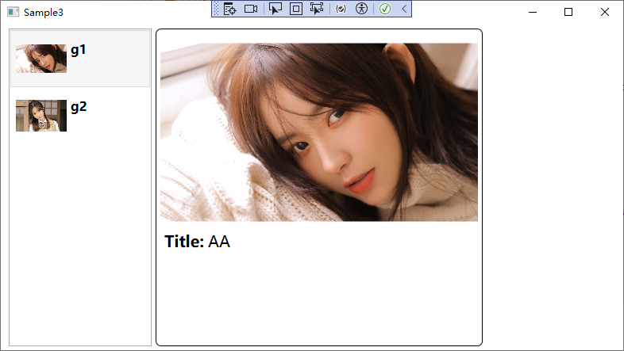
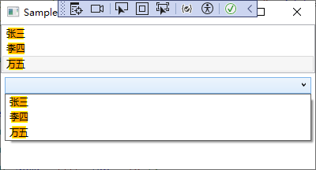
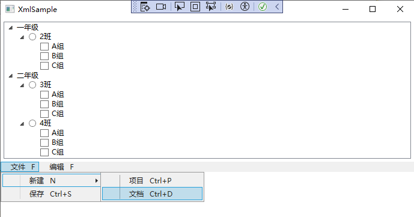

# 模板

在WPF中，有三种类型的模板，这些模板都继承自FrameworkTemplate基类。

- 控件模板（ControlTemplate）
- 数据模板（DataTemplate 和 HierarchicalDataTemplate）：用于从对象中提取数据，并在内容控件或列表控件的各个项中显示数据，数据模板用于在已有控件的内部添加元素，常用于数据绑定中。
- 面板模板（ItemsPanelTemplate）：用于控制列表控件（继承自ItemsControl类的控件）中各项的布局。

完全可在同一个控件中组合使用各种类型的模板。


## 数据模板（DataTemplate）

在之前的Winfrom程序中，常常使用事件驱动实现控件和控件之间的沟通，这种是形式与形式之间的沟通，而在WPF中，更推荐使用数据驱动来实现数据与控件之间的沟通，是内容决定形式。正是因为如此，需要在DataTemplate使用Binding在控件与数据间建立关联，即为DataTemplate中的控件设置Binding，并告诉控件应该关注数据的哪个属性。

DataTemplate是数据的外衣，常用的地方有3处：

- ContentControl的ContentTemplate属性，相当于给ContentControl的内容穿衣服，对应的是在Content属性上进行Binding。
- ItemsControl的ItemTemplate属性，相当于给ItemsControl的数据条目穿衣服，对应的是给ItemsSource属性指定一个集合进行数Binding。
- GridViewColumn的CellTemplate属性，相当于给GridViewColumn单元格里的数据穿衣服。


## 数据模板示例

示例一，直接通过ItemTemplate标签定义数据模板：

```xaml
<Grid>
    <ListBox Name="list">
        <!--定义数据模板-->
        <ListBox.ItemTemplate>
            <DataTemplate>
                <StackPanel Orientation="Horizontal">
                    <Border Width="10" Height="10" Background="{Binding MyColor}"/>
                    <TextBlock Margin="10,0" Text="{Binding Index}"/>
                </StackPanel>
            </DataTemplate>
        </ListBox.ItemTemplate>
    </ListBox>
</Grid>
```

xaml后台代码：

```csharp
 var colors = new[] { "#FFA500", "#FFFFE0", "#F0FFFF", "#CD853F", "#5F9EA0", "#9370DB", "#EE82EE", "#FFB6C1", "#7FFFD4", "#D2B48C", "#FF69B4" };
 list.ItemsSource = Enumerable.Range(1, 10).Select(a => new { Index = a, MyColor = colors[a] });
```

由于资源中的ResourcesDictionary可以存储任意类型的对象，因此可以把模板定义在资源标签中。

示例二，定义在Resources中的可复用的数据模板：

XAML的模板定义和界面布局：

```xaml
<Window x:Class="DataTemplateSample.WpfApp.Sample3"
        xmlns="http://schemas.microsoft.com/winfx/2006/xaml/presentation"
        xmlns:x="http://schemas.microsoft.com/winfx/2006/xaml"
        xmlns:d="http://schemas.microsoft.com/expression/blend/2008"
        xmlns:mc="http://schemas.openxmlformats.org/markup-compatibility/2006"
        xmlns:local="clr-namespace:DataTemplateSample.WpfApp"
        mc:Ignorable="d"
        Title="Sample3" Height="450" Width="800">
    <Window.Resources>
        <local:CarImageToPathConverter x:Key="n2p"/>
        <!--数据模板定义在资源中-->
        <!--左侧ListBox的Item用到的模板-->
        <DataTemplate x:Key="carListItemTemplate">
            <Grid Margin="2">
                <StackPanel Orientation="Horizontal">
                    <!--image的Source是一个路径，这里使用转换器将名称转换为对应的路径类型-->
                    <Image Source="{Binding Name,Converter={StaticResource n2p}}" Grid.RowSpan="3" Width="64" Height="64"/>
                    <StackPanel Margin="5,10">
                        <TextBlock Text="{Binding Name}" FontSize="16" FontWeight="Bold"/>
                    </StackPanel>

                </StackPanel>
            </Grid>
        </DataTemplate>

        <!--右侧大图模板，根据左侧列表选择的SelectedItem绑定该模板-->
        <DataTemplate x:Key="carImageTemplate">
            <Border BorderBrush="Black" BorderThickness="1" CornerRadius="6">
                <StackPanel Margin="5">
                    <Image Width="400" Height="250" Source="{Binding Name,Converter={StaticResource n2p}}"/>
                    <StackPanel Orientation="Horizontal" Margin="5,0">
                        <TextBlock Text="Title:" FontWeight="Bold" FontSize="20"/>
                        <TextBlock Text="{Binding Title}" FontSize="20" Margin="5,0"/>
                    </StackPanel>
                </StackPanel>
            </Border>
        </DataTemplate>
    </Window.Resources>

    <StackPanel Orientation="Horizontal" Margin="5">
        <!--应用左侧模板-->
        <ListBox x:Name="listBoxCars"  Width="180" Margin="5,0" ItemTemplate="{StaticResource carListItemTemplate}"/>

        <!--应用右侧模板，右侧模板的数据源来自于左侧SelectedItem-->
        <UserControl ContentTemplate="{StaticResource carImageTemplate }"
            Content="{Binding SelectedItem, ElementName=listBoxCars}"/>
    </StackPanel>
</Window>
```

XAML后台代码：

```csharp
public partial class Sample3 : Window
{
    public Sample3()
    {
        InitializeComponent();

        var cars = new List<Car>()
        {
             new Car(){Name="g1",Title="AA"},
             new Car(){Name="g2",Title="BB"}
        };
        this.listBoxCars.ItemsSource = cars;
        this.listBoxCars.SelectedIndex = 0;
    }
}

public class Car
{
    public string Name { get; set; }
    public string Title { get; set; }
}
```

转换器代码：

```csharp
/// <summary>
/// 图片名称转换为路径
/// </summary>
public class CarImageToPathConverter : IValueConverter
{
    //数据绑定源流向目标被调用
    public object Convert(object value, Type targetType, object parameter, CultureInfo culture)
    {
        string uriStr = $"Images/{(string)value}.jpg";
        return new BitmapImage(new Uri(uriStr, UriKind.Relative));
    }

    //未被用到
    public object ConvertBack(object value, Type targetType, object parameter, CultureInfo culture)
    {
        throw new NotImplementedException();
    }
}
```

界面最终程序的效果：



数据模板最关键的就是控件的Binding Source的设置。


## 控件模板（ControlTemplate）

控件模板用于定义控件的外观、样式，还可以通过控件模板的触发器（ControlTemplate.Triggers）修改控件的行为、响应动画等。

ControlTemplate主要有两大用武之地：

- 通过更换ControlTemplate改变控件外观，使其具有更优的用户使用体验及外观。
- 借助ControlTemplate，开发者和设计师可以并行工作，开发者可以先用WPF标准控件进行编程，等设计师的工作完成后，只需把心的ControlTemplate应用到程序中就可以了。

查看控件的内部结构可以使用Microsoft Expression Blend工具。

通常情况下，不会从零设计一个空白控件模板，而是基于现有的控件进行二次改造。在Visual Studio中，可以右击控件，在弹出的菜单中选择编辑模板->编辑副本。

创建好的ControlTemplate是由XAML代码编写的并放在资源词典里，作为资源的不是单纯的ControlTemplate而是Style，和DataTemplate不同，ControlTemplate是定义在Style标签里的。而在使用Style时，如果Value的值比较简单，可以直接用Attribute的值来表示：

```xaml
<Style>
	<Setter Property="特性名称" Value="特性值"/>
    <Setter Property="特性名称">
    	<Setter.Value>
        	<!--对象值-->
        </Setter.Value>
    </Setter>
</Style>
```

如果Value值不能用一个简单的字符串描述就需要使用XAML的属性对象语法，这在控件模板中很常用，因为大多数控件的Template属性是一个ControlTemplate对象，给该对象设置值只能使用属性语法来描述：

```xaml
<Style x:Key="MyTextBoxStyle" TargetType="{x:Type TextBox}">
    <Setter Property="Template">
        <Setter.Value>
            <ControlTemplate TargetType="{x:Type TextBox}">
                <Border x:Name="border" Background="{TemplateBinding Background}"
                BorderBrush="{TemplateBinding BorderBrush}" 
                BorderThickness="{TemplateBinding BorderThickness}" CornerRadius="5">
                </Border>
            </ControlTemplate>
        </Setter.Value>
    </Setter>
</Style>
```

使用该控件模板：

```xaml
<TextBox Style="{DynamicResource MyTextBoxStyle}" Text="TextBox" Width="120" Height="30"/>
```

这里引入控件模板是使用Style属性，并通过DynamicResource绑定样式。

除了定义在Style标签中外，也可以像DataTemplate一样，直接定义在Resources中：

```csharp
<Window.Resources>
    <ControlTemplate x:Key="buttonTemplate" TargetType="Button">
        <Border 
            BorderBrush="{TemplateBinding BorderBrush}" 
            BorderThickness="{TemplateBinding BorderThickness}">
            <ContentPresenter HorizontalAlignment="{TemplateBinding HorizontalContentAlignment}" 
                VerticalAlignment="{TemplateBinding VerticalContentAlignment}"  />
        </Border>
    </ControlTemplate>
</Window.Resources>
<Grid>
    <Button Width="100" Height="40" Template="{StaticResource buttonTemplate}"
    BorderThickness="3" BorderBrush="Blue"
    HorizontalContentAlignment="Center" Content="确定"/>
</Grid>
```


### TemplateBinding

ControlTemplate最终会应用到某一个目标控件上，这个目标控件称为模板目标控件或模板化控件。

而ControlTemplate本身里面的控件可以使用TemplateBinding将自己的属性值关联在目标控件的某个属性值上，即模板控件属性上的值跟随目标控件的属性值的变化而变化。当然必要的时候，也可以添加Converter。

当为一个Binding只指定Path不指定Source时，Binding会沿着逻辑树一直向上找、查看每个结点的DataContext属性，如果DataContext引用的对象具有Path指定的属性名，Binding就会把这个对象当作自己的数据源。显然，如果把数据对象赋值给ContentPresenter的DataContext属性，由DataTemplate生成的控件自然会找到这个数据对象并把它当作自己的数据源。


### ContentPresenter

通过ContentPresenter可以指定模板中要添加的内容的位置和显示 ContentControl 的内容。

具体见：[微软官方文档：ContentPresenter注解](https://learn.microsoft.com/zh-cn/dotnet/api/system.windows.controls.contentpresenter?view=netframework-4.7.2#remarks) 


### ItemsControl的PanelTemplate

除了普通控件的Template属性之外，ItemsControl类型的控件具有一个名为ItemsPanel的属性，它的数据类型为ItemsPanelTemplate，ItemsPanelTemplate也是一种控件模板，它的作用就是让程序员有机会控制ItemsControl的**条目容器**。

例如，ListBox默认按照纵向排列Items：

```xaml
<ListBox>
    <TextBlock Text="张三"/>
    <TextBlock Text="李四"/>
    <TextBlock Text="王武"/>
</ListBox>
```

使用ItemsPanelTemplate设置ListBox的Items容器，使其横向排列：

```xaml
<ListBox>
    <ListBox.ItemsPanel>
        <ItemsPanelTemplate>
            <StackPanel Orientation="Horizontal"/>
        </ItemsPanelTemplate>
    </ListBox.ItemsPanel>

    <TextBlock Text="张三"/>
    <TextBlock Text="李四"/>
    <TextBlock Text="王武"/>
</ListBox>
```


## DataTemplate 与 ControlTemplate 之间的关系

凡是Template，最终都要应用到具体的目标控件上，这个控件就是Template的目标控件，也叫模板化控件。

ControlTemplate决定控件外观，它的作用范围是控件本身及其内容区域；DataTemplate 决定数据外观，它的作用范围仅仅是控件的内容区域。

由ControlTemplate生成的控件树其树根就是ControlTemplate的目标控件，此目标控件的Template属性值就是这个ControlTemplate实例；与之相仿，由DataTemplate生成的控件树其树根是一个ContentPresenter控件，此目标控件的ContentTemplate属性值就是这个DataTemplate实例。由于ContentPresenter控件是ControlTemplate控件树上的一个结点，所以DataTemplate控件树是ControlTemplate控件树的一颗子树。因此，ControlTemplate的作用范围包含了DataTemplate的作用范围。

### TemplatedParent

每个控件都有个名为TemplatedParent的属性，如果它的值不为null，说明这个控件是由Template自动生成的，而属性值就是应用了模板的控件（目标控件）。使用模板中使用了TemplateBinding获取属性值，则TemplateBinding的数据源就是应用了这个模板的目标控件。


### 从外部访问Template内部的控件和获取属性值

ControlTemplate 和 DataTemplate 两个类均派生自 FrameworkTemplate类，这个类有一个名为FindName的方法供我们检索模板中的内部控件。

访问ControlTemplate内部的控件，通过目标控件的Template属性或ContentTemplate属性获取到ControlTemplate对象，再通过FindName方法获取即可。

而访问DataTemplate内部的控件，对于结构简单的控件，也可以使用DataTemplate对象的FindName方法。对于结构复杂的控件，还需要借助VisualTreeHelper类检索由DataTemplate生成的控件。对于ItemsControl的派生类（如ListBox、ComboBox、ListView）都具有自己独特的条目容器，需要使用ItemContainerGenerator.ContainerFromItem方法获取包装着指定条目数据的容器。

该内容的示例，见《深入浅出WPF》11.4.3章节。

## DataTemplate 与 ControlTemplate 的应用

应用Template有两种方式：

- 设置目标控件的Template、ContentTemplate、ItemsTemplate、CellTemplate等属性，此时需要在模板定义时，指定模板的x：Key；
- 设置模板应用到某个类型的控件或数据上，此时在定义模板时，不需要指定模板的x:Key。
  - 把ControlTemplate应用在所有目标上需要借助Style来实现，但Style不能标记x:Key，此时默认应用到所有由x：Type指定的控件上，如果某个目标控件不想应用则需把目标控件的Style标记为{x:Null}。（见示例一）
  - 把DataTemplate应用在某个数据类型上的方法是设置DataTemplate的DataType属性，并且DataTemplate作为资源时也不能带有x:Key标记。（见示例二）

### 示例一：把ControlTemplate应用在所有目标类型的控件上

```xaml
<Window.Resources>
    <Style TargetType="{x:Type TextBox}">
        <Setter Property="Template">
            <Setter.Value>
                <ControlTemplate TargetType="{x:Type TextBox}">
                    <Border BorderThickness="{TemplateBinding BorderThickness}" BorderBrush="Red" CornerRadius="5">
                    </Border>
                </ControlTemplate>
            </Setter.Value>
        </Setter>
        <Setter Property="Height" Value="30"/>
        <Setter Property="Background" Value="Green"/>
    </Style>
</Window.Resources>
<StackPanel>

    <TextBox/>
    <!--不应用模板-->
    <TextBox Style="{x:Null}" Margin="5"/>
</StackPanel>
```

### 示例二：把DataTemplate应用在某个数据类型上

```xaml
<Window.Resources>
    <DataTemplate DataType="{x:Type local:Student}">
        <Grid>
            <StackPanel Orientation="Horizontal">
                <Grid>
                    <Rectangle Stroke="Yellow" Fill="Orange" Width="{Binding Age}"/>
                    <TextBlock Text="{Binding Name}"/>
                </Grid>
            </StackPanel>
        </Grid>
    </DataTemplate>
    <c:ArrayList x:Key="ds">
        <local:Student Name="张三" Age="20"/>
        <local:Student Name="李四" Age="21"/>
        <local:Student Name="万五" Age="18"/>
    </c:ArrayList>
</Window.Resources>

<StackPanel>
    <ListBox ItemsSource="{StaticResource ds}"/>
    <ComboBox ItemsSource="{StaticResource ds}" Margin="5"/>
</StackPanel>
```

代码中为DataTemplate的DataType属性指定了类型Student，此时DataTemplate会自动加载到所有绑定到Student类型的控件上，尽管并没有为ListBox和ComboBox指定ItemsTemplate，一样可以得到应用了模板后的效果：



### 示例三：使用XML作为数据源应用模板

DataTemplate具有直接把XML数据结点当作目标对象的功能：

XML数据中的标签名可以作为DataType，标签的子结点和Attribute可以使用XPath来访问。

XML通常表示带有层级的数据，能够帮助层级控件（如Treeview、MenuItem）显示层级数据的模板是HierarchicalDataTemplate。

#### 多层级、不同类型数据的应用

Data.xml数据定义如下：

```xml
<?xml version="1.0" encoding="utf-8" ?>
<Data>
    <Grade Name="一年级">
        <class Name="1班">
            <Group Name="A组"/>
            <Group Name="B组"/>
            <Group Name="C组"/>
        </class>
        <Class Name="2班">
            <Group Name="A组"/>
            <Group Name="B组"/>
            <Group Name="C组"/>
        </Class>
    </Grade>
    <Grade Name="二年级">
        <Class Name="3班">
            <Group Name="A组"/>
            <Group Name="B组"/>
            <Group Name="C组"/>
        </Class>
        <Class Name="4班">
            <Group Name="A组"/>
            <Group Name="B组"/>
            <Group Name="C组"/>
        </Class>
    </Grade>
</Data>
```

由于XML中的标签层级是不同类型的，因此需要为每种层级的数据设计一个模板：

```xaml
<Window.Resources>
<!--示例一：使用TreeView显示多层级、不同类型数据-->
<!--数据源-->
<XmlDataProvider x:Key="ds" Source="Data.xml" XPath="Data/Grade"/>

<!--年级模板-->
<HierarchicalDataTemplate DataType="Grade" ItemsSource="{Binding XPath=Class}">
    <TextBlock Text="{Binding XPath=@Name}"/>
</HierarchicalDataTemplate>

<!--班级模板-->
<HierarchicalDataTemplate DataType="Class" ItemsSource="{Binding XPath=Group}">
    <RadioButton Content="{Binding XPath=@Name}" GroupName="gn" />
</HierarchicalDataTemplate>

<!--小组模板-->
<HierarchicalDataTemplate DataType="Group">
    <CheckBox Content="{Binding XPath=@Name}"/>
</HierarchicalDataTemplate>
</Window.Resources>

<StackPanel>
	<!--应用该模板-->
    <TreeView Margin="5" ItemsSource="{Binding Source={StaticResource ds}}"/>
</StackPanel>
```

#### 多层级同一种类型数据的应用

menu.xml：

```xml
<?xml version="1.0" encoding="utf-8" ?>
<Data>
    <Operation Name="文件" Gesture="F">
        <Operation Name="新建" Gesture="N">
            <Operation Name="项目" Gesture="Ctrl+P"/>
            <Operation Name="文档" Gesture="Ctrl+D"/>
        </Operation>
        <Operation Name="保存" Gesture="Ctrl+S"/>
    </Operation>
    <Operation Name="编辑" Gesture="F">
        <Operation Name="复制" Gesture="Ctrl+C"/>
        <Operation Name="粘贴" Gesture="Ctrl+V"/>
    </Operation>
</Data>
```

同一种数据类型的嵌套结构，这种情况下只设计一个HierarchicalDataTemplate就可以了，会产生自动迭代应用的效果。

xaml文件：

```xaml
<Window.Resources>
    <!--示例二：使用Menu显示多层级、同一种类型数据-->
    <XmlDataProvider x:Key="md" Source="Menu.xml" XPath="Data/Operation"/>
    <HierarchicalDataTemplate DataType="Operation" ItemsSource="{Binding XPath=Operation}">
        <StackPanel Orientation="Horizontal">
            <TextBlock Text="{Binding XPath=@Name}" Margin="10,0"/>
            <TextBlock Text="{Binding XPath=@Gesture}"/>
        </StackPanel>
    </HierarchicalDataTemplate>
</Window.Resources>

<StackPanel>
	<Menu ItemsSource="{Binding Source={StaticResource md}}" MenuItem.Click="Menu_Click"/>
</StackPanel>
```

值得一提的是，HierarchicalDataTemplate的作用目标不是MenuItem的内容，而是它的Header。如果对MenuItem的单击事件进行侦听处理，就可以从被单击MenuItem的Header中取出XML数据。

```csharp
private void Menu_Click(object sender, RoutedEventArgs e)
{
    MenuItem mi= e.OriginalSource as MenuItem;
    XmlElement xe = mi.Header as XmlElement;
    MessageBox.Show(xe.Attributes["Name"].Value); //获取XML数据
}
```

运行效果：



### 示例四：自定义下拉框选项

```xaml
<ComboBox x:Name="myCom" Width="100" Height="20">
    <ComboBox.ItemTemplate>
        <DataTemplate>
            <StackPanel Orientation="Horizontal">
                <TextBlock Text="{Binding UserName}"/>
                <TextBlock Text="→"/>
                <TextBlock Text="{Binding Age}"/>
            </StackPanel>
        </DataTemplate>
    </ComboBox.ItemTemplate>
</ComboBox>
```

xaml后台代码：

```csharp
myCom.ItemsSource = new List<object>()
{
    new {UserName="张三" ,Age=100},
    new {UserName="张三" ,Age=100},
};
```

### 示例五：控件模板和数据模板的组合使用

```xaml
<ListBox BorderThickness="0" ItemsSource="{Binding MenuItems}">
    <ListBox.ItemContainerStyle>
        <Style TargetType="ListBoxItem">
            <!--  让ListBoxItem的内容都填充每一项的空间  -->
            <Setter Property="HorizontalContentAlignment" Value="Stretch" />
            <Setter Property="Height" Value="30" />
            <Setter Property="Template">
                <Setter.Value>
                    <!--  移除ListBox系统默认的鼠标悬浮样式  -->
                    <ControlTemplate TargetType="{x:Type ListBoxItem}">
                        <Grid Background="Transparent">
                            <Border x:Name="bd1" />
                            <Border x:Name="bd2" />
                            <ContentPresenter />
                        </Grid>
                        <ControlTemplate.Triggers>
                            <Trigger Property="IsMouseOver" Value="True">
                                <Setter TargetName="bd1" Property="Background" Value="#ff99ff" />
                            </Trigger>
                            <Trigger Property="IsSelected" Value="True">
                                <Setter Property="Foreground" Value="{Binding BackColor}" />
                                <Setter Property="FontWeight" Value="Bold" />
                                <!--  设置纯颜色背景与透明度  -->
                                <Setter TargetName="bd1" Property="Background" Value="{Binding BackColor}" />
                                <Setter TargetName="bd1" Property="Opacity" Value="0.1" />
                                <Setter TargetName="bd2" Property="BorderThickness" Value="5,0,0,0" />
                                <Setter TargetName="bd2" Property="BorderBrush" Value="{Binding BackColor}" />
                            </Trigger>

                        </ControlTemplate.Triggers>

                    </ControlTemplate>
                </Setter.Value>
            </Setter>
        </Style>
    </ListBox.ItemContainerStyle>

    <!--  左侧菜单进行数据绑定  -->
    <ListBox.ItemTemplate>
        <DataTemplate>
            <DockPanel Margin="10,0,0,0" LastChildFill="False">
                <TextBlock Style="{StaticResource iconStyle}" Text="{Binding Icon}" />
                <TextBlock Text="{Binding Name}" />
                <TextBlock DockPanel.Dock="Right" Text="{Binding Count}" />
            </DockPanel>
        </DataTemplate>
    </ListBox.ItemTemplate>
</ListBox>
```


----

References:

- 《深入浅出WPF》
- [微软官方文档：ContentPresenter注解](https://learn.microsoft.com/zh-cn/dotnet/api/system.windows.controls.contentpresenter?view=netframework-4.7.2#remarks) 

Last updated：2025-05-14


