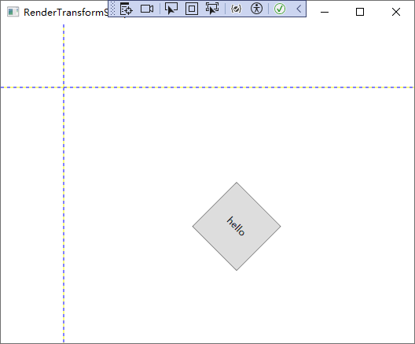

# 变形与动画


## 图形的变形（Transform）

WPF中的变形与UI元素是分开的，可以将同一个变形赋值给不同UI元素的变形控制属性。

控制变形的属性有两个，分别是：

- RenderTransform：呈现变形，定义在UIElement类中；
- LayoutTransform：布局变形，定义在FrameworkElement类中。

由于控件的基类Control派生自FrameworkElement，FrameworkElement又派生自UIElement，因此可以在控件中直接使用这两个属性，它们的数据类型都是Transform抽象类，也就是说，Transform类的派生类均可以为这两个属性赋值。

Transform抽象类的派生类有：

- MatrixTransform：矩阵变形，把容纳被变形UI元素的矩形顶点看作一个矩阵进行变形；
- RotateTransform：旋转变形，以给定的点为旋转中心，以角度为单位进行旋转变形；
- ScaleTransform：坐标系变形，调整被变形元素的坐标系，可产生缩放效果。
- SkewTransform：拉伸变形，可在横向与纵向向上对被变形元素进行拉伸。
- TranslateTransform：偏移变形，使被变形元素在横向或纵向向上偏移一个给定的值。
- TransformGroup：变形组，可以把多个独立变形合成为一个变形组、产生复合变形效果。

RenderTransform 和 LayoutTransform的区别：

- RenderTransform 不牵扯布局的改变，只涉及窗体的重绘，当需要制作动画的时候，切记要使用RenderTransform 。
- LayoutTransform 会影响窗体的布局、导致窗体布局的重新测算。因为窗体布局的重新测算和绘制会影响程序的性能，所以LayoutTransform一般只用在静态变形上，而不用于制作动画。

### RenderTransform（呈现变形）

在窗体上移动UI元素本身会导致窗体布局的改变，而窗体布局的每一个变化都将导致所有窗体元素的尺寸测算函数、位置测算函数、呈现函数等的调用，造成系统资源占用激增、程序性能陡降。而使用呈现变形则不会遇到这样的问题，呈现变形只改变元素“出现在哪里”，所以不牵扯布局的改变、只涉及窗体的重绘。所以当需要制作动画的时候，切记要使用RenderTransform。

```xaml
<Grid ShowGridLines="True">
    <Grid.ColumnDefinitions>
    <!--第一行第一列将按照Button的宽高来决定-->
        <ColumnDefinition Width="Auto"/>
        <ColumnDefinition Width="*"/>
    </Grid.ColumnDefinitions>
    <Grid.RowDefinitions>
        <RowDefinition Height="auto"/>
        <RowDefinition Height="*"/>
    </Grid.RowDefinitions>
    <Button Width="80" HorizontalAlignment="Left" VerticalAlignment="Top" Height="80" Content="hello">
        <Button.RenderTransform>
            <!--组合变形-->
            <TransformGroup>
                <!--以0,0坐标点为中心旋转45度-->
                <RotateTransform CenterX="0" CenterY="0" Angle="45"/>
                <!--再向右平移300像素，向下移动200像素-->
                <TranslateTransform X="300" Y="200"/>
            </TransformGroup>
        </Button.RenderTransform>
    </Button>
</Grid>
```

运行效果：



可以很清楚的看到，虽然Button进行了变形，但是其所在的原来的位置并没有改变（Grid第一行第一列没有变化）。

### LayoutTransform（布局变形）

与RenderTransform不同，LayoutTransform会影响窗体的布局、导致窗体布局的重新测算。因为窗体布局的重新测算和绘制会影响程序的性能，所以LayoutTransform一般只用在静态变形上，而不用于制作动画。

```xaml
<Grid ShowGridLines="True">
    <Grid.ColumnDefinitions>
        <ColumnDefinition Width="auto"/>
        <ColumnDefinition Width="*"/>
    </Grid.ColumnDefinitions>

    <Grid x:Name="titleBar" Background="LightBlue">
        <TextBlock Text="Hello Transformer!" FontSize="24" HorizontalAlignment="Left" VerticalAlignment="Bottom">
            <!--旋转60度之后，第一列的宽度也会跟着变化-->
            <TextBlock.LayoutTransform>
                <RotateTransform Angle="-60"/>
            </TextBlock.LayoutTransform>
        </TextBlock>
    </Grid>
</Grid>
```

运行效果：


## 动画

动画本质就是在一个时间段内对象位置、角度、颜色、透明度等属性值的连续变化。

WPF规定，可以用来制作动画的属性必须是依赖属性。

### 动画相关的类的结构关系

动画通常用一个Timeline派生类的实例加以表达，简单的动画称为AnimationTimeline，通常由一个元素来完成就可以了。而复杂的动画通常需要UI上的多个元素协同完成，WPF把一组协同的动画称为Storyboard（场景）。

动画相关的各种类的关系如下：

- Timeline：抽象类，表示定义一个时间线
  - TimelineGroup：抽象类，实现后该类表示可以包含子 Timeline 对象集合的 Timeline
    - ParallelTimeline：定义可以包含子 Timeline 对象的时间段。 这些子时间线将按各自的 BeginTime 属性变为活动状态。 此外，子时间线也可相互重叠（并行运行）。
      - **Storyboard**：一组协同的动画。
  - **AnimationTimeline**：抽象类，简单动画。
    - 各种动画派生类（见下文）
  - MediaTimeline


### AnimationTimeline

WPF把简单动画称为AnimationTimeline，所谓的动画指的就是能够让UI元素或元素变形的某个属性值产生连续变化，这些能够变化的UI元素的属性都有自己的数据类型，比如UIElement的Width和Height属性为Double类型，WPF针对每个可能的数据类型，都为其准备了相应的动画类，这些动画类均派生自抽象类AnimationTimeline，并且派生类本身也都是抽象基类，它们的类名称通常以AnimationBase后缀结尾。

派生自AnimationTimeline的抽象基类：

| 抽象基类名称            | 抽象基类名称            | 抽象基类名称         |
| ----------------------- | ----------------------- | -------------------- |
| BooleanAnimationBase    | ByteAnimationBase       | CharAnimationBase    |
| ColorAnimationBase      | DecimalAnimationBase    | DoubleAnimationBase  |
| Int16AnimationBase      | Int32AnimationBase      | Int64AnimationBase   |
| MatrixAnimationBase     | ObjectAnimationBase     | Point3DAnimationBase |
| PointAnimationBase      | QuaternionAnimationBase | RectAnimationBase    |
| Rotation3DAnimationBase | SingleAnimationBase     | SizeAnimationBase    |
| StringAnimationBase     | SzieAnimationBase       | StringAnimationBase  |
| ThicknessAnimationBase  | Vector3DAnimationBase   | VectorAnimationBase  |

上面表格中的这些类都带有AnimationBase后缀，它们也都是抽象基类，完整情况下，这些抽象基类又能派生出3种具体动画，以DoubleAnimationBase为例：

1. 简单线性动画，名称以Animation后缀结尾，如DoubleAnimation。
2. 关键帧动画，名称以AnimationUsingKeyFrames后缀结尾，如DoubleAnimationUsingKeyFrames。
3. 沿路径动画，名称以AnimationUsingPath后缀结尾，如DoubleAnimationUsingPath。

注意：并不是所有的类型都支持以上三种动画，例如针对int类型属性的Int32AnimationBase值派生出Int32Animation和Int32AnimationUsingKeyFrames两个具体动画类；而BooleanAnimationBase和CharAnimationBase只派生出关键帧动画类。

#### 简单线性动画（*Animation）

简单线性动画就是指有变化起点、变化终点、变化幅度、变化时间4个要素构成的动画，分别对应以下四个属性：

1. From：变化起点，如果没有指定变化起点，则以变化目标属性的当前值作为起点。
2. To：变化终点，如果没有指定变化终点，程序将采用上一次动画的终点或默认值。
3. By：变化幅度，如果同事指定了变化终点，变化幅度将被忽略。
4. Duration：变化时间，必须指定，数据类型为Duration。

```xaml
<Grid>
    <Button Content="Move!" HorizontalAlignment="Left" VerticalAlignment="Top" Width="60" Height="60"
    Click="Button_Click">
        <Button.RenderTransform>
            <TranslateTransform x:Name="tt" X="0" Y="0"/>
        </Button.RenderTransform>
    </Button>
</Grid>
```

xaml后台代码：

```csharp
private void Button_Click(object sender, RoutedEventArgs e)
{
    DoubleAnimation daX = new DoubleAnimation();
    DoubleAnimation daY = new DoubleAnimation();

    //指定起点
    daX.From = 0D;
    daY.From = 0d;

    //指定终点
    daX.To = 345;
    daY.To = 555;

    //指定时长
    Duration duration = new Duration(TimeSpan.FromSeconds(2));
    daX.Duration = duration;
    daY.Duration = duration;

    //动画的主体是TranslateTransform变形，而非Button
    this.tt.BeginAnimation(TranslateTransform.XProperty, daX);
    this.tt.BeginAnimation(TranslateTransform.YProperty, daY);
}
```

控件的移动通常借助TranslateTransform来实现，所以该动画不是直接作用在Button上，而是Button的RenderTransform属性的TranslateTransform实例。

##### 复杂动画控制

除了上述4个常用的基本属性之外，还可以使用以下属性实现更复杂的动画：

- AccelerationRatio：加速速率，介于0.0和1.0之间，与DecelerationRatio之和不大于1.0，类似汽车启动
- DecelerationRatio：减速速率，介于0.0和1.0之间，与AccelerationRatio之和不大于1.0，类似汽车刹车
- SpeedRatio：动画实际播放速度与正常速度的比值，类似快进播放、慢动作。
- AutoReverse：是否以相反的动画方式从终止值返回起始值，类似倒退播放
- RepeatBehavior：动画的重复行为，取0为不播放，使用Double类型值可以控制循环次数，取RepeatBehavior.Forever为永远循环，类似循环播放。
- BeginTime：正式开始播放前的等待时间。类似多个动画之前的协同。
- EasingFunction：缓冲式渐变。类似乒乓球弹跳效果

其中EasingFunction是一个扩展性非常强的属性，它的取值是IEasingFunction接口类型，而WPF自带的IEasingFunction派生类就有10多种，每个派生类都能产生不同的结束效果。（类似PPT中的常见动画）。

示例，使用EasingFunction赋值为BounceEase产生乒乓球弹跳式效果：

```csharp
private void Button_Click(object sender, RoutedEventArgs e)
{
    DoubleAnimation daX = new DoubleAnimation();
    DoubleAnimation daY = new DoubleAnimation();

    BounceEase be = new BounceEase();
    be.Bounces = 3;//弹跳3次
    be.Bounciness = 3; //弹性程度，值越大反弹越低
    daY.EasingFunction = be;

    //指定起点
    daX.From = 0D;
    daY.From = 0d;

    //指定终点
    daX.To = 345;
    daY.To = 555;

    //指定时长
    Duration duration = new Duration(TimeSpan.FromSeconds(2));
    daX.Duration = duration;
    daY.Duration = duration;

    //动画的主体是TranslateTransform变形，而非Button
    this.tt.BeginAnimation(TranslateTransform.XProperty, daX);
    this.tt.BeginAnimation(TranslateTransform.YProperty, daY);
}
```


#### 关键帧动画（*AnimationUsingKeyFrames）

前面讲到的简单动画只设置了起点和终点，之间的动画帧都是由程序计算出来并绘制的，程序员无法进行控制。

关键帧动画则允许程序员为一段动画设置几个“里程碑”，动画执行到里程碑所在的时间点时，被动画所控制的属性值也必须达到设定的值，这些时间线上的“里程碑”就是关键帧。

示例，使用关键帧动画实现按钮按照Z字形移动效果：

```xaml
<Grid>
    <Button Content="Move" VerticalAlignment="Top" HorizontalAlignment="Left" Width="80" Height="80" Click="Button_Click">
        <Button.RenderTransform>
            <TranslateTransform x:Name="tt" X="0" Y="0"/>
        </Button.RenderTransform>
    </Button>
</Grid>
```

xaml后台代码：

```csharp
private void Button_Click(object sender, RoutedEventArgs e)
{
    //声明两个关键帧动画实例，分别控制TranslateTransform的X属性、Y属性
    DoubleAnimationUsingKeyFrames dakX = new DoubleAnimationUsingKeyFrames()
    {
        //设置动画总时长
        Duration = new Duration(TimeSpan.FromSeconds(2))
    };
    DoubleAnimationUsingKeyFrames dakY = new DoubleAnimationUsingKeyFrames()
    {
        //设置动画总时长
        Duration = new Duration(TimeSpan.FromSeconds(2))
    };

    //创建和添加关键帧
    LinearDoubleKeyFrame x_kf_1 = new LinearDoubleKeyFrame()
    {
        KeyTime = KeyTime.FromTimeSpan(TimeSpan.FromSeconds(1)),
        Value = 200
    };
    LinearDoubleKeyFrame x_kf_2 = new LinearDoubleKeyFrame()
    {
        KeyTime = KeyTime.FromTimeSpan(TimeSpan.FromSeconds(1.2)),
        Value = 0
    };
    LinearDoubleKeyFrame x_kf_3 = new LinearDoubleKeyFrame()
    {
        KeyTime = KeyTime.FromTimeSpan(TimeSpan.FromSeconds(1.4)),
        Value = 200
    };

    //添加关键帧到关键帧动画中
    dakX.KeyFrames.Add(x_kf_1);
    dakX.KeyFrames.Add(x_kf_2);
    dakX.KeyFrames.Add(x_kf_3);


    LinearDoubleKeyFrame y_kf_1 = new LinearDoubleKeyFrame()
    {
        KeyTime = KeyTime.FromTimeSpan(TimeSpan.FromSeconds(1)),
        //KeyTime = KeyTime.FromPercent(0.33) , //以整个关键帧动画的时长（Duration）中的百分比计算相对时间点
        Value = 0
    };
    LinearDoubleKeyFrame y_kf_2 = new LinearDoubleKeyFrame()
    {
        KeyTime = KeyTime.FromTimeSpan(TimeSpan.FromSeconds(1.2)),
        Value = 180
    };
    LinearDoubleKeyFrame y_kf_3 = new LinearDoubleKeyFrame()
    {
        KeyTime = KeyTime.FromTimeSpan(TimeSpan.FromSeconds(1.4)),
        Value = 180
    };
    dakY.KeyFrames.Add(y_kf_1);
    dakY.KeyFrames.Add(y_kf_2);
    dakY.KeyFrames.Add(y_kf_3);


    //执行动画
    this.tt.BeginAnimation(TranslateTransform.XProperty, dakX);
    this.tt.BeginAnimation(TranslateTransform.YProperty, dakY);
}
```

将关键帧添加到关键帧动画中，需要使用关键帧动画的KeyFrames属性，以上述代码中的关键帧动画DoubleAnimationUsingKeyFrames为例，DoubleAnimationUsingKeyFrames的KeyFrames属性的数据类型是DoubleKeyFrameCollection，该集合类可接收的元素类型为DoubleKeyFrame，DoubleKeyFrame是一个抽象类，派生自该类型的常用的关键帧类型有：

- LinearDoubleKeyFrame：线性变化关键帧，只需给定时间点（KeyTime属性）和到达时间点时目标属性的值（Value属性），动画就会让目标属性值在两个关键帧之间匀速变化。（目标属性值的变化是直线性的、均匀的，即变化速率不变）
- DiscreteDoubleKeyFrame：不连续变化关键帧，目标属性值的变化是跳跃的、跃迁的。
- **SplineDoubleKeyFrame**：样条函数式变化关键帧，目标属性值的变化速率是一条贝塞尔曲线。使用该类型可以替代LinearDoubleKeyFrame。
- EasingDoubleKeyFrame：缓冲式变化关键帧，目标属性值以某种缓冲形式变化。

##### SplineDoubleKeyFrame

使用SplineDoubleKeyFrame可以非常方便的制作非匀速动画，因为它使用一条贝塞尔曲线来控制目标属性值的变化速率。

这条用于控制变化速率的贝塞尔曲线的起点是（0,0）和（1,1），分别映射着目标属性的变化起点和变化终点，意思是目标属性值由0%变化到100%。

这条贝塞尔曲线有两个控制点——ControlPoint1 和 ControlPoint2，意思是贝塞尔曲线从起点出发，先向ControlPoint1的方向前进，再向ControlPoint2的方向前进，最后到达终点，形成一条平滑的曲线。如果设置ControlPoint1和ControlPoint2的横纵坐标值相等，比如（0,0）、（0.5,0.5)、（1,1），则贝塞尔曲线成为一条直线，这时候SplineDoubleKeyFrame与LinearDoubleKeyFrame是等价的。当控制点的横纵坐标不相等时，贝塞尔曲线就能出现很多变化。

```xaml
<Grid>
    <Button Content="Move" VerticalAlignment="Top" HorizontalAlignment="Left" Width="80" Height="80" Click="Button_Click">
        <Button.RenderTransform>
            <TranslateTransform x:Name="tt" X="0" Y="0"/>
        </Button.RenderTransform>
    </Button>
</Grid>
```

xaml后台代码：

```csharp
private void Button_Click(object sender, RoutedEventArgs e)
{
    //声明关键帧动画
    DoubleAnimationUsingKeyFrames dakX = new DoubleAnimationUsingKeyFrames
    {
        Duration = new Duration(TimeSpan.FromMilliseconds(1000))
    };
    //创建、添加关键帧
    SplineDoubleKeyFrame kf = new SplineDoubleKeyFrame
    {
        KeyTime = KeyTime.FromPercent(1),
        Value = 400,
        //设置两个控制点，定义此关键帧的动画进度（变化速率）
        KeySpline = new KeySpline
        {
            ControlPoint1 = new Point(0, 1),
            ControlPoint2 = new Point(1, 0),
        }
    };

    SplineDoubleKeyFrame kf2 = new SplineDoubleKeyFrame
    {
        KeyTime = KeyTime.FromPercent(1),
        Value = 0,
    };

    dakX.KeyFrames.Add(kf);
    dakX.KeyFrames.Add(kf2);
    //执行动画
    this.tt.BeginAnimation(TranslateTransform.XProperty, dakX);
}
```


#### 路径动画（*AnimationUsingPath）

路径动画指的是目标对象沿着一条给定的路径进行变化。路径动画的类型名称以AnimationUsingPath后缀结尾。

这里以DoubleAnimationUsingPath类作为讲解。

DoubleAnimationUsingPath需要一个PathGeometry来指明移动路径，PathGeometry的数据信息可以使用XAML的Path语法书写。

PathGeometry的另一个重要属性是Source，Source属性的数据类型是PathAnimationSource枚举，枚举值可取X、Y、或Angle。

如果路径动画Source属性的取值是PathAnimationSource.X，意味着这个动画关注的是曲线上每一点横坐标的变化；如果路径动画Source属性的取值是PathAnimationSource.Y，意味着这个动画关注的是曲线上每一点纵坐标的变化；如果路径动画Source属性的取值是PathAnimationSource.Angle，意味着这个动画关注的是曲线上每一点处切线方向的变化。

示例，让Button沿着一条贝塞尔曲线一直做波浪形运动：

```xaml
<Grid x:Name="layoutRoot">
    <Grid.Resources>
        <PathGeometry x:Key="movingPath" Figures="M 0,150 C 300,-100 300,400 600,120"/>
    </Grid.Resources>
    <Button Content="Move" HorizontalAlignment="Left" VerticalAlignment="Top"
    Width="80" Height="80" Click="Button_Click">
        <Button.RenderTransform>
            <TranslateTransform x:Name="tt" X="0" Y="0"/>
        </Button.RenderTransform>
    </Button>
</Grid>
```

xaml后台代码：

```csharp
private void Button_Click(object sender, RoutedEventArgs e)
{
    //读取XAML代码中获取移动路径数据
    PathGeometry pg = this.layoutRoot.FindResource("movingPath") as PathGeometry;

    //创建动画
    DoubleAnimationUsingPath dapX = new DoubleAnimationUsingPath()
    {
        PathGeometry = pg,
        Source = PathAnimationSource.X,
        Duration = new Duration(TimeSpan.FromSeconds(1)),
        //自动返回
        AutoReverse = true,
        //永远循环
        RepeatBehavior = RepeatBehavior.Forever,
    };

    DoubleAnimationUsingPath dapY = new DoubleAnimationUsingPath
    {
        PathGeometry = pg,
        Source = PathAnimationSource.Y,
        Duration = new Duration(TimeSpan.FromSeconds(1)),
        AutoReverse = true,
        RepeatBehavior = RepeatBehavior.Forever,
    };

    //执行动画
    this.tt.BeginAnimation(TranslateTransform.XProperty, dapX);
    this.tt.BeginAnimation(TranslateTransform.YProperty, dapY);
}
```


### Storyboard（动画场景）

上述关键帧动画是串行执行的一组动画，而Storyboard则是并行执行的一组动画。

先是把一组独立的动画组织在一个Storyboard元素中，安排好他们的协作关系，然后指定哪个动画由哪个UI元素，哪个属性负责完成。Storyboard设计好后，选择一个恰当的触发时机，一旦触发条件被满足，动画场景就会开始执行。

```xaml
<Grid>
    <Grid.RowDefinitions>
        <RowDefinition Height="38"/>
        <RowDefinition Height="38"/>
        <RowDefinition Height="38"/>
    </Grid.RowDefinitions>
    <Grid.ColumnDefinitions>
        <ColumnDefinition />
        <ColumnDefinition Width="60"/>
    </Grid.ColumnDefinitions>

    <!--红色跑道-->
    <Border BorderBrush="Gray" BorderThickness="1" Grid.Row="0">
        <Ellipse x:Name="ballR" Height="36" Width="36" Fill="Red" HorizontalAlignment="Left">
            <Ellipse.RenderTransform>
                <TranslateTransform x:Name="ttR"/>
            </Ellipse.RenderTransform>
        </Ellipse>
    </Border>

    <!--绿色跑道-->
    <Border BorderBrush="Gray" BorderThickness="1,0,1,1" Grid.Row="1">
        <Ellipse x:Name="ballG" Height="36" Width="36" Fill="LawnGreen" HorizontalAlignment="Left">
            <Ellipse.RenderTransform>
                <TranslateTransform x:Name="ttG"/>
            </Ellipse.RenderTransform>
        </Ellipse>
    </Border>

    <!--蓝色跑道-->
    <Border BorderBrush="Gray" BorderThickness="1,0,1,1" Grid.Row="2">
        <Ellipse x:Name="ballB" Height="36" Width="36" Fill="Blue" HorizontalAlignment="Left">
            <Ellipse.RenderTransform>
                <TranslateTransform x:Name="ttB"/>
            </Ellipse.RenderTransform>
        </Ellipse>
    </Border>

    <Button Content="Go" Grid.Column="1" Grid.RowSpan="3" Click="Button_Click"/>
</Grid>
```

使用C#实现Storyboard（不推荐）：

```csharp
private void Button_Click(object sender, RoutedEventArgs e)
{
    //红色小球匀速移动
    DoubleAnimation daRx = new DoubleAnimation
    {
        Duration = new Duration(TimeSpan.FromSeconds(1)),
        To = 400
    };

    //绿色小球变速运动
    DoubleAnimationUsingKeyFrames dakGx = new DoubleAnimationUsingKeyFrames
    {
        Duration = new Duration(TimeSpan.FromSeconds(1))
    };
    SplineDoubleKeyFrame kfG = new SplineDoubleKeyFrame(400, KeyTime.FromPercent(1.0))
    {
        KeySpline = new KeySpline(1, 0, 0, 1)
    };
    dakGx.KeyFrames.Add(kfG);


    //蓝色小球变速运动
    DoubleAnimationUsingKeyFrames dakBx = new DoubleAnimationUsingKeyFrames
    {
        Duration = new Duration(TimeSpan.FromSeconds(1))
    };
    SplineDoubleKeyFrame kfB = new SplineDoubleKeyFrame(400, KeyTime.FromPercent(1.0))
    {
        KeySpline = new KeySpline(0, 1, 1, 0)
    };
    dakBx.KeyFrames.Add(kfB);


    //创建场景
    Storyboard storyboard = new Storyboard();
    Storyboard.SetTargetName(daRx, "ttR");
    Storyboard.SetTargetProperty(daRx, new PropertyPath(TranslateTransform.XProperty));

    Storyboard.SetTargetName(dakGx, "ttG");
    Storyboard.SetTargetProperty(dakGx,new PropertyPath(TranslateTransform.XProperty));
    
    Storyboard.SetTargetName(dakBx, "ttB");
    Storyboard.SetTargetProperty(dakBx, new PropertyPath(TranslateTransform.XProperty));

    storyboard.Duration = new Duration(TimeSpan.FromSeconds(1));
    storyboard.Children.Add(daRx);
    storyboard.Children.Add(dakGx);
    storyboard.Children.Add(dakBx);

    storyboard.Begin(this);
    storyboard.Completed += (a, b) => { MessageBox.Show(ttR.X.ToString()); };
}
```

如上所示，使用C#代码实现Storyboard非常复杂，一般情况下都是用xaml代码结合Trigger创建Storyboard。

将上述C#代码转换为XAML来构建Storyboard：

```xaml
<!--<Button Content="Go" Grid.Column="1" Grid.RowSpan="3" Click="Button_Click"/>-->
<Button Content="Go" Grid.Column="1" Grid.RowSpan="3">
    <Button.Triggers>
        <EventTrigger RoutedEvent="Button.Click">
            <BeginStoryboard>
                <Storyboard Duration="0:0:0.6">
                    <!--红色小球动画-->
                    <DoubleAnimation Duration="0:0:0.6" To="400" 
                    Storyboard.TargetName="ttR"
                    Storyboard.TargetProperty="X"/>

                    <!--绿色小球动画-->
                    <DoubleAnimationUsingKeyFrames Duration="0:0:0.6"
                        Storyboard.TargetName="ttG"
                        Storyboard.TargetProperty="X">
                        <DoubleAnimationUsingKeyFrames.KeyFrames>
                            <SplineDoubleKeyFrame KeyTime="0:0:0.6" Value="400" KeySpline="1,0,0,1"/>
                        </DoubleAnimationUsingKeyFrames.KeyFrames>
                    </DoubleAnimationUsingKeyFrames>

                    <!--蓝色小球动画-->
                    <DoubleAnimationUsingKeyFrames Duration="0:0:0.6" Storyboard.TargetName="ttB"
                        Storyboard.TargetProperty="X">
                        <SplineDoubleKeyFrame KeyTime="0:0:0.6" Value="400" KeySpline="0,1,1,0"/>
                    </DoubleAnimationUsingKeyFrames>
                </Storyboard>
            </BeginStoryboard>
        </EventTrigger>
    </Button.Triggers>
</Button>
```

注意：如果要在XAML中定义动画，必须要把动画定义在故事板（Storyboard）中，故事板为动画提供了时间线。


----

References:

- 《深入浅出WPF》

Last updated：2025-05-27
